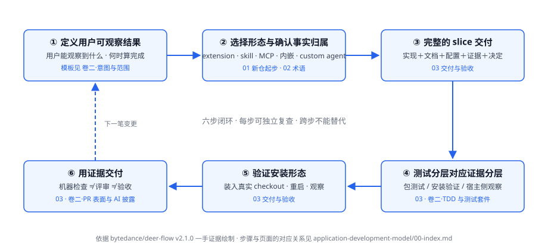

# DeerFlow 应用开发模型：单一事实源、证据与交付判断

## 这卷解决什么问题

新建独立 DeerFlow 应用仓后，最容易出现的不是不会写入口代码，而是不知道怎样把用户意图、接入形态、实现、配置组合、测试资产和交付判断连成一条可复查的链。本卷给出一张用 DeerFlow 自己的概念组织的总地图：哪类事实以哪份文件为权威（source of truth），哪种验证能证明什么，以及为什么"能 import"、"包测试绿"、"扩展装上了"、"宿主侧行为被观察到"是四件不同的事。

这是一种依据 DeerFlow v2.1.0 源码、文档、指南与示例归纳出的开发模型，不是 DeerFlow 官方宣布的方法名，也不是应用仓必须复制的主仓库制度。本卷正文区分四类陈述：DeerFlow 运行时事实、DeerFlow 主仓要求、应用仓建议、仓库自定。

## 一页总览：运行时、仓库、分发、治理是四件事

独立应用开发同时面对四个层次。运行时接口回答"你的代码怎样被 DeerFlow 装载与调用"；仓库结构回答"源码、测试、文档放在哪里"；分发形态回答"用户或部署者拿到什么、怎么装"；治理规则回答"谁评审、哪些检查必须通过、什么条件允许发布"。DeerFlow 的文档与契约主要定义运行时接口和可用组合机制；应用仓需要为自己的仓库结构、分发形态和治理规则确定权威归属。

| 层次 | 主要问题 | DeerFlow 能直接提供什么 | 应用仓仍需自己决定什么 |
|---|---|---|---|
| 运行时接口 | 入口点怎样被发现？贡献怎样进组合？资源怎样清理？ | extension 入口点与七种贡献类型、skill 格式与按需加载、MCP 配置、`create_deerflow_agent` 与 `DeerFlowClient` API | 应用自己的接口、事件、配置与错误合同 |
| 仓库结构 | 源码、测试、文档、构建产物放在哪里？ | 示例扩展的包结构范例 | 独立仓、monorepo、workspace 边界 |
| 分发形态 | 用户安装什么？ | extension manager 安装事务、技能目录、依赖引入 | 发布物、自包含要求、兼容范围与升级路径 |
| 治理规则 | 谁评审、哪些检查是门槛、怎样决定发布？ | 主仓规则可参考（见 SDLC 参考卷） | 自己的 issue、review、CI、release 与安全审批 |

**能 import、包测试绿、扩展装上了、宿主侧行为被观察到，是四件不同的事。**其中"能 import"只证明入口点可解析，不是行为证据；后三件构成 v2.1.0 能落地的三层证据链，一层通过不代表下一层成立。每层的证据与边界见[交付与验收](./03-delivery-and-acceptance.md)。

## 开发闭环（本卷的组织骨架）

闭环六步与页面的对应关系：

1. **从用户可观察的结果定义变更**——写清触发条件、用户看到什么、怎样算完成；主仓 PR 模板要求的正是"用户/调用方视角，不是 diff 复述"，意图入口见[卷二·意图与范围](../sdlc-reference/01-intent-and-scope.md)。
2. **选择接入形态，确认各类事实的权威归属**——四种形态（extension 包 / skill / MCP / 内嵌 harness）各适合什么；每类事实以哪份文件为准（spec 是设计决策的 source of truth，`SKILL.md` 是技能的 authoritative definition）：[新仓起步](./01-new-application-repository.md)、[术语表](./02-terms.md)。
3. **以完整 slice 交付**——实现、用户文档、配置样例、行为证据随同一笔变更落地；主仓实现计划的原话是 "Documentation (land with owning slice)"：[交付与验收](./03-delivery-and-acceptance.md)。
4. **测试分层对应证据分层**——v2.1.0 的三层证据（契约级包测试 / 安装验证 / 宿主侧行为观察），每层只证明它断言的属性：[交付与验收](./03-delivery-and-acceptance.md)；主仓的测试车道见[卷二·TDD 与车道](../sdlc-reference/03-tdd-and-test-lanes.md)。
5. **验证部署实际拿到的东西**——源码能跑不等于分发物能装；装入真实 checkout、重启、观察：[交付与验收](./03-delivery-and-acceptance.md)。
6. **用证据交付**——交付记录写清实际跑了什么、没跑什么；评审读 diff 与证据，而非只看 CI 绿：[交付与验收](./03-delivery-and-acceptance.md)；评审与披露制度见[卷二·PR 表面与 AI 披露](../sdlc-reference/04-pr-surface-and-ai-disclosure.md)。

## 最重要的注意事项

- 不要把"能 import"当作行为证据——包测试不 import harness 与 Gateway（[交付与验收](./03-delivery-and-acceptance.md)·证据分层）；
- 不要只做契约级测试就声称组合成立——补安装验证与宿主侧观察（[交付与验收](./03-delivery-and-acceptance.md)）；
- 不要把"扩展管理器装上了"当作用户验收——第三层证据才是行为证明（[交付与验收](./03-delivery-and-acceptance.md)）；
- 不要把 DeerFlow 主仓的 SDLC 制度当成随依赖继承的义务——四类陈述的读法见[语料入口 README](../README.md)，主仓机制的适用边界逐页登记在 [SDLC Reference](../sdlc-reference/00-index.md)；
- 不要对 v2.1.0 的能力做超出版本的假设——这个版本不提供的（无插件沙箱、startup-only、组合验证代差等）集中在[卷三·边界与代价](../repo-harness/06-boundaries-and-costs.md)。

## 本页导航

- 术语不熟（harness/app、贡献类型、中间件链、thread state、progressive loading）→ [术语表](./02-terms.md)；
- 刚建了应用仓，想知道先建立什么 → [新仓起步](./01-new-application-repository.md)；
- 代码写完了，想知道怎样算交付 → [交付与验收](./03-delivery-and-acceptance.md)；
- 需要核对 DeerFlow 某条规则的准确条件或例外 → [SDLC Reference](../sdlc-reference/README.md)；
- 想找到 DeerFlow 仓库的知识入口、手册与契约 → [Development Harness](../repo-harness/README.md)。

相邻两卷都是可选深入，不是本卷的阅读前提。
