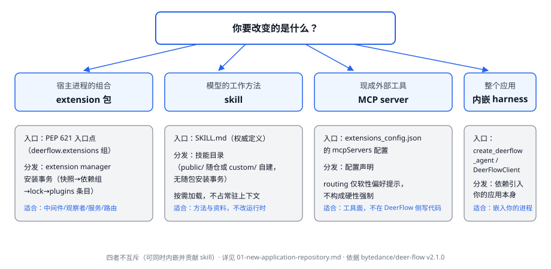

# 新仓起步：从空应用仓到第一次可验证的变更

## 这页解决什么问题

你刚建了一个独立应用仓，打算构建在 DeerFlow 上。第一个决定不是"写什么代码"，而是**选哪种接入形态**——它决定了入口、依赖、分发方式、验证路径和信任边界。本页按 v2.1.0 的实际机制把五种形态的最小入口、安装验证与四层决定讲清楚。

本页区分四类陈述：**运行时事实**对 v2.1.0 可核验；**主仓要求**只约束向 DeerFlow 主仓提交的变更；**应用仓建议**是本语料归纳；**仓库自定**由应用仓自己决定。

## 第一步：选择接入形态

| 形态 | 适合什么 | 入口 | 用户拿到什么 |
|---|---|---|---|
| **内嵌 harness** | 把 agent 嵌进你自己的后端/API/自动化系统 | `create_deerflow_agent()` 或 `DeerFlowClient` | 你的应用本身 |
| **extension 包** | 给一个已部署的 DeerFlow 实例贡献运行时能力（中间件、观察者、服务、路由） | PEP 621 入口点 `deerflow.extensions` | 经 extension manager 安装的包 |
| **skill** | 教 agent 做某类工作的方法与资料，不改运行时 | `SKILL.md` 能力包 | 技能目录（内置公共技能或用户自建） |
| **MCP server** | 接入现成外部工具，不在 DeerFlow 侧写代码 | `extensions_config.json` 的 `mcpServers` 配置 | 配置声明的外部工具面 |
| **custom agent 定义** | 不写代码地给已部署实例定义专家子 agent 或外部进程 agent | `config.yaml` 的 `subagents.custom_agents` / Settings→Subagents / `acp_agents:` | 配置与管理面（无分发物） |

五者不互斥：一个应用可以同时内嵌 harness 并贡献 skill。选择的依据是"你要改变的是宿主进程的组合、模型的行为方法、task 委派目录里有什么，还是只是工具面"。

## 五种形态的最小入口

### 内嵌 harness：从 factory 或 client 开始

最快的理解路径是直接用代码创建 agent：

```python
from deerflow.agents import create_deerflow_agent
agent = create_deerflow_agent(model)
```

`create_deerflow_agent()` 返回带 DeerFlow 默认中间件链的编译后 LangGraph agent，可继续传 `tools`、`system_prompt`、`features`、`extra_middleware`、`plan_mode`、`checkpointer` 定制（[harness quick-start](https://github.com/bytedance/deer-flow/blob/v2.1.0/frontend/src/content/en/harness/quick-start.mdx)）。

要线程式会话、模型/技能/记忆管理、文件上传等更完整的嵌入接口时，改用 `DeerFlowClient`（下面是 integration-guide 的示例代码；与 v2.1.0 源码的三处差异见随后的快照警示）：

```python
from deerflow.client import DeerFlowClient
from deerflow.config import load_config

load_config()  # 读 config.yaml 或 DEER_FLOW_CONFIG_PATH
client = DeerFlowClient()
```

> The client is thread-safe and designed to be instantiated once and reused across requests.
>
> — [integration-guide](https://github.com/bytedance/deer-flow/blob/v2.1.0/frontend/src/content/en/harness/integration-guide.mdx)

**运行时事实**：client 按 `thread_id` 隔离会话、可按 `agent_name` 切换命名 agent 配置；配置加载支持 `DEER_FLOW_CONFIG_PATH` 环境变量与显式路径参数；也可以直接组合底层 LangGraph 图（`make_lead_agent`）或把 Gateway 挂载为子应用——这些模式都在 [integration-guide](https://github.com/bytedance/deer-flow/blob/v2.1.0/frontend/src/content/en/harness/integration-guide.mdx) 有示例。**手册快照警示（对 v2.1.0 源码核验）**：integration-guide 的示例有三处与该版本源码不符——client 方法手册写作 `astream`/`ainvoke`，源码实际是 `stream()` 与 `chat()`；配置加载手册写作 `from deerflow.config import load_config`，源码实际入口是 `get_app_config()`（`DEER_FLOW_CONFIG_PATH` 机制本身真实存在）；Gateway 挂载示例的导入 `deerflow.app.gateway.main` 在源码中不存在（Gateway 实际在不发布层的 `app.gateway`）。照抄手册代码前先对照源码核验（见[卷三·边界与代价](../repo-harness/06-boundaries-and-costs.md)的"文档是快照"条）。**应用仓建议**：内嵌形态下你的仓就是治理主体——线程隔离、checkpoint 持久化和配置路径都由你的应用决定，不要指望 DeerFlow 替你管理部署。

### extension 包：一个正常的 Python 包，建在 checkout 之外

> An extension is a normal Python package. Create it **outside** the DeerFlow checkout.
>
> — [extensions quick-start](https://github.com/bytedance/deer-flow/blob/v2.1.0/frontend/src/content/en/harness/extensions/quick-start.mdx)

`pyproject.toml` 三件事：声明契约版本区间（`deerflow-extension-api>=0.2,<0.3`）、声明你 import 的每一个框架（契约包刻意零依赖）、声明**恰好一个** `deerflow.extensions` 组的入口点。入口点名（如 `hello`）就是 `enable`/`disable`/`remove` 接受的 operator 面向名。完整可抄的 `hello` 示例（计耗时并告警的中间件）在 [extensions quick-start](https://github.com/bytedance/deer-flow/blob/v2.1.0/frontend/src/content/en/harness/extensions/quick-start.mdx)；演示五种贡献的独立示例包在 [examples/deerflow-extension-example](https://github.com/bytedance/deer-flow/blob/v2.1.0/examples/deerflow-extension-example/README.md)。

> Never import `deerflow.*` or `app.*`: those are host internals with no compatibility promise.
>
> — [extensions quick-start](https://github.com/bytedance/deer-flow/blob/v2.1.0/frontend/src/content/en/harness/extensions/quick-start.mdx)

**运行时事实**：注册契约（registry contract）暴露**七种**贡献类型——middleware、task-lifecycle、system-model-call 观察、agent-assembly 观察、context-compaction 观察、Gateway-lifetime 服务与 eager 路由（[extensions 指南](https://github.com/bytedance/deer-flow/blob/v2.1.0/backend/packages/harness/deerflow/extensions/AGENTS.md)）；示例包演示其中五种。中间件贡献声明 lead/subagent 作用域、稳定顺序与语义 placement（如 `MODEL_LOGICAL`、`TOOL_VISIBLE`），而不是脆弱的列表下标。前置条件：Python 3.12+、uv 0.8.0+（manager 拒绝更旧的 uv），以及跑 Gateway 的机器的 shell 权限——装扩展是 operator 动作，不是 web UI 能做的。这条前提随使用 DeerFlow 一起传导给你的部署，不属于"仅约束主仓贡献"的那类规则。

### skill：一个目录加一份权威 SKILL.md

每个 skill 是技能目录下的子目录，部署侧有三个位置：`skills/public/`（随仓提交）、`skills/custom/`（用户自建位置，gitignored、不随仓提交，运行时扫描）、`.deer-flow/integrations/skills/{provider}/`（托管集成技能包，全局生效；集成凭据与启用状态保持 per-user）（根 [AGENTS.md](https://github.com/bytedance/deer-flow/blob/v2.1.0/AGENTS.md)）。`SKILL.md` 是权威定义，由 harness 的 `backend/packages/harness/deerflow/skills/parser.py` 解析出名称、描述、分类、指令与工具依赖（[skills 手册](https://github.com/bytedance/deer-flow/blob/v2.1.0/frontend/src/content/en/harness/skills.mdx) 写作 `skills/parser.py`，是手册简写）。

> Skills are loaded on demand — they inject their content when a task calls for them and stay out of the context otherwise.
>
> — [skills 手册](https://github.com/bytedance/deer-flow/blob/v2.1.0/frontend/src/content/en/harness/skills.mdx)

**运行时事实**：技能的分发面有两个。部署侧：技能就是部署读取的技能目录——`public/` 随仓提交、`custom/` 存用户自建技能、`.deer-flow/integrations/skills/{provider}/` 存托管集成技能包，启用状态在 `extensions_config.json`，经 Gateway API 启用/停用**即时生效、无需重启**。运行侧：Gateway 还提供运行时归档安装——`POST /api/skills/install` 从线程产物里的 `.skill` 归档安装，admin-only 的 `POST /api/skills/install/upload` 接受 multipart 上传（解析前鉴权、限 100 MiB），装入前过安全扫描，技能声明的依赖在首次加载时安装（[skills 手册](https://github.com/bytedance/deer-flow/blob/v2.1.0/frontend/src/content/en/harness/skills.mdx)、[Gateway 指南](https://github.com/bytedance/deer-flow/blob/v2.1.0/backend/app/gateway/AGENTS.md)）；v2.1.0 源码中 `POST /api/skills/install` 同样要求 admin——文档只标注了 upload 端点，代码比文档更严。它与 extension manager 事务是两种机制：技能安装不动 `plugins:`、不改依赖组与 `uv.lock`、无需重启，入口是 Gateway API 而非 operator shell。**应用仓建议**：skill 适合承载"怎么做某类工作"的方法与资料，不承载运行时能力；要拦截调用、暴露服务或路由时用 extension。技能内容随对话注入，属于模型可见数据——敏感操作不要依赖技能文本当访问控制。跨仓分发技能时自行约定同步与审查方式：归档安装有内容扫描，但"允许谁向你的部署装技能"的治理仍由你的部署侧决定。

### MCP server：配置声明的外部工具

MCP server 与技能启用状态放在 `extensions_config.json`，与主配置 `config.yaml` 分离；`mcpServers.<server>.routing` 可加软性工具偏好提示，软硬路由的边界见 [CONFIGURATION](https://github.com/bytedance/deer-flow/blob/v2.1.0/backend/docs/CONFIGURATION.md)。**应用仓建议**：MCP 适合把现成工具面接进来；要改变 agent 内部组合时仍需 extension。

### custom agent 定义：不写代码扩展 task 委派目录

前四种形态都要交付某种产物（包、技能目录、配置声明或应用）；v2.1.0 还有一条纯配置面：不动任何代码，直接定义"`task` 工具能委派给谁"。委派目录（catalog）从三个来源合并，同名冲突按 **built-in → `config.yaml` → managed** 的优先级裁决（[subagents/catalog 手册](https://github.com/bytedance/deer-flow/blob/v2.1.0/frontend/src/content/en/harness/subagents/catalog.mdx)）：

| 来源 | 定义处 | 谁能改 | 生效方式 |
|---|---|---|---|
| built-in | 代码（`general-purpose`；`bash` 仅在沙箱允许命令执行时出现） | 无人，只能覆盖参数 | 随版本 |
| `config.yaml` | `subagents.custom_agents.<name>`：description、system_prompt、tools/disallowed_tools、skills 白名单、model、max_turns、timeout_seconds | operator | **需重启** |
| managed | Settings → Subagents（经 `/api/subagents`：任何用户可列表，system prompt 仅管理员可见；增改删需管理员） | administrator | **即时生效**（运行时缓存约 1 秒） |

managed 定义按 `agent_storage.backend` 存储：`file` 写 `DEER_FLOW_HOME/managed-subagents/` 下的原子 JSON 文件，`db` 存共享应用库（多实例部署）；定义是 deployment 级而非用户级。`subagents.agents.<name>` 可对任何来源的子代理覆盖 timeout_seconds、max_turns、model、skills 与 token_budget；每个 custom agent 还能收窄自己的委派范围（Subagent access：全部 / 无 / 指定名单），名单在 run 开始时快照进运行元数据并由 `task` 工具再次强制——客户端点名隐藏子代理也绕不过。

**外部 ACP agent**：`acp_agents:` 配置块声明以独立进程运行的外部 agent（Agent Client Protocol；`claude`/`codex` 原生命令不兼容，需 ACP 适配器包）。lead agent 经 `invoke_acp_agent` 工具调用它们——ACP agent **不进** `task` 目录、容量与台账，只受自己的 `timeout_seconds` 约束。

**应用仓建议**：这条形态适合"先验证 agent 分工设计，再决定要不要沉淀为 extension/skill"——配置面改起来最便宜；但它是部署侧状态（config.yaml 与 Settings 存储），不随你的仓分发，要可复制的产物时仍需前四种形态。

## 先建立什么：第一个完整 slice



无论形态，应用仓的第一笔完整交付应同时包含：

1. **可运行的入口**——上面的最小入口之一，能在干净环境复现；
2. **声明的依赖**——extension 形态下每个被 import 的框架都要显式声明（契约包零依赖是刻意的）；
3. **包级测试**——extension 形态下，示例包的测试只用公共契约加自身依赖：
   > The tests use only the public contract plus this package's declared dependencies; the DeerFlow harness and Gateway application are not imported.
   >
   > — [示例扩展 README](https://github.com/bytedance/deer-flow/blob/v2.1.0/examples/deerflow-extension-example/README.md)
4. **安装验证与宿主侧观察**——extension 形态下必须装进一个真实 checkout，重启后先确认装载成立、再观察一个宿主侧行为（见下）；
5. **面向用户的说明**——入口名、贡献了什么、怎么开关。

**测试的诚实边界（运行时事实）**：v2.1.0 的示例与手册只演示契约级包测试；真实装载组合（真 Loader、真 Gateway 装配后的行为证据）在这个版本没有随包交付的现成模式。**应用仓建议**：不要把"包测试绿"当作组合成立——在装进 checkout 并重启后，至少观察一个可检查的宿主侧行为（示例的做法是贡献一条 `GET /api/extension-example/stats` 路由再 curl 它）。

## 安装与分发（extension 形态）

接受信任提示后，extension manager 依次：把可部署快照复制到 `backend/extensions/sources/<包名>/`；把快照加进 `backend/pyproject.toml` 的 `extensions` 依赖组并更新 `backend/uv.lock`；安装锁定环境；在所选 `config.yaml` 写入并启用 startup-only 的 `plugins:` 条目（[示例 README](https://github.com/bytedance/deer-flow/blob/v2.1.0/examples/deerflow-extension-example/README.md)）。

**运行时事实**：

- 装载只发生在 Gateway 构建应用时——install/enable/disable/remove 与手改 `plugins:` 都要**重启**才生效；
- 来源规则（成文，[extensions 指南](https://github.com/bytedance/deer-flow/blob/v2.1.0/backend/packages/harness/deerflow/extensions/AGENTS.md)）：远程直接引用限于 HTTPS、远程 Git 必须公共 Git-over-HTTPS、本地目录以快照装入、含内嵌凭据的来源 URL 拒收；SSH Git URL 被拒（Docker 构建器不转发主机 SSH 凭据）。用户手册 [operations 页](https://github.com/bytedance/deer-flow/blob/v2.1.0/frontend/src/content/en/harness/extensions/operations.mdx) 的 Accepted sources 表列出**五种**接受形式——包索引 requirement（示例为版本锁定 `==1.2.3`）、钉定 commit 的公共 Git-over-HTTPS、HTTPS 直接引用（wheel URL）、本地目录快照、回环 HTTP（写入 lock 时带警告）；"版本锁定/钉定"是手册示例形式，不是 manager 的强制规则（manager 接受任意合法 requirement）；
- `--yes` 仅供已审查并信任来源的自动化使用——构建钩子与运行时代码以 Gateway 权限执行；
- `--required` 把后续装载失败变成 Gateway 启动中止，除非应用缺了这个扩展就是错的，否则别开。

**应用仓建议**：把"operator 信任"写进你自己的发布文档——谁能装、装什么来源、装完怎么验证，这三问在 DeerFlow 侧没有替你回答。

## 部署与运行时机制：guardrails、非交互运行与渠道绑定

接入形态之外，v2.1.0 还有三个部署侧机制直接决定你的应用能安全地做什么：

**guardrails（工具调用前授权）**。中间件链里的 `GuardrailMiddleware` 在**每次工具调用执行前**把工具名与参数交给可插拔的 `GuardrailProvider` 评估：deny 则工具不执行、agent 收到带原因的错误并自行调整；provider 出错且 `fail_closed=true`（默认）时同样拦截（[GUARDRAILS](https://github.com/bytedance/deer-flow/blob/v2.1.0/backend/docs/GUARDRAILS.md)）。它与另两道防线分工明确：沙箱是进程隔离（管不住沙箱内 `bash` 把数据 `curl` 出去）、`ask_clarification` 是人工在环（自主工作流撑不住），guardrails 是**确定性的语义授权**。provider 三选一：内置 AllowlistProvider（零依赖，按工具名放行/拒绝）、OAP Passport（开放标准）、自定义 provider（你的代码）。

**非交互运行**。`config.yaml -> scheduler.enabled` 开启后台调度后，定时运行刻意做成非交互：`context.non_interactive=true` 时 lead 工具集排除 `ask_clarification`；该键与 `disable_clarification`、`github_token` 只对内部认证的调用方生效，客户端自带的副本会从 `body.context` 与 `body.config` 双双丢弃。忙碌的定时任务持久化为 `queued`，`launching` 是短期租约认领，`scheduler.queue_timeout_seconds` 约束排队等待（根 [AGENTS.md](https://github.com/bytedance/deer-flow/blob/v2.1.0/AGENTS.md)）。**应用仓建议**：自建后台/定时调用你的 agent 时，模拟同一约束——非交互模式加服务端注入的上下文键，不要指望对话里"问用户"兜底。

**渠道绑定**。已部署实例可以经配置把 agent 接到用户自有的 IM 账号（Telegram、Slack、Discord、Feishu/Lark、DingTalk、WeChat、WeCom、Buzz——复用 `channels.*` 运行时配置，无需公网 IP、OAuth 回调或 provider webhook；[IM Channel Connections](https://github.com/bytedance/deer-flow/blob/v2.1.0/backend/docs/IM_CHANNEL_CONNECTIONS.md)）；GitHub 则是事件驱动面：webhook 推送到 `POST /api/webhooks/github`，HMAC 校验后按 custom-agent 绑定扇出为入站消息，线程确定性用 `UUID5(repo, number, agent_name)`，出站只记日志（agent 在沙箱里用 `gh` 发帖）（[GitHub Event-Driven Agents](https://github.com/bytedance/deer-flow/blob/v2.1.0/backend/docs/GITHUB_AGENTS.md)）。它与 custom agent 定义组合，不写 extension 就能做"事件驱动的 agent 应用"。

## 四层决定清单

| 层 | DeerFlow v2.1.0 给了什么 | 你的仓要决定什么 |
|---|---|---|
| 运行时接口 | 契约七种贡献类型 / factory 与 client API / SKILL.md 格式 / MCP 配置 / custom agent 与 ACP 委派目录 | 你的公开接口、错误合同、配置面 |
| 仓库结构 | 示例包布局（`__init__.py` + 实现模块 + `tests/`） | 独立仓或 monorepo、测试放哪、文档放哪 |
| 分发形态 | extension manager 事务、技能目录与运行时归档安装、依赖引入 | 发布到哪、版本区间、兼容承诺、升级路径 |
| 治理规则 | 主仓规则可参考（见 [SDLC Reference](../sdlc-reference/00-index.md)） | 你的 review、CI、发布与安全审批 |

## 证据入口

- [harness quick-start](https://github.com/bytedance/deer-flow/blob/v2.1.0/frontend/src/content/en/harness/quick-start.mdx) 与 [integration-guide](https://github.com/bytedance/deer-flow/blob/v2.1.0/frontend/src/content/en/harness/integration-guide.mdx)：内嵌形态入口。
- [extensions quick-start](https://github.com/bytedance/deer-flow/blob/v2.1.0/frontend/src/content/en/harness/extensions/quick-start.mdx) 与 [extensions 指南](https://github.com/bytedance/deer-flow/blob/v2.1.0/backend/packages/harness/deerflow/extensions/AGENTS.md)：extension 形态入口与契约面。
- [示例扩展 README](https://github.com/bytedance/deer-flow/blob/v2.1.0/examples/deerflow-extension-example/README.md)：安装事务、分发来源、信任边界与包测试口径。
- [skills 手册](https://github.com/bytedance/deer-flow/blob/v2.1.0/frontend/src/content/en/harness/skills.mdx)、[Gateway 指南](https://github.com/bytedance/deer-flow/blob/v2.1.0/backend/app/gateway/AGENTS.md)（技能安装/启用 API）与 [CONFIGURATION](https://github.com/bytedance/deer-flow/blob/v2.1.0/backend/docs/CONFIGURATION.md)：skill 与 MCP 形态。
- [subagents/catalog 手册](https://github.com/bytedance/deer-flow/blob/v2.1.0/frontend/src/content/en/harness/subagents/catalog.mdx) 与 [operations 手册](https://github.com/bytedance/deer-flow/blob/v2.1.0/frontend/src/content/en/harness/extensions/operations.mdx)：custom agent/ACP 形态与扩展来源表。
- [GUARDRAILS](https://github.com/bytedance/deer-flow/blob/v2.1.0/backend/docs/GUARDRAILS.md)、[IM Channel Connections](https://github.com/bytedance/deer-flow/blob/v2.1.0/backend/docs/IM_CHANNEL_CONNECTIONS.md) 与 [GitHub Event-Driven Agents](https://github.com/bytedance/deer-flow/blob/v2.1.0/backend/docs/GITHUB_AGENTS.md)：guardrails、渠道绑定与事件驱动 agent。

术语不熟时查[术语表](./02-terms.md)。
