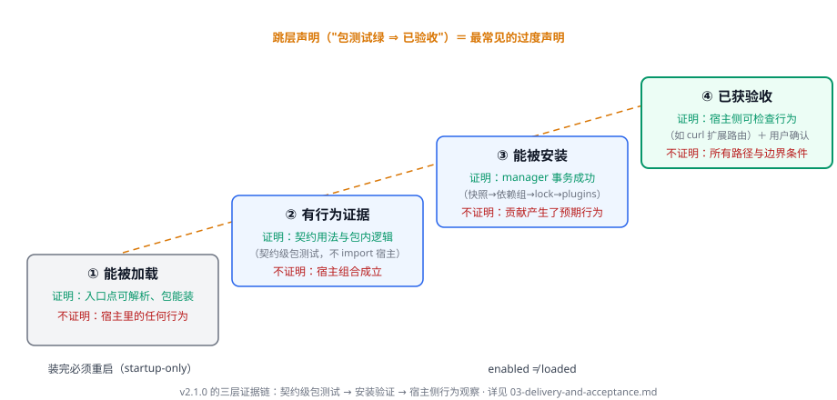

# 交付与验收：一次完整变更怎么走完

## 这页解决什么问题

代码写完不等于交付。本页承接[总览页](./00-index.md)闭环的后四步：一个 slice 怎样才算完整、v2.1.0 的测试证据分几层、安装形态怎么验证、交付记录里写什么。前两步（用户可观察的结果、选择接入形态与确认事实归属）见[新仓起步](./01-new-application-repository.md)与[术语表](./02-terms.md)。

## 1. 完整的 slice 交付

主仓实现计划里的 slice 按**交付物与依赖**组织（slice map：每个 slice 有明确 deliverable 和依赖顺序），文档"land with owning slice"。应用仓的一笔完整交付同理，同时包含：

| 组成 | 回答什么 | 参照 |
|---|---|---|
| 实现 | 入口代码与贡献实现 | [新仓起步](./01-new-application-repository.md)的最小入口 |
| 用户文档 | 别人怎么装、怎么开、需要什么权限面 | 示例包 README 覆盖的四个组成面（入口声明/测试口径/安装事务/信任边界） |
| 配置消费者 | 你的贡献在 `plugins:`/`extensions_config.json` 里长什么样 | 示例包的 `plugins:` 条目样例 |
| 行为证据 | 哪个测试或观察钉住了这个行为 | 见下节 |
| 设计决定与偏离（需要时） | 为什么这么做、放弃了什么 | 大变更记入 spec 与 deviation register（[卷二·02](../sdlc-reference/02-spec-and-plan.md)）；小变更进 commit 与 PR 描述 |

**应用仓建议**：slice 宁小勿缺件——"代码 + 绿测试"不是一个 slice，缺用户文档的贡献装不进别人的部署，缺配置样例的贡献装进去了也不知道自己开了什么。

## 2. 证据分层：v2.1.0 的三层证据



这个版本能落地的证据分三层，每层只证明它实际断言的属性。把它们放回[总览页](./00-index.md)的"四件不同的事"：**能 import** 不是行为证据，只证明入口点可解析；**包测试绿、扩展装上了、宿主侧行为被观察到**依次对应下面的第一、二、三层。

**第一层：契约级包测试。**示例包的标准口径——只用公共契约加包自身声明的依赖：

> The tests use only the public contract plus this package's declared dependencies; the DeerFlow harness and Gateway application are not imported.
>
> — [示例扩展 README](https://github.com/bytedance/deer-flow/blob/v2.1.0/examples/deerflow-extension-example/README.md)

它证明契约用法正确、包内逻辑成立；**不证明**宿主组合成立——harness 与 Gateway 根本不在测试进程里。

**第二层：安装验证。**经 extension manager 装入真实 checkout（快照 → 依赖组 → lock → `plugins:` 条目）、重启 Gateway、确认扩展出现在列表。它证明分发物可安装、装载链成立；**不证明**贡献产生了预期行为。

**第三层：宿主侧行为观察。**观察一个可检查的宿主侧行为。示例的做法：贡献 `GET /api/extension-example/stats` 路由，重启后：

```bash
curl -s http://localhost:2026/api/extension-example/stats
```

该路由走 Gateway 的常规认证中间件，认证开启时要用已认证的浏览器会话（示例 README 的提醒）。它证明贡献真的在宿主里工作了；**不证明**所有调用路径与边界条件——那是包测试与评审的事。

**边界（v2.1.0 的空缺）**：真实装载组合没有随包交付的现成测试模式，这三层是当前版本能写下的完整证据链；更深的组合证据（如回放式端到端）需要应用仓自建。

## 3. 安装形态验证

**分发自包含**。示例包刻意让 Docker 构建包含本地快照，本地 `make dev`、Docker dev 与生产 Gateway 镜像消费**同一份 `backend/uv.lock`**；构建好的生产容器不在网络上解析或安装扩展（[示例 README](https://github.com/bytedance/deer-flow/blob/v2.1.0/examples/deerflow-extension-example/README.md)）。验证清单：

1. 干净 checkout 上 `make extension-install SOURCE=<你的包>`；
2. 重启后 `make extension-list` 确认条目与 `enabled: true`；
3. 观察一个宿主侧行为（第三层证据）；
4. 声明了多版本兼容时，记录**实际验证过的**契约/宿主版本范围——契约区间（如 `>=0.2,<0.3`）是声明，不是验证。

## 4. 交付记录与判断

机器检查、评审与用户验收回答不同问题（评审制度详见[卷二](../sdlc-reference/04-pr-surface-and-ai-disclosure.md)）。应用仓的交付记录建议包含：

- **外部行为**：这笔变更让用户看到什么（用户视角描述，不是 diff 复述）；
- **影响面**：改了哪些层（契约面/宿主组合/配置/文档）；
- **实际运行的验证**：三层证据各跑了什么命令、什么结果；
- **未执行的检查**：明确列出，不留给读者猜。

**为什么最后一条最重要**：AI 参与开发时，"没测的部分"最容易被生成文本的自信语气掩盖。把未验证项写成交付记录的必填段，是把[卷二 AI 披露](../sdlc-reference/04-pr-surface-and-ai-disclosure.md)的责任声明落到应用仓自己的交付物上。

## 常见失败模式

- 只交代码不交文档与配置样例——用户装不上或装上不知道；
- 包测试绿就发版——跳过了第二、三层证据；
- 装完不重启就说"没生效"——装载是 startup-only 的；
- 把 `enabled: true` 当作"已加载"——运行中的进程没变；
- 交付记录只写成功项——未验证的部分会在用户侧变成事故。

## 证据入口

- [示例扩展 README](https://github.com/bytedance/deer-flow/blob/v2.1.0/examples/deerflow-extension-example/README.md)（测试口径、安装事务、自包含分发、路由观察）
- [extensions quick-start](https://github.com/bytedance/deer-flow/blob/v2.1.0/frontend/src/content/en/harness/extensions/quick-start.mdx)（包结构与入口点）
- 交付记录格式参照 [pull_request_template.md](https://github.com/bytedance/deer-flow/blob/v2.1.0/.github/pull_request_template.md)（用户视角/影响面/验证/披露四节）
