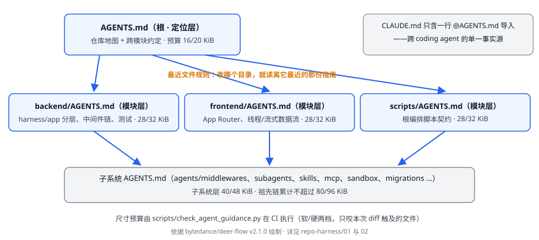

# Development Harness · 仓库怎样让 agent 与应用开发者可参与

## 这卷解决什么问题

一个从未来过的 coding agent（或应用开发者）进入 DeerFlow 仓库后，怎样快速找到"改哪里、怎么验证、边界在哪"？本卷盘点 DeerFlow v2.1.0 把参与知识放进仓库的实际机制，并回答应用仓维护者最关心的问题：这些机制里哪些值得搬回自己的仓库。

这是从 DeerFlow 一手材料归纳的视角，不是官方治理宣言。机制清单全部对 v2.1.0 核验——"现状清单"最容易随上游演进失真，本卷每页的取证时间与基线见[维护页](../_coverage/00-corpus-maintenance.md)。

## 机制总览

DeerFlow 仓库的可参与性由五类机制叠加（正文页逐项取证）：

1. **分层指南网络**——根 `AGENTS.md` 只做定位，深度下放到模块与子系统级指南，agent 按最近文件读规则；
2. **指南本身的治理**——指南尺寸按目录深度设预算并进 CI，文档示例被测试直接执行，防止"给 agent 的指令"膨胀或过期；
3. **应用手册阶梯**——docs 站 harness 手册从快速上手到逐主题（扩展、定制、中间件、MCP、skill、沙箱、子代理）再到示例扩展，构成应用开发者现成的官方路径；
4. **可执行契约面**——`extension-api` 公共包与跨组件 JSON 契约把"扩展能依赖什么"变成可对照的稳定表面；
5. **配置与检查面**——示例配置、配置版本升级指引、诊断工具与运行证据，让部署侧问题可定位。

## 参考目录

| 页面 | 适用问题 |
|---|---|
| [01-follow-a-fresh-agent.md](./01-follow-a-fresh-agent.md) | 一个新 agent 进仓第一小时读什么；指南网络的分层与最近文件规则 |
| [02-guidance-budgets-and-doc-tests.md](./02-guidance-budgets-and-doc-tests.md) | 指南预算 CI、文档示例进测试——"指令也是受治理资产" |
| [03-harness-docs-site.md](./03-harness-docs-site.md) | docs 站 harness 手册阶梯：从 quick-start 到逐主题手册到双语约定 |
| [04-example-and-contracts.md](./04-example-and-contracts.md) | 示例扩展包、extension-api 公共契约与跨组件 JSON 契约的分工 |
| [05-config-and-inspection.md](./05-config-and-inspection.md) | 示例配置、config 版本升级、doctor 与运维诊断面 |
| [06-boundaries-and-costs.md](./06-boundaries-and-costs.md) | 这套机制不给什么：startup-only 装载、无插件沙箱、文档快照性与对策清单 |

## 使用方式

按当前任务进入一篇；每页末尾的"证据入口"给出钉定 v2.1.0 的指南、手册或源码链接。应用仓维护者读本卷时应带着一个问题：我的仓库需要哪几件——分层指南、预算治理、手册阶梯、可执行契约、检查面——按自己的规模裁剪，不照单全收。
