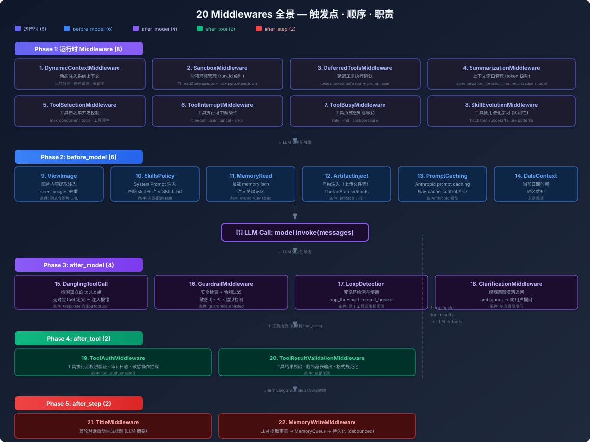
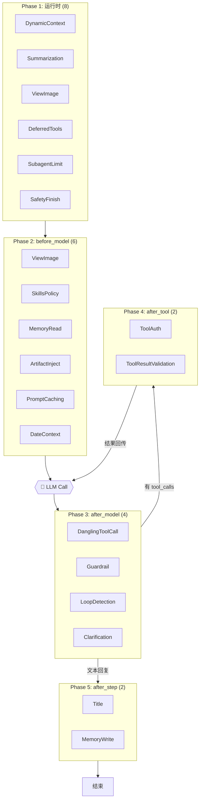

# Middleware 链

DeerFlow 使用 LangChain 的 `AgentMiddleware` 机制实现所有横切关注点。Middleware 在严格顺序下装配，每个有特定的触发点和职责。

## 触发流程

## 装配位置

`_build_middlewares()` in `agents/lead_agent/agent.py`（约 266-353 行）：
- 前 8 个来自 `build_lead_runtime_middlewares()`（始终激活）
- 后面 12 个按配置开关或始终添加

## 完整列表

### 1. ThreadDataMiddleware — 每线程目录

- **触发**：运行时（Agent 创建时）
- **内容**：创建 `{base_dir}/users/{user_id}/threads/{thread_id}/user-data/{workspace,uploads,outputs}`
- `user_id` 通过 `get_effective_user_id()` 获取（无 auth 模式 = `"default"`）
- 线程删除时清理本地数据目录

### 2. UploadsMiddleware — 文件追踪

- **触发**：运行时
- 追踪最新上传的文件并注入到对话上下文
- 在每次 state update 时反映新上传的文件列表

### 3. SandboxMiddleware — 沙箱获取

- **触发**：运行时
- 调用 `SandboxProvider.acquire(thread_id)` 获取沙箱实例
- 将 `sandbox_id` 存入 `ThreadState.sandbox`
- 本地：per-thread `LocalSandbox`，LRU 缓存（256）
- AIO：Docker 容器（先探测 Apple Container，fallback Docker）

### 4. DanglingToolCallMiddleware — 孤立的 tool_calls

- **触发**：after_model
- **场景**：用户中断导致 AI 消息有 tool_calls 但缺少对应 ToolMessage
- 注入占位 ToolMessage 让图继续运行而不是卡死
- 也能处理仅存在于 `additional_kwargs["tool_calls"]` 中的 raw provider payload

### 5. LLMErrorHandlingMiddleware — LLM 错误归一化

- **触发**：运行时（wrap model invocation）
- 将 provider 特有的错误转化为统一的 agent-facing 错误
- 防止 provider 特定异常传播到后续 middleware/tool 阶段

### 6. GuardrailMiddleware — 工具调用鉴权

- **触发**：after_model
- **可选**（`guardrails.enabled: true`）
- 每个 tool_call 都经过 `GuardrailProvider.evaluate()` 判定
- 被拒的 tool_call → 返回 error ToolMessage
- 三种 provider：AllowlistProvider (内置)、OAP (aport)、自定义

### 7. SandboxAuditMiddleware — 安全审计

- **触发**：after_model
- 记录沙箱操作的审计日志（shell 命令、文件操作）
- 工具执行前的安全检查

### 8. ToolErrorHandlingMiddleware — 工具异常转换

- **触发**：runtime（wrap tool execution）
- **关键**：工具抛出异常 → 转为 error `ToolMessage`
- 这样一次工具失败不会中止整条 run，Agent 可以感知错误并尝试替代方案

### 9. DynamicContextMiddleware — 动态上下文注入

- **触发**：before_model
- 将当前日期作为 `<system-reminder>` 注入第一个 HumanMessage
- 可选注入 memory 数据
- **设计目的**：system prompt 保持完全静态以复用 prefix cache

### 10. SummarizationMiddleware — 上下文摘要

- **触发**：before_model
- **可选**（`summarization.enabled: true`）
- 当 token 达到阈值（默认 32000）时触发
- 保留最近 N 条消息，摘要更早的历史
- 保留最近加载的 Skill 文件（默认 5 个，~25k tokens）
- 保持 system prompt 的 prefix cache 热

### 11. TodoListMiddleware — 计划模式

- **触发**：before_model
- **可选**（`is_plan_mode: true`）
- 提供 `write_todos` 工具
- 一次一个 task in_progress，实时更新
- 注入计划模式的 system prompt 和 tool description

### 12. TokenUsageMiddleware — Token 用量

- **触发**：after_tool 和 model 调用
- **可选**（`token_usage.enabled: true`）
- 记录每次模型调用的 input/output/total tokens
- 子 Agent 使用按 `tool_call_id` 缓存，合并回发起调用的 AIMessage
- 用法数据展示在 workspace UI

### 13. TitleMiddleware — 标题生成

- **触发**：after_step（第一个完整 exchange 后）
- 调用 LLM 生成对话标题（max 6 词/60 字符）
- 将结构化 message content normalizing 后再 prompt 标题模型

### 14. MemoryMiddleware — 记忆入队

- **触发**：after_step
- 过滤用户输入 + 最终 AI 回复
- 捕获 `user_id` 后入队（`MemoryQueue`）
- 30s debounce，per-thread 去重
- per-agent memory 支持（传入 `agent_name`）

### 15. ViewImageMiddleware — 图片注入

- **触发**：before_model
- **可选**（仅 `supports_vision: true` 的模型）
- 将对话中的图片转为 base64，注入 `viewed_images` state
- LLM 调用前将图片数据注入消息

### 16. DeferredToolFilterMiddleware — 延迟 MCP 工具

- **触发**：before_model
- **可选**（`tool_search.enabled: true`）
- 从绑定的 model 中隐藏延迟工具的 schema
- Agent 通过 `tool_search` 按需发现 MCP 工具
- 减少初始上下文大小，提高工具选择准确性

### 17. SubagentLimitMiddleware — 子 Agent 并发限制

- **触发**：before_model
- **可选**（`subagent_enabled: true`）
- 截断超过 `MAX_CONCURRENT_SUBAGENTS`（3）的 `task` tool calls
- 只保留前 3 个，其他丢弃

### 18. LoopDetectionMiddleware — 循环检测

- **触发**：after_model
- **可选**（`loop_detection.enabled: true`，默认开启）
- 检测连续重复的 tool_call：>=3 次 warn，>=5 次 hard stop
- 追踪全局最多 100 个线程
- 单工具频率检测（默认 30 warn / 50 hard stop）
- Hard stop 时清除 structured `tool_calls` 和 raw provider metadata → 强制 LLM 文本回答

### 19. SafetyFinishReasonMiddleware — 安全终止

- **触发**：after_model（在自定义 middleware 之后注册）
- **可选**（`safety_finish_reason.enabled: true`，默认开启）
- 检测 provider 安全终止（OpenAI `content_filter`、Anthropic `refusal`、Gemini `SAFETY`）
- 清除不可靠的 tool_calls，防止执行截断/有害的调用
- 在 LoopDetection 之前运行（LangChain 的 after_model 是倒序 dispatch）

### 20. ClarificationMiddleware — 澄清拦截

- **触发**：after_model（**必须最后一个**）
- 拦截 `ask_clarification` tool call
- 触发 `Command(goto=END)` 中断图执行
- Agent 需要人类澄清时，不继续执行而是暂停等待输入

## Middleware 执行顺序原则

1. **运行时 middleware 最前**：ThreadData、Uploads、Sandbox 必须在其他 middleware 之前执行
2. **before_model 顺序**：DynamicContext → Summarization → ... → before model call
3. **after_model 倒序**：LangChain 以 reverse 顺序调用 after_model
   - Clarification 在 `_build_middlewares()` 中最后 append
   - 但在 after_model 中第一个执行（最关键，需要拦在一切前面）
   - SafetyFinishReason 在自定义 middleware 之后 append
   - 但在 after_model 中先于 loop/subagent 运行（清除后不发假警报）
4. **依赖关系**：
   - ThreadData 在 Sandbox 之前（sandbox 需要 thread_id）
   - Uploads 在 ThreadData 之后（需要访问 thread_id）
   - TodoList 在 Clarification 之前（允许 plan 管理）
   - Title 在 Memory 之前（先生成标题再入队记忆）
   - ViewImage 在 Clarification 之前（注入图片后再出发 LLM）
   - ToolError 在 Clarification 之前（异常转 ToolMessage 之后再给 LLM）

## 条件激活汇总

| 中间件 | 激活条件 |
|--------|----------|
| 1-8 (Runtime) | 始终激活 |
| Summarization | `summarization.enabled: true` |
| TodoList | `is_plan_mode: true` |
| TokenUsage | `token_usage.enabled: true` |
| Title | 始终激活 |
| Memory | 始终激活 |
| ViewImage | 模型 `supports_vision: true` |
| DeferredToolFilter | `tool_search.enabled: true` |
| SubagentLimit | `subagent_enabled: true` |
| LoopDetection | `loop_detection.enabled: true`（默认） |
| SafetyFinishReason | `safety_finish_reason.enabled: true`（默认） |
| Clarification | 始终激活 |
