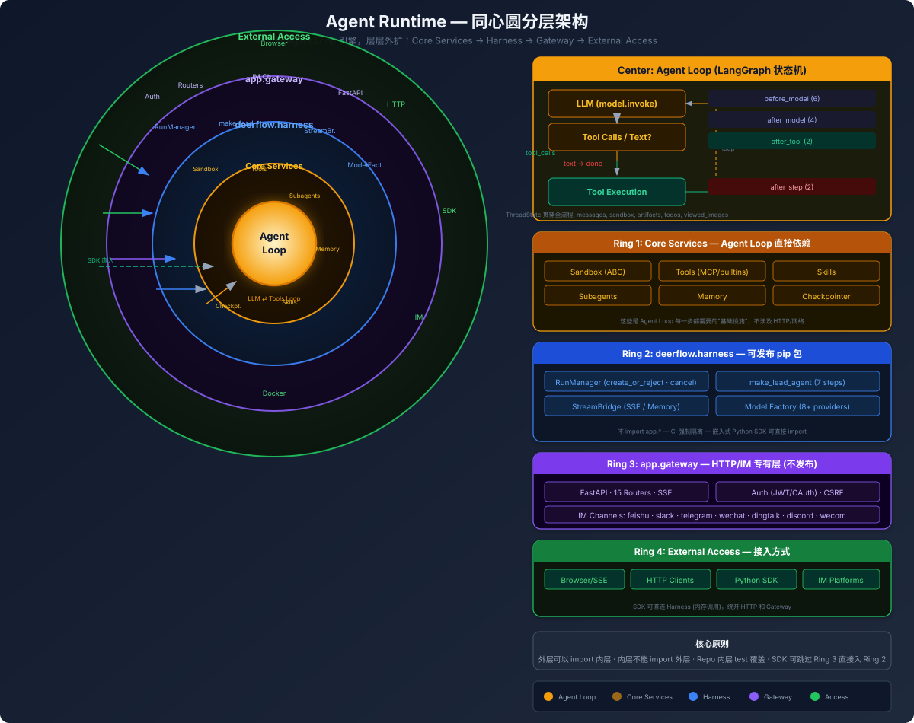
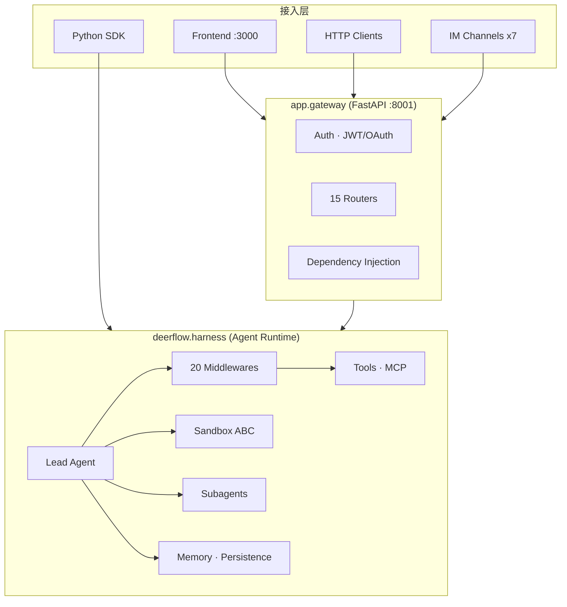

# DeerFlow 架构分析

> 内部设计、数据流、核心抽象。**先看图，再看文。**

---

## 全景图

---

## 关键设计原则

- **两层拆分**：Harness (deerflow.*) 是纯框架，可独立发布 pip 包；App (app.*) 是 HTTP/IM 应用层
- **Middleware 链**：20 个中间件覆盖所有横切关注点，严格顺序装配
- **LangGraph 嵌入**：不依赖外部 LangGraph Server，Gateway 内嵌 Runtime
- **Sandbox 抽象**：统一虚拟路径体系，Agent 不感知 Local/Docker/K3s 差异
- **配置驱动**：模型/工具/沙箱/Skill 都是运行时通过 config 解析

---

## 核心图

| 图 | 内容 |
|---|------|
| [agent-runtime-overview.svg](figures/agent-runtime-overview.svg) | 同心圆分层：Agent Loop (中心) → Services → Harness → Gateway → Access |
| [harness-app-boundary.svg](figures/harness-app-boundary.svg) | Harness/App 两层边界 + CI 导入规则 |
| [request-flow.svg](figures/request-flow.svg) | 请求数据流：14 步从 HTTP → SSE |
| [middleware-chain.svg](figures/middleware-chain.svg) | 20 Middlewares 全景：5 个阶段 · 触发点 · 职责 |
| [sandbox-architecture.svg](figures/sandbox-architecture.svg) | Sandbox：ABC 抽象 + 3 种实现 + 虚拟路径映射 |

---

## 阅读顺序

### 第一步：建立全局认知

| # | 文件 | 内容 | 图 |
|---|------|------|----|
| 1 | [01-system-overview.md](01-system-overview.md) | 系统全景：4 进程、端口、组件关系 | — |
| 2 | [02-harness-app-boundary.md](02-harness-app-boundary.md) | Harness/App 两层分层、CI 强制隔离 | [SVG](figures/harness-app-boundary.svg) |

### 第二步：理解核心链路

| # | 文件 | 内容 | 图 |
|---|------|------|----|
| 3 | [03-request-flow.md](03-request-flow.md) | 一次请求的完整生命周期 | [SVG](figures/request-flow.svg) |
| 4 | [04-middleware-chain.md](04-middleware-chain.md) | 20 个 Middleware 逐一剖析 | [SVG](figures/middleware-chain.svg) |

### 第三步：深入各模块

| # | 文件 | 内容 | 图 |
|---|------|------|----|
| 5 | [05-lead-agent.md](05-lead-agent.md) | Agent 工厂：7 步构建、ThreadState | — |
| 6 | [06-sandbox.md](06-sandbox.md) | 沙箱：ABC 接口、3 种 Provider、虚拟路径 | [SVG](figures/sandbox-architecture.svg) |
| 7 | [07-subagent.md](07-subagent.md) | 子 Agent：双线程池、生命周期、内置 | — |
| 8 | [08-memory.md](08-memory.md) | 记忆：提取 → 队列 → 持久化、per-user 隔离 | — |
| 9 | [09-skills-tools.md](09-skills-tools.md) | Skills + Tools：加载、注入、装配、MCP | — |
| 10 | [10-persistence.md](10-persistence.md) | 持久化 + 流式：DB/Checkpointer/SSE 协议 | — |
| 11 | [11-frontend.md](11-frontend.md) | 前端：Next.js 层、core 模块、流式渲染 | — |

---

## 架构速览

**核心事实**：Gateway 是 HTTP 壳，Runtime 是引擎。SDK 可以跳过 Gateway 直接调 Runtime。
