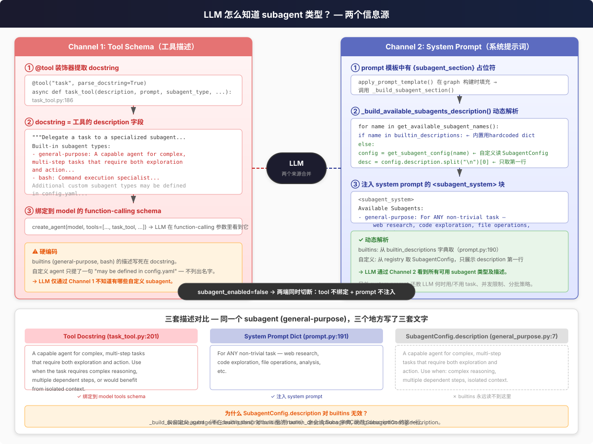
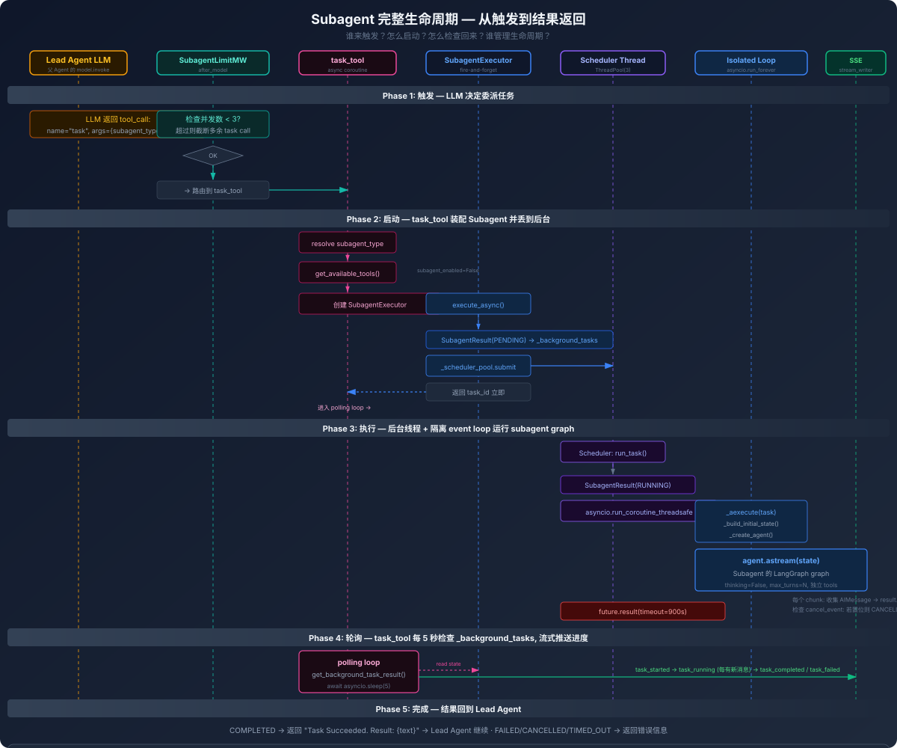

# 子 Agent 系统

Lead Agent 把复杂任务委派给后台子 Agent 并行执行。

## LLM 怎么知道 subagent 类型？

LLM 不会凭空知道有哪些 subagent — 它通过**两个独立的信息源**获知，缺一不可。



### Channel 1: Tool Schema（`task` 工具的 description）

在 `task_tool.py:186`，`@tool("task", parse_docstring=True)` 装饰器把函数的 docstring 提取为这个 tool 的 `description`，langchain 在 `create_agent()` 时把它绑到 model 的 function-calling schema 里。LLM 在决定调哪个 tool 时直接能看到它。

**问题：** docstring 是写死的。builtins (`general-purpose`, `bash`) 的描述硬编码在源码里。自定义 agent 只泛泛提了一句 "may be defined in config.yaml" — LLM 无法通过这个 channel 知道自定义 subagent 的类型名。

### Channel 2: System Prompt（`<subagent_system>` 块）

`prompt.py:213` 的 `_build_subagent_section()` 在 graph 构建时跑，动态生成 `<subagent_system>` 块注入 system prompt。

它调用 `_build_available_subagents_description()`，遍历 `get_available_subagent_names()`：
- **builtins 有匹配**: 用 `builtin_descriptions` 字典的硬编码一行文案
- **自定义 agent**: 读 `SubagentConfig.description` 的**第一行**作为描述

system prompt 还教 LLM 何时用 `task`、并发限制（max 3）、分批策略、反例（何时直接执行）。

### 三套描述的问题

同一个 subagent 类型 (`general-purpose`) 在三处代码写了三套文案：

| 位置 | 内容（节选） | LLM 看得到？ |
|------|------------|-------------|
| Tool docstring `task_tool.py:201` | "A capable agent for complex, multi-step tasks that require both exploration and action..." | ✓ 在 function-calling schema 里 |
| System prompt dict `prompt.py:191` | "For ANY non-trivial task — web research, code exploration, file operations, analysis, etc." | ✓ 在 system prompt 里 |
| `SubagentConfig.description` `general_purpose.py:7` | 多行带 bullet points | ✗ **builtins 永远读不到** |

第三处只在自定义 agent 时通过 registry 进入 Channel 2（取第一行）。对 builtins，`_build_available_subagents_description()` 直接用 `builtin_descriptions` 字典跳过 `SubagentConfig.description`。

### 总开关：`subagent_enabled`

`subagent_enabled=False` 时**两端同时切断**：
- `get_available_tools(subagent_enabled=False)` → `task` tool 不加入 tools 列表 → model 的 function-calling schema 里没有它
- `_build_subagent_section()` → 检查 `subagent_enabled`，false 时整个 `<subagent_system>` 块不注入 system prompt

## 三个核心问题

| 问题 | 答案 |
|------|------|
| **怎么触发？** | LLM 产出 `task` tool_call → `SubagentLimitMiddleware` 检查并发 <3 → LangGraph 路由到 `task_tool` |
| **怎么检查回来？** | `task_tool` 每 5s 调 `get_background_task_result(task_id)` 读共享的 `_background_tasks` dict，有新消息就推 SSE `task_running` 事件 |
| **谁管理生命周期？** | 双线程池 — `_scheduler_pool`(3 workers) 管理 timeout + status 转换，`_isolated_subagent_loop`(1 daemon thread) 执行 `agent.astream()` |

---

## 完整生命周期时序图



---

## Phase 1: 触发 — LLM 决定委派

Lead Agent 的 LLM 返回一个 `tool_call(name="task")`：

```json
{
  "name": "task",
  "args": {
    "subagent_type": "general-purpose",
    "description": "Research Python async patterns",
    "prompt": "Find the top 3 async libraries and compare them"
  }
}
```

**`SubagentLimitMiddleware` (after_model)** 拦截这个 tool_call：

```
_last_aimessage.tool_calls 中数 "task" 的数量
  ├── ≤ max_concurrent (默认 3) → 放行
  └── > 3 → 截断，只保留前 3 个，后面的丢弃
```

截断在 `agent.py:328` 装配，`subagent_limit_middleware.py:71` 触发。用 `clone_ai_message_with_tool_calls()` 替换最后一条 AIMessage，保留前 N 个 task call，丢弃其余。

**过检后**，LangGraph 的 ToolNode 路由到 `task_tool()`。

---

## Phase 2: 启动 — task_tool 装配并丢到后台

`task_tool` 是一个 `async def`，用 `@tool("task")` 装饰。位于 `tools/builtins/task_tool.py:187`。

**第一步：解析 subagent_type**

```
get_subagent_config(subagent_type)
  ├── builtins: "general-purpose" | "bash"
  ├── custom_agents: config.yaml → subagents.custom_agents.<name>
  └── per-agent overrides: config.yaml → subagents.agents.<name>
      (timeout_seconds, max_turns, model, skills 可在 agent 级别覆盖)
```

**第二步：获取 tools（防止递归委派）**

```python
tools = get_available_tools(subagent_enabled=False)
```

`subagent_enabled=False` 是关键 — 这会从 tool 列表中移除 `task` tool，防止 subagent 再创建 sub-subagent。builtins 里的 `task` tool 本身就排除了 `task`，这里是双重保障。

**第三步：创建 SubagentExecutor**

```python
executor = SubagentExecutor(
    config=subagent_config,
    tools=tools,
    parent_model=lead_agent_model,
    sandbox_state=runtime.state.get("sandbox"),
    thread_data=runtime.state.get("thread_data"),
)
```

**第四步：execute_async — fire and forget**

```python
task_id = executor.execute_async(task=prompt, task_id=tool_call_id)
# 立即返回 task_id，不等待 subagent 完成
```

`execute_async` 做了三件事（`executor.py:724`）：
1. 创建 `SubagentResult(PENDING)` → 存入全局 `_background_tasks[task_id]`
2. `_scheduler_pool.submit(run_task)` — 丢到后台线程池
3. 立即返回 `task_id`

---

## Phase 3: 执行 — 后台线程 + 隔离 event loop

这是双线程池的核心。

```
_scheduler_pool (ThreadPoolExecutor, 3 workers)
    │
    │  run_task():
    │    1. SubagentResult → RUNNING, started_at=now
    │    2. asyncio.run_coroutine_threadsafe(_aexecute(task), isolated_loop)
    │    3. future.result(timeout=900s)  ← 阻塞等结果
    │
    └──► _isolated_subagent_loop
            │
            │  asyncio.run_forever() daemon thread (全局单例，懒初始化)
            │
            │  _aexecute(task):
            │    1. _build_initial_state(task)
            │       ├── _load_skills() → 加载 subagent 专属 skills
            │       ├── _load_skill_messages() → SystemMessage(skill content)
            │       ├── merge system_prompt + skill messages → single SystemMessage
            │       └── append HumanMessage(task)
            │    2. _create_agent(filtered_tools)
            │       ├── create_chat_model(thinking_enabled=False)
            │       ├── build_subagent_runtime_middlewares()
            │       └── create_agent(model, tools, middleware, ThreadState)
            │    3. async for chunk in agent.astream(state, stream_mode="values"):
            │       ├── 每个 chunk: 收集 AIMessage → result.ai_messages
            │       ├── 检查 result.cancel_event → 置位则 CANCELLED
            │       └── 完成: try_set_terminal(COMPLETED, result=text)
            │    4. exception → try_set_terminal(FAILED)
```

**关键细节：**

- **thinking 关闭**: `create_chat_model(thinking_enabled=False)` — subagent 不需要 thinking 模式
- **max_turns**: `RunnableConfig(recursion_limit=config.max_turns)` — 防止 subagent 无限循环（默认 150（general-purpose），bash 是 60）
- **cancel_event**: `threading.Event` — cooperative 取消信号，subagent 在每次 `astream` chunk 后检查，不强制杀线程
- **timeout**: scheduler thread 用 `future.result(timeout=900s)` — 超时后设 cancel_event + try_set_terminal(TIMED_OUT) + cancel future

---

## Phase 4: 轮询 — task_tool 每 5 秒检查

task_tool 在 Phase 2 拿到 task_id 后立刻进入轮询循环：

```python
# task_tool.py:332
while True:
    result = get_background_task_result(task_id)  # 读 _background_tasks

    # 推送 SSE 进度事件
    new_msgs = result.ai_messages[last_count:]
    for msg in new_msgs:
        stream_writer.write_event("task_running", {
            "task_id": task_id,
            "message": msg,
            "index": i,
            "total": len(result.ai_messages)
        })

    # 检查终止状态
    if result.status == COMPLETED:
        return "Task Succeeded. Result: {text}"
    elif result.status == FAILED:
        return "Task failed. Error: {error}"
    elif result.status == CANCELLED:
        return "Task cancelled by user."
    elif result.status == TIMED_OUT:
        return "Task timed out."

    await asyncio.sleep(5)  # ← 5 秒间隔
```

**SSE 事件流向 Browser:**

```
task_started  → "Subagent 已启动"
task_running  → "Subagent 正在思考..."  (每 5s, 仅新消息)
task_running  → "Subagent 正在执行工具..."
...
task_completed → "Subagent 完成"
```

前端通过 `task_id` 和 `message.index` 渲染 subagent 的实时输出。

**轮询上限**: `max_poll_count = (timeout + 60) / 5` — 超时后还有 12 次额外轮询的机会，然后 task_tool 主动发 `task_timed_out` + 请求取消。

---

## Phase 5: 完成 — 结果回到 Lead Agent

**正常完成**: `COMPLETED` → `try_set_terminal()` → 返回 `"Task Succeeded. Result: {text}"` 给 Lead Agent → Lead Agent 的 LLM 在下一轮 step 看到这个结果（作为 ToolMessage 追加到 messages）→ 决定下一步动作。

**超时**: `TIMED_OUT` → 返回 `"Task timed out."` → cleanup_background_task 清理 `_background_tasks`。

**取消**: 用户点停止 → 父协程收到 `CancelledError` → task_tool 调用 `request_cancel_background_task(task_id)` 设 cancel_event → 用 `asyncio.shield()` 等 subagent 到 terminal 状态（确保 token 用量不丢失）→ 若未到 terminal 则 schedule deferred cleanup。

**Token 合并**: `SubagentTokenCollector` 在 subagent 每次 `on_llm_end` 时按 `tool_call_id` 缓存 token 用量。`TokenUsageMiddleware` 通过 `pop_cached_subagent_usage()` 将 subagent 用量合并回父 agent 的 AIMessage，在前端 workspace UI 展示总用量时计入 subagent 消耗。

---

## 双线程池为什么需要两个？

| 池 | workers | 角色 |
|----|---------|------|
| `_scheduler_pool` | 3 | 调度 + timeout 管理：接收 `run_task()`，阻塞等 `future.result(timeout)`，处理超时和异常 |
| `_isolated_subagent_loop` | 1 (daemon) | 执行 async graph：运行 `asyncio.run_forever()`，所有 subagent 的 `_aexecute()` 在这里调度 |

**为什么不用一个池？**

Scheduler thread 需要阻塞在 `future.result(timeout=900s)` 上做超时控制。Isolated loop 需要运行 `asyncio.run_forever()` 来处理协程。如果混在一个线程里，阻塞等待会卡死 async 执行。

**为什么 isolated loop 是全局单例？**

避免每个 subagent 创建一个新的 event loop 然后销毁。共享 async 原语（如 httpx client 连接池）在 loop 销毁时会被关闭，下一个 subagent 创建新 loop 又得重新建立连接。全局单例 daemon thread 保活，所有 subagent 复用同一个 loop。

---

## 内置 Subagent

### general-purpose

- `tools=None` — 继承父 agent 全部工具
- `disallowed_tools=["task", "ask_clarification", "present_files"]` — 不能委派、不能追问、不能弹文件
- `max_turns=150`
- 适用于研究、分析、多步骤推理

### bash

- `tools=["bash", "ls", "read_file", "write_file", "str_replace"]` — 仅沙箱工具
- `disallowed_tools=["task", "ask_clarification", "present_files"]`
- `max_turns=60`
- 仅当 `is_host_bash_allowed()=True` 时对 LLM 可见

---

## 自定义 Subagent

```yaml
# config.yaml
subagents:
  custom_agents:
    code-reviewer:
      description: "Reviews code for bugs and style issues"
      system_prompt: "You are a senior code reviewer. Check for..."
      tools: ["bash", "read_file", "grep", "glob"]
      skills: ["code-review"]
      model: inherit
      max_turns: 100
      timeout_seconds: 600
```

**模型指定**（按优先级）：

1. Agent 级覆盖: `subagents.agents.{name}.model` — 最高优先级
2. Custom agent 自身的 `model` 字段 — 例如 `model: gpt-4o`
3. `"inherit"`（默认）— 使用父 agent 的模型，fallback 到 `models[0].name`

> ⚠️ `model` 的值必须是 `config.yaml` 中 `models[].name` 之一。`"inherit"` 是特殊字符串，其余值直接传给 `create_chat_model(name)`。

源码：`resolve_subagent_model_name()` in `subagents/config.py:44`

---

## SubagentConfig

```python
@dataclass
class SubagentConfig:
    name: str                      # 唯一标识
    description: str               # 告诉 LLM 何时委派
    system_prompt: str | None      # subagent 专属 system prompt
    tools: list[str] | None        # None=继承父 agent 全部, [] = 无工具
    disallowed_tools: list[str]    # 默认 ["task"]
    skills: list[str] | None       # None=全部, [] = 无 skill
    model: str                     # "inherit" | 明确模型名
    max_turns: int                 # 默认 50
    timeout_seconds: int           # 默认 900 (15 分钟)
```

---

## SubagentResult 状态机

```
PENDING → RUNNING → COMPLETED  → (cleanup)
                         ↓
                  FAILED / CANCELLED / TIMED_OUT / MAX_TURNS_REACHED 🆕
```

`try_set_terminal()` 线程安全 first-terminal-wins。

## Turn-Budget Cap（MAX_TURNS_REACHED）🆕

源码：`deerflow/subagents/executor.py:717`

Subagent 的 `max_turns`（general-purpose 默认 150，旧值 100）设到 `recursion_limit`。耗尽时 LangGraph 抛出 `GraphRecursionError`。`_aexecute()` 专门 catch 此异常（在 generic `except` 之前），设置 `MAX_TURNS_REACHED` 状态并**恢复已流式输出的部分结果**。Lead agent 收到带 `subagent_result_brief` + `subagent_error` 的响应，能区分「坏了」和「预算用完了」（旧版一律报 FAILED）。

## Step Capture & Persistence 🆕

源码：`deerflow/subagents/step_events.py`

`capture_new_step_messages()` 遍历每个新追加的消息（不只 `messages[-1]`），保留多工具调用的所有 `ToolMessage`。`build_subagent_step()` 截断超大内容（`SUBAGENT_STEP_MAX_CHARS=8192`）。`_SubagentEventBuffer` 批量写入 `RunEventStore`（category=`"subagent"`），前端通过 `list_events?task_id=...` 分页拉取。修复了 issue #3779（多 tool call 只保留最后一个）。

## Checkpointer Isolation 🆕

Subagent 编译时 `checkpointer=False`——永不继承父 run 的 checkpointer。每次运行独立 `ThreadState`，deferred MCP tool 提升按 subagent run 隔离。源码：`deerflow/subagents/executor.py:433`

---

## 关键约束

| 约束 | 值 | 强制位置 |
|------|-----|----------|
| 最大并发 | 3 | `MAX_CONCURRENT_SUBAGENTS` + `SubagentLimitMiddleware` |
| 不能递归委派 | `subagent_enabled=False` | `task_tool` → `get_available_tools()` |
| 默认超时 | 30 min | `SubagentConfig.timeout_seconds`, `future.result(timeout)` |
| 默认 max_turns | 150（general-purpose） | `SubagentConfig.max_turns` |
| 轮询间隔 | 5s | `task_tool` polling loop |
| 取消方式 | cooperative | `cancel_event.set()`, 在 `astream` chunk 边界检查 |
| thinking | 关闭 | `create_chat_model(thinking_enabled=False)` |
| checkpointer | 隔离（False） | `executor.py:433` |

---
> **See also:** [Lead Agent factory](../lead-agent/factory-and-threadstate.md) · [Middleware: SubagentLimitMiddleware](../../internals/middleware/03-catalog.md) · [Testing sub-agents](../../testing/04-agent-test-patterns.md)
