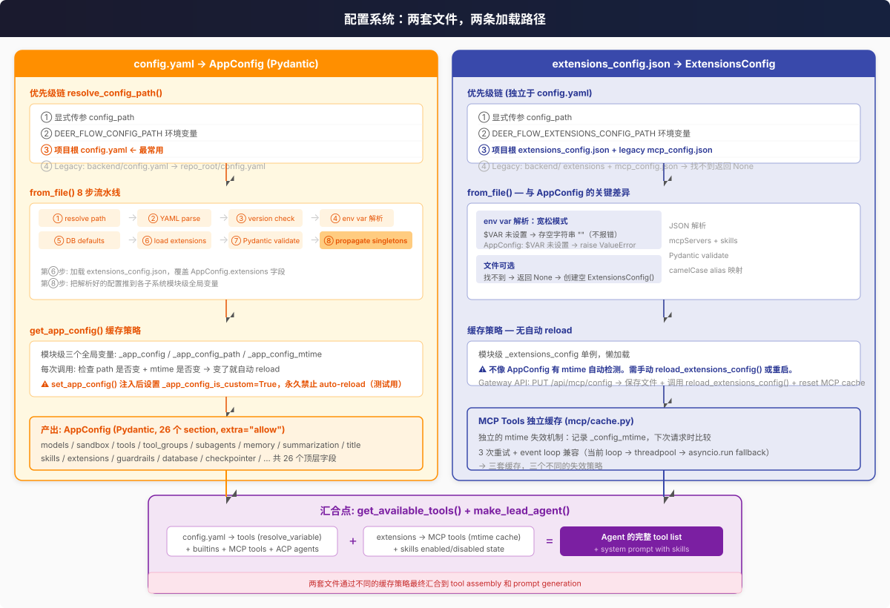
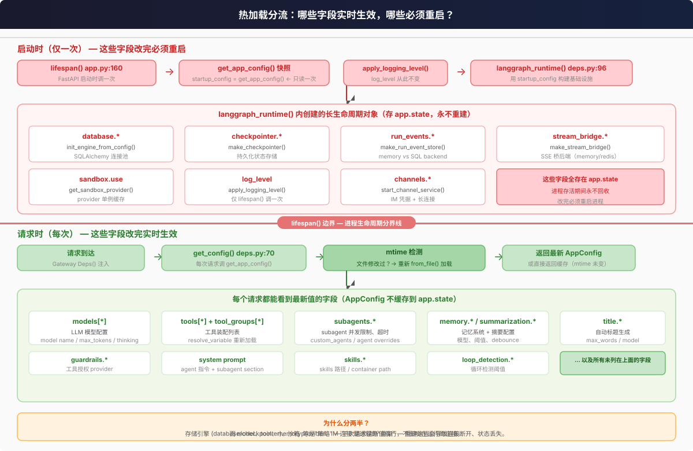

# 配置系统全景

DeerFlow 的配置系统由两套文件驱动，各有独立的加载路径、缓存策略和热更新行为。

## 核心问题

| 问题 | 答案 |
|------|------|
| **几个配置文件？** | 两个 — `config.yaml`（AppConfig，26 section）+ `extensions_config.json`（MCP servers + skills state） |
| **改 config.yaml 要重启吗？** | 分两半 — database/sandbox/channels 等基础设施字段要重启，model/tool/memory/prompt 等策略字段实时生效 |
| **env var 怎么解析？** | `$VAR` → `os.getenv()`。AppConfig 严格模式（缺了就报错），ExtensionsConfig 宽松模式（缺了存空串） |
| **配置优先级？** | 显式传参 > 环境变量 > 项目根目录 > legacy backend/ |
| **怎么加载自定义 tool/model？** | `resolve_variable("module.path:name", BaseTool)` — 动态 import + type check |
| **subagent 怎么覆盖配置？** | 三层 override: builtin defaults → config.yaml 全局 → per-agent overrides |

---

## 作为使用者，我去哪个文件做什么？

拿到 DeerFlow 之后，你只需要记住一条规则：

> **config.yaml = 这个应用本身怎么运行。extensions_config.json = 这个应用对外接了什么。**

更具体地说：

| 我要做的事 | 去哪个文件 | 改什么 |
|------------|-----------|--------|
| 换 LLM 模型、配 API key、调 thinking 模式 | `config.yaml` | `models[]` |
| 选沙箱模式（本地 vs Docker vs K3s） | `config.yaml` | `sandbox.use` |
| 加载自定义 tool（如 Tavily 搜索、Firecrawl 爬虫） | `config.yaml` | `tools[]`，写 `use: module.path:tool_name` |
| 调 subagent 行为（并发数、超时、加自定义 subagent） | `config.yaml` | `subagents` |
| 配置记忆系统、摘要、标题生成、循环检测 | `config.yaml` | `memory` / `summarization` / `title` / `loop_detection` |
| 换数据库后端（SQLite → Postgres）、checkpointer | `config.yaml` | `database` / `checkpointer` |
| 接 IM 渠道（飞书、Slack、Telegram） | `config.yaml` | `channels` |
| 指定 skills 目录在哪、沙箱里挂到哪个路径 | `config.yaml` | `skills.path` / `skills.container_path` |
| **接外部 MCP server（GitHub、Postgres、自建服务...）** | `extensions_config.json` | `mcpServers.<name>` |
| **开关某个 skill（关掉不需要的、打开自定义的）** | `extensions_config.json` | `skills.<name>.enabled` |

**为什么 MCP 和 skill 开关单独放一个文件？**

因为这两样是**用户最频繁动态调整的东西** — 你今天接个 GitHub MCP，明天关了某个 skill，后天换个 Postgres 连接。这些操作有专门的 API（`PUT /api/mcp/config`、`PUT /api/skills/{name}`），改了立即生效不用重启。

而 `config.yaml` 的绝大部分内容**没有 API 可以改** — 你只能编辑文件，然后靠热加载（或重启）生效。它是"基础设施"，不经常变。

### 唯一有重叠的地方：Skills

Skills 的**路径**在 `config.yaml` 里（告诉系统去哪找 SKILL.md 文件），但 Skills 的**开关**在 `extensions_config.json` 里（告诉系统这个 skill 用不用）。两者不是重复 — 是分工：config 管"在哪"，extensions 管"开不开"。

---

## 两套文件，两条路径



`config.yaml` 是**必须存在**的主配置 — 找不到直接 `FileNotFoundError`。`extensions_config.json` 是**可选的**扩展配置 — 找不到返回空 `ExtensionsConfig()`。

关键差异：

| | config.yaml | extensions_config.json |
|---|---|---|
| 数据格式 | YAML → `AppConfig` (Pydantic) | JSON → `ExtensionsConfig` |
| 必须存在 | ✓ 找不到报错 | ✗ 找不到返回空配置 |
| 缓存策略 | mtime 自动 reload | 懒加载，无自动 reload |
| env var 缺失 | `raise ValueError` | 存空字符串 `""` |
| 热更新 | 仅策略字段 | 需手动 `reload_extensions_config()` |
| MCP cache | — | 独立 mtime 失效 (mcp/cache.py) |

两套文件的汇合点在 `get_available_tools()` 和 `make_lead_agent()`：
- `config.yaml` → tool 列表（`resolve_variable` 解析）+ subagent 配置 + model 配置
- `extensions_config.json` → MCP tool 列表（mtime 缓存）+ skills 启用/禁用状态

---

## 热加载：谁实时生效，谁必须重启？



`lifespan()`（`app/gateway/app.py:160`）是进程生命周期分界线。启动时 `get_app_config()` 的快照传给 `langgraph_runtime()`，构建所有长生命周期对象并存到 `app.state`。后续请求走另一条路径 — 直接调 `get_app_config()` 检测 mtime 决定要不要重新从磁盘加载。

**设计理由：** 数据库连接池、checkpointer、沙箱 provider、IM 长连接是进程的"骨架" — 热替换这些会导致连接断开、状态丢失。而 model、tool、memory 是"策略"，下次请求读新值即可。

---

## 优先级链

### config.yaml (`app_config.py:113`)

```
① 显式传参 config_path
② DEER_FLOW_CONFIG_PATH 环境变量
③ 项目根目录 config.yaml（最常用）
④ legacy: backend/config.yaml → repo_root/config.yaml
```

### extensions_config.json (`extensions_config.py:72`)

```
① 显式传参 config_path
② DEER_FLOW_EXTENSIONS_CONFIG_PATH 环境变量
③ 项目根 extensions_config.json → legacy mcp_config.json
④ legacy: backend/ 同位置 → 找不到返回 None（不报错）
```

---

## env var 解析

`AppConfig.resolve_env_variables()` (`app_config.py:270`) 在 YAML 解析后递归遍历整个 config dict。任何 string 值以 `$` 开头就调用 `os.getenv()`：

```yaml
# config.yaml
models:
  - name: gpt-4
    api_key: $OPENAI_API_KEY     # → os.getenv("OPENAI_API_KEY")
    base_url: $AZURE_ENDPOINT    # → os.getenv("AZURE_ENDPOINT")
```

**AppConfig vs ExtensionsConfig 的差异：**

```python
# AppConfig (app_config.py:280-286) — 严格模式
value = os.getenv(env_key)
if value is None:
    raise ValueError(f"Environment variable '{env_key}' not found")

# ExtensionsConfig (extensions_config.py:163-172) — 宽松模式
value = os.getenv(env_key, "")   # 缺了就是空串，不报错
```

MCP server 的 env 字段设计为宽松是因为 server 可能用 `env` 传 fallback 默认值，缺失不应阻止启动。

---

## 三套缓存，三种失效策略

| 缓存 | 位置 | 失效方式 |
|------|------|----------|
| `_app_config` | `app_config.py:332` | mtime 自动检测，path 变更也触发 |
| `_extensions_config` | `extensions_config.py:210` | 懒加载，需手动 `reload_extensions_config()` |
| `_mcp_tools_cache` | `mcp/cache.py:11` | 独立 mtime 比较，3 次重试加载 |

三者互不依赖，各自管理生命周期。`PUT /api/mcp/config` 是唯一同时触发后两者更新的路径 — 保存 JSON → `reload_extensions_config()` → `reset MCP cache`。
