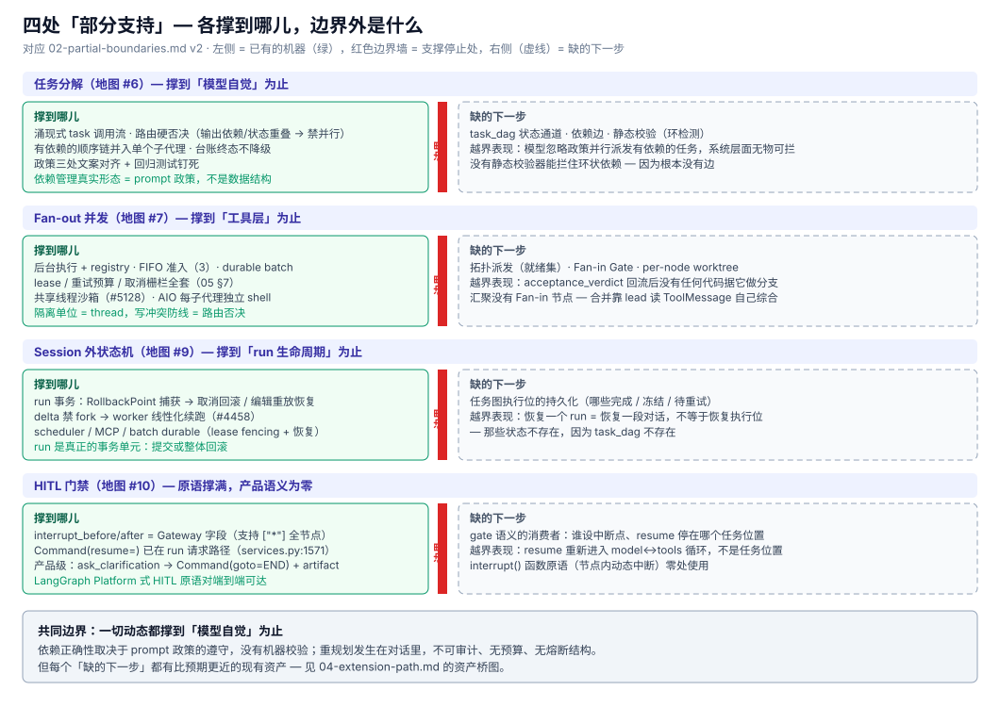

# 02 · 部分支持的边界 — 四处各撑到哪儿(v2,深挖修订)

> §01 地图里的 ◐ 档不是同一档"半个支持":四处各缺不同的东西,越过边界的表现也不同。v2 依据 [05](05-delegation-mechanics.md)/[06](06-langgraph-capability-surface.md) 逐文件核实修订。

## 1. 动态分解撑到"模型自觉"为止(地图 #6)

lead agent 想拆就拆、想串就串,拆分质量完全取决于模型当下表现。依赖关系只存在于对话语义中——**模型忘了就是忘了**。

- **但依赖管理并非空白(v2 修正)**:benefit-based 路由策略把"任务间输出依赖"和"可变状态重叠"定为**并行派发的硬否决**,有依赖的顺序链并入单个子代理——即依赖关系被降维成 **prompt 政策**,三处文案对齐 + 回归测试钉死;
- 越过边界的表现:政策靠模型自觉遵守,**没有机器校验**——模型忽略政策并行派发了有依赖的任务,系统层面没有任何东西能拦住;没有静态校验器能拦住环状依赖,因为根本没有边;
- 已有的最接近物:`delegations` 台账(append、同 id latest-wins、**终态不降级**、50 条封顶)——它是**记录**,不是**计划**;记录已发生的事,不声明接下来依赖什么。

## 2. 并发 Fan-out 撑到"工具层"为止(地图 #7)

后台执行、容量上限(FIFO 准入默认 3)、durable batch 都是真实的。但派发出去的是"**一堆独立任务**",不是"**一张图上的节点**"。

- **隔离的真相(v2 修正)**:子代理**共享 lead 线程的沙箱**(lease 生命周期保证兄弟不互相关,#5128;AIO 上每子代理独立 shell session)——物理隔离的单位是 **thread**,不是 worker;worker 级写冲突的防线是 §1 的路由硬否决,**不是**每 worker 一个容器。研究层"并发 Worker 必须物理文件隔离"的叙事在 DeerFlow 语境里要按此修正;
- 越过边界的表现:**汇聚没有 Fan-in 节点**——结果合并靠 lead agent 读 ToolMessage 后自己综合;`acceptance_verdict` 是任务边界上的点检,不是图上带通过/失败分支的 Gate(判定回流后没有代码据它做分支);失败的任务不触发任何拓扑级响应。

## 3. Session 外撑到"run 生命周期"为止(地图 #9)

scheduler 持久队列 / MCP durable task / subagent durable batch 解决的是"**进程死了活儿别丢**"(lease fencing、崩溃恢复、预算闸门)——方向上正是研究层议题 03 的正解。

- **run 级事务语义比 v1 判定的更强(v2 修正)**:开跑前捕获 `RollbackPoint`(全量状态 + pending_writes);取消带回滚、编辑重放失败恢复 pre-run 快照;delta 模式下 fork 被结构性禁用,worker 把续跑**线性化**为当前 head 上的整体状态替换(#4458)——run 是真正的**事务单元**;
- 越过边界的表现:恢复一个 run 等于恢复一段对话,**不等于恢复一张任务图的执行位**——没有"哪些节点已完成、哪些冻结、哪些待重试"的状态可以恢复,因为那些状态不存在。

## 4. HITL 撑到"对话回合"为止——但原语层比 v1 判定的强得多(地图 #10)

- **原语对已端到端暴露(v2 修正)**:`interrupt_before` / `interrupt_after` 是 Gateway API 字段(支持 `["*"]` 全节点暂停),`Command(resume=...)` 在 run 请求路径上——LangGraph Platform 式的图级中断/续跑,**基础设施是现成的**;
- 但**产品层无消费者**:内置 HITL 是 `ask_clarification` → `Command(goto=END)` + `human_input` artifact(结构化载荷),靠下一轮对话续;`interrupt()` 函数原语(节点内动态中断)全库零处使用;
- 越过边界的表现:resume 重新进入的是 model↔tools 循环,**不是某个任务位置**——"图停在某个节点、带完整状态等审批、approve 后原位续跑"的语义没有业务对象(没有任务节点可停)。原语齐备,产品语义缺失。

## 小结

| ◐ 项 | 撑到哪儿 | 缺的下一步 |
|------|---------|-----------|
| 任务分解 | 模型自觉 + 路由政策硬否决(依赖 → 串行/否决) | `task_dag` 状态通道 + 依赖边 + 机器校验 |
| Fan-out | 工具层独立任务;隔离单位 = thread 沙箱 | 拓扑派发 + Fan-in Gate + per-node worktree |
| Session 外 | run 事务(回滚/重放/线性化)+ durable 队列 | 任务图执行位的持久化 |
| HITL | 原语齐备(API 已暴露)、产品层对话回合 | gate 语义的消费者(resume 停在任务位置) |

这些"缺的下一步"的具体落点与对研究层注入方案的判读,见 [04-extension-path.md](04-extension-path.md);机制的完整解剖见 [05-delegation-mechanics.md](05-delegation-mechanics.md)。
