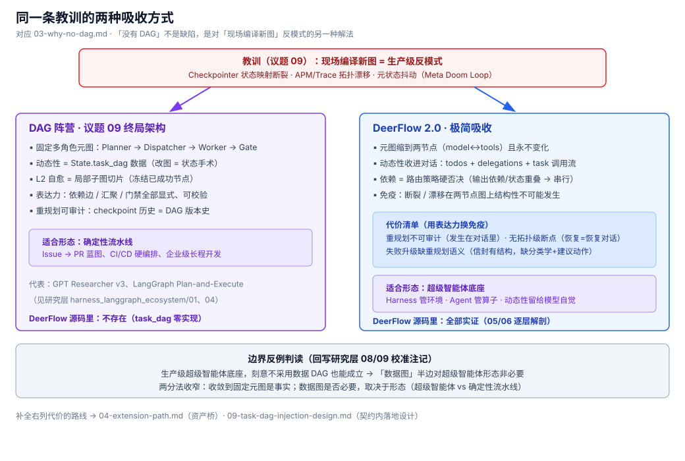

# 03 · 为什么没有 DAG — 刻意取舍，而非缺失

> 判定"缺席"之前，先判定"这是不是缺陷"。结论：不是。这是对同一组生产教训的另一种吸收方式。

## 1. 元图小到不需要切片

研究层议题 09 反对的"现场编译新图"，DeerFlow 用另一种方式吸收了：

- 元图只有 **两个节点**（model↔tools）且**永不变化**——Checkpointer 断裂、Trace 拓扑漂移这两个议题 09 的头号陷阱，在 DeerFlow 里**结构性不可能发生**；
- 可变性全部收进 lead agent 的对话上下文（todos + delegations + task 调用流）——"改图" = "改对话"；
- 代价是放弃拓扑级的表达力（见下节代价清单）。

## 2. 代价清单

即地图 #6 / #7 / #11 三行缺席的直接后果：

| 缺什么 | 直接后果 |
|--------|---------|
| task_dag 数据结构 | 重规划不可审计——"重新规划"发生在对话里，没有 diff 可看、没有版本可回滚 |
| 拓扑级断点 | checkpoint 恢复的是对话线程；任务执行位（哪些完成/冻结/待重试）无状态可恢复 |
| 结构化失败信封 | error ToolMessage 是弱契约——失败分类、建议动作、依赖缺口全靠模型从报错文本里猜 |

## 3. 对研究层的反例价值

研究层议题 09 的命题是"工业终局 = 固定元图 + 动态任务 DAG"。DeerFlow 回源后给出一个更锐利的边界反例：

> **一个生产级超级智能体底座，刻意不采用数据 DAG 也能成立。**

由此修正两分法的适用范围：

- "收敛到**固定元图**"是事实——DeerFlow 实证了这一半（尽管形态是极小元图）；
- "**数据图**是否必要，取决于形态"——对**超级智能体形态**（Harness 管环境、Agent 管算子、动态性留给模型自觉），数据 DAG 非必要；它更可能是**确定性流水线形态**（Issue→PR 蓝图一类）的必要条件。

**修正后的样本定位**：DeerFlow 2.0 实证的是"固定元图（极小形态）+ 物理沙箱 + 渐进装配 + 涌现式工具级 fan-out"；它**不是**"固定元图 + 动态任务 DAG"完整范式的实证。

> 研究层侧的对应校准：议题 [08](/Users/bowhead/ai_dev_sdlc_aidc/02_research/01_agent_engineering/graph_engineering/digested/08-superagent-harness-deerflow-langgraph.md)、[09](/Users/bowhead/ai_dev_sdlc_aidc/02_research/01_agent_engineering/graph_engineering/digested/09-meta-graph-vs-dynamic-task-dag.md) 末尾的"源码校准注记"（2026-10-01），以及 `result/landscape.md` §6.1、`CURRENT.md` 缺口第 3 条。

## 4. 对本知识库的含义

- `_digest/` 不铺 graph engineering 实现维度的决定成立：无实现可消化，本目录判定的是**能力边界**；
- 若未来源码长出数据图半边，从 [01](01-support-map.md) 的 #6/#7/#11 三行开始升级——那是缺口地图，也是扩展路线（[04](04-extension-path.md)）。
