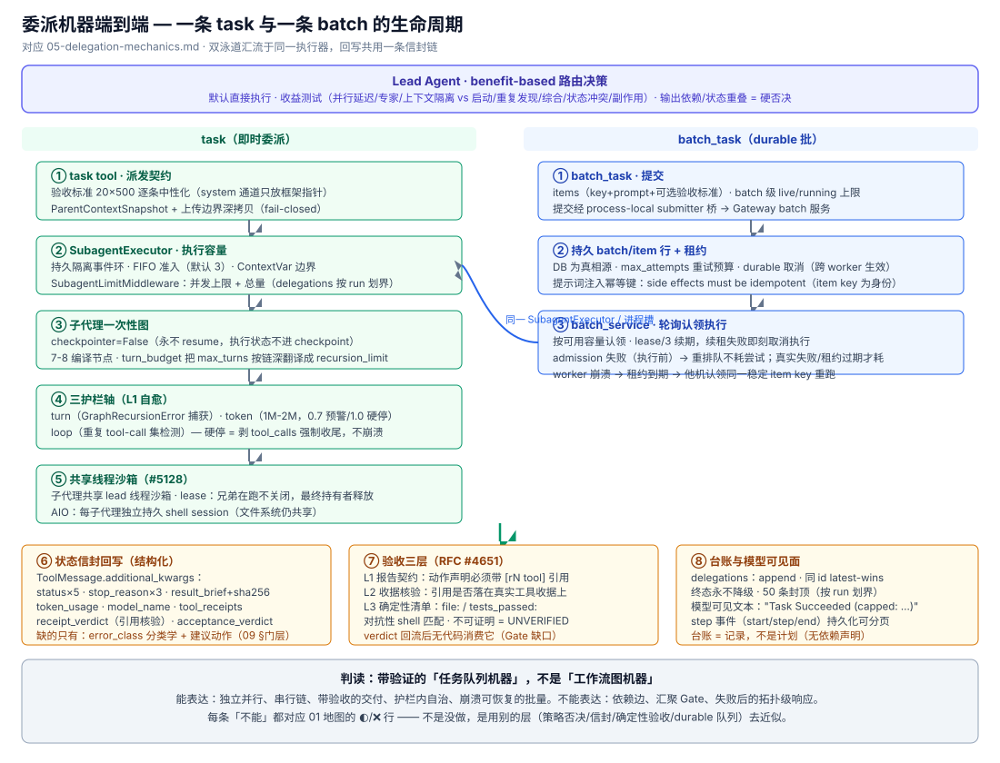
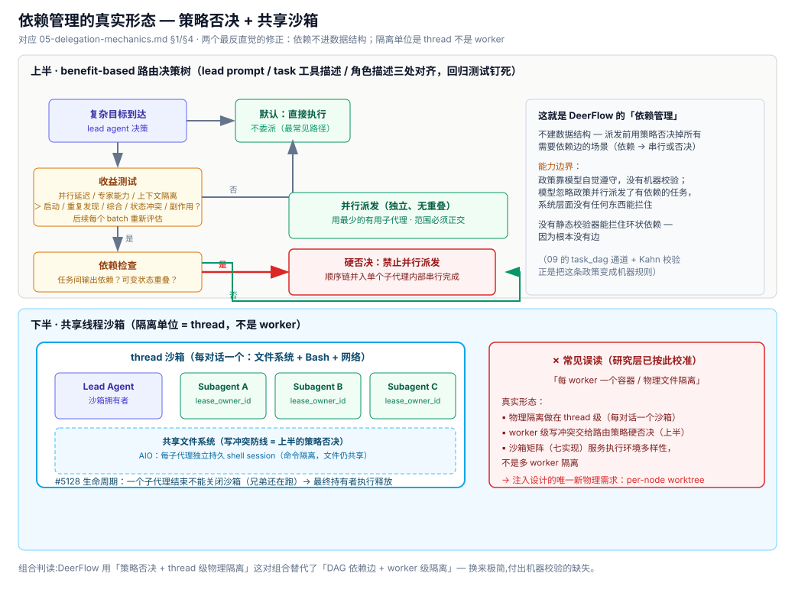

# 05 · 委派机制解剖 — DeerFlow 动态性的端到端真相

> 深挖版判定(2026-10-02)。`01` 的地图说"动态性下放到工具层的涌现式派发"——本文回答:**这台机器到底长什么样,每一层做了多深**。依据:`subagents/AGENTS.md`、`tools/builtins/task_tool.py`、`subagents/{executor,status_contract,acceptance_checks,turn_budget,batch_service}.py`、`agents/middlewares/clarification_middleware.py`,全部逐文件核实。

## 0. 一句话判读

**DeerFlow 造了一台带验证的"任务队列机器",不是"工作流图机器"——但每一层都做到了工业级深度。** 它缺的从来不是工程质量,是任务间关系的显式表达(依赖边)。反过来读:**依赖关系在 DeerFlow 里不是不存在,而是被降维成了路由策略的硬否决规则**——这是理解它能力边界的关键。

## 1. 路由决策层:依赖管理的真实形态

`lead_agent/prompt.py` 的 benefit-based routing policy(`subagents/AGENTS.md` 有全文,prompt/tool 描述/角色描述三处对齐,回归测试钉死):

- **默认直接执行**,`task` 只在并行延迟 / 专家能力 / 上下文隔离收益**明显超过**启动、重复发现、综合、状态冲突、副作用成本时使用;
- **输出依赖(inter-agent output dependencies)与可变状态重叠(overlapping mutable state)= 并行派发的硬否决**;
- 有依赖的顺序链可以并入**单个 subagent** 内部串行完成;每个后续 batch 重新评估。

**判读**:这就是 DeerFlow 对"DAG 依赖边"的回答——不建数据结构,而是在派发前用策略否决掉所有需要依赖边的场景。能力边界:依赖正确性取决于**模型自觉遵守 prompt 政策**,没有机器校验;一旦模型忽略政策并行派发了有依赖的任务,系统层面没有任何东西能拦住。

## 2. 派发层:task 工具的边界契约

`task_tool.py` 派发前的三个快照动作,每个都是显式契约:

| 契约 | 机制 |
|------|------|
| 验收标准传递 | lead 供给的 `acceptance_criteria` 经 `render_acceptance_criteria_block` 追加到任务 HumanMessage(封顶 20 条 × 500 字符,逐条标签中性化);SystemMessage 只放框架所有的指针注记——**不可信文本永远进不了 system 通道** |
| 父上下文快照 | `ParentContextSnapshot`:验证后捕获,保留真实回复,排除框架状态与未配对调用,不可序列化媒体标记 omitted |
| 上传边界 | 父 `ThreadState.uploaded_files` 在派发时快照、深拷贝过隔离环边界、种子进子状态;缺失/畸形 fail-closed 禁用工具 |

## 3. 执行层:子代理图的运行形态

- **一次性图**:`checkpointer=False` 编译,永不 resume——子代理执行状态**不进 checkpoint**,只有结果信封回流父线程;
- **拓扑感知预算**:`turn_budget.py` 把 `max_turns`(如 150)翻译成 `recursion_limit`——因为 LangGraph 按 super-step 计数且 `create_agent` 把每个 middleware 钩子编译成节点,子代理链编译出 7-8 个循环节点,直传会让预算缩水 8 倍(150 ≈ 18 轮)。DeerFlow 按实际装配的链推导乘数。**这是"把元图拓扑当成本模型用"的直接证据**;
- **三护栏轴**(L1 自愈的完整形态):turn 轴(`GraphRecursionError` 捕获)、token 轴(默认 1M/2M 与 summarization 联动,0.7 预警 1.0 硬停)、loop 轴(重复 tool-call 集检测)。后两者的硬停**不抛异常**:剥掉当轮 tool_calls、强制 `finish_reason="stop"`、优雅收尾。`consume_stop_reason(run_id)` duck-type 接口——加新护栏不用改 executor;
- **失败判定权威**:LLM 异常经 `LLMErrorHandlingMiddleware` 转成带 `deerflow_error_fallback` 标记的 AIMessage;executor 只认标记判 FAILED,**绝不解析展示文本当状态协议**。

## 4. 隔离层:共享线程沙箱(修正一个常见误读)

**子代理共享 lead 线程的沙箱,不是每 worker 一个沙箱。** `#5128` 生命周期:每个获准的子代理携带 task 派生的 `sandbox_lease_owner_id` + `sandbox_command_scope_id`;一个子代理结束不能关闭沙箱(兄弟还在跑),最终持有者执行释放;回滚/fork 恢复的子代理绑非释放 holder。AIO 上 command scope 为每个子代理选独立的持久 shell session(文件系统仍共享)。

**判读**:研究层"并发 Worker 必须物理文件隔离否则写冲突"的叙事,在 DeerFlow 里的真实解法是**双层的**:物理隔离做在 **thread 级**(每对话一个沙箱),worker 级的写冲突交给**路由策略硬否决**(§1)。沙箱矩阵(七实现)的超配服务于执行环境多样性,不是多 worker 隔离。

## 5. 结果回写层:状态信封(它比"弱契约"强得多)

`status_contract.py` 的结构化信封,经 `ToolMessage.additional_kwargs` 传输,前后端由 `contracts/subagent_status_contract.json` 共享夹具钉死:

| 字段 | 内容 |
|------|------|
| `subagent_status` | 5 值枚举:completed / failed / cancelled / timed_out / polling_timed_out |
| `subagent_stop_reason` | 3 值:token_capped / turn_capped / loop_capped(**护栏截停的分类学**,additive 字段而非新枚举——旧消费者不破) |
| `subagent_result_brief` + `subagent_result_sha256` | 有界结果摘要 + 全量结果摘要的 SHA-256 |
| `subagent_error` | 有界错误 blob(非 completed 才携带) |
| `subagent_token_usage` / `subagent_model_name` | 累计用量快照 + 实际模型 |
| `subagent_tool_receipts` / `receipt_verdict` / `acceptance_verdict` | 工具收据、引用核验判定、确定性验收判定 |

外加 `delegations` 台账 reducer(`thread_state.py::merge_delegations`):append、同 id latest-wins、**终态永不降级**、50 条封顶。模型可见文本 `Task Succeeded (capped: token budget). Result: ...` 与信封并行。

**判读**:与议题 07 的 FailureEnvelope 对表——**已有**:状态词汇、截停原因分类、结果摘要与摘要指纹、验收判定;**缺的只有两样**:`failure_classification`(基础设施/语法/断言/spec 歧义)与 `suggested_replanning_action`(LOCAL_RETRY / SUBGRAPH_REPLAN / HUMAN_ESCALATE)。即:**信封存在,缺的是重规划语义,不是结构化本身**。

## 6. 验收层:确定性 Gate 的种子(RFC #4651)

三层验证,一层比一层硬:

1. **L1 报告契约**(prompt 层):子代理 SystemMessage 强制要求动作声明带 `[rN tool_name]` 引用、交付物带可验证句柄(绝对路径/URL/ID/HTTP 状态);
2. **L2 收据核验**(执行证据):`receipt_verification` 核对引用是否落在真实工具收据上,输出 `receipt_verdict`(advisory);
3. **L3 验收清单**(确定性代码):`acceptance_checks.py` 在 completed 分支代码级检查 `file:<path> exists|non-empty`、`file_written:<path>`、`tests_passed:<command>`——shell 结构感知的对抗性匹配(算子分段、可执行身份、参数子序列、环境赋值精确相等、退出码标记解析、持久 shell 来源戳、否定选项否决),**一切不可证明即 UNVERIFIED,绝不静默通过**。durable batch 的完成项复用同一检查器(`batch_acceptance.py`)。

**判读**:这是全库最接近"Gate"的机器——但它检查的是**单个任务的交付**,不是**图上汇聚节点的通过/失败分支**。`acceptance_verdict` 回流后没有消费者做拓扑决策(没有后续节点可以"因为验收失败而走 Fail 分支"),只有 lead agent 读到 UNVERIFIED 后自己决定怎么办。AGENTS.md 明说 claim correctness 属于设计中的 PR5 judge / RFC §6 re-execution——**Layer 4(受控重执行)是有设计、未实现的下一层**。

## 7. durable batch 层:最接近工作流引擎的部分

`batch_task` → 持久 batch/item 行 → lease-based `batch_service.py`(Gateway 启动)→ 同一 `SubagentExecutor`/进程槽 → 有界存储结果 + owner-scoped API/JSONL 导出。语义细节完全是 durable workflow 引擎的:

- **重试预算精确性**:执行器队列拒绝/超时发生在模型执行前,**不消耗** item 尝试次数;真实执行失败与租约过期**才消耗**;
- **取消栅栏**:用户取消立刻 terminalize 全部 nonterminal item 并清租约,fence 掉过期 worker 的迟到完成;
- **租约续期**:验收检查期间 item 租约持续续期;阻塞读在取消时 drain 后才释放。

**判读**:item 之间**没有依赖边**——它是 durable 任务队列(lease/retry/fence 全套),不是 durable 工作流图。但工程语义的成熟度意味着:**如果给它加上依赖边和就绪集派发,它就是议题 09 的 Dispatcher 底座**——离数据图半边最近的一块现有资产。

## 8. 能力边界总结

这台机器**能**表达:独立并行任务、串行链(单子代理内部)、带验收的交付、护栏内的自治执行、崩溃后可恢复的批量任务。
它**不能**表达:任务间依赖、汇聚点、按依赖拓扑的并发调度、失败后的拓扑级响应(信封里没有"接下来该怎样")、跨任务的执行位恢复。
每一条"不能",都对应 `01` 地图的一个 ◐/❌ 行——而本篇证明了:**不是没做,是选择用别的层(策略否决、状态信封、确定性验收、durable 队列)去近似**。
