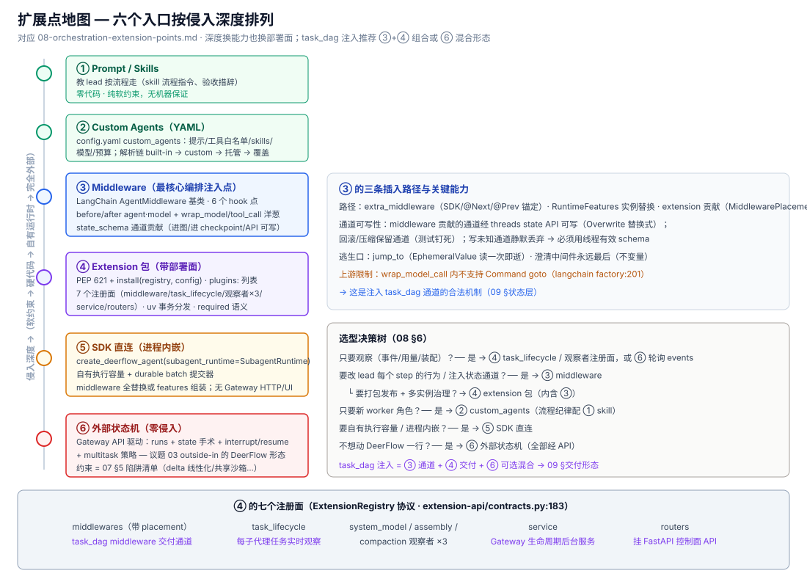

# 08 · 扩展点地图 — 往 DeerFlow 里加编排逻辑的六个入口

> 2026-10-02 深挖成稿。回答:**要给 DeerFlow 加编排逻辑(观察、拦截、注入状态、自有执行容量、完全外部驱动),从哪儿进**。依据:`extension-api/contracts.py`(注册协议)、`extensions/AGENTS.md`、`subagents/config.py`/`registry.py`、`agents/factory.py`、`_digest/internals/middleware/00-overview.md`、`examples/deerflow-extension-example/`。

## 0. 一句话

**六个入口,按侵入深度排序**;深度换能力,也换部署面与风险。task_dag 注入(09)推荐走 ③ middleware + ④ extension 包的组合,或 ⑥ 外部状态机的混合形态。

## 1. 入口总表



| # | 入口 | 形态 | 能做什么 | 部署面 / 风险 |
|---|------|------|---------|--------------|
| ① | Prompt / Skills | 文本 | 教 lead 按流程走(skill 的流程化指令、验收标准措辞) | 零代码;纯软约束,无机器保证 |
| ② | Custom Agents | `config.yaml custom_agents` | 定义专职 worker(系统提示/工具白名单/skills/模型/预算) | YAML;每字段有 schema 校验;运行时可经 API 改 |
| ③ | Middleware | Python 类进 agent 链 | **每个 step 的钩子 + 状态通道贡献 + 工具/模型调用包裹** | 代码;随图编译,通道进 checkpoint |
| ④ | Extension 包 | PEP 621 包 + `install(registry, config)` | ③ 的全部 + 生命周期观察者 + Gateway 服务 + HTTP 路由 | 独立发布/升级/启停;执行于 Gateway 权限,仅信任源 |
| ⑤ | SDK 直连 | `create_deerflow_agent(subagent_runtime=...)` | 自有执行容量/批量提交器/中间件全替换,进程内嵌 | 代码;绕开 Gateway(无 HTTP/UI 面) |
| ⑥ | 外部状态机 | Gateway API 驱动 | runs + state 手术 + interrupt/resume + multitask 策略,**从外面编排** | 零代码侵入;受 §5 约束(delta 线性化等) |

## 2. ③ Middleware 契约(最核心的编排注入点)

基类是 **LangChain 的 `AgentMiddleware[State]`**(不是 DeerFlow 私有协议);DeerFlow 做的是选择与排序(37 条目位,见 `_digest/internals/middleware/03-catalog.md`)。

**六个 hook 点**(一轮 step 的管道):
```
before_agent → [before_model → (wrap_model_call 洋葱) → LLM → after_model
  → 有 tool_calls → (wrap_tool_call 洋葱) → tools] × N → after_agent → END
```

| 能力 | 说明 |
|------|------|
| `state_schema` **通道贡献** | middleware 自带 state schema,其通道**进图、进 checkpoint、经 state API 可写**(Overwrite 替换式;回滚/压缩均保留——有测试钉死)。**这是注入 `task_dag` 通道的合法机制** |
| `wrap_tool_call` / `wrap_model_call` | 洋葱包裹:可改参、可短路、可重试;**上游限制:wrap_model_call 内不支持 `Command(goto=...)`**(langchain factory.py:201-203) |
| `jump_to` | 紧急逃生口(`"tools"/"model"/"end"`,EphemeralValue 读一次即逝) |
| 定位 | `@Next(X)` / `@Prev(X)` 锚定插入;冲突检测 + 循环依赖检测;不变量:ClarificationMiddleware 永远最后 |
| 三条插入路径 | `extra_middleware`(create_deerflow_agent)/ `RuntimeFeatures` 实例替换(SDK)/ extension 贡献(带 `MiddlewarePlacement`) |

**通道可写性的边界**:写未知通道**静默丢弃**;必须用线程的有效 schema(`graph_state_schema(assistant_graph)`);reducer 通道替换需 `Overwrite`。预算类字段要**单写者**(09 §预算层)。

## 3. ② Custom Agents(YAML 定义的专职 worker)

`custom_agents.<name>` 字段(全部):`description`(何时委派)、`system_prompt`、`tools`(白名单,None=继承全部)、`disallowed_tools`(默认 `["task"]`)、`skills`(None=全部可见,[]=禁用)、`model`(`inherit`/父模型/默认)、`max_turns`(经 turn_budget 按链深翻译成 recursion_limit)、`timeout_seconds`。

解析顺序(权威链):`BUILTIN_SUBAGENTS` → `custom_agents` → 管理员托管定义(部署级持久) → 显式 `subagents.agents.<name>` 覆盖。`allowed_subagents` 快照进 run 元数据(None=全部,[]=硬拒)。**注意**:benefit 路由政策文案在 lead prompt / task 工具描述 / 内置角色描述三处对齐,自定义角色要与政策语义一致(`tests/test_subagent_routing_prompt.py` 钉死)。

## 4. ④ Extension 包(带部署面的完整插件)

装载:根 `config.yaml` 的 `plugins:` 列表(operator 控制,刻意不放 API 可写的 extensions_config.json);`required: true` 失败即拒绝启动(默认 false 容错降级)。分发:`deerflow extensions install/upgrade/list/enable/disable/remove`(uv 事务,失败回滚 pyproject+lock,本地目录是快照非软链)。

**七个注册面**(`ExtensionRegistry` 协议,`extension-api/contracts.py:183`):

| 注册面 | 编排用途 |
|--------|---------|
| `middlewares(contributor)` | 贡献 middleware(带 placement 定位)——**task_dag middleware 的交付通道** |
| `task_lifecycle(contributor)` | **每个子代理任务的生命周期观察**(TaskInfo/TaskOutcome)——外部编排器的实时传感器 |
| `system_model_observer(observer)` | 系统模型调用观察(标题/评估器等) |
| `agent_assembly_observer(observer)` | 图装配观察(描述符/中间件栈) |
| `context_compaction_observer(observer)` | 压缩观察 |
| `service(service)` | Gateway 生命周期服务(自启自停的后台进程) |
| `routers(routers)` | 挂 FastAPI 路由(编排控制面 API!) |

参考实现:`examples/deerflow-extension-example/`(五类贡献各一个最小样例,含测试)。

## 5. ⑤ SDK 直连 / ⑥ 外部状态机

- **⑤ SDK**:`create_deerflow_agent(model, tools, middleware=…, features=…, subagent_runtime=SubagentRuntime)`——调用方自有执行容量与 durable batch 提交器(`async with runtime` 生命周期),middleware 全替换或 features 组装;`assemble_lead_agent` 返回 `(graph, descriptor)`;嵌入宿主进程,无 Gateway HTTP/UI。
- **⑥ 外部状态机(议题 03 的 outside-in 在 DeerFlow 的形态)**:编排器活在 DeerFlow 之外,用 07 §1 的 API 面驱动——发 runs(`command.resume`/`interrupt_before`)、读 events/subagent steps、写状态(state API 手术 middleware 通道)、控 batch(pause/resume/retry)。**这是零侵入的完整编排路径**,约束 = 07 §5 的陷阱清单(delta 线性化、共享沙箱、无完成回调)。

## 6. 选型决策树

```
只要观察(事件/用量/装配)? ── 是 → ④ task_lifecycle/observer 注册面(或 ⑥ 轮询 events)
要改 lead 每个 step 的行为/注入状态通道? ── 是 → ③ middleware
                               └─ 要打包发布+多实例治理? → ④ extension 包(内含 ③)
只要新 worker 角色? ── 是 → ② custom_agents(要流程纪律则配 ① skill)
要自有执行容量/进程内嵌? ── 是 → ⑤ SDK 直连
不想动 DeerFlow 一行? ── 是 → ⑥ 外部状态机(全部经 API)
```

> task_dag 注入如何组合 ③④⑥ → [09-task-dag-injection-design.md](09-task-dag-injection-design.md)。
