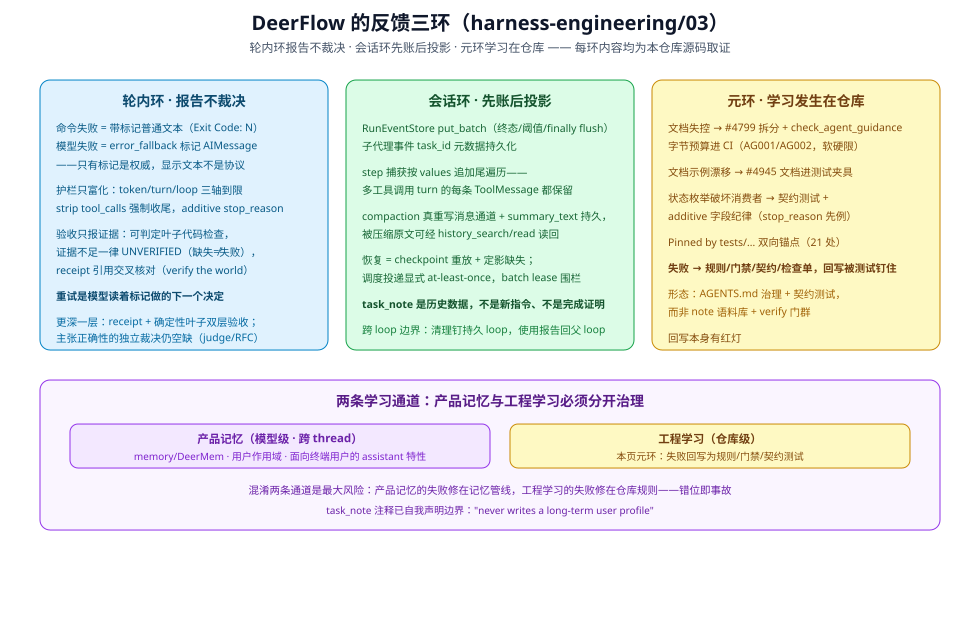

# 反馈三环：DeerFlow 如何报告失败、落账反馈、在仓库里学习

> 本篇把 DeerFlow 的反馈机制拆成三环盘点：**轮内环**（失败如何变成模型可见信号）、**会话环**（反馈如何持久化与恢复）、**元环**（仓库如何从失败中学习）。每环内容均从本仓库源码取证。出处分级：`[源码]` 本仓库已核验；`[推断]` 由事实推出。

## 轮内环：失败是标记，不是异常

**统一立场：失败以标记进入上下文，重试是模型的下一个决定。** `[源码]` 三条互不相同的实现形态：

- **命令失败 = 带标记的普通文本**：每个沙箱 provider 在非零退出时向输出追加状态标记（local/e2b/opensandbox/tenki/boxlite 走文本 `Exit Code: N`，AIO 走 SDK 结构化 `exit_code`；本地超时 `Exit Code: 124`、信号杀进程记负数）。非零退出返回的是普通文本，`deerflow_tool_meta` 仍报 success——重试与否是模型读着标记做的下一个决定（`subagents/AGENTS.md` 验收清单节）。
- **模型失败 = 带标记的普通 AIMessage**：`LLMErrorHandlingMiddleware` 把 provider 异常转换成干净的图终止 + `additional_kwargs.deerflow_error_fallback=true` 与错误元数据。**只有标记是权威的**——"error-looking assistant prose without it remains a normal completed result"，执行器与前端都不解析显示文本当协议（`subagents/AGENTS.md` Handled LLM failures 节）。
- **护栏只富化，不改语义**：token 预算（warn 0.7 / hard 1.0）、turn/recursion 预算（按组装链深度缩放）、循环检测三轴到限时不抛错——strip 掉本轮 tool_calls、强制 `finish_reason="stop"` 让 run 自然收尾，原因走 **additive 的 `stop_reason` 字段**（`token_capped|turn_capped|loop_capped`）而不是新增状态枚举，旧前端与 ledger 无感（跨语言契约 `contracts/subagent_status_contract.json` v2，被 `test_status_values_match_contract` 等钉住）。
- **验收只报证据，不裁决主张**：`acceptance_checks.py` 对可判定的叶子（`file:<path> exists`、`tests_passed:<command>`）跑确定性代码检查——但任何证据不足（截断、来源不可识别、路径逃逸、shell 结构不可证明）一律 **degrade to UNVERIFIED，never silently passed**；"Layer 2 is execution evidence only, claim correctness belongs to the judge"是仓库自己写下的边界（`subagents/AGENTS.md` acceptance 节、`TestKnownBoundaries`）。

`[推断]` 这一环的诚实边界：receipt（Layer 1）+ 确定性叶子检查（Layer 2）已让模型自报受代码证据约束，但**主张正确性的独立裁决（judge / RFC 的 re-execution）仍未落地**——验收证明的是"执行发生过"，不是"主张正确"。

## 会话环：先落账，再投影；恢复是重放 + 定影

`[源码]` DeerFlow 的会话环有三个本仓库特有的形态：

1. **先账后投影有性能形态**：`RunEventStore.put()` 是逐线程 advisory lock 的低频路径，所以子代理 `task_*` 事件走 `put_batch`（终态/阈值/finally 三处 flush）——"先落账"在这里是写路径工程，不只是原则。
2. **步进捕获按追加尾遍历**：`capture_new_step_messages` 走每个 `values` chunk 的**新增尾部**而非 `messages[-1]`，一个 turn 里 ToolNode 并发追加的多条 ToolMessage 全部保留；compaction 用 `RemoveMessage(REMOVE_ALL_MESSAGES)` 收缩消息通道时游标重置 + 去重，收缩后的新 step 不丢（`subagents/AGENTS.md` Step capture 节）。
3. **恢复 = checkpoint 重放 + 缺口定影**：子代理图 `checkpointer=False`（one-shot 从不 resume）；lead 侧 compaction 把被摘要的历史**真重写**，摘要以 `ThreadState.summary_text` 持久并由 durable-context 中间件投影为受保护隐藏数据——被压缩的原文仍可经 `history_search`/`history_read` 从 compacted source batches 读回，`task_note` 的注释把资格说死："historical data, never new instructions or proof that a reported action actually succeeded"（`docs/task-continuity.md`）。调度器投递是显式 at-least-once（崩溃后可重投，不假装 exactly-once），batch 用 lease 双向围栏防陈旧 worker（`orchestration-ladder/01` 已逐原语核验崩溃窗口，本篇不重复）。

## 元环：学习发生在仓库——DeerFlow 的最强一环

**元环：学习发生在仓库。** 模型不跨会话沉淀工程经验；跨会话的主体是仓库本身——失败回写成规则/门禁/契约，且回写被测试钉住。`harness-engineering/01` 记录了完整轨迹，这里补三个"失败→机制"的回写实例：

- 1289 行巨型 `backend/AGENTS.md` 文档失控 → `#4799` 拆成 ~20 个 per-directory 文件 **并上线 `check_agent_guidance.py` 预算 CI**——把"文档不许膨胀"从劝告变成红灯；
- 文档示例与真实签名漂移 → `#4945` `test_middleware_documentation.py` 把文档示例放进测试夹具——文档本身进了测试矩阵；
- 状态枚举破坏 v1 消费者 → 契约测试（`test_status_values_match_contract`）+ additive 字段纪律——一次 API 演进事故变成跨语言契约门。

加上"Pinned by tests/…" 双向锚点与 `docs/testing/` 的五台阶检查单，DeerFlow 元环的形态是：**AGENTS.md 治理 + 契约测试 + 预算 CI**——回写本身有红灯。

## 两条学习通道：产品记忆与工程学习必须分开治理

`[源码]` DeerFlow 同时存在两条学习通道：`memory.enabled` + DeerMem 让 lead agent 跨 thread 携带用户级记忆——这是面向终端用户的 assistant 的产品特性（用户期望"它记得我"），不是纪律松弛；元环的仓库级学习则服务工程演进。两条通道的纪律互不相同：

`[推断]` 正确的读法是**双通道**，两条通道的纪律互不相同：

| 通道 | 内容 | 纪律 |
|------|------|------|
| 产品记忆（模型级） | 用户上下文、偏好、事实——memory 中间件注入 | 用户作用域、注入受 hidden/escaped 通道约束、task continuity 明文"不写长期用户画像" |
| 工程学习（仓库级） | 本篇元环：规则、门禁、契约、检查单 | 失败→回写、回写被测试钉住 |

混淆这两条通道是最大风险：产品记忆的失败（记错用户偏好）修法在记忆管线，工程学习的失败修法在仓库规则——把前者当后者（往 AGENTS.md 里写"记得用户 X"）或把后者当前者（指望 memory 学会工程纪律）都是错位。

## 人类反馈三分流：DeerFlow 的现状

**人的反馈按目的地分流** `[源码]`：**进环的**——`ask_clarification` 的用户回复成为下一轮输入（`clarification_middleware.py`，回合级 HITL）；**关于仓库的**——GitHub issue/PR 与 `deerflow-maintainer-orchestrator` skill（comment-plane 信任边界、证据优于绿灯）；**关于输出的**——单向 log-only 评分通道目前缺位（IM 通道与 UI 反馈面是否构成此通道，**未核验，登记**）。

## 结论

三环读数：**轮内环**——失败以标记进入上下文，验收证据层已有 receipt + 确定性检查双层；**会话环**——先账后投影成立，恢复是"checkpoint 重放 + 定影 + 显式 at-least-once"；**元环**——失败回写成规则/门禁/契约，回写有红灯。最重要的清醒：DeerFlow 把学习同时放在模型（产品记忆）与仓库（工程规则）两条通道上，必须永远保持两者的纪律边界——混淆通道（往 AGENTS.md 写"记得用户 X"、指望 memory 学会工程纪律）都是错位。

## 出处

- DeerFlow 事实：`backend/packages/harness/deerflow/subagents/AGENTS.md`（error_fallback 标记、stop_reason、验收清单、事件捕获、租约）、`docs/task-continuity.md`、`harness-engineering/01-agent-docs-system.md`（治理轨迹）、`docs/agents/maintainer-orchestrator-design.md`、`orchestration-ladder/01-完成语义与崩溃窗口-接受可见静止处置.md`（崩溃窗口逐原语核验）
