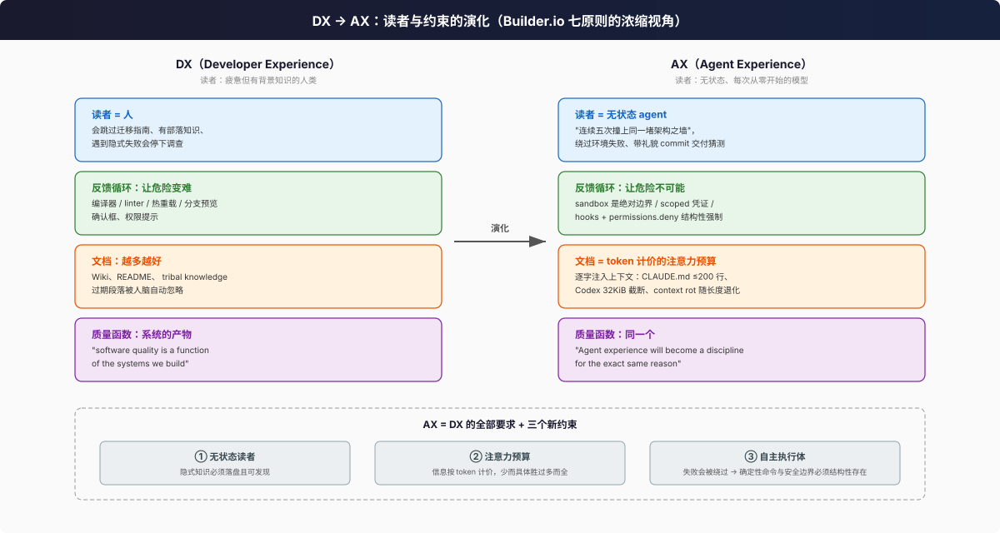

# AX：从 Developer Experience 到 Agent Experience

> 本篇回答：**"agent 友好的仓库"是一个已被公认的概念吗？它与 DX 是什么关系？** 结论：社区正在把它命名为 Agent Experience（AX），并且已经出现了系统性的论述与七条核心原则。

## 1. 概念起源：为什么需要新名词

Builder.io 的系统性文章 [Developer experience is dead. Long live agent experience.](https://www.builder.io/blog/agent-experience)（2026-06）给出了目前最完整的定义：

> **Agent experience (AX) 是设计"模型与真实代码库之间的那一层"的学科：上下文、工具、权限、测试与 review 闭环，它们告诉 agent 什么重要、什么能碰、以及如何确认自己成功了。**

它的出发点是一个第一性原理问题："**我们如何为 agent 构建一个快速、安全、确定性的反馈循环？**"（同文）。关键论证链：

1. DX 的十年积累（编译器、linter、热重载、分支预览）本质是"**让正确的路径成为容易的路径**"。
2. Agent 是**完全无状态的贡献者**："它没有你产品的活记忆，不知道团队惧怕的 legacy bug，没有代码库的部落知识。放任不管的话，一个无状态 agent 会连续五次撞上同一堵架构之墙，除非环境提供更好的反馈循环。"（[同文](https://www.builder.io/blog/agent-experience)）
3. 因此"我们不该只优化 prompt，而要**主动工程化它们的环境**"。

微软开发者博客也从平台视角讨论了 [The AX stack: what's fixed, where you can win](https://developer.microsoft.com/blog/the-ax-stack-whats-fixed-where-you-can-win)，把 AX 作为一整层技术栈来分析（原文站内跳转受限，细目**待验证**，此处仅登记存在性与链接）。

社区侧还有配套的[agent-friendly-guide](https://github.com/mixcode/agent-friendly-guide)——一个以"audit → scaffold llms.txt/AGENTS.txt → clean-agent 评估"为方法论的 Claude Code 插件仓库，说明 AX 已经从"文章概念"沉淀为"可执行的工具链"。第三方评测站 [agentfriendlycode.com](https://www.agentfriendlycode.com/repo/16?model=cursor) 甚至对不同 harness 下同一仓库的 agent 友好度打分（评测方法**待验证**）。

## 2. AX 的七条核心原则（Builder.io 框架）

以下七条均出自 [builder.io/blog/agent-experience](https://www.builder.io/blog/agent-experience)，每条附本调研的理解：

| # | 原则 | 一句话内核 |
|---|------|-----------|
| 1 | **Context is onboarding** | Agent 的 onboarding 不再是一次性事件，而是**每个任务开始时都发生一次**；因此上下文必须像代码一样"minimal、transparent、tested" |
| 2 | **The environment is part of the prompt** | LLM 非确定，所以**环境必须极度确定**：依赖版本、脚本、环境变量形状、种子数据决定了 agent 能观察到什么、修正什么 |
| 3 | **No handoffs without verification** | 交付前必须自证：测试、截图、浏览器流程、日志。"Spend tokens before spending reviewer attention"——token 便宜且 24/7，资深工程师注意力贵 |
| 4 | **Safety needs to be deterministic** | "DX 让危险动作变难，AX 要让危险动作**不可能**"：sandbox、scoped 凭证、网络/文件限额、人工门禁。"'别碰数据库'这种 prompt 挡不住 agent——安全必须结构性" |
| 5 | **Model routing as boring infrastructure** | 模型选型应成为无聊的基建：便宜模型做分诊，确定性语法验证交给 linter/测试运行器，贵的推理模型留给多文件判断 |
| 6 | **Design systems and code architecture are the source of truth** | "代码库必须成为产品真实工作方式的最准确记录"；经典软件工程原则——**深模块 + 薄接口**（文内直接引用 Ousterhout）、类型化 API、可预测路由——被重新论证为"机器的渐进式披露" |
| 7 | **Agents become cross-functional glue** | AX 最终是组织协调引擎：设计/产品/市场在受限预览环境里直接与 agent 迭代，开发者从"人肉路由器"变成平台工程师 |

注意第 6 条与本仓库 `_digest` 中 codebase-design 词汇的关系：AX 论述**复用**了经典可维护性理论（深模块），而不是推翻它——这是理解 AX 与传统工程关系的关键。

## 3. AX 与 DX/可维护性的异同

### 相同点（AX 是 DX 的延续而非断裂）

- Builder.io 原文的结语："**Developer experience became a discipline because we realized that software quality is a function of the systems we build. Agent experience will become a discipline for the exact same reason.**"（[同文](https://www.builder.io/blog/agent-experience)）
- 一手厂商的最佳实践完全沿用传统工程语汇：OpenAI function calling 指南要求"**应用软件工程最佳实践：让函数可预测、符合最小惊讶原则**"并且"**通过实习生测试**：只给你给模型的那些信息，一个实习生能否正确使用这个函数？"（[Function calling](https://developers.openai.com/api/docs/guides/function-calling.md)）
- agents.md 规范本身只是标准 Markdown，没有新的格式负担（[agents.md](https://agents.md/)）。

### 差异点（AX 的新增约束）

| 维度 | 传统 DX / 可维护性 | AX 的增量 |
|------|--------------------|-----------|
| 读者 | 疲惫、会跳过迁移指南、有背景知识的人类 | **无状态、无部落知识、每次任务都从零开始**的模型（[builder.io](https://www.builder.io/blog/agent-experience)） |
| 注意力 | 人的时间宝贵 → 减少"重新理解"成本 | **上下文预算**是硬约束：token 越多注意力越稀释（[context rot](https://www.trychroma.com/research/context-rot)），文档不是越多越好（[Anthropic context engineering](https://www.anthropic.com/engineering/effective-context-engineering-for-ai-agents)） |
| 错误处理 | 人会停下调查 | "Agent 会**绕过**失败、改错文件、带着礼貌的 commit message 交付一个猜测"（[builder.io](https://www.builder.io/blog/agent-experience)）——所以环境失败必须显性、可行动 |
| 安全 | "让危险变难"（确认框、权限提示） | "让危险**不可能**"（sandbox 是绝对安全边界）（[builder.io](https://www.builder.io/blog/agent-experience)；Claude Code 的 [hooks/permissions](https://code.claude.com/docs/en/memory) 分层同理） |
| 指令消费 | 人读文档、忽略过期段落 | 指令**逐字注入上下文**并消耗注意力预算：CLAUDE.md ≤200 行、>4MiB 跳过（[Claude Code memory](https://code.claude.com/docs/en/memory#my-claude-md-is-too-large)）；Codex 32KiB 截断（[Codex docs](https://learn.chatgpt.com/docs/agent-configuration/agents-md)） |
| review 负担 | 人写人审 | "我们在用写代码的摩擦换取**审查代码的巨大认知负担**"；AX 要求 agent 交付时自带证据（[builder.io](https://www.builder.io/blog/agent-experience)） |

### 一个精确的表述

> **AX = DX 的全部要求 + 三个新约束：① 无状态读者（所有隐式知识必须落盘且可发现）；② 注意力预算（信息按 token 计价，少而具体胜过多而全）；③ 自主执行体（环境失败会被绕过而非上报，因此确定性命令与安全边界必须结构性存在）。**

## 4. 各方论述的收敛处

把本目录 01 篇的一手来源与 AX 论述并排，可以看到高度收敛：

1. **确定性反馈循环**是所有方案的中心词——builder.io 的第一性原理问题、agents.md 的"列出测试命令，agent 会执行并修复失败"（[agents.md](https://agents.md/)）、Claude Code 的 hooks（[memory docs](https://code.claude.com/docs/en/memory)）。
2. **上下文最小化 + 就近分层**——嵌套 AGENTS.md（[agents.md](https://agents.md/)）、Claude Code path-scoped rules（[memory docs](https://code.claude.com/docs/en/memory#organize-rules-with-claude-rules)）、Cursor `globs` 触发（[rules docs](https://cursor.com/docs/rules)）、Gemini CLI JIT 层（[GEMINI.md](https://mintlify.wiki/google-gemini/gemini-cli/reference/gemini-md)）。
3. **经典软件工程重新升值**——深模块薄接口、类型化 API、清晰目录结构（[builder.io](https://www.builder.io/blog/agent-experience) 原则 6）、语义化命名帮助模型消歧（[Anthropic writing tools](https://www.anthropic.com/engineering/writing-tools-for-agents)）。

## 4.1 七原则逐条展开（AX 实践清单）

Builder.io 的七条原则各对应一组仓库级实践，逐条展开：

1. **Context is onboarding** → "好的 agent 上下文表现得像好的代码：minimal（全局上下文保持薄，尽量指回代码本身）、transparent（reviewer 能审计是哪条规则/技能影响了产出）、tested（团队能力包自解释到 agent 能在对的时机调用）"；并警告反面："放任不管，团队会积累技能、AGENTS.md 规则、过期定义、prompt 片段的坟场——上下文过载时 agent 做错选择，人不得不去调试一大段非确定性的输入历史"（[原文](https://www.builder.io/blog/agent-experience)）。
2. **The environment is part of the prompt** → 检查清单：依赖版本锁定、本地脚本可用、环境变量形状固定、seed 数据一键生成、浏览器/本地服务可达。原文金句："*I couldn't run the tests locally, but this should work* 是人类说出的巨大 DX 红旗；agent 说这话时我们却倾向于祈祷。"
3. **No handoffs without verification** → agent 交付时应附证据："跑过的测试、截图、检查过的浏览器流程、看过的日志、审过的可访问性树、探索过的边界"；并要求 handoff 可回灌："reviewer 应能对着预览分支留视觉备注、指着失败的 check 把上下文送回 agent 的执行循环"。
4. **Safety needs to be deterministic** → 具体措施清单：sandboxing、scoped credentials、文件与网络限额、dev/prod 数据分离、环境变量审批门禁、高危操作 human-in-the-loop。原文追问值得每个仓库自查："当我在 Twitter 上看到 agent 删库的戏剧时我会想：**为什么你的系统允许那个？为什么 agent 有那个权限？**"
5. **Model routing as boring infrastructure** → 仓库视角的落点：确定性语法验证归 linter/typechecker/test runner；分诊/摘要/脚手架归便宜模型；多文件判断归推理模型。治理（用量、成本、审计）应"直接长在 agent 路径里"。
6. **Design systems and code architecture are the source of truth** → "如果你的代码库是乱的——文档说一套、组件做另一套、Storybook 落后三个版本——agent 会把混乱合成为**漂亮的垃圾**（elegant-looking garbage）"。对策是"机器的渐进式披露：把实现细节藏在干净接口后面，降低 agent 认知负载，直接转化为更低 token 消耗与更少逻辑错误"。
7. **Agents become cross-functional glue** → 组织层面：预览部署 + 角色感知权限，让非工程角色在受限环境与 agent 共享迭代；"开发者不再是复制粘贴的瓶颈，而是拥有系统设计的平台工程师"。

## 4.2 AX 的"黄金法则"

Builder.io 给全文收尾的法则（[原文](https://www.builder.io/blog/agent-experience)）：

> **LLMs should do the glue work. People should do the interesting work.**
> "如果人类在工具间复制反馈、反复解释仓库上下文、手动检查 agent 是否弄坏了显而易见的东西、清理过期文档、收拾模板化输出——而模型在做创造性决策——那么这个系统是倒置的。"

这条法则可以直接作为审计的元标准：**凡是让人类反复向 agent 解释同一件事的仓库状态，都是 AX 债**（对照 07 篇清单第 1、8、46 条）。

## 4.3 与既有 _digest 词汇的接口

- AX 原则 6 的"深模块薄接口"与 `_digest/concepts/`、codebase-design 词汇共享理论源头（Ousterhout《A Philosophy of Software Design》）；AX 的新贡献是给出**为什么经典原则对机器读者更重要**的量化理由（注意力预算）。
- AX 与 `_digest/observability/` 的关系：原则 3 的"交付证据"本质是把 run events / 日志关联做成 agent 可消费的验证材料。
- AX 与本目录 07 篇的关系：七原则是"为什么"，60 条清单是"怎么查"。

## 5. 延伸阅读

- 03 篇深入各 harness 到底**怎么消费**这些约定 → [03-harness-consumption-deep-dive.md](03-harness-consumption-deep-dive.md)
- 04 篇讲"模型与代码库之间那一层"中最薄也最重要的部分——工具与接口设计 → [04-tool-and-interface-design.md](04-tool-and-interface-design.md)
