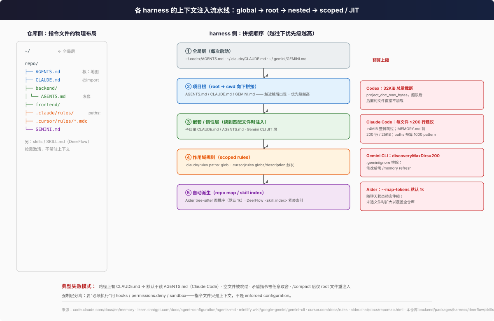

# 各 Harness 如何消费仓库：注入时机、预算上限与失败模式

> 01 篇讲了"仓库应该提供什么"，本篇讲"harness 到底**怎么吃**这些约定"。对每家梳理三件事：**上下文注入时机**、**预算上限**、**典型失败模式**。除标注者外均基于各厂商官方文档原文（2026-06 抓取）。

## 1. Claude Code

来源：[How Claude remembers your project](https://code.claude.com/docs/en/memory)。

### 指令文件（软层）

- **注入时机**：CLAUDE.md / CLAUDE.local.md 从 cwd 及全部祖先目录加载——"`foo/bar/` 启动则加载 `foo/bar/CLAUDE.md`、`foo/CLAUDE.md`，从文件系统根向下拼接，**越靠近工作目录越后读**"；**子目录**的 CLAUDE.md 不在启动时加载，而是"Claude 读到该子目录文件时按需加载"（惰性）。AGENTS.md 同理，v2.1.277 起原生支持。
- **Import**：`@path` 语法展开，最深 4 跳；**解析时跳过代码 span 与 fenced code block**（想提路径别被 import，用反引号包起来）；路径解析基于**引用文件所在目录**而非 cwd。解析到工作目录之外的 import 触发人工审批——"保护你免受他人提交到共享项目的文件伤害"。
- **预算上限**：每份 CLAUDE.md 目标 **200 行**以内（"更长文件消耗更多上下文并降低遵循度"）；**>4 MiB 整份跳过**；auto memory 索引 `MEMORY.md` 只注入前 **200 行或 25KB**。
- **作用域链**：managed policy（`/etc/claude-code/CLAUDE.md` 等）→ user（`~/.claude/CLAUDE.md`）→ project（`./CLAUDE.md`）→ local（`CLAUDE.local.md`，gitignored）。`.claude/rules/*.md` 支持 `paths:` frontmatter（glob 预算：每规则 1000 个展开 pattern / 4 MiB），匹配发生在"Claude 读到匹配文件时"。

### 强制层（hooks / settings）

- 官方红线："**CLAUDE.md 是上下文而不是 enforced configuration。要无条件阻止某行为，用 PreToolUse hook**"；"Block specific tools, commands, or file paths → Managed settings 的 `permissions.deny`"（[managed 对照表](https://code.claude.com/docs/en/memory#manage-claude-md-for-large-teams)）。
- `/doctor` 会主动修剪 checked-in CLAUDE.md："删除 Claude 能从代码库推导的内容（目录布局、依赖清单、架构综述），保留 pitfalls、rationale、偏离工具默认值的约定。"

### 失败模式

1. 项目路径上任何位置有 CLAUDE.md，默认 `claude-md-or-agents-md` 就**不读** AGENTS.md——"如果仓库有 AGENTS.md 但 Claude 似乎不知道内容，最常见原因是路径上有 CLAUDE.md"（[troubleshoot](https://code.claude.com/docs/en/memory#my-agents-md-isnt-loading)）。
2. 矛盾指令 → "Claude 可能任意挑一条"。
3. `/compact` 后只有 project-root CLAUDE.md 会**从磁盘重读注入**；只出现在对话里的指令会消失。
4. import ≠ 分层："`@path` import 有助于组织但**不省上下文**，imported 文件在启动时全部加载。"

## 2. Codex CLI

来源：[Custom instructions with AGENTS.md](https://learn.chatgpt.com/docs/agent-configuration/agents-md)。

- **合并算法**：全局（`$CODEX_HOME/AGENTS.override.md` > `AGENTS.md`，取第一个非空文件）→ 从项目根（Git root）向下走到 cwd，每目录按 `AGENTS.override.md` > `AGENTS.md` > `project_doc_fallback_filenames` 取**至多一个**文件 → 全部**用空行拼接，root 在前**。效果："文件离当前目录越近，因为出现在拼接 prompt 的后面，优先级越高。"
- **预算上限**：`project_doc_max_bytes` 默认 **32 KiB**，"跳过空文件，达到上限后停止添加"；无项目根时只检查当前目录。
- **可调**：`project_doc_fallback_filenames` 让自定义文件名（如 `TEAM_GUIDE.md`）被当作指令文件；每次运行（TUI 每会话）重建指令链，"没有缓存要清"。
- **执行环境**：approval 模式与 sandbox 是运行时配置（`codex --ask-for-approval never` 等）；openai/codex 仓库自己的 [AGENTS.md](https://github.com/openai/codex/blob/main/AGENTS.md) 展示了 harness 如何把 sandbox 事实写进指令："你在 sandbox 里，`CODEX_SANDBOX_NETWORK_DISABLED=1` 会被设置……作者据此写了提前退出的测试"——即**把 agent 的环境限制作为代码可见事实**（详见 [06 篇](06-case-studies.md)）。
- **失败模式**：文件为空即被忽略；override 在更高目录静默遮蔽常规文件；超 32KiB 后面的指引**直接截断丢失**（官方 troubleshooting："raise the limit or split instructions across nested directories"）。

## 3. Cursor

来源：[Rules](https://cursor.com/docs/rules)。

- **注入时机**："规则应用时，内容被包含在模型上下文的**开头**"（'Rules provide persistent, reusable context at the prompt level'）。`.cursor/rules/*.mdc` 四种触发：`alwaysApply` 每会话；`globs` 匹配文件在上下文时自动附上；`description` 让 agent 自主判断拉取；都没有则只能 `@` 手动引用。
- **AGENTS.md 定位**："Agent instructions in markdown format. Simple alternative to `.cursor/rules`."——`.cursor/rules` 里的**裸 .md 会被忽略**（无 frontmatter），这点容易踩坑。
- **失败模式**：扩展名错误静默失效（`.md` 不被识别）；过度依赖 `alwaysApply` 等于放弃了按路径省 token 的能力（对照 Claude Code 的 200 行警告）。

## 4. Aider

来源：[Repository map](https://aider.chat/docs/repomap.html)、[Building a better repository map with tree sitter](https://aider.chat/2023/10/22/repomap.html)。

- **算法**（原博客原文细节）：
  1. 用 [tree-sitter](https://tree-sitter.github.io/tree-sitter/)（`py-tree-sitter-languages`）把源码解析成 AST，识别函数/类/变量的**定义与引用**位置；
  2. 把 repo 建成图："每个源文件是节点，边连接有依赖关系的文件"；
  3. 图排序选出"最常被其他代码引用的关键标识符"，只保留定义处的关键行；
  4. 在 **token 预算**内（`--map-tokens` 默认 **1k**）输出最相关部分，"随聊天状态动态伸缩——未添加任何文件到 chat 时会显著扩大以尽量理解全仓库"。
- **作用**：LLM"仅凭 map 中的签名就能搞清某模块导出的 API 怎么用"，并自主决定要看哪些文件。tree-sitter 方案取代了旧的 ctags 方案（更丰富的签名 + 免装 universal-ctags）。
- **Conventions**：[conventions.md](https://aider.chat/docs/usage/conventions.html) / `read: AGENTS.md` 配置，把人工约定并入每次请求。
- **失败模式**：repo map 是**自动派生**的，与手工指令不同——它擅长"代码里是什么"，完全不携带"为什么/不许做什么"；语义近似的命名会在 map 里互相干扰（与 [context rot](https://www.trychroma.com/research/context-rot) 的 distractor 实验呼应）。

## 5. Gemini CLI

来源：[GEMINI.md File Format](https://mintlify.wiki/google-gemini/gemini-cli/reference/gemini-md)。

- **注入时机**：三层——global `~/.gemini/GEMINI.md` → workspace（配置目录及其父目录）→ **Just-in-Time**（"工具访问到文件或目录时自动发现"，即子目录说明的惰性加载）；"CLI 把找到的全部 context 文件**拼接**进每个 prompt"。文件名可配置为列表并**按优先序全部加载**：`"fileName": ["AGENTS.md", "CONTEXT.md", "GEMINI.md"]`。
- **预算/规模控制**：`context.discoveryMaxDirs`（默认 200 个目录）；`.geminiignore` 排除目录；官方 troubleshooting 首条就是 "Too much context loaded"。
- **失败模式**：改了文件忘 `/memory refresh`（内容不刷新）；发现目录过多导致上下文爆炸。

## 6. DeerFlow 自身（源码印证）

> 以下摘自本仓库 `backend/packages/harness/` 源码与模块文档，路径均相对仓库根。只读印证，未改动代码。

- **Skills 元数据与加载**：[`backend/packages/harness/deerflow/skills/AGENTS.md`](../../backend/packages/harness/deerflow/skills/AGENTS.md) 规定 SKILL.md 为"目录 + YAML frontmatter（name, description, license, allowed-tools, argument-hint, required-secrets）"；`load_skills()` 递归扫描 public / per-user custom / global integration / legacy 四个位置，**目录即包边界**："嵌套 SKILL.md 不再注册为运行时 skill"，安装器直接报错（`installer.py`：`nested SKILL.md is not allowed`），SkillScan 也把 `package-nested-skill-md` 列为 CRITICAL（`skills/skillscan/orchestrator.py`）。安装链路的完整契约（预检/抽取/LLM 扫描/原子提交/失败清理、39 条静态规则表）见 [skill-package-intake.md](../concepts/skills-tools/skill-package-intake.md)。
- **上下文注入时机与预算**：默认模式系统提示里带 skill 列表；`skills.deferred_discovery: true` 时改为"**仅名字的紧凑 `<skill_index>` 块，保持系统提示前缀缓存友好**"，agent 用 `describe_skill` 工具按需取元数据、用 `read_file` 读 SKILL.md 全文——这正是 Anthropic [just-in-time 上下文](https://www.anthropic.com/engineering/effective-context-engineering-for-ai-agents)模式的实现。
- **Slash 激活**：`middlewares/skill_activation_middleware.py`——"`/skill-name task` 只为**当前这一次模型调用**注入该 SKILL.md 全文（隐藏上下文），拒绝禁用技能与白名单外技能"（`middlewares/AGENTS.md` 第 15 条）。
- **状态去重**：`merge_skill_context` reducer "按路径去重活动 skill 引用，**只存 name/path/description 引用而非 SKILL.md 正文**"（`agents/AGENTS.md`）——主动防止 skill 正文重复膨胀状态。
- **安全边界**：`skills/skillscan/orchestrator.py` 的静态规则包括 `declaration-prompt-override`（HIGH：SKILL.md 含 prompt 覆盖短语）、`declaration-sensitive-path`、`declaration-external-endpoint`；激活时拒绝 symlink 的 SKILL.md 与路径逃逸——与 01 篇"指令文件自身是攻击面"的论断互为印证。
- **与通用机制的对照**：DeerFlow 没有 CLAUDE.md/AGENTS.md 层级的"仓库指引"消费（它的输入是 SKILL.md 包），但其 **deferred discovery ≈ Aider repo map / Claude Code 子目录惰性加载、SkillScan ≈ Claude Code 外部 import 审批、allowed-tools ≈ Cursor rules 作用域**——各家 harness 在收敛到同一组机制。

## 7. 横向对照表

| Harness | 指令载体 | 注入时机 | 预算上限 | 惰性/按需机制 | 失败模式 |
|---------|----------|----------|----------|----------------|----------|
| Claude Code | CLAUDE.md / AGENTS.md / rules | 启动（祖先链）+ 子目录按需 | ≤200 行（建议）、4MiB 硬顶、MEMORY.md 200 行/25KB | 子目录文件、`paths:` 规则、skills 按需 | CLAUDE.md 遮蔽 AGENTS.md；矛盾指令任意取舍 |
| Codex CLI | AGENTS(.override).md | 每次运行重建链 | 32KiB（可调） | 无（单层拼接） | 空文件跳过；尾部截断 |
| Cursor | `.cursor/rules/*.mdc` / AGENTS.md | 规则触发时置于上下文开头 | 未公开（**待验证**） | globs / description 触发 | 裸 .md 静默忽略 |
| Aider | repo map + conventions | 每次请求附带 | `--map-tokens` 默认 1k，动态伸缩 | 图排序选最相关 | 只携带"是什么"不携带"为什么" |
| Gemini CLI | GEMINI.md（可含 AGENTS.md） | 全局→workspace→JIT 三层拼接 | discoveryMaxDirs=200 目录 | JIT 子目录发现 | 改后需 `/memory refresh` |
| DeerFlow | SKILL.md 包 | 索引常驻 / 正文激活时注入 | 正文只在激活轮注入 | deferred_discovery + describe_skill + read_file | 嵌套 SKILL.md 禁装；symlink 激活被拒 |

## 8. 跨 harness 的三条结构性观察

把上表展开，有三个非显然的结论：

### 8.1 "就近优先"靠拼接顺序实现，而非优先级算法

Codex（root→cwd 拼接）、Claude Code（根→工作目录拼接）、Gemini CLI（global→workspace→JIT）三家都不实现"覆盖/合并"语义，而是**把所有层全部塞进上下文，让位置靠后者天然占优**。后果：

- 不会丢层（全局与局部同时在场），但也**不能真正"覆盖"**——矛盾指令会同时出现在上下文里，模型自行取舍（Claude Code 官方 troubleshooting 承认这一点）。
- 对仓库作者的含义：嵌套文件不要"重申"上级规则，只写**增量**——重申既耗 token 又制造矛盾风险（07 篇第 6 条）。

### 8.2 惰性加载是共同演化方向，机制各异

| Harness | 惰性机制 | 触发信号 |
|---------|----------|----------|
| Claude Code | 子目录 CLAUDE.md / `.claude/rules` `paths:` | 读到匹配文件 |
| Gemini CLI | JIT 层 GEMINI.md | 工具访问到目录 |
| Cursor | `globs` / `description` 触发的规则 | 文件在上下文 / agent 自判 |
| OpenAI API | `tool_search` deferred tools | 模型搜索后再加载 |
| Aider | repo map 图排序 | token 预算内选最相关 |
| DeerFlow | deferred_discovery + describe_skill | agent 主动查询 |

方向一致：**常驻上下文只留索引，正文按需注入**。仓库作者的对策是把模块细节放进"会被按需发现的载体"（嵌套指南、skill、目录级文档），而不是全堆进根文件。

### 8.3 失败模式多为静默

除 Codex 的截断、DeerFlow 安装器的 nested-skill 硬错误外，多数失效是**静默的**：Cursor 忽略裸 `.md` 规则、Claude Code 静默跳过 >4MiB 文件、Gemini CLI 不刷新就不生效、Claude Code 默认静默不读被 CLAUDE.md 遮蔽的 AGENTS.md。审计时不能只看"文件存在"，要验证"**真的被注入了吗**"——Claude Code 提供 `/context` 查看已加载的 memory files，Codex 提供 `codex ... "Summarize the current instructions."` 自检命令（[memory docs](https://code.claude.com/docs/en/memory)、[Codex docs](https://learn.chatgpt.com/docs/agent-configuration/agents-md)）。07 篇第 11、16 条对应此检查。

## 9. 审计口径

对任一仓库，按本篇口径要回答三个问题：

1. **入口**：主要 harness（团队实际使用的）会发现哪些指令文件？各自多大、是否超预算？
2. **注入**：哪些内容常驻、哪些按需？有没有本该按需的内容被塞进了常驻层？
3. **验证**：能否在目标 harness 里用自检命令确认指令真的加载了？

## 10. 延伸阅读

- 工具与接口层的设计原则（04 篇）→ [04-tool-and-interface-design.md](04-tool-and-interface-design.md)
- 真实仓库案例精读（06 篇）→ [06-case-studies.md](06-case-studies.md)
