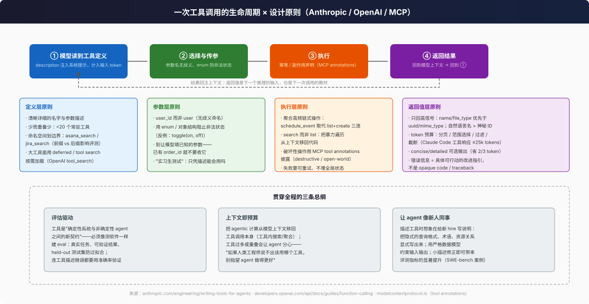

# 面向 agent 的工具与接口设计原则

> 仓库对 agent 的"接口"不止是文件布局，还包括它暴露给 agent 的一切可调用面：内置工具、MCP 工具、CLI 命令、脚本。本篇以一手来源深挖这些接口的设计原则。

## 1. 出发点：工具是新型软件契约

Anthropic 工程博客 [Writing effective tools for agents — with agents](https://www.anthropic.com/engineering/writing-tools-for-agents) 的定义值得原样引用：

> "工具是反映**确定性系统与非确定性 agent 之间契约**的新型软件。传统软件写函数是给其他开发者用的；给 agent 写工具必须**为 agent 设计**。"

OpenAI 侧同构的表述："functions 应**可预测、直观（最小惊讶原则）**"，并通过"**实习生测试**"检验——"只凭你给模型的那些信息，一个实习生能否正确使用这个函数？如果否，他们会问你什么？把答案写进 prompt/描述"（[Function calling](https://developers.openai.com/api/docs/guides/function-calling.md)）。

## 2. 命名与命名空间

- **选择做对的工具，而非包装所有 API 端点**："常见错误是把既有软件功能原样包成工具，不管它是否适合 agent 的 affordances"（[Anthropic](https://www.anthropic.com/engineering/writing-tools-for-agents)）。地址簿例子：`search_contacts` / `message_contact` 优于 `list_contacts`（后者让 agent 逐 token 暴力遍历，浪费上下文）。
- **命名空间划边界**："当工具功能重叠或目的模糊，agent 会困惑该用哪个。按服务（`asana_search`、`jira_search`）和资源（`asana_projects_search`、`asana_users_search`）加前缀可划定边界"；并提醒"**前缀 vs 后缀的选择对工具使用评测有非平凡影响**，应按自己的评测定"（同上）。
- **OpenAI 的原生 namespace**：function calling 支持按域（`crm`、`billing`、`shipping`）分组，"当模型必须在服务不同系统的工具间抉择时尤其有用"；对 deferred 工具，"详细指引放函数描述、namespace 描述保持简短——namespace 帮模型决定加载什么，函数描述帮它正确使用"（[Function calling / Defining namespaces](https://developers.openai.com/api/docs/guides/function-calling.md)）。
- **参数名同样要消歧**："参数名应无歧义：与其叫 `user`，不如叫 `user_id`"（[Anthropic](https://www.anthropic.com/engineering/writing-tools-for-agents)）。

**仓库层类比**：这一原则直接映射到 01 篇的"可 grep 命名"——模块名、CLI 子命令、env 变量名都在为同一个非确定性消费者消歧。

## 3. 返回值设计：上下文即预算

- **只回高信号**："工具实现应只把高信号信息返回给 agent，优先上下文相关性而非灵活性，**避开底层技术标识符（uuid、256px_image_url、mime_type）**——`name`、`image_url`、`file_type` 更可能直接影响 agent 的下一步"；"仅把任意 UUID 解析为语义化名称就显著提升了 Claude 检索任务的精确度"（[Anthropic](https://www.anthropic.com/engineering/writing-tools-for-agents)）。
- **token 效率**："实现分页、范围选择、过滤和/或截断的组合，并给合理默认值"；"Claude Code 默认把工具响应限制在 **25,000 tokens**"；截断时要"用有用指令引导 agent 追求更省 token 的策略（多次小而准的搜索而非一次大搜索）"（同上）。
- **concise/detailed 双模式**：暴露 `response_format` enum，让 agent 自己选择输出详略——Slack 例子中 concise 版本用约 1/3 token 保留 thread 内容、去掉 `thread_ts` 等 ID（同上）。
- **Schema 严格性**：OpenAI 建议开启 `strict` 模式（JSON schema 约束），"用 enum 和对象结构防止非法状态——`toggle_light(on: bool, off: bool)` 允许非法调用"（[Function calling](https://developers.openai.com/api/docs/guides/function-calling.md)）。
- **延迟加载**："若函数很多或 schema 很大，用 tool search 推迟不常用工具，只在模型需要时加载；**回合开始时常驻工具建议少于 20 个**"（同上）。

## 4. 错误信息设计：可行动性

Anthropic 给出直接对比："工具调用报错（如输入校验失败）时，应 **prompt-engineer 错误响应，清晰传达具体且可行动的改进**，而不是 opaque 错误码或 traceback"；好错误还会顺带示范正确格式、"引导 agent 走向更省 token 的行为（改用过滤/分页）"（[writing tools for agents](https://www.anthropic.com/engineering/writing-tools-for-agents)）。

配合 builder.io 的 AX 观察更完整："人类开发者遇到缺失环境变量会停下调查；**agent 会绕过失败、改错文件、交付一个带着礼貌 commit message 的猜测**"（[agent-experience](https://www.builder.io/blog/agent-experience)）——所以仓库脚本的 stderr 是接口设计的一部分，不是日志的附属品。

## 5. 聚合操作与"把计算移回代码"

- **聚合高频链式调用**："与其 `list_users` + `list_events` + `create_event`，不如 `schedule_event`（内部找空闲并排会）；与其 `read_logs`，不如 `search_logs`（只回相关行及上下文）"（[Anthropic](https://www.anthropic.com/engineering/writing-tools-for-agents)）。
- OpenAI 同款建议："**合并总是被顺序调用的函数**——如果每次 `query_location()` 后都 `mark_location()`，把标记逻辑挪进查询函数"；以及"**别让模型填你已经知道的参数**"（[Function calling](https://developers.openai.com/api/docs/guides/function-calling.md)）。
- 原则内核（Anthropic 原文）："通过选择性实现**以任务自然划分为名的工具**，同时减少载入上下文的工具数量，并把 agentic 计算从模型上下文**移回工具调用本身**"。

## 6. 幂等、安全与副作用披露

- **MCP tool annotations**："披露哪些工具需要 open-world 访问或造成破坏性变更"（[Anthropic 引 MCP 规范](https://www.anthropic.com/engineering/writing-tools-for-agents)）；MCP 官方的客户端最佳实践进一步要求为工具执行选择合适的 [sandbox](https://modelcontextprotocol.io/docs/draft/develop/clients/client-best-practices#choosing-a-sandbox)。
- **确定性安全边界**：builder.io 原则 4——"prompt 说'别碰数据库'挡不住任何东西。安全必须结构性：sandboxing、scoped credentials、文件与网络限额、dev/prod 数据分离、高危操作 human-in-the-loop"（[agent-experience](https://www.builder.io/blog/agent-experience)）。与 Claude Code 的官方分层一致：指令文件是"上下文而非 enforced configuration"，硬约束走 `permissions.deny` / hooks（[memory docs](https://code.claude.com/docs/en/memory)）。
- **写权限与重试语义**：DeerFlow 自身的印证——skill 激活拒绝 symlink 与路径逃逸、SkillScan 把 prompt-override 短语列为 HIGH（`backend/packages/harness/deerflow/skills/`，见 [03 篇](03-harness-consumption-deep-dive.md#6-deerflow-自身源码印证)）；Codex 仓库 AGENTS.md 则把 sandbox 环境变量写成 agent 可见的事实（[openai/codex AGENTS.md](https://github.com/openai/codex/blob/main/AGENTS.md)）。

## 7. 工具数量与选择负担

- "**工具太多或功能重叠会让 agent 分心，无法走上高效策略**"（[Anthropic](https://www.anthropic.com/engineering/writing-tools-for-agents)）；context engineering 篇的版本更狠："**如果人类工程师无法明确说出该用哪个工具，就不能指望 AI agent 做得更好**"（[effective-context-engineering](https://www.anthropic.com/engineering/effective-context-engineering-for-ai-agents)）。
- 定量锚点：OpenAI 建议"回合开始时常驻函数 **< 20 个**（软建议）"，更多则用 tool search / fine-tuning 优化（[Function calling / Best practices](https://developers.openai.com/api/docs/guides/function-calling.md)）。
- 仓库层含义：脚本目录、Makefile targets、npm scripts 都是"工具面"。目标数量应可一眼枚举，名称应自解释——否则 agent 与新人一样要靠考古。

## 8. 评估驱动：设计必须被测量

Anthropic 整篇的元方法论："通过**评估驱动**的迭代过程改进工具"：生成真实世界启发的大量评测任务、配可验证结果（字符串比对到 LLM judge，"避免因格式/标点拒绝正确答案的过严验证器"）、收集工具调用数/耗时/token 消耗/错误率、读 agent 的推理与原始 transcript 找"说不出口的困难"、用 held-out 测试集防过拟合；甚至"用 Claude 分析 transcript 并批量重构工具"（[writing tools for agents](https://www.anthropic.com/engineering/writing-tools-for-agents)）。

案例数据点：Claude Sonnet 3.5 "仅对工具描述做了精确微调"就在 SWE-bench Verified 创下当时 SOTA；web search 工具上线后发现 Claude 给 `query` 画蛇添足加 "2025"，靠改进工具描述纠正（同上）。

## 8.1 约束自由文本：grammar 与"防止跑出分布"

OpenAI 的 custom tools 允许模型以自由文本传参，并用 context-free grammar（Lark 或 regex）约束输入格式（[Function calling / Custom tools](https://developers.openai.com/api/docs/guides/function-calling.md)）。其最佳实践对本话题的普适启示：

- "**限制 grammar 复杂度**：只写工具需要的规则与模式"；复杂 grammar 会"要求在 grammar 定义、prompt、工具描述三者间迭代，否则模型会跑出分布（out of distribution）——输出过长、重复、语法对但语义错"。
- terminal/rule 的分工教训："规则适合组合显式定界的 token；**不适合约束两个 terminal 之间的自由文本**"——本质是：**约束要放在确定性最强的那一层**（数据模型 > grammar > prompt 描述 > 祈使句），能下沉就下沉。

仓库层类比：与其在 AGENTS.md 里写"导入要按字母序"（祈使句，最弱），不如上 linter（确定性最强）——Codex 官方"reserve formatting and lint checks for CI"是同一原理的表述。

## 8.2 文档面：llms.txt 与"给 agent 的官方文档"

Anthropic 在工具写作指南中提到："LLM 友好的文档常见形式是官方文档站上的扁平 `llms.txt` 文件"（并链接自家 [docs.anthropic.com/llms.txt](https://docs.anthropic.com/llms.txt)）；OpenAI 文档站则提供 [llms.txt 索引](https://learn.chatgpt.com/llms.txt)并说明"页面 URL 加 `.md` 可得 Markdown 版本"。含义：**文档也是 agent 接口**——仓库若依赖外部 SDK，链接（而非转述）官方 llms.txt/md 版文档，可以让 agent 以更低噪声拿到一手资料。

## 8.3 工具描述即 prompt：一个可测的假设

Anthropic 强调"工具描述与 schema 被载入 agent 上下文，可以集体引导 agent 的工具调用行为"，并给出两个数据点：web search 工具的 `query` 参数曾被 Claude 擅自追加 "2025"，靠改描述纠正；SWE-bench Verified 的 SOTA 来自"对工具描述的精确微调"（[writing tools for agents](https://www.anthropic.com/engineering/writing-tools-for-agents)）。推论：**工具描述、脚本 help 文本、AGENTS.md 里的命令说明，都是同一类 prompt 资产**——改动它们应当像改 prompt 一样做对照验证，而不是当注释随手写。

## 9. 反例集（对照正文的正面原则）

| 反例 | 为什么错 | 正确做法 |
|------|----------|----------|
| `list_all_records()` 返回全表 | agent 逐 token 暴力遍历（[地址簿例子](https://www.anthropic.com/engineering/writing-tools-for-agents)） | `search_records(filter)`，回相关行 + 少量上下文 |
| 参数名 `user` / `data` / `flag1` | 模型无法消歧 | `user_id`、`payload_bytes`、布尔改 enum |
| 工具返回 `uuid, mime_type, created_at_epoch` | 低信号字段挤占预算 | `name, file_type`；ID 仅 detailed 模式给出 |
| 错误返回 `Error 400` | agent 盲目重试 | "缺少 `region` 参数，可用值：us/eu/ap；示例：… " |
| 50 个平铺工具 | 选择负担，"人类都选不出来" | 命名空间分组 + deferred 加载 |
| 描述里写"聪明地使用此工具" | 无信息量 | 写清何时用/何时不用/边界示例 |

## 10. 检查表（速览）

| 层 | 检查项 | 依据 |
|----|--------|------|
| 定义 | 工具 ≤20 常驻；重叠消解；命名空间前缀一致 | [OpenAI](https://developers.openai.com/api/docs/guides/function-calling.md)、[Anthropic](https://www.anthropic.com/engineering/writing-tools-for-agents) |
| 参数 | 无歧义命名；enum 防非法态；不收已知参数 | [OpenAI](https://developers.openai.com/api/docs/guides/function-calling.md) |
| 返回 | 高信号字段；分页/截断；concise/detailed | [Anthropic](https://www.anthropic.com/engineering/writing-tools-for-agents) |
| 错误 | 具体可行动 + 示例正确输入 | [Anthropic](https://www.anthropic.com/engineering/writing-tools-for-agents) |
| 安全 | annotations 披露副作用；sandbox 硬边界 | [MCP](https://modelcontextprotocol.io/docs/draft/develop/clients/client-best-practices#choosing-a-sandbox)、[builder.io](https://www.builder.io/blog/agent-experience) |
| 度量 | eval 驱动迭代；held-out 防过拟合 | [Anthropic](https://www.anthropic.com/engineering/writing-tools-for-agents) |

## 10. 延伸阅读

- 可验证性与测试基建 → [05-verifiability-and-test-infra.md](05-verifiability-and-test-infra.md)
- 审计清单中"工具面"条目 → [07-audit-checklist.md](07-audit-checklist.md)
