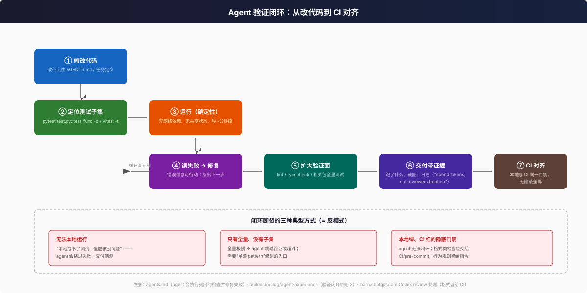

# 可验证性与测试基建：让 agent 能自主闭环

> 五维框架的"可验证性"维度的深挖。核心命题：**agent 的输出可信度 = 它能运行的验证闭环的强度**。

## 1. 为什么"能自己跑测试"是第一性的

- [agents.md](https://agents.md/) FAQ 的承诺："列出测试命令后，agent 会尝试执行相关程序化检查并**在完成任务前修复失败**。"——验证入口是指令文件里被机器消费的部分，不是给人看的礼节。
- [builder.io AX](https://www.builder.io/blog/agent-experience) 原则 2/3："agent 编不了代码、起不了 dev server、seed 不了数据库时，它的输出不是可信软件"；"**先花 token 再花 reviewer 注意力**——token 便宜且 24/7，资深工程师注意力贵且会耗尽"。
- Anthropic 工具评估指南从验证器角度补充："每个评测 prompt 应配**可验证的响应或结果**，但避免过严验证器因格式、标点、合法替代表述而拒绝正确答案"（[writing tools for agents](https://www.anthropic.com/engineering/writing-tools-for-agents)）。

## 2. 测试基建的六条设计原则

| # | 原则 | 判断标准 | 反模式 |
|---|------|----------|--------|
| 1 | **确定性** | 同输入同结果；无 flaky | 随机顺序、时间依赖、竞态 |
| 2 | **快速子集** | 有"单文件/单函数"级入口 | 只有全量、全量极慢 |
| 3 | **隔离** | 不依赖网络/外部服务/共享状态 | 本地能跑 CI 挂、依赖他人数据 |
| 4 | **可发现** | 测试布局镜像源码布局 | 测试与源码对应关系靠口口相传 |
| 5 | **本地 = CI** | 同一门禁，无隐蔽差异 | 本地绿 CI 红 |
| 6 | **失败可行动** | 断言失败信息指出期望与实际差异 | opaque traceback |

其中第 1、3 条的深层原因是 [context rot](https://www.trychroma.com/research/context-rot) 的姊妹问题：flaky 测试给 agent 的反馈是**噪声 distractor**——它会学会把随机失败归因为自己的修改，或干脆学会无视失败。

## 3. 本仓库印证：DeerFlow 的验证基建

> 只读印证，路径相对仓库根；命令摘自 `backend/Makefile` 与根 `AGENTS.md`。

### 后端（`backend/Makefile`）

- **默认套件即"离线子集"**：`make test` = `pytest -m "not live" --ignore=tests/blocking_io tests/`——live（需外部服务）与 blocking-I/O 特化套件被显式排除，这正对应原则 1/3：agent 默认路径里没有网络依赖。
- **单测入口**：根 AGENTS.md 文档化了 `python -m pytest tests/path/to/test.py::test_func -q`——单函数级入口（原则 2）。
- **CI 一致性用分片基建保证**：`make test-shard SPLITS=4 GROUP=2` 按 `.test_durations` 时长基线做 `--splitting-algorithm least_duration` 分片，与 CI 共享同一套命令（原则 5）；分片与 CI 的关系被写进 Makefile 注释。
- **规模**：`backend/tests/` 有 **704 个文件**，`AGENTS.md` 位于测试目录内、TDD 为强制（根 AGENTS.md："Backend tests live in `backend/tests/`（TDD is mandatory there）"）——测试目录自己也有 agent 指引，指令就近（原则 4）。

### 前端（`frontend/`）

- `pnpm check`（lint + type check，"run before committing"）+ `pnpm test`（unit，`frontend/tests/{unit,e2e,...}`）+ `pnpm rstest run <pattern>` 单测 pattern——同样是"子集入口 + 门禁命令"双轨。

### 跨栈门禁的确定性

- 格式检查交机器：`make format` / `ruff format --check` 在 CI 强制（根 AGENTS.md "Format before pushing"）——对应 Codex 官方建议"把格式与 lint 检查留给 CI"（[Codex docs](https://learn.chatgpt.com/docs/agent-configuration/agents-md)）。
- 契约级一致性测试：`backend/tests/test_compose_default_bind_host.py` 把"每个服务的发布端口必须显式 bind 地址"钉进测试——**用测试替代理应属于指令的约束**，这是 agent 时代值得推广的模式（指令会被忽略，测试不会）。

## 4. Record-Replay：外部依赖的确定性化

当验证闭环必须涉及外部 API 时，业界模式是 **record-replay**：录制真实交互、回放为确定性 fixture，使测试既离线又真实。本仓库 `_digest/testing/07-record-replay.md` 记录了 backend 的 `_replay_fixture.py` / `replay_provider.py` 机制（详见该笔记）；行业侧的对应物是 [Temporal 的 in-memory test server](https://github.com/temporalio/sdk-java/blob/main/AGENTS.md)——temporal-sdk-java 的 AGENTS.md 把 `temporal-test-server`（"in-memory Temporal server for fast tests"）列为仓库一级模块，即**把"快而确定"的验证环境当产品资产维护**。

agent 特有的含义：record-replay 让 agent 能在无凭证环境验证"会真实调用外部 API 的代码"，避免把密钥塞进 agent 环境的诱惑（呼应安全维度）。

## 5. 测试布局作为上下文

- "Test location mirrors source" 是业界的强约定：airflow AGENTS.md 明文要求 "`airflow/cli/cli_parser.py` → `tests/cli/test_cli_parser.py`"（[apache/airflow AGENTS.md](https://github.com/apache/airflow/blob/main/AGENTS.md)）；DeerFlow 同样采用。镜像布局意味着 **agent 由文件路径即可推断测试位置**，无需额外检索——文件系统元数据即上下文（[Anthropic context engineering](https://www.anthropic.com/engineering/effective-context-engineering-for-ai-agents)："文件名、层级、时间戳都是帮助 agent 理解信息的信号"）。
- 反例：测试散落多处且命名不一致时，agent 会漏改测试或为错误模块补测试——修改的"涟漪范围"变得不可枚举（01 篇维度四）。

## 6. 谁该跑什么：测试门禁的责任分配

| 检查 | 归属 | 依据 |
|------|------|------|
| 格式化 / lint | CI + pre-commit，agent 可跑但不作为行为规则 | [Codex review 规则](https://learn.chatgpt.com/docs/agent-configuration/agents-md)："reserve formatting and lint checks for CI" |
| 类型检查 / 单测 | agent 本地闭环必跑 | [agents.md](https://agents.md/)、[Claude Code best practices](https://code.claude.com/docs/en/best-practices) |
| 全量套件 / 集成测试 | CI；agent 提交前按需 | openai/codex AGENTS.md：项目级测试可自行跑，"完整套件先问用户"（[codex AGENTS.md](https://github.com/openai/codex/blob/main/AGENTS.md)） |
| 交付证据（截图/日志/边界探索） | agent 在 handoff 前自证 | [builder.io AX 原则 3](https://www.builder.io/blog/agent-experience) |

## 6.1 深化：为什么"本地 = CI"值得基建投入

deer-flow 的 `.test_durations` 分片机制值得单独说明，因为它展示了原则 5 的工程形态：本地命令与 CI 命令**同源**（同一 Makefile target，仅 SPLITS/GROUP 参数不同），时长基线文件由专门命令再生成、CI 校验漂移。agent 收益是双重的：

1. agent 在本地用 `make test-shard SPLITS=4 GROUP=1` 就能预演 CI 的一个分片，避免"本地绿 CI 红"；
2. 分片按"最短时长"算法切分，agent 改哪个包就跑对应 shard，验证成本与改动规模成正比——这正是"快速子集"在全量与单测之间的中间层。

对照案例：[codex AGENTS.md](https://github.com/openai/codex/blob/main/AGENTS.md) 的 CI 漂移规则（"If you change Rust dependencies… run `just bazel-lock-update`… CI verifies lockfile drift"）说明 **lockfile/基线类文件的漂移应由机器而非文档守护**。

## 6.2 深化：测试即指令的反模式边界

"用测试钉住约束"（05 篇 §3 的 `test_compose_default_bind_host.py`）有边界：测试钉住的是**行为不变量**；而"为什么会有这条不变量"仍需文档承载。两者关系：

- 只有文档：agent 可能不信/不读 → 违约（Claude Code 官方：指令是上下文不是强制，[memory docs](https://code.claude.com/docs/en/memory#claude-md-vs-auto-memory)）。
- 只有测试：agent 通过测试后仍会在相邻代码重犯同类错（测试不解释模式）。
- 正确组合：文档写 rationale + 测试钉行为（deer-flow 两条都有）。

## 6.3 测试金字塔在 agent 时代的重排

传统金字塔（单元多、集成少、E2E 最少）在 agent 时代出现一个新考量：**agent 的验证预算与人类不同**——它能承受比人更多的中层验证（集成/契约测试），因为它不需要在心理上"保持专注"。codex 仓库的测试政策捕捉到了这一点："For agent changes prefer integration tests over unit tests… Features that change the agent logic MUST add an integration test"（[codex AGENTS.md](https://github.com/openai/codex/blob/main/AGENTS.md)）。仓库作者的启示：**为 agent 优化测试布局时，把"能确定性快速跑的集成层"做厚，比把单元层做到极致更划算**——契约测试、replay 测试、compose 配置测试（deer-flow 的 `test_compose_default_bind_host.py` 即此类）都是 agent 高价值验证面。

## 6.4 常见审计发现（预期模式）

对多数仓库执行 07 篇维度二检查时，预计会看到这几类缺口（按出现频率，属调研者经验判断，**待验证**）：

1. 单测入口存在于 Makefile 但未写进指令文件（agent 不知道）；
2. 默认测试子集仍需数据库/docker（agent 无法离线跑）；
3. 有 e2e 但无 record-replay，agent 无法验证外部集成改动；
4. lint/formatter 版本本地与 CI 漂移（无 pin 或无 lockstep 脚本）。

## 7. 审计问题（承接 07 篇）

1. 一个新 agent 会话能否只凭仓库内文档跑通"改一处代码 → 跑相关测试 → 绿"？
2. 单个测试/文件级入口是否文档化？全量与子集的耗时差是多少？
3. 有没有只在 CI 出现的门禁？agent 是否被告知？
4. flaky 测试如何标记与隔离（如 `-m "not live"` 这类显式出口）？
5. 外部依赖是否有 replay/沙箱替身？

## 8. 延伸阅读

- 审计清单完整条目 → [07-audit-checklist.md](07-audit-checklist.md)
- 本仓库测试策略原笔记 → [`_digest/testing/`](../testing/)
