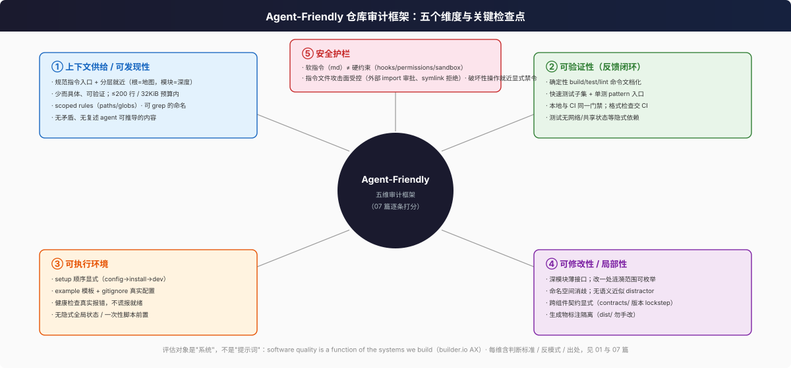

# Agent-Friendly 仓库审计清单（60 条）

> 用法：逐条打分 ✅ / ⚠️ / ❌；⚠️ 需注明理由。出处列给出权威依据；案例锚点指向 [06 篇](06-case-studies.md)的真实仓库。

## 维度一：上下文供给 / 可发现性（16 条）

| # | 检查什么 | 怎么查 | 合格标准 | 依据 |
|---|----------|--------|----------|------|
| 1 | 有规范指令入口 | 根目录 `ls AGENTS.md CLAUDE.md GEMINI.md` | 至少一个；命名是 harness 可发现的 | [agents.md](https://agents.md/) |
| 2 | 入口文件覆盖推荐章节 | 读入口文件小节 | 项目概览/构建测试命令/风格/测试/安全 至少含前三 | [agents.md](https://agents.md/) |
| 3 | 根文件是"定位层"而非百科 | 看根文件是否指向模块级指南 | 模块细节下沉嵌套文件，根文件给地图 | [agents.md 嵌套机制](https://agents.md/)；deer-flow 根 AGENTS.md |
| 4 | 嵌套文件就近生效 | 在子目录树抽查 | 每个主要模块有自身指南或明确的"无" | [agents.md](https://agents.md/) |
| 5 | 单文件长度受控 | `wc -l` 各指令文件 | ≤200 行（Claude Code 建议）；总量留意 32KiB（Codex 截断） | [memory docs](https://code.claude.com/docs/en/memory#my-claude-md-is-too-large)、[Codex](https://learn.chatgpt.com/docs/agent-configuration/agents-md) |
| 6 | 无互相矛盾的指令 | 跨文件搜同一主题的规则 | 同一行为只有一条现行规则 | [memory troubleshooting](https://code.claude.com/docs/en/memory#claude-isnt-following-my-claude-md) |
| 7 | 不复述 agent 可推导内容 | 抽查是否包含目录树/依赖清单 | 有则应删（保留 pitfalls/rationale/偏离默认值） | [memory docs /doctor](https://code.claude.com/docs/en/memory#my-claude-md-is-too-large) |
| 8 | 指令具体可验证 | 抽查措辞 | "跑 `X` 命令 / 文件在 `Y` 路径"式，非"保持整洁"式 | [Write effective instructions](https://code.claude.com/docs/en/memory#write-effective-instructions) |
| 9 | 路径作用域机制被利用 | 查 `.claude/rules/`、`.cursor/rules/` 等 | 模块专属规则带 paths/globs，不全量常驻 | [memory rules](https://code.claude.com/docs/en/memory#organize-rules-with-claude-rules)、[Cursor rules](https://cursor.com/docs/rules) |
| 10 | Cursor 特有陷阱 | `.cursor/rules/` 内扩展名 | 规则用 `.mdc`，裸 `.md` 不算规则 | [Cursor rules](https://cursor.com/docs/rules) |
| 11 | harness 兼容策略明确 | 检查 CLAUDE.md 与 AGENTS.md 关系 | import/symlink 之一，且注明别改 shim | [memory 共享写法](https://code.claude.com/docs/en/memory#share-one-file-with-other-coding-tools)；deer-flow CLAUDE.md |
| 12 | 文件命名可 grep | 抽样模块/工具/脚本名 | 语义化、全仓库唯一、无多义缩写 | [Anthropic context engineering](https://www.anthropic.com/engineering/effective-context-engineering-for-ai-agents)（元数据即上下文） |
| 13 | 无语义近似 distractor | 全局搜相似命名（如 DAG/Dag） | 有明文规范区分（案例：airflow 的 Dag 规则） | [airflow AGENTS.md](https://github.com/apache/airflow/blob/main/AGENTS.md)；[context rot](https://www.trychroma.com/research/context-rot) |
| 14 | 结构化格式 | 抽查入口文件排版 | markdown 标题 + bullet 分组，非大段散文 | [memory docs](https://code.claude.com/docs/en/memory#write-effective-instructions) |
| 15 | 指令是活文档 | `git log --follow` 入口文件 | 随代码变更持续更新（文档更新政策成文） | [agents.md FAQ](https://agents.md/)；deer-flow "Documentation update policy" |
| 16 | 指令文件的 import 可控 | 查 `@path` 引用 | 无意外外部路径 import；外部引用有审批意识 | [memory imports](https://code.claude.com/docs/en/memory#import-additional-files) |

## 维度二：可验证性 / 反馈闭环（12 条）

| # | 检查什么 | 怎么查 | 合格标准 | 依据 |
|---|----------|--------|----------|------|
| 17 | 构建/测试/lint 命令文档化 | 指令文件搜命令 | 安装、构建、跑测试、lint 四类齐备 | [agents.md](https://agents.md/) |
| 18 | 单测入口存在并文档化 | 查单文件/单函数运行方式 | 如 `pytest x.py::t -q` / `rstest run <pattern>` | [agents.md 示例](https://agents.md/)；deer-flow 根 AGENTS.md |
| 19 | 存在快速默认子集 | 看默认 `make test` 范围 | live/慢测试显式排除（如 `-m "not live"`） | deer-flow backend/Makefile |
| 20 | 测试确定性 | 抽查 fixture/标记 | 无网络/时间/随机顺序隐式依赖 | [05 篇原则 1](05-verifiability-and-test-infra.md) |
| 21 | 外部依赖有替身 | 查 replay/mock/in-memory server | 存在离线回放或内存桩 | [05 篇 §4](05-verifiability-and-test-infra.md#4-record-replay外部依赖的确定性化)；[temporal test-server](https://github.com/temporalio/sdk-java/blob/main/AGENTS.md) |
| 22 | 测试布局镜像源码 | 抽三处对应关系 | `src/x.py → tests/x_test.py` 可由路径推断 | [airflow AGENTS.md](https://github.com/apache/airflow/blob/main/AGENTS.md) |
| 23 | 本地与 CI 同门禁 | 对比 Makefile 与 CI 配置 | 命令同源（分片/基线文件共享） | deer-flow `make test-shard` |
| 24 | 格式检查不占 agent 指令 | 检查格式规则位置 | 由 pre-commit/CI 强制，指令只提示存在 | [Codex 规则建议](https://learn.chatgpt.com/docs/agent-configuration/agents-md) |
| 25 | agent 知道哪些检查别跑 | 指令文件查边界 | 大型/昂贵套件标注"先问"或排除 | [codex AGENTS.md](https://github.com/openai/codex/blob/main/AGENTS.md)；electron CLAUDE.md |
| 26 | flaky 有出口 | 查标记/隔离机制 | 显式标记 + 处理策略成文 | [05 篇 §2](05-verifiability-and-test-infra.md) |
| 27 | 失败信息可行动 | 人为跑一次失败测试 | 断言显示期望/实际与下一步线索 | [Anthropic 错误设计](https://www.anthropic.com/engineering/writing-tools-for-agents) |
| 28 | 关键约束有测试钉子 | 抽查历史踩坑 | 重要不变量进了测试而非只在文档 | deer-flow `test_compose_default_bind_host.py` |

## 维度三：可执行环境（10 条）

| # | 检查什么 | 怎么查 | 合格标准 | 依据 |
|---|----------|--------|----------|------|
| 29 | setup 顺序显式 | 指令文件搜 setup 节 | config→install→run 顺序一步步成文 | [GEMINI.md best practices](https://mintlify.wiki/google-gemini/gemini-cli/reference/gemini-md#best-practices)；deer-flow "Prerequisites" |
| 30 | 缺失前置的失败模式已说明 | 查"没有 X 会怎样" | "无 config.yaml 服务起不来"类说明存在 | deer-flow 根 AGENTS.md |
| 31 | 配置模板与真实配置分离 | `ls` + `.gitignore` | `*.example.*` 模板入库，真实文件 gitignored | deer-flow config.example.yaml |
| 32 | 就绪探测真实 | 查启动/健康检查脚本 | 失败时输出诊断而非谎报成功 | deer-flow 根 AGENTS.md readiness 要求 |
| 33 | 确定性命令包装器 | 查 Makefile/scripts | 统一入口吸收平台差异 | deer-flow `scripts/pnpm.py` |
| 34 | 隐式全局状态清零 | 抽查启动路径 | 无未文档化的 hosts/一次性脚本/手动步骤 | [builder.io AX 原则 2](https://www.builder.io/blog/agent-experience) |
| 35 | 环境编码/平台兼容 | 查显式 encoding、跨平台 shim | 显式 `encoding="utf-8"`；Windows/POSix 差异被脚本吸收 | deer-flow 根 AGENTS.md 两条约定 |
| 36 | 日志可定位 | 查日志指南 | 每服务的日志去向与查看命令文档化 | deer-flow "Logs" 节 |
| 37 | 版本/依赖 pin | 查 lockfile 策略 | lockfile 入库 + 漂移有检查 | [airflow uv.lock 政策](https://github.com/apache/airflow/blob/main/AGENTS.md) |
| 38 | 破坏性脚本可辨识 | 抽查脚本命名/帮助 | 危险操作在名称或 help 中可见 | [MCP annotations 思想](https://modelcontextprotocol.io/docs/draft/develop/clients/client-best-practices#choosing-a-sandbox) |

## 维度四：可修改性 / 局部性（12 条）

| # | 检查什么 | 怎么查 | 合格标准 | 依据 |
|---|----------|--------|----------|------|
| 39 | 深模块薄接口 | 抽样模块公共面 | 接口窄、实现深；无散装全局单例 | [builder.io AX 原则 6](https://www.builder.io/blog/agent-experience)（引 Ousterhout） |
| 40 | 模块大小有规则 | 查指令中的量化边界 | 如"≤500 LoC，新功能开新模块" | [codex AGENTS.md](https://github.com/openai/codex/blob/main/AGENTS.md) |
| 41 | 公共 API 冻结策略 | 查 API 变更规则 | public/internal 分界成文 | [temporal AGENTS.md](https://github.com/temporalio/sdk-java/blob/main/AGENTS.md) |
| 42 | 跨组件契约显式 | 查 contracts/schema/lockstep | 契约文件化 + 一致性检查脚本 | deer-flow `contracts/`、`verify_versions.sh` |
| 43 | 生成物隔离 | 查生成目录规则 | "勿手改 generated files"成文且有生成器 | [Cursor rules 示例](https://cursor.com/docs/rules)、airflow |
| 44 | 命名空间消歧 | 抽样工具/模块/CLI 名 | 前缀分组、无重叠语义 | [Anthropic namespacing](https://www.anthropic.com/engineering/writing-tools-for-agents) |
| 45 | 高频操作已聚合 | 抽查脚本/工具面 | 复合任务有单入口，非 N 步拼接 | [Anthropic 聚合原则](https://www.anthropic.com/engineering/writing-tools-for-agents) |
| 46 | 文档与代码同源 | 抽查 docs 声明 vs 实现 | 文档策略要求同一变更集内同步 | deer-flow "Documentation update policy" |
| 47 | 设计系统/组件复用路径清晰 | 前端仓库抽查 | "先找现成组件"路径文档化 | [builder.io AX 原则 6](https://www.builder.io/blog/agent-experience) |
| 48 | 修改涟漪可枚举 | 抽一个历史大改 | 受影响面可从 contracts/目录地图推出 | 01 篇维度四 |
| 49 | 模块指南覆盖危险区 | 查领域易错点的文档 | GC/并发/安全边界等危险区前置成文 | electron CLAUDE.md cppgc 节 |
| 50 | 工具面数量受控 | 数 Makefile targets / scripts | 一屏可枚举、名称自解释 | [OpenAI <20 建议](https://developers.openai.com/api/docs/guides/function-calling.md) |

## 维度五：安全护栏（10 条）

| # | 检查什么 | 怎么查 | 合格标准 | 依据 |
|---|----------|--------|----------|------|
| 51 | 软指令与硬约束分离 | 查 hooks/permissions/settings 配置 | 必须生效的规则不只在 md 里 | [memory docs](https://code.claude.com/docs/en/memory#claude-md-vs-auto-memory) |
| 52 | 破坏性操作显式禁令 | 指令文件搜 Never 区 | 密钥、生成物、破坏性 git 有 Never 列表 | [airflow Boundaries](https://github.com/apache/airflow/blob/main/AGENTS.md) |
| 53 | 禁令带安全替代路径 | 抽查禁令措辞 | "禁 X，改用 Y"（如 electron 禁 npx） | [electron CLAUDE.md](https://github.com/electron/electron/blob/main/CLAUDE.md) |
| 54 | 禁令就近放置 | 检查服务专属规则位置 | 放在对应子目录的嵌套文件而非全仓库 | [Codex 分层建议](https://learn.chatgpt.com/docs/agent-configuration/agents-md) |
| 55 | 指令文件攻击面受控 | 查 import/symlink/嵌套规则 | 外部引用需审批；嵌套/symlink 逃逸被拒 | [memory 外部 import 审批](https://code.claude.com/docs/en/memory)；deer-flow SkillScan |
| 56 | agent 环境限制成文 | 查 sandbox 相关说明 | agent 的网络/文件限制写成代码可见事实 | [codex AGENTS.md sandbox 节](https://github.com/openai/codex/blob/main/AGENTS.md) |
| 57 | 凭证不进 agent 环境 | 查 required-secrets/scope 机制 | 凭证经声明式注入，不落仓库 | deer-flow SKILL.md `required-secrets` |
| 58 | 危险操作有 human-in-the-loop | 查高危门禁 | 发布/迁移/删除类操作需确认 | [builder.io AX 原则 4](https://www.builder.io/blog/agent-experience) |
| 59 | 远程操作有 guardrails | 查 push/PR 规则 | 只推 fork、禁 force push、AI 披露要求 | [airflow Commits and PRs](https://github.com/apache/airflow/blob/main/AGENTS.md) |
| 60 | 安全模型文档化 | 查 security 模型文档 | agent review 时可区分漏洞/已知限制/加固项 | [airflow Security Model 节](https://github.com/apache/airflow/blob/main/AGENTS.md) |

## 打分建议

- 每维内部先打 ✅/⚠️/❌，再算维度分：✅=2、⚠️=1、❌=0；维度满分 2×条数。
- 权重：对 coding agent 实际产出影响最大的是维度二（可验证性）与维度一（上下文供给）——前者决定 agent 能否闭环，后者决定它朝哪个方向闭环。建议权重 ×1.5。
- 任何一条触发"❌ 且属于维度五"，无论总分多少都应列为整改项（安全不可用平均分稀释）。

## 审计操作流程（建议四步）

1. **静态扫描（半自动）**：定位指令文件并 `wc -l`（对应 1/5）；grep 出全部 Makefile targets / scripts / package.json scripts（对应 50）；核对 `.gitignore` 与 example 模板（对应 31）。
2. **注入验证（harness 内）**：在目标 harness 里用自检命令确认指令真的加载——Claude Code `/context` 查看 Memory files；Codex 问 "Summarize the current instructions."（对应 11/16，见 [03 篇 §8.3](03-harness-consumption-deep-dive.md#83-失败模式多为静默)）。
3. **闭环演练（端到端）**：让一个真实 agent 会话完成一次小改动并跑通测试子集，记录它在哪里卡住/绕过——失败点直接映射到维度二/三的具体条目（对应 17-28、29-38）。
4. **打分与整改排序**：按上方权重计分；先修"❌×维度五"，再修"❌×维度二/一"，最后处理 ⚠️。每条整改附本清单出处链接，便于 review 时核对依据。

## 与六篇正文条目的映射

| 维度 | 详细论述 | 案例锚点 |
|------|----------|----------|
| 一（1-16） | [01 篇维度一](01-what-makes-repo-agent-friendly.md)、[03 篇](03-harness-consumption-deep-dive.md) | [06 篇案例 1/2/5](06-case-studies.md) |
| 二（17-28） | [05 篇](05-verifiability-and-test-infra.md) | 06 篇案例 1（分级测试授权）、案例 4（--offline） |
| 三（29-38） | [01 篇维度三](01-what-makes-repo-agent-friendly.md) | 06 篇案例 2（breeze setup）、案例 5（Prerequisites 节） |
| 四（39-50） | [01 篇维度四](01-what-makes-repo-agent-friendly.md)、[04 篇](04-tool-and-interface-design.md) | 06 篇案例 1（模块大小规则）、案例 4（API 冻结） |
| 五（51-60） | [01 篇维度五](01-what-makes-repo-agent-friendly.md)、[04 篇 §6](04-tool-and-interface-design.md) | 06 篇案例 3（禁 npx）、案例 2（Boundaries 节） |

## 延伸阅读

- 框架推导过程 → [01-what-makes-repo-agent-friendly.md](01-what-makes-repo-agent-friendly.md)
- 案例锚点 → [06-case-studies.md](06-case-studies.md)
