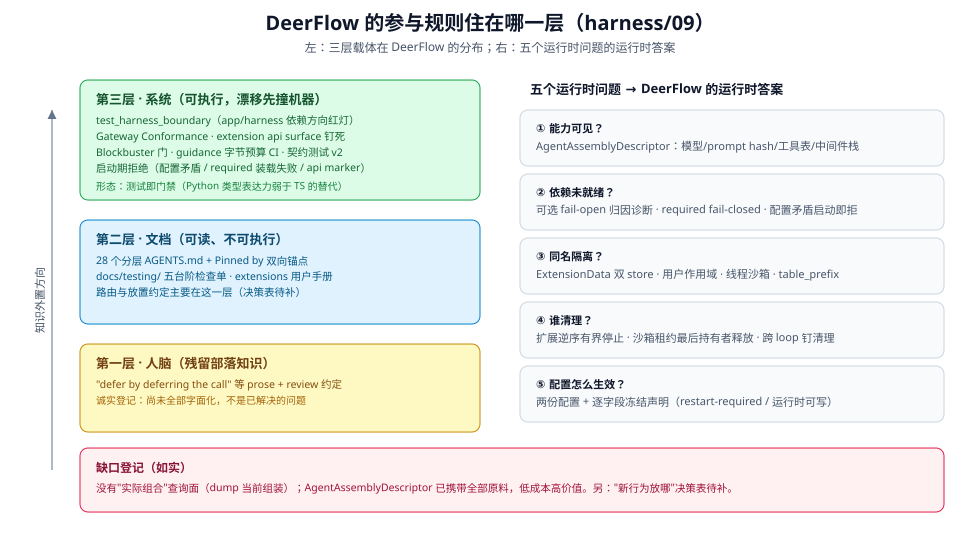

# DeerFlow 的参与规则住在哪一层

> 本篇回答一个问题：**一个没有背景知识的参与者，能不能只靠仓库本身学会正确参与 DeerFlow？** 检验办法是把参与知识拆成五个运行时问题逐问取证——答案是 DeerFlow 自己的形状。出处分级：`[源码]` = 本仓库已核验事实；`[推断]` = 从事实推出的判断。

## 三层载体在 DeerFlow 的分布

参与知识有三个可能的住处：人脑（部落知识，会遗忘）、文档（可读不可执行，会漂移）、系统本身（测试、门禁、运行时检查——被 CI 与多个工具消费，漂移先撞机器）。DeerFlow 的真实分布 `[源码]`：

| 载体 | DeerFlow 的实例 |
|------|----------------|
| 系统（可执行） | `tests/test_harness_boundary.py`（app/harness 依赖方向红灯）；`Gateway Conformance Tests`（client 返回 dict 必须过 Gateway Pydantic model，缺失字段在 CI 报 ValidationError）；extension api marker 校验（loader 拒绝不兼容 `deerflow-extension-api` 版本）；`tests/test_extension_api_surface.py`（公共契约面钉死）；Blockbuster 阻塞 I/O 门；`scripts/check_agent_guidance.py`（AGENTS.md 预算进 CI）；调度器配置校验（`multi_instance=true` 缺前置直接拒绝启动） |
| 文档（可读） | 28 个分层 AGENTS.md + "Pinned by tests/…" 双向锚点；`docs/testing/` 五台阶检查单；extensions 用户手册 |
| 人脑（残留部落知识） | 如"defer by deferring the *call*"这类约定仍有部分仅以 prose + review 存在（`backend/packages/harness/deerflow/extensions/AGENTS.md` 自述）——诚实登记，不是已解决的问题 |

`[推断]` DeerFlow 的第三层主体形态是**"测试即门禁"**：Python 类型系统不足以把不变量钉在编译期，所以依赖方向、契约面、基础设施绑定都用 pytest 红灯钉住。这是语言与运行时选择决定的形状，不是纪律强弱。

## 五个运行时问题：DeerFlow 的答案

### ① 参与者在当前位置能看到哪些能力

`[源码]` DeerFlow 的权威答案是 **`AgentAssemblyDescriptor`**（`deerflow_extension_api.assembly`）：每次 agent 组装时捕获 resolved model、渲染 prompt hash、授权过滤后的工具表、带策略声明的中间件栈、deferred tools、enabled skills。`assemble_lead_agent()` 返回 `LeadAgentAssembly(graph, descriptor)`——descriptor 存在的理由写得很清楚：这些决定发生在工厂内部，**事后不可恢复**，所以必须在组装点显式投影。`SubagentExecutor` 对每个委派 agent 发布同一 descriptor。

委派面的可见性同理：Custom Agent 的 `allowed_subagents` 在 dispatch 时**快照进 run metadata**（None=全部 / []=硬拒 / 列表=allowlist），且必须同时过滤 prompt 发现与 `task` 执行——子代理运行中改配置不能改变本次可见面。

### ② 依赖未就绪时，参与者是否启动

`[源码]` DeerFlow 的答案是**按来源分权的 fail 语义**，且把选择权显式化：

- 扩展装载：`required: false`（默认）→ 装载失败只留**归因诊断**，Gateway 照常启动；`required: true` 是 operator 显式 opt-in，装载失败即启动中止；
- 贡献者失败：`IsolatedMiddleware` 把每个扩展贡献包起来——失败发诊断、fail-open、**不重复下游模型/工具副作用**；fail-open 按*失败来源*判定（宿主任务的真取消要传播，贡献者自己的 CancelledError 要被遏制）；
- 配置矛盾：scheduler `multi_instance=true` 而缺共享 Postgres/heartbeat/DB events 前置 → **启动即拒绝**，不是运行时静默降级。

### ③ 同名能力如何隔离

`[源码]` DeerFlow 有五套互相独立的隔离面，各自回答不同的"同名"问题：

| 隔离面 | 回答的问题 | 机制 |
|--------|-----------|------|
| `ExtensionData` app store vs task store | 扩展自己的数据：应用级还是任务级？ | middleware/lifecycle/system-observation 注册时才分配 task store；services/routers 是 app-scoped |
| 用户作用域 | 同一扩展在不同用户下看到什么？ | `get_or_new_user_skill_storage(user_id)` 用父运行时身份解析，custom skill 遮蔽与 lead 对齐 |
| 线程隔离 | 沙箱与上传串味吗？ | per-thread 沙箱目录 `users/{user_id}/threads/{thread_id}/…`；子代理每次 run 拿 fresh `ThreadState` |
| 表所有权 | 扩展的表和宿主的表冲突吗？ | `ExtensionSpec.table_prefix` 声明 + alembic autogenerate 排除该前缀表 |
| 每次委派 | 子代理看到父的工具注册表吗？ | preset join 全量重建 + 委派时权限在第一个 await 前捕获，之后不可放宽 |

### ④ 退出时谁清理注册项、进程与句柄

`[源码]` DeerFlow 的清理语义是**显式排序 + 有界等待 + 所有权最后释放**：

- 扩展服务：按注册**逆序**停止，每个服务独立有界超时，"failures do not starve later cleanup"；停止发生在 run/subagent drain **之后**、store/checkpointer/engine teardown **之前**（`extensions/AGENTS.md` Gateway 生命周期节）；
- 沙箱租约：每个委派 run 携带 `sandbox_lease_owner_id`，中间件保留执行直到**最后一个持有者**释放；`SubagentExecutor` 在 `finally` 里幂等重复释放，异常/取消/超时路径都不能漏租约；
- 跨 loop 清理：task 工具 poller 意外退出时，registry 清理被钉到持久子代理 loop（`run_on_isolated_subagent_loop()`）——caller loop 的 `asyncio.run` 退出会取消它自己 create 的 task，所以普通 `create_task` 会丢清理。

### ⑤ 静态配置怎样变成可检查的运行时

`[源码]` DeerFlow 的答案是**两份配置 + 一个冻结点**，且冻结语义逐字段声明：

- `config.yaml`（进程启动读取；`logging` 等字段 restart-required，`STARTUP_ONLY_FIELDS` 显式列出）；`extensions_config.json`（Gateway API 运行时可写，双锁保护 read-modify-write）；
- `create_app()` 在启动时装载插件**一次**，registry 存 `app.state` + 进程单例——改 `plugins:` 必须重启；
- 运行时每次 run 从 `get_app_config()` 取快照组装 agent（按 user 缓存），scheduler dispatch 时读配置使 `scheduler.recursion_limit` 改动"下次 run 生效"——**哪个配置何时生效是逐字段声明的，这是 DeerFlow 版的"配置到树"**。

### 诚实缺口

`[推断]` **缺口**：DeerFlow 没有"这次运行实际是什么"的查询面——扩展启用状态要看 `extensions_config.json` + 诊断列表，agent 实际工具集要从 descriptor 推断。`AgentAssemblyDescriptor` 已经携带了全部原料（工具表、prompt hash、中间件栈），一个"dump 当前组装"的查询面是低成本高价值的缺口——本篇按"缺口登记"处理，不做设计。

## 用三个问题检验 DeerFlow

**三个问题盘点**：规则在哪层？正确与错误路径的摩擦差多少？错误何时暴露？DeerFlow 的读数 `[源码]+[推断]`：

1. **规则在哪层**——依赖方向、契约面、基础设施绑定在第三层（测试门禁）；路由与放置约定大部分在第二层（extensions/AGENTS.md 的贡献契约），**"新行为放哪"还没有一张 DeerFlow 版决策表**（登记待补）；
2. **摩擦差**——做扩展的正确路径已有范本可抄（`examples/deerflow-extension-example` + `docs/testing/` 五台阶），错误路径（hand-wired registry、改模型请求）已被测试策略文档明文拒绝；
3. **错误何时暴露**——启动时（配置矛盾、required 装载失败、api marker 不兼容）与请求边界（IsolatedMiddleware 归因诊断）两层；编译期拒绝在 Python 类型系统里不可得，两层是现实可达的最快反馈。

## 出处

- DeerFlow 事实：`backend/packages/harness/deerflow/extensions/AGENTS.md`（fail 语义、清理序、信任边界）、`backend/AGENTS.md`（依赖方向、trust boundary）、`backend/packages/harness/deerflow/subagents/AGENTS.md`（快照、租约、隔离面）、`backend/packages/harness/deerflow/agents/assembly_descriptor.py`（descriptor 字段）
