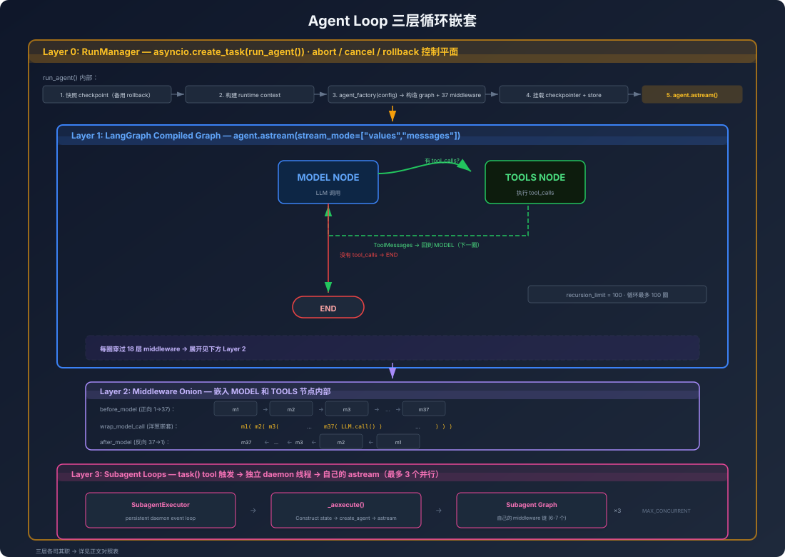
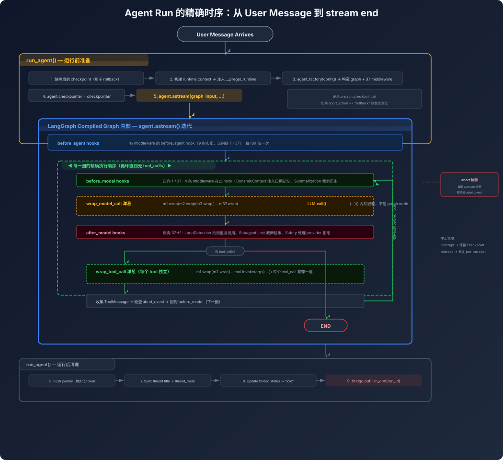
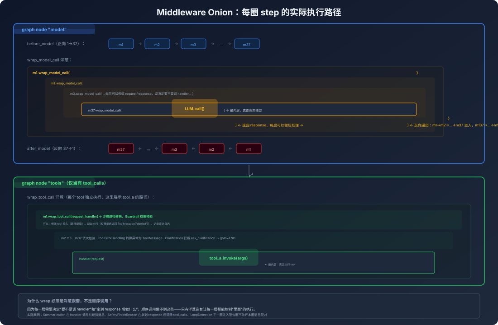
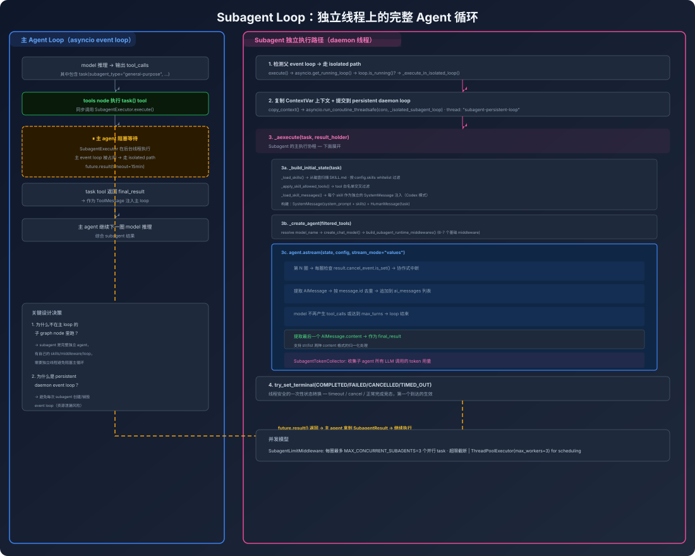
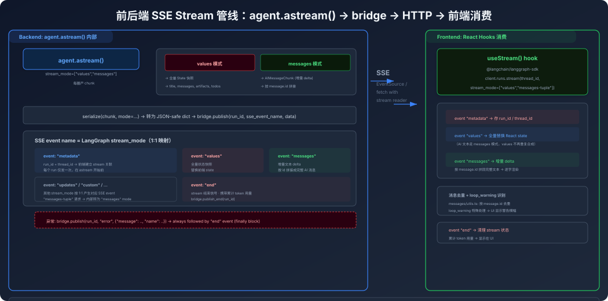

# Agent Loop 解剖：谁在循环、怎么循环、边界在哪

## 一句话结论

**DeerFlow 没有手写 `while` 循环。** loop 由 LangGraph 的 compiled graph 驱动——model node 和 tools node 交替执行，直到 model 不再输出 tool_calls。DeerFlow 的代码做的是**在每一圈上绑定 middleware hook**，以及对 loop 整体做生命周期管理（启停、取消、回滚、日志）。

> **交叉引用：** Middleware 6 种 hook 点的触发时机与执行流见 [middleware/01-hooks-and-flow.md](../middleware/01-hooks-and-flow.md)。

## 全景：三层循环嵌套



三层各司其职：

| 层 | 谁驱动 | 循环边界 | 中断方式 |
|----|--------|---------|---------|
| RunManager | `asyncio.create_task(run_agent())` | 单次 run 的生命周期 | `record.abort_event` |
| LangGraph graph | `agent.astream()` 内部的 model/tools 交替 | 一次 run 内多圈，直到无 tool_calls 或 recursion_limit=100 | LangGraph 自身 + LoopDetection 强制停止 |
| Subagent loops | 独立 daemon thread 上的 persistent event loop | 独立的 astream，max_turns 控制 | `result.cancel_event` |

## Layer 1 深入：LangGraph graph 到底怎么循环的

很多人以为 agent loop 是 DeerFlow 自己写的。不是。核心代码只有一行：

```python
# worker.py:311
async for chunk in agent.astream(graph_input, config=runnable_config, stream_mode=lg_modes):
    if record.abort_event.is_set():
        break
    await bridge.publish(run_id, sse_event, serialize(chunk))
```

注意两点：

1. **`agent` 是 LangChain `create_agent()` 返回的 `CompiledStateGraph`**。它是一个预编译的状态图——model node → (有 tool_calls? → tools node → model node | 无 tool_calls? → END)。这个"交替"逻辑是 LangGraph 的 compiled graph 执行的，不是 DeerFlow 的代码在执行。

2. **`stream_mode` 的灵活性**：不是简单的 `"values"`。支持 6 种模式（values, updates, checkpoints, tasks, debug, messages），可以同时开多个。前端请求 `["values", "messages-tuple"]` 时，LangGraph 每个 iteration 同时产两种格式的数据：
   - `values` → 全量状态快照（用于标题、artifact 等）
   - `messages` → 增量消息元组（用于逐字流式输出）

### 一圈 step 的精确时序



## Layer 2：Middleware 就是 loop 的结构

这是 DeerFlow 最核心的设计洞察：**middleware 不是 loop 外面的装饰，它就是 loop 本身的**结构。

传统的 web framework middleware 是"请求前/后做点事"，但 agent middleware 完全不同——`wrap_model_call` 和 `wrap_tool_call` 是**洋葱嵌套的 callable 链**。这意味着：

- 最外层的 middleware 看到原始 request，也最后一个看到 response
- `wrap_model_call` 可以**修改传给 LLM 的 message list**，也可以**修改 return 的 response**
- 而且这不是 graph node——是**内联函数调用**。LangGraph 的 graph 只看到一个 "model node"，但 model node 内部已经穿过了 18 层包装



**为什么 wrap 是洋葱嵌套而不是顺序调用？** 因为每一层可以：
- 修改输入（如 SummarizationMiddleware 删除旧消息）
- 跳过 LLM 调用（如缓存命中时）
- 修改输出（如 SafetyFinishReasonMiddleware 清除 tool_calls）
- 注入额外消息（如 LoopDetectionMiddleware 在下一圈注入警告）

这些能力要求 middleware 能控制"里面"的行为。顺序调用做不到，洋葱嵌套做得到。

### before vs after 的正/反向

注意：`before_model` 是正向遍历（1→18），`after_model` 是**反向**遍历（18→1）。这是 LangChain 的约定，原因很直观：

- before: 外层先准备上下文，内层才能用
- after: 内层先处理结果，外层做收尾（最内层最接近 LLM 输出）

## Layer 3：Subagent 的独立 loop

Subagent 不是在同一个 graph 里跑的子节点——它有自己的**完整的独立 agent loop**：



几个关键设计决策：

### 为什么需要 persistent daemon event loop？

Subagent 是在主 agent 的 event loop 已经被占用的前提下被调用的。如果直接 `asyncio.run()` 创建临时 loop：
- 每次执行都要创建/销毁 event loop，开销大
- 异步资源（httpx client、MCP connection）的生命周期绑在临时 loop 上，随 loop 销毁而失效

所以用一个**永不退出的 daemon thread** 跑一个 persistent event loop。所有 subagent 的 coroutine 都提交到这个 loop 上执行。

### 为什么用 stream_mode="values" 而不是 "messages"？

主 agent 用 `["values", "messages"]` 是为了同时拿到全量快照和增量流。Subagent 只需要最终结果，不需要实时流式——它用 `"values"` 就够了，每次 chunk 是完整状态，从中提取最后一个 AIMessage 即可。

### cancel 的协作式设计

Subagent 运行在独立线程上，Python 的 `Future.cancel()` **不能中断正在运行的线程**。所以 cancel 是协作式的：

```python
# 主线程想取消：
result.cancel_event.set()

# subagent loop 在每圈 astream 边界检查：
if result.cancel_event.is_set():
    result.try_set_terminal(SubagentStatus.CANCELLED, ...)
    return result
```

`try_set_terminal` 有线程安全的**一次性状态转换**——timeout、cancel、正常完成三者可能竞态，只有第一个到达的 terminal transition 生效。

## 前端怎么消费这个 loop

前端不跑 loop，它消费 SSE stream：



关键：**SSE event name 跟 LangGraph stream_mode 是 1:1 的**。`stream_mode="messages"` 产生 SSE event `"messages"`，前端用 `useStream` hook 按 event name dispatch。

前端的 token 级流式渲染不来自 SSE 的逐字推送——而是 LangGraph 的 `"messages"` mode 产生的 `AIMessageChunk`。每个 chunk 是一个 **delta**（增量文本片段），前端按 `message.id` 拼回完整消息。

## 总结：什么是 DeerFlow agent loop 的"特别之处"

| 特点 | 不是什么 |
|------|---------|
| loop 本身不自己写 | 它是 LangGraph 的 compiled graph 驱动的 |
| 18 层 middleware 精确嵌入 loop 的每一个节点 | middleware 不是"请求前后"，是 loop 的结构 |
| wrap 是洋葱嵌套不是顺序调用 | 所以能控制"里面"的行为 |
| subagent 有独立的完整 loop | 不是子图节点，是有自己 middleware 的独立 agent |
| cancel 是协作式的不是抢占的 | 只有 astream 迭代边界才能中断 |
| SSE 协议直接对接到 LangGraph stream_mode | 1:1 映射，没有中间转换层 |

下一步：[[01-middleware-as-loop]] 深入 middleware 当成 loop 结构的设计哲学；[[02-extension-points]] 从三个维度讲怎么往外扩。
