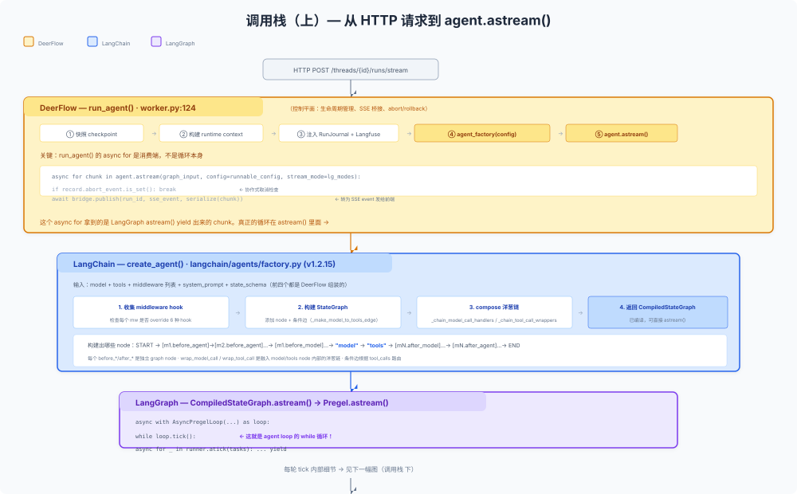
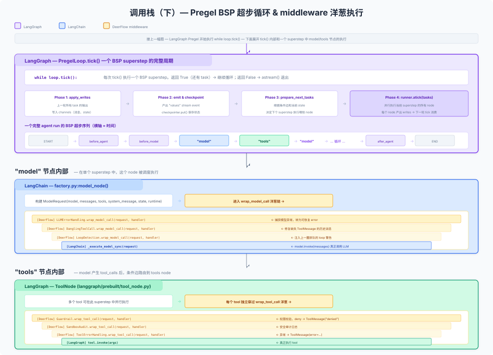

# 代码路径追踪：从 `run_agent()` 到 Pregel `tick()` 的完整调用链

读完前面三篇你可能有一个困惑：**agent loop 的代码到底在哪？** 答案是：它不在 DeerFlow 里，而是在 **LangChain + LangGraph** 的源码中。DeerFlow 做的是在 loop 的每一个 hook 点上挂载自己的 middleware。

这篇沿着一次 HTTP 请求的完整调用链，从外到内逐层追踪。每一步标注**"谁负责"**。

## 先回答核心问题

**Q: agent loop 的 `while` 循环到底在哪？**

A: 在 **LangGraph** 的 `PregelLoop.tick()` 里。这是 LangGraph 的 BSP（Bulk Synchronous Parallel）执行引擎：

```python
# langgraph/pregel/_loop.py — LangGraph 的代码，不是 DeerFlow 的
class PregelLoop:
    def tick(self):
        """执行一个 superstep，返回 True 表示还有更多 step"""
        # 1. 收集上一轮 task 的写入
        # 2. 应用到 channels
        # 3. 保存 checkpoint
        # 4. 准备下一轮 tasks → model node / tools node
        # 5. 如果还有 tasks → 返回 True，否则返回 False
        ...
```

调用方（`Pregel.astream()`）：

```python
# langgraph/pregel/__init__.py — LangGraph 的代码
async def astream(self, input, config, stream_mode):
    async with AsyncPregelLoop(...) as loop:
        while loop.tick():              # ← 这就是 agent loop 的 while 循环
            async for _ in runner.atick(tasks):
                for o in output():
                    yield o             # ← 每圈产出的 stream event
```

**Q: 那 DeerFlow 的 `run_agent()` 里的 `async for chunk in agent.astream(...)` 是什么？**

A: 那是 **消费端**。DeerFlow 消费 LangGraph `astream()` 产出的 chunk，转成 SSE event 发给前端。真正的循环逻辑在 `astream()` **里面**，不在 DeerFlow 的 `async for` 这行代码里。

---

## 全景调用栈

```
HTTP POST /api/threads/{id}/runs/stream
│
│  [DeerFlow: app/gateway/routers/thread_runs.py]
│  FastAPI → 创建 StreamingResponse → asyncio.create_task(run_agent(...))
│
▼
┌─ Layer A ──────────────────────────────────────────────────────────┐
│ [DeerFlow] run_agent()                                              │
│ packages/harness/deerflow/runtime/runs/worker.py:124               │
│                                                                     │
│   1. 快照 checkpoint                                                │
│   2. 构建 runtime context → 注入 __pregel_runtime                   │
│   3. agent_factory(config) → 触发下面 Layer B                       │
│   4. agent.checkpointer = checkpointer                              │
│   5. agent.astream(graph_input, config, stream_mode)                │
│      │                                                              │
│      ▼                                                              │
│   ┌─ Layer B ──────────────────────────────────────────────────┐   │
│   │ [LangChain] create_agent()                                  │   │
│   │ langchain/agents/factory.py                                │   │
│   │                                                             │   │
│   │   1. 遍历 middleware 列表，收集 hook 方法                    │   │
│   │   2. 构建 StateGraph，添加节点:                              │   │
│   │      - 每个有 before_agent hook 的 middleware → 独立节点     │   │
│   │      - 每个有 before_model hook 的 middleware → 独立节点     │   │
│   │      - "model" 节点（核心）                                  │   │
│   │      - "tools" 节点（如果有 tools 或 wrap_tool_call hook）   │   │
│   │      - 每个有 after_model hook 的 middleware → 独立节点      │   │
│   │      - 每个有 after_agent hook 的 middleware → 独立节点      │   │
│   │   3. compose wrap_model_call 洋葱链                          │   │
│   │   4. compose wrap_tool_call 洋葱链                           │   │
│   │   5. 添加条件边（_make_model_to_tools_edge 等）               │   │
│   │   6. 返回 CompiledStateGraph                                 │   │
│   └─────────────────────────────────────────────────────────────┘   │
│      │                                                              │
│      ▼                                                              │
│   ┌─ Layer C ──────────────────────────────────────────────────┐   │
│   │ [LangGraph] CompiledStateGraph.astream()                    │   │
│   │ langgraph/pregel/__init__.py                               │   │
│   │                                                             │   │
│   │   async with AsyncPregelLoop(...) as loop:                  │   │
│   │       while loop.tick():                    ← agent loop!   │   │
│   │           async for _ in runner.atick(tasks):               │   │
│   │               for o in output():                            │   │
│   │                   yield o                                   │   │
│   └─────────────────────────────────────────────────────────────┘   │
│      │                                                              │
│      ▼  (每个 tick 产出的 chunk)                                    │
│   6. serialize(chunk) → bridge.publish(run_id, event, data)          │
│   7. bridge.publish_end(run_id)                                      │
│   8. journal flush, token persist, title sync                       │
└─────────────────────────────────────────────────────────────────────┘
│
▼
SSE stream → 前端消费
```



---

## Layer A 展开：`run_agent()` [DeerFlow]

**文件**: `packages/harness/deerflow/runtime/runs/worker.py:124`

这是 DeerFlow 写的"运行一个 agent run"的外壳。它不是 loop 本身，而是 loop 的 **启动器 + 生命周期管理器**：

```
run_agent() 做什么：

  ┌─ 启动前 ──────────────────────────────────────
  │ snapshot checkpoint（rollback 用）
  │ mark status = running
  │ publish "metadata" SSE event
  │
  ├─ 构建 agent ──────────────────────────────────
  │ 注入 runtime context（thread_id, run_id, app_config）
  │ 注入 __pregel_runtime（让 tool/middleware 访问 Runtime.context）
  │ 注入 RunJournal 作为 LangChain callback
  │ 注入 Langfuse trace metadata
  │ agent_factory(config) → 触发 Layer B: create_agent()
  │ 挂载 checkpointer + store
  │
  ├─ 执行 loop（委托给 LangGraph）────────────────
  │ async for chunk in agent.astream(...):    ← 真正的循环在 astream() 里面
  │     if abort_event: break                  ← 协作式取消
  │     bridge.publish(event, data)            ← 转 SSE
  │
  └─ 清理 ────────────────────────────────────────
    flush journal
    persist token usage
    sync thread title
    bridge.publish_end()
```

关键代码（简化）：

```python
# worker.py:311 — 这不是 loop，这是消费 stream
async for chunk in agent.astream(graph_input, config=runnable_config, stream_mode=lg_modes):
    if record.abort_event.is_set():
        break
    sse_event = _lg_mode_to_sse_event(mode)
    await bridge.publish(run_id, sse_event, serialize(chunk, mode=mode))
```

**DeerFlow 的贡献**：checkpoint 快照、runtime context 注入、journal 回调、abort 机制、SSE 桥接、token 持久化、title 同步。

---

## Layer B 展开：`create_agent()` [LangChain]

**文件**: `langchain/agents/factory.py`（LangChain 1.2.15）

`create_agent()` 是 LangChain 提供的工厂函数。它接收 middleware 列表，构建一个带 hook 节点的 StateGraph，**然后编译返回**。DeerFlow 调用它：

```python
# deerflow/agents/lead_agent/agent.py:482
return create_agent(
    model=create_chat_model(...),        # DeerFlow 的模型工厂
    tools=filtered_tools,                # DeerFlow 的 tool 组装
    middleware=_build_middlewares(...),   # DeerFlow 的 29 个 middleware
    system_prompt=apply_prompt_template(...),  # DeerFlow 的 prompt
    state_schema=ThreadState,            # DeerFlow 的 state schema
)
```

**`create_agent()` 内部做了什么**：

### 第一步：收集 middleware hook

遍历 `middleware` 列表，检查每个 middleware 是否 override 了以下方法：

| Hook 方法 | 如何检测 | 如果存在：创建什么 |
|-----------|---------|-------------------|
| `before_agent` / `abefore_agent` | `type(mw).before_agent is not AgentMiddleware.before_agent` | 独立 graph node `{mw.name}.before_agent` |
| `before_model` / `abefore_model` | 同上 | 独立 graph node `{mw.name}.before_model` |
| `after_model` / `aafter_model` | 同上 | 独立 graph node `{mw.name}.after_model` |
| `after_agent` / `aafter_agent` | 同上 | 独立 graph node `{mw.name}.after_agent` |
| `wrap_model_call` / `awrap_model_call` | 同上 | **不创建 node**，而是进入 composed handler 链 |
| `wrap_tool_call` / `awrap_tool_call` | 同上 | **不创建 node**，而是传给 ToolNode 的 `wrap_tool_call` 参数 |

关键区别：`before_*` / `after_*` 变成 graph node，`wrap_*` 变成**内联嵌套的 callable 链**。

### 第二步：构建 StateGraph 节点和边

```
create_agent() 构建的图结构（简化，忽略 hook_config jump_to）：

  START
    │
    ▼
  [m1.before_agent] → [m2.before_agent] → ... (仅 override 了 before_agent 的 middleware)
    │
    ▼
  [m1.before_model] → [m2.before_model] → ... (仅 override 了 before_model 的 middleware)
    │
    ▼
  ┌─────────────────────────────┐
  │       "model" 节点          │  ← 内部调用 wrap_model_call 洋葱链
  │  model_node(state, runtime) │
  └──────────┬──────────────────┘
             │
             ▼ (条件边: _make_model_to_tools_edge)
      有未完成的 tool_calls?
         │            │
      YES│            │NO
         ▼            ▼
  ┌─────────────┐   [mN.after_model] → ... → [m1.after_model]
  │"tools" 节点  │        │
  │wrap_tool_call│        ▼ (条件边，同上)
  │  洋葱链      │   有 after_agent hook?
  └──────┬───────┘     │YES          │NO
         │              ▼             ▼
         │       [mN.after_agent]    END
         │       → ... →
         │       [m1.after_agent]
         │              │
         ▼              ▼
    回到 [m1.before_model] (下一圈)
```

### 第三步：compose wrap_model_call 洋葱链

这是 `create_agent()` 最精妙的部分。`_chain_model_call_handlers()` 把**实现了 `wrap_model_call` 的 middleware** 组装成洋葱链：

```python
# langchain/agents/factory.py (LangChain 的代码)
def _chain_model_call_handlers(middlewares, execute_model):
    """返回一个 composed handler，最外层 middleware 在最外面"""
    handler = execute_model  # 最内层：真正调 LLM
    for mw in reversed(middlewares):  # 反序遍历
        if has_wrap_model_call(mw):
            outer = handler
            handler = lambda req, mw=mw, inner=outer: mw.wrap_model_call(req, inner)
    return handler
```

结果是一个嵌套调用链：

```
m1.wrap_model_call(request,
    m2.wrap_model_call(request,
        ...
            mN.wrap_model_call(request,
                execute_model(request)  ← 真正调 LLM
            )
        ...
    )
)
```

DeerFlow 的 middleware 在链中的位置由它们在 `_build_middlewares()` 返回列表中的顺序决定——**第一个 middleware 是最外层**。

### 第四步：compose wrap_tool_call 洋葱链

类似地，`_chain_tool_call_wrappers()` 组装 tool 执行链。结果传给 LangGraph 的 `ToolNode`：

```python
tool_node = ToolNode(
    tools=available_tools,
    wrap_tool_call=composed_wrapper,       # 同步版洋葱链
    awrap_tool_call=async_composed_wrapper, # 异步版洋葱链
)
```

**DeerFlow 的贡献**：提供 29 个 `AgentMiddleware` 子类实例，按严格顺序排列。LangChain 负责把它们变成节点和洋葱链。

---

## Layer C 展开：Graph 内部执行 [LangChain + DeerFlow middleware]

### "model" 节点内部

```python
# langchain/agents/factory.py (LangChain 的代码)
def model_node(state, runtime):
    request = ModelRequest(
        model=model,
        tools=tools,
        messages=state["messages"],  # ← 当前完整消息历史
        system_message=system_prompt,
        state=state,
        runtime=runtime,
    )

    if wrap_model_call_handler is None:
        # 没有 middleware，直接调 LLM
        return [AIMessage(...)]

    # 有 middleware：穿过洋葱链
    result = wrap_model_call_handler(request, _execute_model_sync)

    # 返回 model response + 任何 middleware 产生的额外 Command
    return _build_commands(result.model_response, result.commands)
```

**执行路径**（从外到内）：

```
DeerFlow: LLMErrorHandlingMiddleware.wrap_model_call(request, handler)
  → 捕获 LLM 异常，转为可恢复的错误
  → handler(request)  # 调用内层

    DeerFlow: DanglingToolCallMiddleware.wrap_model_call(request, handler)
      → 修复缺失 ToolMessage 的历史消息
      → handler(request)

        DeerFlow: SummarizationMiddleware.wrap_model_call(request, handler)
          → 如果 context 太长，裁剪旧消息
          → handler(request)

            DeerFlow: LoopDetectionMiddleware.wrap_model_call(request, handler)
              → 注入上一圈排队的 loop 警告
              → handler(request)

                LangChain: _execute_model_sync(request)
                  → model.invoke(messages)  # 真正调 LLM
                  → 返回 AIMessage(content, tool_calls)
```

**注意区分**：
- `before_model` hook（独立 graph node）在 `model_node` **之前**执行——可以修改 state，但不能控制 model 调用本身
- `wrap_model_call` 洋葱在 `model_node` **内部**执行——可以修改 request/response，决定调不调 LLM

### "tools" 节点内部

```python
# langgraph/prebuilt/tool_node.py (LangGraph 的代码)
class ToolNode:
    def _execute_tool_sync(self, request: ToolCallRequest):
        # 1. 如果有 wrap_tool_call 链
        if self.wrap_tool_call:
            result = self.wrap_tool_call(request, self._raw_execute)
        else:
            result = self._raw_execute(request)
        # 2. 返回 ToolMessage（或 Command）
        return result

    def _raw_execute(self, request):
        # 真正执行 tool
        return request.tool.invoke(request.tool_call["args"])
```

**执行路径**（从外到内）：

```
DeerFlow: SandboxAuditMiddleware.wrap_tool_call(request, handler)
  → 记录审计日志
  → handler(request)

    DeerFlow: ToolErrorHandlingMiddleware.wrap_tool_call(request, handler)
      → 捕获 tool 异常，转为 ToolMessage(error=...)
      → handler(request)

        DeerFlow: ClarificationMiddleware.wrap_tool_call(request, handler)
          → 如果是 ask_clarification → return Command(goto=END)
          → handler(request)

            LangGraph: ToolNode._raw_execute(request)
              → tool.invoke(args)  # 真正执行 tool
```

### 条件边：什么时候回 model，什么时候结束

```python
# langchain/agents/factory.py (LangChain 的代码)
def _make_model_to_tools_edge(state):
    messages = state["messages"]
    last_msg = messages[-1]

    # 检查是否有未完成的 tool_calls
    if isinstance(last_msg, AIMessage) and last_msg.tool_calls:
        # 检查是否都是 return_direct 或 structured output
        if not all_resolved(last_msg.tool_calls):
            return "tools"  # → 继续循环
    return END  # → 结束
```

---

## Layer D 展开：Pregel `astream()` [LangGraph]

**文件**: `langgraph/pregel/__init__.py`

这才是真正的 **agent loop 的 `while` 循环**。

```python
# langgraph/pregel/__init__.py — LangGraph 的代码
class Pregel:
    async def astream(self, input, config, *, stream_mode, subgraphs):
        # ... 初始化 ...

        async with AsyncPregelLoop(input, config, ...) as loop:
            runner = PregelRunner(...)

            # ═══════════════════════════════════════
            # 这就是 agent loop 的 while 循环
            # ═══════════════════════════════════════
            while loop.tick(input_keys=self.input_channels):
                # 每个 tick 是一个 superstep
                # loop.tick() 内部：
                #   1. 收集上一轮 task 写入
                #   2. apply_writes → 更新 channels
                #   3. 发出 "values" stream event
                #   4. 保存 checkpoint
                #   5. step += 1
                #   6. prepare_next_tasks → 决定下个 superstep 的 tasks

                async for _ in runner.atick(tasks, timeout=..., retry_policy=...):
                    # runner 并行执行当前 superstep 的所有 task
                    # 每个 task 对应一个 graph node
                    pass

                # 产出 stream events
                for o in output():
                    yield o  # ← DeerFlow 的 async for 拿到的是这个

            # loop 结束
            for o in output():
                yield o
```

### 一个完整 run 的 BSP superstep 序列

```
Superstep 0:  [START] → 初始化
Superstep 1:  [m1.before_agent] [m2.before_agent] ... (并行)
Superstep 2:  [m1.before_model] [m2.before_model] ... (并行)
Superstep 3:  ["model" 节点]  ← LLM 调用，穿过 wrap_model_call 洋葱
              产出 AIMessage(tool_calls=[read_file, bash])
Superstep 4:  ["tools" 节点]   ← 并行执行 read_file + bash，穿过 wrap_tool_call 洋葱
              产出 [ToolMessage, ToolMessage]
Superstep 5:  [m1.before_model] [m2.before_model] ... (并行)
Superstep 6:  ["model" 节点]  ← LLM 处理 tool results
              产出 AIMessage(content="根据结果...")
Superstep 7:  [mN.after_model] ... [m1.after_model] (并行，反向)
Superstep 8:  [mN.after_agent] ... [m1.after_agent] (并行，反向)
              → END
```

**循环次数** 由 `recursion_limit` 控制（默认 100）。如果 model 反复产生 tool_calls 超过 100 个 superstep，LangGraph 抛 `GraphRecursionError`。



---

## Layer E：Middleware Hook 总览 — DeerFlow 怎么利用 LangChain 的 hook 机制

LangChain 提供 6 种 hook 点 + 2 种 wrap 洋葱。DeerFlow 的 29 个 middleware 全部基于这些 hook：

| LangChain Hook | 机制 | DeerFlow 利用者 |
|---------------|------|----------------|
| `before_agent` | 独立 graph node（仅一次） | ThreadData、Uploads、LoopDetection（清理）、Todo |
| `before_model` | 独立 graph node（每圈） | DynamicContext（注入日期/memory）、Summarization、ViewImage（注入图片）、Todo |
| `wrap_model_call` | 内联洋葱链（每圈） | LLMErrorHandling（异常→错误消息）、DanglingToolCall（修复配对）、Summarization（裁剪消息）、LoopDetection（注入 loop 警告）、DeferredToolFilter |
| `after_model` | 独立 graph node（每圈，反向） | LoopDetection（检测重复）、SubagentLimit（截断）、SafetyFinishReason（清除 refusals）、TokenUsage、Title、Todo |
| `wrap_tool_call` | 内联洋葱链（每个 tool） | SandboxAudit（审计日志）、ToolErrorHandling（异常→ToolMessage）、Clarification（拦截 ask_clarification→goto=END）、Guardrail（权限校验） |
| `after_agent` | 独立 graph node（仅一次，反向） | Memory（队列更新）、LoopDetection（清理待发警告）、Todo |

**结论：DeerFlow 100% 利用了 LangChain 的 middleware hook 体系。** 没有自己发明 hook 协议，没有绕过 graph 结构。所有扩展都是标准的 `AgentMiddleware` 子类。

---

## 总结：谁做了什么

```
                    DeerFlow 写的              LangChain/LangGraph 提供的
                    ────────────               ────────────────────────
Agent Loop 核心     ✗ (没有)                   ✓ PregelLoop.tick() + astream()
Graph 构建          ✗ (没有)                   ✓ create_agent() → StateGraph
条件路由            ✗ (没有)                   ✓ _make_model_to_tools_edge
Middleware 协议     ✗ (没有)                   ✓ AgentMiddleware 基类 + 6 hook
Middleware 实现     ✓ 29 个 AgentMiddleware 子类  ✗ (没有)
Middleware 装配     ✓ _build_middlewares()      ✓ _chain_model_call_handlers
State Schema        ✓ ThreadState              ✓ AgentState (基类)
模型调用            ✓ create_chat_model()      ✓ model.invoke() in _execute_model_sync
Tool 系统           ✓ get_available_tools()    ✓ ToolNode + ToolCallRequest
Checkpoint          ✗ (没有)                   ✓ SqliteSaver / PostgresSaver
Run 生命周期        ✓ run_agent() + RunManager ✗ (没有)
SSE 桥接            ✓ StreamBridge             ✗ (没有)
```

**核心洞见**：DeerFlow 的 agent loop 不是自己写的循环，而是 **LangGraph Pregel 的 BSP superstep 机制 + LangChain 的 graph 节点/条件边 + DeerFlow 的 29 个 middleware 实现**。三层叠在一起，形成了完整的 agent 执行系统。

下一步：回到 [[00-loop-anatomy]] 看三层循环的架构全貌，[[01-middleware-as-loop]] 深入 middleware 的设计哲学，[[02-extension-points]] 了解怎么往外扩。
