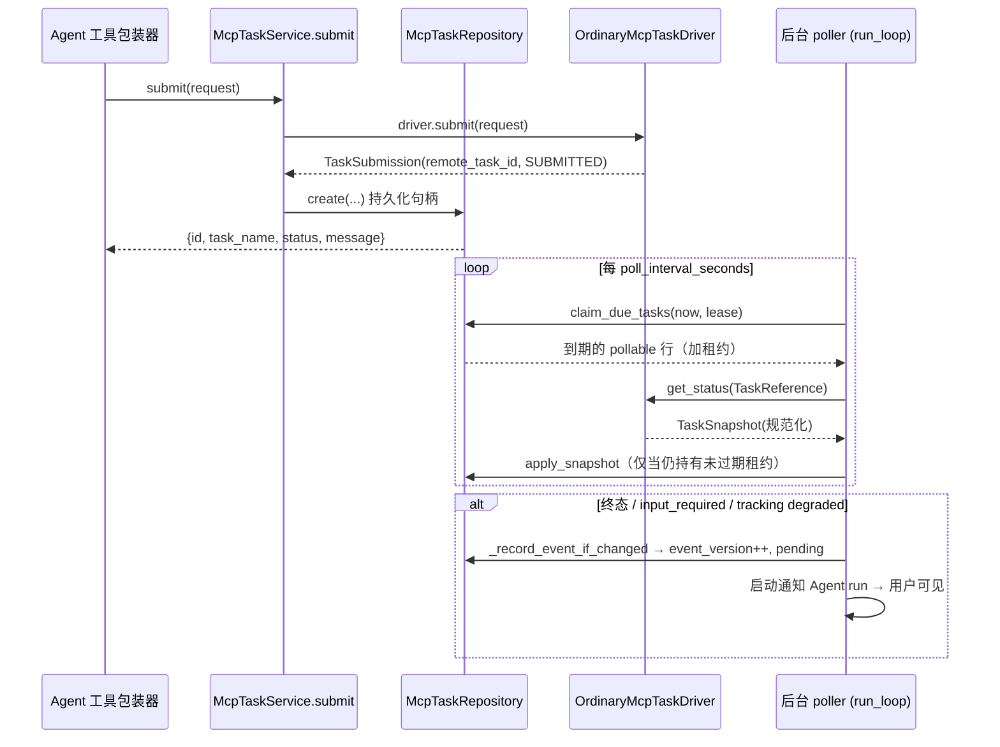

# MCP Durable Task — 持久化长任务子系统

MCP 服务器暴露的"提交 → 轮询 → 取结果"类工具（典型如 OpenViking 这类长任务集成）默认是同步的：Agent 调用工具后必须阻塞等待远端完成，既占用 Agent 循环，也拿不到可恢复的任务句柄。这套子系统把这类工作**从一次工具调用变成一个持久化任务对象**，把"状态轮询"整个搬出 Agent/LLM 循环。

> 同步 #5：对应上游 `e9387394`（runtime foundation）、`47b258eb`（ordinary driver）、`5ffc2d3e`（notification + chat UI）、`7e95bef2`（per-user credential injection）、`a263af28`（OpenViking 集成）。前三个是 durable task 的主体，后两个是本轮一并落地的相邻能力。
>
> 同步 #6 增量：stdio 后台会话在任务超时后保留、按错误类别断线驱逐（#5027/#5018）；submit 独占 `headers_from_context` 请求级 headers（#5010）。

## 相关文件

- `deerflow/mcp/tasks/driver.py` (36 行) — `McpTaskDriver` 协议 + `McpTaskDriverRegistry`
- `deerflow/mcp/tasks/models.py` (146 行) — 协议中立状态机、快照、任务引用
- `deerflow/mcp/tasks/ordinary.py` (213 行) — 唯一内置 driver：普通 submit/status/cancel 三工具契约
- `deerflow/mcp/tasks/runtime.py` (124 行) — 进程内桥：`McpTaskSubmitter` 协议 + 启动快照冻结
- `deerflow/mcp/task_tool_caller.py` (267 行) — 按精确名调用原始 MCP 工具、复用 stdio 会话
- `deerflow/mcp/tools.py` (`_configure_task_tools_for_server`) — 隐藏 status/cancel、替换 submit 包装器
- `deerflow/tools/builtins/background_tasks_tool.py` (84 行) — 模型可见的 `list/cancel_background_task` 业务工具
- `deerflow/mcp/user_scoped_auth.py` (150 行) — 共享 MCP server 的按用户凭据注入
- `deerflow/mcp/context_headers.py` (206 行) 🆕 同步#6 — 按请求凭据注入（submit 带、poll 不带，见 §4.2）
- `deerflow/mcp/interceptors.py` (96 行) — 拦截器组装（OAuth → user-auth → context-headers → 自定义）
- `deerflow/persistence/mcp_tasks/model.py` / `sql.py` — `mcp_tasks` 表与 `McpTaskRepository`
- `deerflow/persistence/migrations/versions/001{1,2,3}_mcp_task*.py` — 建表 / 结果字段 / 通知字段
- `app/mcp_tasks/service.py` (676 行) — `McpTaskService`：轮询/取消/通知的后台循环
- `app/mcp_tasks/errors.py` — `PermanentNotificationError`
- `app/gateway/routers/mcp_tasks.py` (126 行) — `/api/threads/{id}/mcp-tasks` 读/取消 API
- `app/gateway/services.py` (`launch_mcp_task_notification_run`) — 通知投递 Agent run
- `deerflow/config/mcp_tasks_config.py` (15 行) — `mcp_tasks` 启动配置段

---

## 1. 什么是 durable task

**问题**：长任务 MCP 工具调用期间 Agent 必须原地等待远端结果；远端任务 ID、轮询节奏、结果落盘都散在调用点，没有恢复点、没有跨进程可见性、没有用户可感知的进度。

**核心思想**（`models.py` + `service.py` 的注释）：

- **submit 与 poll 分离**：Agent 只调用 submit 包装器，它先把远端句柄持久化，再立即返回一个**本地 task ID**；真正的状态轮询由后台 `McpTaskService` 独立完成。
- **协议中立**：`TaskStatus` / `TaskSnapshot` / `TaskReference` 是规范化的内部模型，与具体 MCP 服务器返回什么字段无关；每种远端契约由 `McpTaskDriver` 适配成这套模型。
- **数据库是唯一事实来源**：远端句柄、轮询计划、通知状态、租约 owner 都落在 `mcp_tasks` 表；`ThreadState` 只拿到当前线程的有界投影。
- **重启恢复靠租约过期**：没有专门的"清扫"步骤，过期租约在下一次扫描时自然重新可认领。

### 状态机

```python
class TaskStatus(StrEnum):
    SUBMITTED = "submitted"        # 刚提交（远端已返回 task_id，尚未轮询）
    WORKING = "working"            # 远端 running 的规范化态
    INPUT_REQUIRED = "input_required"  # 需要用户输入（当前版本尚不能回填）
    COMPLETED = "completed"
    FAILED = "failed"
    CANCELLED = "cancelled"
```

三个派生集合（`models.py`）：

- `POLLABLE_TASK_STATUSES` = `{submitted, working, input_required}` — 会继续轮询
- `TERMINAL_TASK_STATUSES` = `{completed, failed, cancelled}` — 不再轮询
- `ATTENTION_TASK_STATUSES` = `{input_required, completed, failed, cancelled}` — 需要"引起注意"（触发通知）

`TaskSnapshot` 是 driver 一次状态返回的规范化结果，带 `result` / `result_preview` / `result_truncated` / `result_artifact` / `error` / `input_required` / `poll_after_seconds`。`poll_after_seconds` 在 `__post_init__` 强制为**有限正数**，因为消费方会把它转成下一次轮询的 `timedelta`（NaN/inf 会炸掉定时器）。

`TaskReference` 是"原始 Agent run 结束后 driver 仍需要"的稳定数据：`local_task_id / user_id / thread_id / server_name / remote_task_id / driver_data`，由 `from_record()` 从数据库行还原。

---

## 2. 生命周期：创建 → 轮询 → 完成 / 取消 / 通知



关键保证（`service.py` / `sql.py`）：

- **租约 fencing**：`apply_snapshot` 只在 `lease_owner` 匹配且租约未过期、状态非终态、且无取消请求时写入。过期后的迟到轮询结果即使 owner token 仍对得上也会被丢弃——这正是重启恢复机制。
- **submit 的补偿**：submit 成功后若本地持久化失败、或调用方在持久化 in-flight 时被取消，服务会 best-effort 取消远端任务（`_cancel_untracked_task`，最多等 5 秒），避免留下一个没人跟踪的活远端任务。唯一的例外是 `uq_mcp_tasks_user_server_remote` 冲突——那说明已有一个持久化行在跟踪该句柄，此时不取消。
- **取消 fence**：第一个取消请求会把 in-flight 的轮询租约置空（fence 掉在途结果），但**重复取消要保留已有的取消租约**，防止并发发起多次远端取消；取消退避从远端尝试结束那一刻才开始计时。
- **隔离性**：轮询 / 取消 / 通知三批各用 `asyncio.gather(..., return_exceptions=True)`，单任务异常不拖垮同批兄弟；轮询/取消的意外失败只留租约过期等恢复，通知失败只释放受影响的租约重试。

---

## 3. 组件分层：driver 抽象 / runtime 桥 / ordinary 实现

源码里其实分**三层**，任务描述里的"runtime / ordinary 两种 driver"需要澄清：

### 3.1 `McpTaskDriver` 协议 + `McpTaskDriverRegistry`（`driver.py`）

```python
class McpTaskDriver(Protocol):
    async def submit(self, request: TaskSubmitRequest) -> TaskSubmission: ...
    async def get_status(self, task: TaskReference) -> TaskSnapshot: ...
    async def cancel(self, task: TaskReference) -> TaskSnapshot: ...
```

这是**协议中立的运行时**面向的传输/协议适配层。`McpTaskDriverRegistry` 是进程内目录，在 Gateway 启动时装配（`app.py` lifespan），`register` 拒绝空名与重名。

### 3.2 `OrdinaryMcpTaskDriver`（`ordinary.py`，`"ordinary-tools"`）

唯一内置 driver，把 `task_toolsets` 绑定的三个原始工具名（`submit_tool` / `status_tool` / `cancel_tool`）适配成规范化状态。契约要点：

- **只读 `structuredContent`**：`_structured_content` 要求工具返回 structured 内容，纯文本 content 不解析（`McpTaskProtocolError`）；`isError=true` 的 submit/status 结果按调用失败处理（重试），文本内容块被截断到 500 字符作诊断。
- **状态映射**：远端 `running → working`，`input_required / completed / failed / cancelled` 原样映射；`submit` 返回的 `_SubmitPayload` 只认 `status: "running"`。
- **`error_code == "task_not_found"` → 永久失败**：`_snapshot_from_status` 把它折叠成 `FAILED`，而不是重试。
- **`task_id` 必须回显一致**：`_require_matching_task_id` 校验 status/cancel 返回的 `task_id` 与持久化的 `remote_task_id` 一致，不一致即协议错误。
- **畸形结构化输出 = 永久失败**：`_parse` 的 `ValidationError` 全部转成 `McpTaskProtocolError`，由 `_poll_one` 捕获后把任务标记为 `FAILED`（见 §2 的 `apply_snapshot` 路径）。

### 3.3 `runtime.py` 的进程内桥（**不是 driver**）

`runtime.py` 是"Agent 工具包装器 → Gateway 任务服务"的进程内桥接层，靠模块级单例 `_submitter` 连接 harness 与 app（app 装 submitter，harness 永远不 import app）：

- `McpTaskSubmitter` 协议：`submit` / `list_tasks` / `cancel_matching_task`；`set_mcp_task_submitter()` 在 Gateway lifespan 装入，`get_mcp_task_submitter()` 未装时抛 `McpTaskConfigurationError`。
- **启动快照冻结**：`set_mcp_task_config_snapshot()` 冻结"任务启用的 server 运行时配置 + `mcpInterceptors`"，`validate_mcp_task_config_snapshot()` 拒绝会"把工具发现与后台调用劈开"的热变更（`McpTaskConfigurationError`）。presentation 字段（`description/routing/tools/tool_name_prefix`）与非任务 server 仍可热重载。
- **启动校验**：`validate_mcp_task_runtime_configuration()` 在 `task_toolsets` 非空时强制 `mcp_tasks.enabled=true` 且 SQL 后端（否则这些工具会静默退化为同步调用）；并对每个任务 server 预跑 `build_server_params`。

> **提交者即真相来源**：进程内 submitter 是否装好，决定了管理工具是否暴露；`mcp_tasks` 是 startup-only，改 `config.yaml` 不重启不会改变活工具集。

---

## 4. 模型可见的任务工具集（task tool caller）

### 4.1 submit 包装器（`tools.py::_configure_task_tools_for_server`）

对声明了 `task_toolsets` 的 server，工具发现阶段做三件事：

1. 校验三个角色引用的原始工具名确实存在（缺失 → `McpTaskConfigurationError`）；
2. **隐藏** `status_tool` 与 `cancel_tool`（driver-only，绝不对 Agent 暴露）；
3. 把 `submit_tool` 换成 `_make_background_submit_tool`：调用 `get_mcp_task_submitter().submit(...)`，持久化成功后**只返回本地 ID**：

```python
{"task_id", "task_name", "status", "message": "Task is running in the background."}
```

`driver_data` 携带 `submit_tool / status_tool / cancel_tool` 三个原始名，供后台 driver 反查。原始工具名用 `_raw_mcp_tool_name()` 剥离 `tool_name_prefix` 前缀后匹配——展示前缀刻意不进入 durable 绑定。

### 4.2 后台调用器（`task_tool_caller.py::McpTaskToolCaller`）

`McpTaskToolCaller.call_tool()` 负责"按精确名调用原始 MCP 工具但不把它们暴露回 Agent"，对两条 transport 分别处理：

- **stdio**：`_prepare_stdio_connection` 把 cwd 钉到线程 workspace、`TMPDIR/TMP/TEMP` 钉到 `workspace/.mcp/tmp/`（`0o700`）；通过 `get_session_pool()` 以 `scope_key = f"{user_id}:{thread_id}"` **复用持久会话**；`session_init_timeout` 包住 `pool.get_session`，`tool_call_timeout` 作为 `read_timeout_seconds`。🆕 同步#6：异常处理不再"一律 `close_session`"（#5027）——超时的 status poll 不能把健康的有状态会话（连同浏览器等服务器状态）端掉；会话驱逐改由池内按错误类别判定，只有真正的传输断线（MCP SDK `Connection closed` / AnyIO closed-stream，且注册条目仍是那个失败的 `ClientSession`）才清掉该 scope（#5018），之后的重试创建全新子进程/会话，失败调用本身照常上抛、绝不自动重放。
- **HTTP/SSE**：走 ephemeral `create_session`，`session_init_timeout` 包 `initialize`，`tool_call_timeout` 包 `call_tool`；`tool_call_timeout` 生效前先通过 `OAuthTokenManager.get_authorization_header` 注入 OAuth 头（server 级 refresh 可在 Agent run 之外发生）。

🆕 同步#6 **请求级 headers 只覆盖 submit**：`call_tool(request_scoped_headers=True)` 由 `OrdinaryMcpTaskDriver.submit` 独家传入，启用 `headers_from_context` 拦截器（此时请求 secrets 还在 Agent run 里）；status/cancel poll 跑在该 run 结束之后、没有 secrets，继续用 server 静态/OAuth 凭据。声明了 `headers_from_context` + `task_toolsets` 的 server 会在启动时收到警告——`on_missing: "deny"` 只保护 submit，不保护后台 poll。

`_invoke` 把拦截器（OAuth → user-auth → context-headers → 自定义，见 §7）按 onion 风格包在 `MCPToolCallRequest` 外层。

### 4.3 管理工具（`background_tasks_tool.py` + `tools/tools.py`）

`list_background_tasks` / `cancel_background_task` 是**内置业务工具**，只在 `is_mcp_task_runtime_available()`（submitter 已装）时加入 builtin 集合。它们调用 submitter 的 `list_tasks` / `cancel_matching_task`，返回有界本地字段（含 `cancel_requested`），**从不暴露远端句柄**；取消只是持久化请求并立即返回，真正的远端调用与重试由后台服务独占。这两个工具仍是普通业务工具，受 active skill 的 `allowed-tools` 策略约束，必须显式声明。

---

## 5. 持久化与 migrations

### 5.1 表结构（`model.py::McpTaskRow`）

`mcp_tasks` 单表承载整个生命周期。核心列分组：

| 组 | 列 | 说明 |
|----|----|------|
| 身份/来源 | `id`(PK, 64), `user_id`, `thread_id`, `run_id`, `tool_call_id`, `server_name`, `driver_name` | 谁、哪个线程、哪次 run 提交的 |
| 远端句柄 | `remote_task_id`(255), `task_name`(255) | 唯一约束见下 |
| 结果 | `result`(JSON), `result_preview`(Text), `result_truncated`(Bool), `result_artifact`(JSON), `error`(Text), `input_required`(JSON) | 有界结果投影 |
| 轮询 | `next_poll_at`, `last_polled_at`, `last_poll_error`, `poll_attempt_count`, `consecutive_poll_error_count`, `lease_owner`, `lease_expires_at` | 扫描计划 + 租约 + 连续错误计数 |
| 取消 | `cancel_requested_at`, `cancel_attempt_count`, `next_cancel_at`, `last_cancel_error` | 独立的取消租约与退避 |
| 通知 | `notification_status`, `event_fingerprint`, `event_version`, `notified_version`, `dispatch_version`, `dispatch_attempt`, `dispatch_event`, `notification_run_id`, `notification_error`, `notification_attempt_count`, `next_notification_at`, `notification_lease_*` | 事件 outbox + 投递租约 |

约束与索引：

- `UniqueConstraint("user_id","server_name","remote_task_id")` = `uq_mcp_tasks_user_server_remote` —— 同一用户对同一 server 的同一远端任务只能有一个持久化 owner（`DuplicateMcpRemoteTaskError` 的判定依据）。
- `ix_mcp_tasks_thread_created`（列表查询）、`ix_mcp_tasks_due(status, next_poll_at)`（轮询扫描）、`ix_mcp_tasks_notification_due(notification_status, next_notification_at)`（通知扫描）、`ix_mcp_tasks_cancel_due(cancel_requested_at, next_cancel_at)`（取消扫描）。

### 5.2 `McpTaskRepository`（`sql.py`，722 行）

所有并发安全通过 `SELECT ... FOR UPDATE SKIP LOCKED` + 租约实现：

- `claim_due_tasks` / `claim_cancel_requests` / `claim_notification_work`：扫描到期行并原子打上 `lease_owner` + `lease_expires_at`。
- `apply_snapshot` / `apply_cancel_snapshot`：仅当 owner 匹配、租约未过期、非终态（snapshot 还要求无取消请求）时写入，否则返回 `False`（结果被丢弃）。
- `release_claim`：意外轮询失败时递增 `consecutive_poll_error_count`，当它达到 `tracking_degraded_after_errors` 时 `_record_event_if_changed` 用 `tracking_degraded=true` 记一次事件。
- `_record_event_if_changed`：对需要引起注意的行做事件指纹（SHA-256），变了才 `event_version++` 并置 `notification_status=pending`；inflight 阶段（claimed/dispatched/retry）不重置，避免丢投递。
- 通知 outbox：`mark_notification_dispatched`（写 run_id）、`finish_notification_run`（delivered → `notified_version = dispatch_version`；失败 → retry 且 `dispatch_attempt`/`notification_attempt_count` 都 +1）、`dead_letter_notification`（若已有更新的 event_version，则退化为 `pending` 重投，而非死信整个任务）。

### 5.3 三个迁移

- **`0011_mcp_tasks`**：建 `mcp_tasks` 表 + 唯一约束 + 基础索引。
- **`0012_mcp_task_results`**：`result_preview` / `result_truncated` / `result_artifact` —— 有界结果字段（`safe_add_column` 幂等）。
- **`0013_mcp_task_notifications`**：通知 outbox 全套字段 + 取消退避字段（`cancel_attempt_count`/`next_cancel_at`/`last_cancel_error`）+ `runs.idempotency_key`（通知 Agent run 的幂等键）+ `uq_runs_idempotency_key` 唯一索引 + 两个扫描索引。升级时对 PR2 已终态且 `notification_status='pending'` 的行做一次性回填：`event_version=1, next_notification_at=updated_at`，让它们的通知能被投递。

---

## 6. Gateway `/mcp_tasks` + chat UI 通知（#4833）

### 6.1 读/取消 API（`routers/mcp_tasks.py`）

`/api/threads/{thread_id}/mcp-tasks`，全部 `owner_check` 权限：

- `GET ""` — 当前用户该线程的 durable 任务列表（`limit` 1–100，默认 50）。
- `GET "/{task_id}"` — 有界详情：result/preview/artifact/input_required、最近一次轮询/取消/通知错误与计数、`notification_status`。**不返回 `remote_task_id` 与 driver 配置**；错误文本截断到 500 字符。
- `POST "/{task_id}/cancel"` — 持久化取消请求；当 `mcp_tasks_available` 为 false（worker 未运行，例如 `mcp_tasks.enabled=false` 但有 SQL 后端）时返回 **503**——绝不"确认一个没人会执行的取消"。

`tracking_degraded` 由 `consecutive_poll_error_count >= tracking_degraded_after_errors` 派生，随列表/详情一起返回给前端。

### 6.2 通知投递（`service.py` + `services.py`）

当任务进入 `input_required` / 终态，或 `tracking_degraded` 翻转时，`_record_event_if_changed` 产出 pending 事件；`_run_notifications` 认领后 `_notify_one` 调用 `launch_mcp_task_notification_run` 拉起一个**内部 Agent run** 把更新投递到原线程：

- **可信指令在输入边界之外**：`_mcp_task_notification_prompt` 把固定的投递指令（解释更新、不暴露远端 task ID、`input_required` 时说明暂不能回填、`tracking_degraded` 时说明会低频重试）与序列化后的远端事件拼接；远端事件用 `frame_untrusted_text` 框成不可信文本后才进模型。
- **幂等**：`idempotency_key = "mcp-task:{task_id}:{dispatch_version}:{dispatch_attempt}"`，靠 `runs.idempotency_key` 唯一索引去重；`dispatch_attempt`（幂等键的一部分）与 `notification_attempt_count`（失败计数）**分离**。
- **严格存在性准入**：`require_existing_thread=True` —— 目标线程已删除或 owner 不匹配 → `PermanentNotificationError` → 立即 `dead_letter`，不复活聊天。busy 线程冲突（409）→ `ConflictError` → 用 `replace_with_latest=True` 释放，让 queued 快照合并到最新事件。
- **投递成功才标记 delivered**：run 成功 → `finish_notification_run(delivered=True)`；run 失败/超时/中断 → retry；run 仍 active → `defer_dispatched_notification`。
- **退避与上限**：`_notification_retry_seconds` 用 `poll_interval * 2^min(failures,16)` 封顶 `max_poll_backoff_seconds`；失败达到 `_MAX_NOTIFICATION_ATTEMPTS=5` → `dead_letter`（`count_failure=False`，不动幂等 attempt 计数）。缺 run → 记为一次失败投递并重试；瞬态 run-store 水合错误保持可区分、重查同一 lookup。

### 6.3 前端（`frontend/src/core/background-tasks/`）

header 触发器在 `/api/features -> mcp_tasks.enabled` 为 false（默认）或 memory 后端时隐藏；列表最多 20 条，有 active 任务时 3 秒、否则 15 秒轮询；详情仅在展开卡片时拉取；取消走本地 ID 端点。已持久化的取消请求在任务仍 active 时显示 "Cancelling…"，远端取消持续失败则展示 attempt 数与最近有界错误。通知投递失败展示其有界错误与计数，永久拒绝/耗尽 5 次预算显示为 "stopped"。

---

## 7. per-user credential injection（#4868）

一个配置好的 HTTP/SSE MCP server 可以服务多个 DeerFlow 用户，每个用户用**自己的凭据**访问远端。这是 `oauth.py` 的 `OAuthTokenManager`（server 级令牌）之外的另一套"每调用重写 header"机制。

### 7.1 配置（`extensions_config.py::McpUserScopedAuthConfig`）

```yaml
mcpServers:
  my_server:
    user_auth:
      enabled: true
      header: Authorization        # 默认 Authorization
      users:
        "alice-example-com-ab12cd34": "Bearer $ALICE_TOKEN"   # 支持 $ENV_VAR
      on_missing: deny             # deny（默认）| passthrough
```

### 7.2 拦截器（`user_scoped_auth.py::build_user_scoped_auth_interceptor`）

- 只对 `sse`/`http` 生效；`stdio` 声明 `user_auth` 会 warn-and-skip（stdio 池把重写 header 当 call meta 转发、不是 transport header，凭据无处可去）。
- 每次调用解析认证用户（`request.runtime` → ambient `get_runtime()` → `resolve_runtime_user_id` 链），重写 `user_auth.header` 的值为该用户的凭据，经 `request.override(headers=...)` 转发——与 OAuth 拦截器同一 per-call 机制。
- **fail-closed**：未映射用户（含匿名 `DEFAULT_USER_ID` fallback）或 `$ENV_VAR` 解析为空 → `ToolException`（提示里带上解析出的 user id，方便 operator 照抄 `users` key；它是调用者自己的 id，不跨用户泄露）。`on_missing: "passthrough"` 才回退到 server 静态 header。

### 7.3 与 oauth.py / session_pool.py 的关系（`interceptors.py`）

`build_mcp_tool_interceptors` 的注册顺序是 **OAuth → user-scoped auth → 自定义 `mcpInterceptors`**。拦截器 onion 组合是"后注册的更靠近 transport"，所以 server 同时声明两者时，**user-scoped 的 per-user 值覆盖 OAuth 注入的 header**（`compose_tool_interceptors` 的注释点明这正是它依赖的性质）。server 的静态 `headers` 只用于启动期工具发现（`tools/list`），永不用于 `user_auth` 开启时的用户调用。`session_pool.py` 的 stdio 持久会话路径也经同一个 `compose_tool_interceptors` 组合，因此重写 header 走 call meta；HTTP/SSE 则直接合并进 `connection["headers"]`。

---

## 8. config 段 `mcp_tasks`（`mcp_tasks_config.py`）

`config.yaml -> mcp_tasks`，**全部 restart-required**（lifespan 启动时读取）：

| 字段 | 默认 | 范围 | 说明 |
|------|------|------|------|
| `enabled` | `false` | — | 后台状态 poller 总开关 |
| `poll_interval_seconds` | `5` | 1–300 | 扫描间隔 + 默认任务重试间隔 |
| `lease_seconds` | `120` | 5–3600 | 认领租约时长；过期后任务可被他人恢复 |
| `max_concurrent_polls` | `8` | 1–64 | 单 worker 每轮最多发起的 status 调用数 |
| `max_poll_backoff_seconds` | `300` | 1–3600 | 瞬态错误指数退避上限 |
| `input_required_poll_interval_seconds` | `60` | 5–3600 | 等用户输入时的最小轮询间隔 |
| `tracking_degraded_after_errors` | `3` | 1–100 | 连续错误多少次后 API 报告 tracking 降级 |
| `max_result_bytes` | `65536` | 1024–10485760 | 完整 JSON 结果存储上限 |
| `result_preview_max_chars` | `2000` | 64–100000 | 超限时保留的文本预览长度 |

启动装配（`app/gateway/app.py` lifespan）：`mcp_task_repo` 仅在 SQL 后端存在（memory 后端 `sf is None` → repo 为 `None` → service 不可用）。有 repo 时注册 `ordinary-tools` driver（当配置了 task_toolsets）、构造 `McpTaskService`、`enabled` 时 `start()` 并 `set_mcp_task_submitter(service)`、置 `app.state.mcp_tasks_available=True`。shutdown 时先清 `mcp_tasks_available` 再 `stop()`（取消 poller，避免挂起的外部 status 调用阻塞进程退出）。

---

## 相邻 digest

- [MCP 深度解析 — Session Pool、OAuth、缓存](session-pool-oauth-cache-invalidation.md) — 本子系统依赖的 `session_pool.py` / `oauth.py` / `cache.py` / 传输路由。
- [Harness Hooks — MCP 拦截器](../harness-hooks/06-mcp-interceptors.md) — 拦截器/中间件视角。
