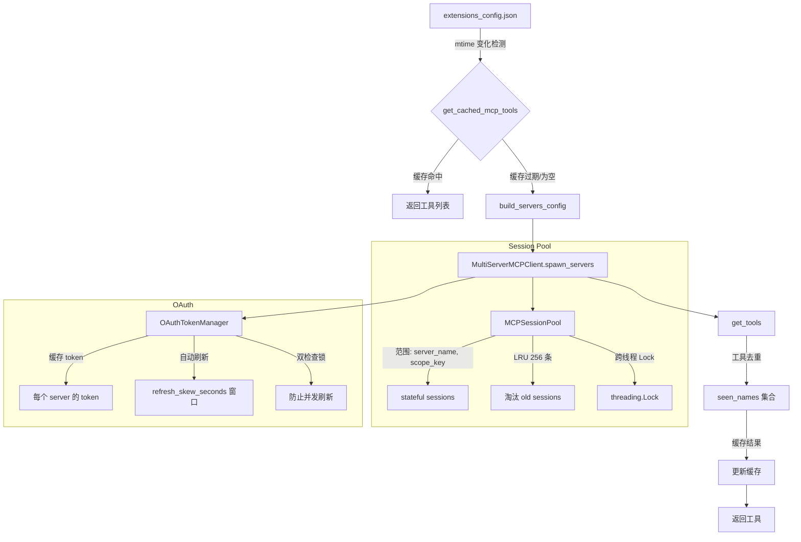
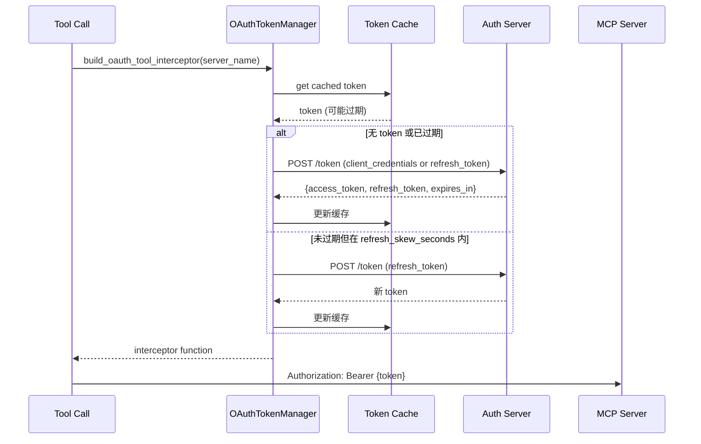

# MCP 深度解析 — Session Pool、OAuth、缓存

## 相关文件

- `deerflow/mcp/cache.py` (159 行) — 惰性初始化、mtime 缓存失效
- `deerflow/mcp/oauth.py` (151 行) — OAuth TokenManager、双检查锁、header 注入
- `deerflow/mcp/session_pool.py` (199 行) — 持久会话池、LRU 淘汰、跨线程安全
- `deerflow/mcp/client.py` (69 行) — 传输类型路由、服务器配置构建
- `deerflow/mcp/tools.py` (~50 行) — 通过 MultiServerMCPClient 加载工具

## MCP 工具生命周期全景



## Session Pool (`session_pool.py`)

### 为什么需要持久会话

部分 MCP 服务器是**有状态的**：
- Playwright MCP 在工具调用之间维护浏览器状态
- 数据库 MCP 保持连接池

无会话池的情况下，每个请求都会创建/销毁 MCP 连接，丢失状态并产生不必要的开销。

### 设计

```python
class MCPSessionPool:
    _sessions: dict[tuple[str, str], Any]  # (server_name, scope_key) → session
    _lock: threading.Lock                   # async + sync 路径安全
    _max_size: int = 256                    # LRU 上限
```

- **范围键** `scope_key` 通常为 `thread_id` — 同一线程的工具调用复用同一会话
- **LRU 淘汰** — 当会话数超过 256 时，最久未使用的被关闭
- **跨事件循环处理** — 如果会话属于不同的事件循环（在 asyncio 下），会话会被替换而不是崩溃
- **`close_all_sync()`** — 跨事件循环边界优雅关闭
- **每范围 close** — `close_scope(scope_key)` 用于线程清理

### 线程安全

`threading.Lock` 保护所有变更操作。此选择的原因：
1. 工具调用在 `asyncio.to_thread` 中运行（离开主事件循环）
2. MCP 客户端方法可能是同步的
3. 简单的 `asyncio.Lock` 会导致跨线程数据竞争

## OAuth Token 管理 (`oauth.py`)

### 支持的授权类型

| 授权类型 | `grant_type` | 说明 |
|---------|-------------|------|
| `client_credentials` | `"client_credentials"` | 无需刷新 token |
| `refresh_token` | `"refresh_token"` | 初始 token + 自动刷新 |

### Token 生命周期



### 关键设计细节

- **refresh_skew_seconds** — 如果 token 在 skew 窗口内过期，主动刷新以避免竞态
- **双检查锁定模式** (`_lock` + `_refresh_locks[server]`) — 防止多个并发工具调用同时刷新同一 token
- **`get_initial_oauth_headers()`** — 用于 MCP 连接设置，与 tool 调用授权分离

## 缓存失效 (`cache.py`)

### 惰性初始化

`get_cached_mcp_tools()` 使用惰性加载模式：

```python
_cache: dict | None = None
_cache_mtime: float = 0

async def get_cached_mcp_tools():
    if _cache is None or _is_cache_stale():
        await _init_cache()
    return _cache
```

### 缓存失效检测 🆕 2.1 增强

`_is_cache_stale()` 现在比较 resolved config path **和** `(mtime, size, sha256)` content signature（而非仅 mtime）。这解决了：

- 同秒编辑（same-second edits）
- mtime 不变或倒退（`git checkout`、`cp -p`、backup restore、`tar`/`rsync`、object-store/network mounts）
- 切换到不同 config file（mtime 相同或更旧）

`config/file_signature.py::get_config_signature()` 是共享 helper——`app_config.py::get_app_config()` 也用它做 runtime-editable config 的热重载检测。

### 异步安全初始化

在活跃事件循环内调用 `get_cached_mcp_tools()` 时：
1. 检查 `asyncio.get_event_loop()`
2. 如果循环正在运行但不在异步上下文中 → 使用 `ThreadPoolExecutor` 回退
3. 如果已经在异步上下文中 → 直接调用异步初始化

### 重置集成

`reset_mcp_tools_cache()` 在以下时机被调用：
- 通过 Gateway API 更新 MCP 配置
- `DeerFlowClient.update_mcp_config()`
- 会话池关闭

## 工具加载 (`tools.py`)

`get_mcp_tools()` 流：

```
1. 构建 server params（传输类型路由：stdio/sse/http）
2. 构建拦截器（OAuth header 注入）
3. 实例化 MultiServerMCPClient
4. 调用 client.get_tools() → 返回 List[StructuredTool]
```

所有 MCP 工具都包装为标准 LangChain `StructuredTool` 对象，与 DeerFlow 工具注册管道完全兼容。

## 传输类型

| 类型 | `type` 值 | 示例 |
|------|----------|------|
| **stdio** | `"stdio"` | 本地命令：`command: python`, `args: [-m, my_mcp]` |
| **SSE** | `"sse"` | 远程 SSE：`url: https://mcp.example.com/sse` |
| **HTTP** | `"http"` | 远程 HTTP：`url: https://mcp.example.com/mcp` |

OAuth 支持目前仅用于 `sse` 和 `http` 传输类型。

---

## MCP Routing Hints 🆕

`extensions_config.json` 里的 `mcpServers.<server>.routing` 和 `tools.<name>.routing` 是软偏好元数据，不在 middleware 层硬禁用 tools：

- `routing.mode="prefer"` → 生成 `<mcp_routing_hints>` prompt 引导
- 当 tool 被 deferred 且有 routing metadata 时，`McpRoutingMiddleware` 自动提升匹配的 deferred schema（before model call）
- `tool_search.auto_promote_top_k`（默认 3，1-5）控制提升广度
- Routing hints 只在 `tool_search.enabled=true` 时生效

## Per-Server `tool_call_timeout` 🆕

每个 MCP server 独立超时配置：`mcpServers.<server>.tool_call_timeout`（秒）。覆盖全局默认值。

## Per-Server `tool_name_prefix` 🆕

**同步 #4（`feat: support per-server MCP tool name prefixes (#4624)`）**：`mcpServers.<server>.tool_name_prefix` 默认 `true`，保留碰撞安全的 `<server_name>_` 前缀。工具已自带稳定 namespace 的 server 可设 `false`；discovery 时按该 server 的 flag 调用 `load_mcp_tools`。来源路由（routing/session-pool 包装）基于生产 server 和 transport，不看可见工具名是否带 server 前缀。

## Auto-Promote Deferred MCP Tools 🆕

`McpRoutingMiddleware` 在每次 model call 前：
1. 匹配 latest `HumanMessage` 与 deferred MCP tool 的 routing keywords
2. 最多提升 `auto_promote_top_k` 个 matching schema
3. 写入 `ThreadState.promoted`（hash-scoped，per-run）
4. 永远不执行 tool，只做 schema promotion
