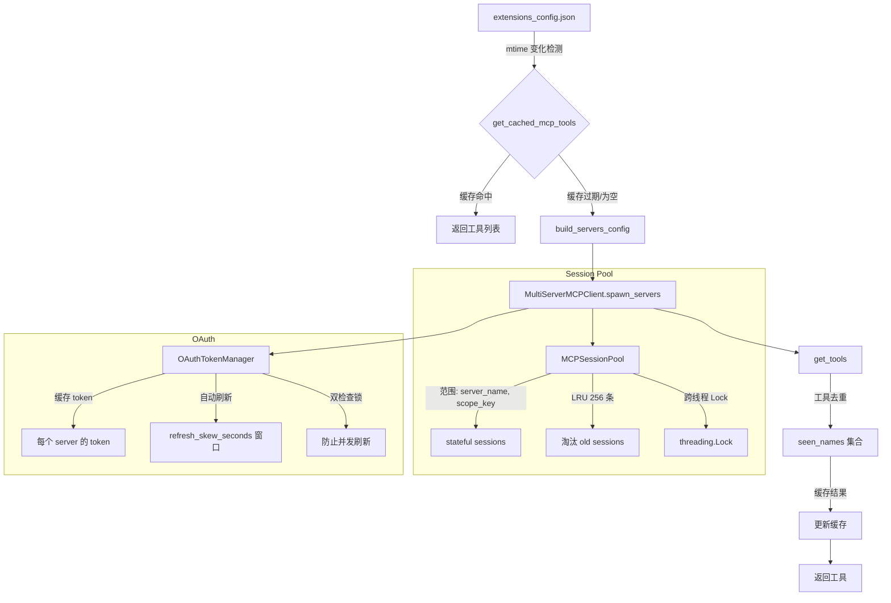
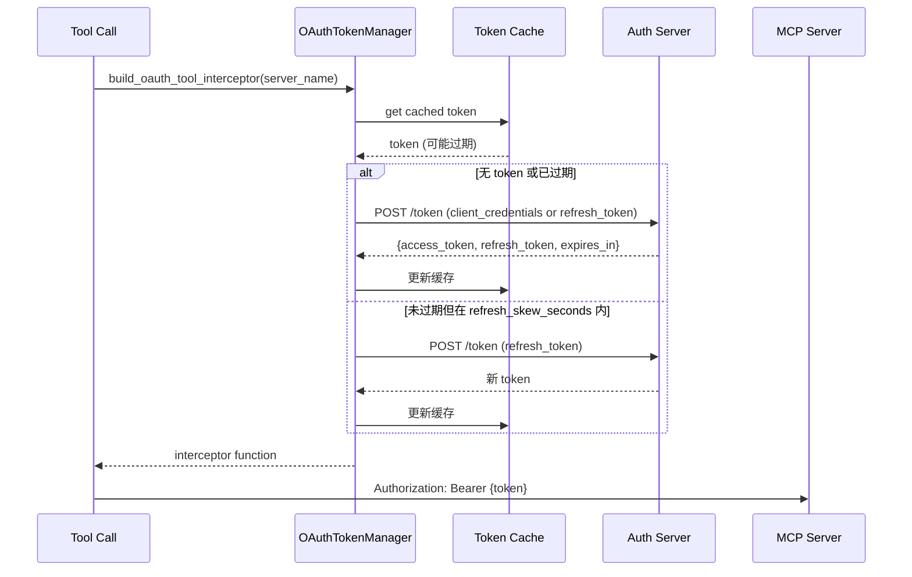

# MCP 深度解析 — Session Pool、OAuth、缓存

## 相关文件

- `deerflow/mcp/cache.py` (316 行) — 惰性初始化、content-signature 缓存失效、跨循环初始化锁
- `deerflow/mcp/oauth.py` (262 行) — OAuth TokenManager、双检查锁、header 注入 + 值合法性检查
- `deerflow/mcp/session_pool.py` (756 行) — 持久会话池，按 `(server_name, scope_key, owning_loop)` 键控、LRU 256 硬上限、跨线程安全
- `deerflow/mcp/headers.py` (103 行) 🆕 同步#6 — 大小写不敏感 header 写入 + 非法 header 值检测（#5010、#5066）
- `deerflow/mcp/context_headers.py` (206 行) 🆕 同步#6 — `headers_from_context` 按请求凭据拦截器（#5010）
- `deerflow/mcp/client.py` (80 行) — 传输类型路由、服务器配置构建（静态 headers 同样过值检查）
- `deerflow/mcp/tools.py` (967 行) — 通过 MultiServerMCPClient 加载工具、stdio 会话池包装、断线重连
- `app/gateway/routers/mcp.py` (~1588 行) 🆕 同步#6 — MCP 管理面：Settings 页后端 API（#5022）

## MCP 工具生命周期全景



## Session Pool (`session_pool.py`)

### 为什么需要持久会话

部分 MCP 服务器是**有状态的**：
- Playwright MCP 在工具调用之间维护浏览器状态
- 数据库 MCP 保持连接池

无会话池的情况下，每个请求都会创建/销毁 MCP 连接，丢失状态并产生不必要的开销。

### 设计

```python
class MCPSessionPool:
    MAX_SESSIONS = 256
    # 每条目: (session, owning_loop, owner_task, close_event)
    _entries: dict[tuple[str, str, asyncio.AbstractEventLoop], ...]
    # in-flight 创建同样按 (server, scope, owning_loop) 键控
```

🆕 同步#6 大改（+472 行）后的键控与生命周期：

- **范围键带 owning loop** — registry 与 in-flight 创建都按 `(server_name, scope_key, owning_loop)` 键控；`scope_key` 通常为 `user_id:thread_id`。同循环调用者共享初始化与状态；活着的兄弟循环绝不因 server/scope 相同就取消或替换彼此的会话（#5396，把会话池按所属事件循环隔离，并移除了旧的 eviction 取消管道）。
- **LRU 256 硬上限，创建与 promotion 两次准入**（#4962）— 不同 key 可以在"看似还有余量"时并发完成初始化，所以除了创建前检查，in-flight 会话被提升（promotion）为 live 时也强制执行容量；被淘汰的 victim 由其所属 loop 上单独跟踪的 teardown task 信号并 drain，**新 owner 绝不 await victim**——victim 卡住的退出不会阻止新会话关闭或断线恢复。
- **`get_session` 取消时清理 in-flight owner**（#5008）— 调用方在驱逐/创建中途被取消时，in-flight owner 会被拆除，不留悬空的半初始化会话。
- **`close_all_sync()` / `close_scope(scope_key)` / `close_session_if_current()`** — 跨循环优雅关闭、按线程清理、仅当注册表里的条目仍是那个失败的具体 `ClientSession` 时才驱逐（断线重连 #5018 的前提）。
- **同步包装每次调用开新循环** — 并行同步调用拥有独立的子进程/server 状态；手动 loop owner 必须在 `loop.close()` 前 drain pending task（`asyncio.run()` 会自动 drain）。

### Stdio 断线重连 🆕 同步#6（#5018）

普通 Agent 工具调用与 durable task 调用收到 MCP SDK 的显式 `Connection closed` 或 AnyIO closed-stream 错误时，只驱逐**注册条目仍是那个失败 `ClientSession`** 的 `(server_name, scope_key)` 会话——旧并发调用的迟到错误不能驱逐它的替代者或新的 in-flight 创建。失败的调用照常上抛原始错误、绝不自动重放；之后的重试创建全新子进程/会话。协议超时、正常 `isError=true` 工具结果、拦截器失败都**不**驱逐健康的有状态会话。

### 任务超时后保留 pooled stdio 会话 🆕 同步#6（#5027）

`McpTaskToolCaller` 的后台 stdio 路径不再"任何异常都 `close_session`"——超时的 status poll 不再把健康的持久会话（连同浏览器等服务器状态）整锅端掉。会话清理改由 `_invoke` 内部按错误类别决定：只有真正的传输断线（上面的 #5018 判定）才驱逐该 scope，普通超时/工具错误保留会话。

### 线程安全

`threading.Lock` 保护所有变更操作。此选择的原因：
1. 工具调用在 `asyncio.to_thread` 中运行（离开主事件循环）
2. MCP 客户端方法可能是同步的
3. 简单的 `asyncio.Lock` 会导致跨线程数据竞争

> 注：`threading.Lock` 守卫池内注册表；**缓存初始化的跨循环 `asyncio.Lock` 是另一个问题**，见 §缓存失效的 #5062。

## OAuth Token 管理 (`oauth.py`)

### 支持的授权类型

| 授权类型 | `grant_type` | 说明 |
|---------|-------------|------|
| `client_credentials` | `"client_credentials"` | 无需刷新 token |
| `refresh_token` | `"refresh_token"` | 初始 token + 自动刷新 |

### Token 生命周期



### 关键设计细节

- **refresh_skew_seconds** — 如果 token 在 skew 窗口内过期，主动刷新以避免竞态
- **双检查锁定模式** (`_lock` + `_refresh_locks[server]`) — 防止多个并发工具调用同时刷新同一 token
- **`get_initial_oauth_headers()`** — 用于 MCP 连接设置，与 tool 调用授权分离
- **值合法性检查** 🆕 同步#6（#5066）— 渲染后的 `<token_type> <access_token>` 整串过 `mcp/headers.py::illegal_header_value_reason`（这是 tool 拦截器、初始发现 headers、durable task 路径共用的唯一取值边界）；token endpoint 返回传输层会拒绝的值时 fail-closed，而不是让 h11 把完整 token 回显进模型可见的工具错误。operator 的静态 `headers` 在 `mcp/client.py::build_server_params` 做同样检查，`build_servers_config` 只丢弃该 server 并记日志。

## 缓存失效 (`cache.py`)

### 惰性初始化

`get_cached_mcp_tools()` 使用惰性加载模式：

```python
_cache: dict | None = None
_cache_mtime: float = 0

async def get_cached_mcp_tools():
    if _cache is None or _is_cache_stale():
        await _init_cache()
    return _cache
```

### 缓存失效检测 🆕 2.1 增强

`_is_cache_stale()` 现在比较 resolved config path **和** `(mtime, size, sha256)` content signature（而非仅 mtime）。这解决了：

- 同秒编辑（same-second edits）
- mtime 不变或倒退（`git checkout`、`cp -p`、backup restore、`tar`/`rsync`、object-store/network mounts）
- 切换到不同 config file（mtime 相同或更旧）

`config/file_signature.py::get_config_signature()` 是共享 helper——`app_config.py::get_app_config()` 也用它做 runtime-editable config 的热重载检测。

### 异步安全初始化

在活跃事件循环内调用 `get_cached_mcp_tools()` 时：
1. 检查 `asyncio.get_event_loop()`
2. 如果循环正在运行但不在异步上下文中 → 使用 `ThreadPoolExecutor` 回退
3. 如果已经在异步上下文中 → 直接调用异步初始化

### 跨循环初始化锁 🆕 同步#6（#5062）

初始化用的 `asyncio.Lock` 如果在 loop A 上创建、却在 loop B 上 await，会直接炸掉 MCP 缓存重建——这正是"Gateway API 热更新 MCP 配置后运行中 worker 重新初始化缓存"踩到的坑。修复后初始化锁按需要的事件循环安全获取/重建，缓存在配置变更后能跨循环正确 re-initialize；若 `initialize_mcp_tools()` 在加载前后观察到 config-signature 变化，丢弃分支也走与会话池退役相同的路径重置工具缓存，避免被放弃连接的 `(server_name, scope_key)` 会话漏进下一次 wrapper 构建。

### 重置集成

`reset_mcp_tools_cache()` 在以下时机被调用：
- 通过 Gateway API 更新 MCP 配置
- `DeerFlowClient.update_mcp_config()`
- 会话池关闭

## 工具加载 (`tools.py`)

`get_mcp_tools()` 流：

```
1. 构建 server params（传输类型路由：stdio/sse/http）
2. 构建拦截器（OAuth header 注入）
3. 实例化 MultiServerMCPClient
4. 调用 client.get_tools() → 返回 List[StructuredTool]
```

所有 MCP 工具都包装为标准 LangChain `StructuredTool` 对象，与 DeerFlow 工具注册管道完全兼容。

## 传输类型

| 类型 | `type` 值 | 示例 |
|------|----------|------|
| **stdio** | `"stdio"` | 本地命令：`command: python`, `args: [-m, my_mcp]` |
| **SSE** | `"sse"` | 远程 SSE：`url: https://mcp.example.com/sse` |
| **HTTP** | `"http"` | 远程 HTTP：`url: https://mcp.example.com/mcp` |

OAuth 支持目前仅用于 `sse` 和 `http` 传输类型。

---

## MCP Routing Hints 🆕

`extensions_config.json` 里的 `mcpServers.<server>.routing` 和 `tools.<name>.routing` 是软偏好元数据，不在 middleware 层硬禁用 tools：

- `routing.mode="prefer"` → 生成 `<mcp_routing_hints>` prompt 引导
- 当 tool 被 deferred 且有 routing metadata 时，`McpRoutingMiddleware` 自动提升匹配的 deferred schema（before model call）
- `tool_search.auto_promote_top_k`（默认 3，1-5）控制提升广度
- Routing hints 只在 `tool_search.enabled=true` 时生效

## Per-Server `tool_call_timeout` 🆕

每个 MCP server 独立超时配置：`mcpServers.<server>.tool_call_timeout`（秒）。覆盖全局默认值。

## Per-Server `tool_name_prefix` 🆕

**同步 #4（`feat: support per-server MCP tool name prefixes (#4624)`）**：`mcpServers.<server>.tool_name_prefix` 默认 `true`，保留碰撞安全的 `<server_name>_` 前缀。工具已自带稳定 namespace 的 server 可设 `false`；discovery 时按该 server 的 flag 调用 `load_mcp_tools`。来源路由（routing/session-pool 包装）基于生产 server 和 transport，不看可见工具名是否带 server 前缀。

## Auto-Promote Deferred MCP Tools 🆕

`McpRoutingMiddleware` 在每次 model call 前：
1. 匹配 latest `HumanMessage` 与 deferred MCP tool 的 routing keywords
2. 最多提升 `auto_promote_top_k` 个 matching schema
3. 写入 `ThreadState.promoted`（hash-scoped，per-run）
4. 永远不执行 tool，只做 schema promotion

---

## 请求级凭据映射为 MCP HTTP/SSE headers 🆕 同步#6（#5010）

`user_auth` 把凭据绑到**已配置**的 DeerFlow 用户；当凭据由调用方在请求时才决定（多租户网关、每次 run 换 API key）时，就得一个凭据一条 server 配置。新模块补上这个缺口：

### 配置（`McpContextHeadersConfig`）

```yaml
mcpServers:
  my_server:
    headers_from_context:
      enabled: true
      headers:
        Authorization: api_key        # header 名 → config.context.secrets 里的 key
      on_missing: deny                # deny（默认）| passthrough
```

配置里只存**名字**，不存凭据——凭据随 run request 的 `config.context.secrets` 带外到达，绝不进 prompt、工具参数或 trace。Gateway GET 不掩码这个块（没有敏感值），PUT 原样替换；块内 `extra="allow"` 的敏感 key 照常掩码并从存量恢复。

### 拦截器（`context_headers.py::build_context_headers_interceptor`）

- 只对 `sse`/`http` 生效；stdio 声明会 warn-and-skip（与 `user_auth` 一致——stdio 池把重写 header 当 call meta 转发，凭据无处可去）。
- 每次调用从 `request.runtime`（LangGraph 工具节点注入到名为 `runtime` 的参数）→ ambient `get_runtime()` 解析 run context，读 `config.context.secrets`。**不要**用 `langgraph.config.get_config()["context"]`：run context 挂在 runtime 上、不随 `RunnableConfig` 传给子 runnable，工具调用里那个 key 是 `None`。
- **fail-closed**：映射 key 缺失或解析为空 → `ToolException`，只暴露 key 名不暴露值；`on_missing: "passthrough"` 才回退。
- **凭据不能作为 HTTP header value 传输时一律拒绝** 🆕（#5066）：换行/首尾空白/非 ASCII（`headers.py::illegal_header_value_reason`）→ 无论 `on_missing` 都拒绝。原因：h11 拒绝换行/首尾空白时会把**完整值**放进异常消息，`ToolErrorHandlingMiddleware` 会把它复制进模型可见 ToolMessage——凭据就进了 prompt、checkpoint 和 trace；非 ASCII 在 httpx 里报 `UnicodeEncodeError`（只点名字符），提前拒绝买到的是可操作错误。
- **声明了 `task_toolsets` 的 server 会收到启动警告**：durable task 的 status/cancel poll 跑在 Agent run 结束之后、没有请求 secrets，走 server 自己的静态/OAuth 凭据；只有 submit（在 Agent run 内）带映射 headers。详见 [durable-tasks.md](durable-tasks.md) §4.2。

### 大小写不敏感 header 写入（`headers.py`）

HTTP 字段名大小写不敏感（RFC 9110 §5.1），但从配置到传输的每个字典都是大小写**敏感**的：`langchain_mcp_adapters` 用 `{**static, **override}` 平铺合并，静态 `authorization` 和注入的 `Authorization` 会共存上线，单值读取的 server 拿到**第一个**——恰好是本该被替换的静态条目，静默反转上面的优先级。所有凭据拦截器（OAuth、user_auth、context_headers）因此统一走 `apply_header_overrides`：按 `header_spellings` 钉住连接已有的拼写、删掉仅大小写不同的 key，`headers_from_context.headers` 在配置加载时还拒绝同一 header 的两种拼写。

### 拦截器优先级（`interceptors.py`）

注册顺序 **OAuth → user_auth → headers_from_context → 自定义 `mcpInterceptors`**，onion 组合下后注册者更靠近 transport，所以最终 header 优先级：静态 `headers` < `oauth` < `user_auth` < `headers_from_context`。

---

## Settings 页管理 MCP servers 🆕 同步#6（#5022，`routers/mcp.py`）

MCP server 管理从"整包替换 config"升级为 Settings 页的逐 server CRUD。`app/gateway/routers/mcp.py`（本轮 +715 行）在原 `GET /api/mcp/config`、`PUT /api/mcp/config`、`POST /api/mcp/cache-reset` 之上新增：

| 端点 | 行为 |
|------|------|
| `POST /api/mcp/servers` | 批量新增 server（`McpConfigUpdateRequest`） |
| `PUT /api/mcp/servers/{name}` | 更新单个 server 的完整配置 |
| `DELETE /api/mcp/servers/{name}` | 删除单个 server |
| `PATCH /api/mcp/servers/state` | 只翻一个 server 的 `enabled` 位；启用时才做目标校验 |

要点：

- **写入走 raw read-modify-write**（与 skills toggle 共享 `read_raw_extensions_config` / `validate_raw_extensions_config` helper）：候选先按运行时加载方式校验，再原子写盘——`$ENV_VAR` 引用绝不会被解析值覆盖回文件（#5357 把这条规则收拢到一处，并删掉了不安全的 `to_file_dict()`）。
- **GET 掩码 / PUT 回程保真**：`user_auth.users` 的值、`env` 里的敏感变量等被 `_mask_server_config` 掩码；PUT 回来的掩码值通过 `_merge_preserving_secrets` 还原为存量凭据，而不是把 `***` 写进文件。
- **stdio 启动策略（HTTP 边界）**：API 注册的 stdio server 必须 (a) command 是裸允许名单可执行文件（`{npx, uvx}` + `DEER_FLOW_MCP_STDIO_COMMAND_ALLOWLIST`，拒路径分隔符/空白/shell 元字符）；(b) 无任意 exec 类 `args` flag（按 launcher 各自的 option grammar 精确界定，npx/uvx 只扫自己的 option 区）；(c) 不设置无条件执行代码的 `env` 名（`PYTHONPATH` 等；`LD_LIBRARY_PATH` 类条件搜索路径是声明接受的残余）。PUT 与 PATCH 的启用分支共用 `_validate_mcp_update_request`。这是纵深防御而非信任边界——`npx`/`uvx` 本来就会拉取执行远端包，边界仍是 admin 认证 + 网络可达性。
- **缓存重置按 worker 收敛**：两个写端点的 reset 只清自己 worker 的缓存，其他 worker 靠 content-signature 检测自行失效（见 §缓存失效）。

---

## Parallel Search server（可选集成）🆕 同步#6（#5028、#5501）

`extensions_config.example.json` 新增默认关闭的 `parallel-search` 条目：`https://search.parallel.ai/mcp`（HTTP 传输），带前缀后模型可见 `parallel-search_web_search` / `parallel-search_web_fetch`。启用方式：复制条目到本地 `extensions_config.json` 的 `mcpServers` 并置 `"enabled": true`，重启生效。

- **匿名访问**：默认无需 API key；搜索调用会把 objectives/查询、fetch 会把 URL 与抽取目标发给 Parallel.ai（可能含会话内容），文档明确要求知情启用。
- **UA 标识**（#5501）：条目 `headers` 携带 `"User-Agent": "deer-flow"`——稳定的**项目级**身份，供 Parallel 度量聚合采用情况，不标识个人用户或安装；传输方式变化时应保留。可选的 `Authorization: $PARALLEL_AUTHORIZATION`（环境变量需含完整 `Bearer <key>`，DeerFlow 只展开整串 `$ENV_VAR`）用于更高限额，去掉它即回到匿名。
