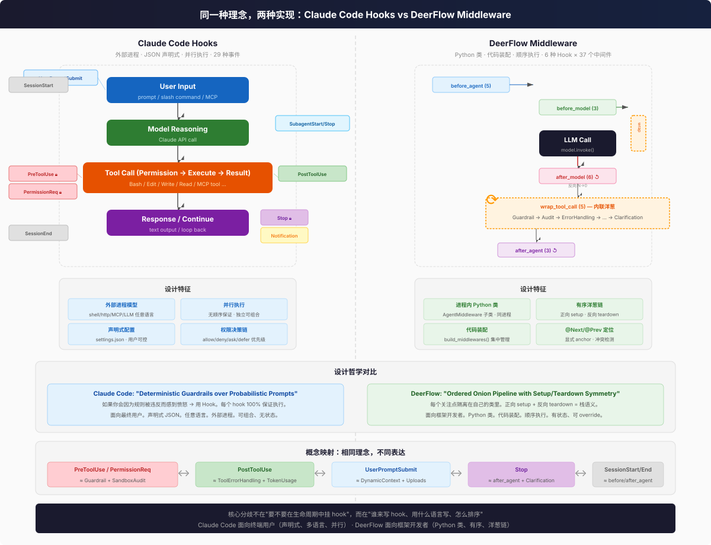
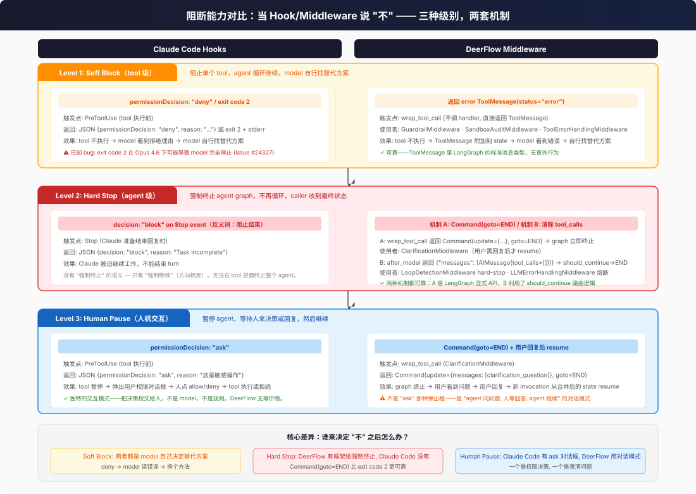

# Claude Code Hooks vs DeerFlow Middleware

同一种理念，两种实现。两者都在 Agent 生命周期的关键节点挂入自定义逻辑，但面向不同的用户、用不同的方式。



## 为什么这个对比很重要

当你已经熟悉一个概念时，理解新概念最快的方式就是**找映射**。如果你用过 Claude Code 的 Hooks，DeerFlow 的 Middleware 就是同一件事的不同实现——就像你学会了 Express.js 的 middleware，再看 Django 的 middleware 就不会从零开始。

**DeerFlow 本身没有独立的 "Hooks" 概念。** Hooks 就长在 Middleware 里面——6 个 hook 方法（`before_agent`、`wrap_tool_call` 等）定义在 `AgentMiddleware` 基类上，每个 middleware 子类选择自己要 override 哪几个。这和 Claude Code 不同：Claude Code 的 hook 是**独立的 JSON 条目**（"当 PreToolUse 事件触发时，跑这个 shell 脚本"），不依附于任何 middleware 类。

| 概念 | Claude Code | DeerFlow |
|------|------------|----------|
| **Hook** | 独立实体：JSON 配置中的一个条目，指定事件 + 处理命令 | 依附于 Middleware：`AgentMiddleware` 基类上的方法，由子类 override |
| **Middleware** | 不存在这个概念 | 核心抽象：包装多个 hook 方法的 Python 类，按顺序排列成链 |
| **Hook 和 Middleware 的关系** | 没有 middleware 层——hook 直接注册到事件上 | 一个 middleware = 一组相关 hook 的容器（如 SandboxMiddleware 同时 override `before_agent` 和 `after_agent`） |

**简单说：** Claude Code 是"事件 → 处理脚本"的扁平映射，DeerFlow 是"事件 → Middleware 链 → 每个 Middleware 内部决定响应哪些 hook"的两层结构。DeerFlow 多了一层抽象（middleware 类），换来的是更好的组织性（相关 hook 封装在一起）和顺序控制。

## 一句话对比

| | Claude Code Hooks | DeerFlow Middleware |
|---|---|---|
| **面向谁** | 终端用户、团队 | 框架开发者、平台团队 |
| **怎么配** | JSON 文件（`settings.json`） | Python 代码（`_build_middlewares()`） |
| **怎么写** | 任意语言（shell/Python/Node/HTTP/MCP） | Python `AgentMiddleware` 子类 |
| **怎么跑** | 外部进程（stdin JSON → stdout JSON） | 进程内 Python 对象 |
| **怎么排** | 并行（无顺序保证） | 顺序链（正向 setup / 反向 teardown） |
| **多少个** | 29 种事件 | 6 种 hook 点 |
| **多少个处理者** | 用户定义，无上限 | 29 个内置 + 用户可追加 |
| **能阻塞吗** | 能（exit code 2） | 能（不调 handler()） |
| **能修改输入吗** | 能（`updatedInput`） | 能（`request.override()`） |
| **能注入上下文吗** | 能（`additionalContext`） | 能（返回 `{"messages": [...]}`） |

## 概念映射

Claude Code 的 29 种事件可以映射到 DeerFlow 的 6 种 hook 点：

| Claude Code 事件 | ≈ DeerFlow Hook | 说明 |
|---|---|---|
| `UserPromptSubmit` | `before_agent` / `before_model` | 用户输入前注入上下文 |
| `UserPromptExpansion` | （无直接对应） | 斜杠命令展开是 Claude Code 特有 |
| `PreToolUse` | `wrap_tool_call` (Guardrail, SandboxAudit) | Tool 执行前校验/拒绝 |
| `PermissionRequest` | `wrap_tool_call` (Guardrail) | 权限决策 |
| `PostToolUse` | `wrap_tool_call` (ToolErrorHandling) + `after_model` (TokenUsage) | Tool 执行后处理 |
| `PostToolUseFailure` | `wrap_tool_call` (ToolErrorHandling) | Tool 失败兜底 |
| `PostToolBatch` | （无直接对应） | DeerFlow tool 是逐个执行的 |
| `Stop` | `after_model` (无 tool_calls 分支) + `after_agent` | Agent 结束处理 |
| `StopFailure` | （无直接对应） | API error 终止是 Claude Code 特有 |
| `SubagentStart` / `SubagentStop` | （无直接对应，subagent 自己有一套 middleware 链） | 子 agent 生命周期 |
| `SessionStart` / `SessionEnd` | `before_agent` / `after_agent` | 会话生命周期 |
| `PreCompact` / `PostCompact` | `before_model` (Summarization) | 上下文压缩 |
| `Notification` | （无直接对应） | UI 通知是 Claude Code 特有 |
| `InstructionsLoaded` | `before_agent` (DynamicContext) | 加载系统指令 |
| `PermissionDenied` | `wrap_tool_call` 被拒绝后 | 权限被拒绝 |
| `CwdChanged` / `FileChanged` | （无直接对应） | 文件监控是 Claude Code 特有 |
| `WorktreeCreate` / `WorktreeRemove` | （无直接对应） | Worktree 是 Claude Code 特有 |

**核心差异：** Claude Code 把同一个 lifecycle 点拆得更细（`PreToolUse`、`PermissionRequest`、`PostToolUse`、`PostToolUseFailure` 是 4 个独立事件），DeerFlow 把它们合并到 `wrap_tool_call` 一个 hook 中，靠 middleware 顺序区分职责。

## 阻断能力对比：当 Hook/Middleware 说 "不"

监听（observing）很简单——在事件上挂一个 side effect，打印日志、发通知、记录指标，不改变任何东西。但 hooks 和 middleware 的真正力量不在于 "看"，而在于 **"说不"**——打破控制流，阻止执行，强制 agent 停下或换方向。

这才是架构上真正的考验：**每个系统给了你什么 primitive 来打破 flow？打断之后会发生什么？agent 停了还是继续？model 知道发生了什么吗？**



### Claude Code 的阻断能力

Claude Code 在三个层级上提供了阻断：

#### Level 1: Soft Block（tool 级拒绝）

**机制：** `permissionDecision: "deny"` 或 exit code 2 + stderr

Hook 在 `PreToolUse` 事件上运行，返回 `{permissionDecision: "deny", reason: "..."}` 或以 exit code 2 退出。Tool 不执行，但 agent 循环继续。Model 看到拒绝理由（通过 stderr 或 reason 字段），自行决定替代方案——换个 tool、换个参数、换个策略。

**已知 bug：** exit code 2 在 Opus 4.6 下可能导致 model **完全停止**而非继续寻找替代方案（[issue #24327](https://github.com/anthropics/claude-code/issues/24327)）。这是一个严重缺陷——soft block 的语义是 "换个方法"，但实际行为可能变成 "整个 agent 停了"。

#### Level 2: Hard Stop（agent 级终止）

**机制：** 不存在真正的 "强制终止"

Claude Code **没有**框架级的强制终止原语。最接近的是 Stop 事件上的 `decision: "block"`，但语义是**反的**——它不是 "停止 agent"，而是 "阻止 agent 结束"，强迫 Claude 继续工作。用 "block" 这个词表示 "阻止结束"，方向相反。

当你想让 agent 停下来时，Claude Code 没有显式的 "stop right now" 机制。你只能 deny tool 然后靠 model 自己决定停止——这不叫 "强制终止"，叫 "等 model 自己想通"。

#### Level 3: Human Pause（人机交互）

**机制：** `permissionDecision: "ask"`

这是 Claude Code 最独特的阻断模式。Tool 暂停执行，弹出用户权限对话框，**把决策权交给人**——不是 model，不是规则。用户点击 Allow 或 Deny 后，tool 执行或跳过，agent 继续。这和人机协作的安全模型一致：关键操作由人把关。

Agent 的目标是完成用户的请求 → 执行命令；Hook 说 "你应该问一下" → 弹对话框；用户说 "行/不行" → 命令执行或跳过；Agent 继续循环 — 它不需要知道 "为什么这个要问，那个不用问"，它只需要知道结果。

### DeerFlow 的阻断能力

DeerFlow 同样在三个层级上提供了阻断，但实现方式不同：

#### Level 1: Soft Block（tool 级拒绝）

**机制：** 返回 error `ToolMessage(status="error")` 从 `wrap_tool_call`

Middleware 的 `wrap_tool_call` 不调用 `handler(request)`，直接返回 `ToolMessage(status="error", content="原因")`。Tool 不执行。ToolMessage 作为标准 LangGraph 消息附加到 state。Model 在下一次 model 调用时看到这个 error 消息，自行决定替代方案。

**使用者：** GuardrailMiddleware（权限校验拒绝）、SandboxAuditMiddleware（危险命令匹配）、ToolErrorHandlingMiddleware（tool 执行异常后返回 error 消息）

**对比 Claude Code：** 策略相同——都是让 model 看到错误然后自己换方案。区别是 DeerFlow 用 LangGraph 标准消息类型（`ToolMessage`），没有 Claude Code exit code 2 的那种意外行为。

#### Level 2: Hard Stop（agent 级终止）

DeerFlow 有**两种**框架级强制终止机制：

**机制 A：`Command(goto=END)` 从 `wrap_tool_call`**

Middleware 返回 `Command(update={...}, goto=END)`，graph 立即跳转到 END 节点，agent 终止。这是 LangGraph 的显式 API，可靠且无歧义。

**使用者：** ClarificationMiddleware——拦截 `ask_clarification` tool call，不执行 tool，直接终止 graph，向用户展示澄清问题，等待用户回复后新 invocation resume。

**机制 B：清除 `tool_calls` 在 `after_model`**

Middleware 在 `after_model` 中返回 `{"messages": [AIMessage(tool_calls=[])]}`，覆盖原 AIMessage 的 tool_calls。`should_continue` 路由检测不到 tool_calls，路由到 END。看起来像是 agent "自然结束"——model 没说要调 tool，所以停了。实际上是被 middleware 强制停止的。

**使用者：** LoopDetectionMiddleware hard-stop（检测到重复 tool call 循环后清除 tool_calls）、LLMErrorHandlingMiddleware 熔断（连续失败后强制停止）

**对比 Claude Code：** DeerFlow 的两种机制都是真正意义上的 "agent 终止"。Claude Code 没有等价物——它的 `decision: "block"` 是阻止结束（方向相反），exit code 2 有意外行为的 bug。`Command(goto=END)` 比 exit code 2 可靠得多。

#### Level 3: Skip Model Call（跳过 LLM 调用）

**机制：** `wrap_model_call` 直接返回 AIMessage，不调用 `handler(request)`

Middleware 的 `wrap_model_call` 不进入下一层洋葱，直接返回一个 AIMessage。Model 从未被调用。这是 Claude Code 没有的能力——当你想让 agent "闭嘴" 时（如熔断、限流），不是阻止 tool，而是跳过整个 model 调用。

**使用者：** LLMErrorHandlingMiddleware（circuit breaker 打开时返回预置错误消息）

### 阻断能力对照表

| 阻断级别 | Claude Code | DeerFlow |
|---------|------------|----------|
| **阻止单个 tool，循环继续** | `permissionDecision: "deny"` / exit 2 | 返回 error `ToolMessage(status="error")` |
| **强制终止 agent** | 无（`decision: "block"` 是阻止结束，方向相反） | 机制 A: `Command(goto=END)` / 机制 B: 清除 `tool_calls` |
| **暂停等待用户** | `permissionDecision: "ask"` → 弹出对话框 | `Command(goto=END)` → graph 中断 → 用户回复 → resume |
| **跳过 model 调用** | 无 | `wrap_model_call` 返回 AIMessage（不调 handler） |

### 核心差异

**1. 强制终止的能力**

这是两者最大的分歧。DeerFlow 有 `Command(goto=END)` 和清除 tool_calls 两种框架级强制终止机制——agent **被**终止，不是 agent **自己决定**终止。Claude Code 没有等价能力。exit code 2 的语义是 "拒绝这个 tool"，不是 "终止 agent"；`decision: "block"` 的语义是 "不许结束"，方向相反。

**2. 人机交互的模式**

Claude Code 的 `permissionDecision: "ask"` 是**权限决策对话框**——"这个操作敏感，你要不要让它执行？" DeerFlow 的 `Command(goto=END)` 是**对话模式**——"agent 问了用户一个问题，等用户回答，然后继续"。前者把决策权交给人（allow/deny），后者把对话权交给人（回答问题）。它们是不同的交互模式，解决不同的问题。

**3. Soft block 的一致性**

两者在 soft block 层面策略相同——返回错误让 model 看到，model 自己决定替代方案。区别在于可靠性：DeerFlow 的 `ToolMessage` 是 LangGraph 的标准消息类型，行为可预测；Claude Code 的 exit code 2 在特定 model 版本下有意外行为。

**4. 阻断之后的可见性**

Claude Code 的所有阻断都通过相同的 JSON/stderr 通道告知 model。DeerFlow 的阻断发生后，state 中的消息就是接下来 model 看到的全部上下文——A 机制把澄清问题注入消息列表，B 机制把 error ToolMessage 包好放到 AIMessage 后面。没有额外的 "系统频道" 来解释 "为什么 agent 停了"。

### 阻断决策流

```
Soft Block（tool 级）——两者相同:
  请求 → hook/middleware 检查 → 拒绝 → 返回错误 → model 看到错误 → model 决定替代方案 → 循环继续

Hard Stop（agent 级）——DeerFlow 独有:
  请求 → middleware 检查 → Command(goto=END) 或 清除 tool_calls → graph 终止 → 返回给 caller

Human Pause（人机交互）——两种模式:
  Claude Code: 请求 → hook 检查 → permissionDecision: "ask" → 弹出对话框 → 人决定 allow/deny → tool 执行或跳过
  DeerFlow:   请求 → middleware 检查 → Command(goto=END) → graph 终止 → 用户回复 → 新 invocation resume
```

## 设计哲学对比

### Claude Code: Deterministic Guardrails

> "If you'd be angry when a rule is violated, make it a hook. If you'd be mildly annoyed, put it in CLAUDE.md."

核心理念：**确定性 > 概率性**。模型可能忽略 prompt 中的规则，但 hook 100% 执行。

- **外部进程模型** — hook 是独立进程，通过 stdin/stdout JSON 通信。隔离性好，hook 崩溃不影响 agent。
- **并行执行** — 同一事件的所有匹配 hook 并行运行，互不阻塞。适合独立校验。
- **声明式配置** — 用户在手写 JSON，不在代码里写装配逻辑。接入门槛极低。
- **多语言** — shell script、Python、Node、HTTP webhook、MCP tool、LLM prompt、subagent 都能做 hook。
- **权限决策链** — `deny > defer > ask > allow` 优先级，多个 hook 的结果自动合并。

### DeerFlow: Ordered Onion Pipeline

> 正向 setup、反向 teardown、洋葱组合。middleware 是栈，不是链。

核心理念：**顺序 > 并行**。middleware 之间有依赖关系，必须按特定顺序执行。

- **进程内 Python 类** — 零序列化开销，共享内存。但 middleware bug 可能影响 agent 稳定性。
- **顺序执行** — 洋葱组合（`wrap_*`）+ 正向/反向图节点（`before_*`/`after_*`）。设计保证 setup/teardown 对称。
- **代码装配** — 顺序硬编码在 `_build_middlewares()` 中。一目了然，但不够"开放"。
- **Python only** — 必须继承 `AgentMiddleware`。类型安全但限制了实现语言。
- **@Next/@Prev 定位** — 显式声明位置相对于已知 anchor，带冲突检测。比 Claude Code 的"无顺序保证"精确但使用门槛高。

## 互相可以学什么

### Claude Code → DeerFlow

1. **声明式配置层** — DeerFlow 的 middleware 装配全在 Python 代码里。加一层类似 `hooks.json` 的 YAML 声明式配置，让非 Python 用户也能开关/配置 middleware。
2. **外部进程隔离** — 第三方 middleware 如果跑在子进程中，它的崩溃不会拖垮整个 agent。DeerFlow 目前没有 middleware 间的错误隔离。
3. **权限决策优先级链** — Claude Code 的 `deny > defer > ask > allow` 多级决策比 DeerFlow 的 allow/deny 二元更细粒度。
4. **更多生命周期事件** — DeerFlow 的 6 种 hook 比较粗。Claude Code 的 29 种事件覆盖了很多 DeerFlow 没有的点（文件监控、权限拒绝、指令加载）。

### DeerFlow → Claude Code

1. **有序执行** — Claude Code 的并行执行语义导致 "没有顺序保证"。当 hook 之间有依赖关系时（"先校验权限，再审计命令"），并行模型迫使用户把逻辑塞进一个 hook 脚本。DeerFlow 的顺序链更清晰。
2. **洋葱组合** — `wrap_model_call`/`wrap_tool_call` 的嵌套 callable 模式让 middleware 同时看到 request 和 response。Claude Code 用 `PreToolUse` + `PostToolUse` 两个分离事件来实现类似效果，但不如洋葱模式直观。
3. **位置声明** — `@Next(GuardrailMiddleware)` / `@Prev(ClarificationMiddleware)` 比 Claude Code 的 "所有 hook 并行" 更精确。如果 Claude Code 支持 `@After(PreToolUse)` 或 `@Before(PostToolUse)` 定位，体验会更好。
4. **框架内置 hook** — Claude Code 的 hook 全由用户定义，没有内置的。DeerFlow 的 29 个内置 middleware 提供了开箱即用的安全/观测/资源管理能力。

## 为什么理念如此相似？

因为两者解决的问题是**同构的**：

```
Agent = Model + Tools 的循环
Hook/Middleware = 在这个循环的关键节点插入自定义逻辑
```

这是 Agent 架构的必然需求。不管是 Claude Code 的 "我是一个 CLI 工具，用户需要 guardrails" 还是 DeerFlow 的 "我是一个框架，平台团队需要 extensibility"，只要你的系统是 Model→Tools 循环，你就需要一个机制在循环节点上挂逻辑。

**这不是谁抄谁——而是 Agent 架构的内在规律。** 就像 Web 框架都有 middleware（Express、Django、Flask、Rails），Agent 框架也会有。只是 Claude Code 选择了"给用户最大的自由（任何语言、任何进程）"，DeerFlow 选择了"给开发者最强的控制（有序洋葱链、类型安全的 Python 类）"。

## 关键差异的根源

Claude Code 是一个 **CLI 产品**，DeerFlow 是一个 **Python 框架**。这个身份决定了所有差异：

| 因为是... | 所以... |
|---|---|
| CLI 产品 | hook 用 JSON 配置，用户手写就行 |
| CLI 产品 | hook 是外部进程，用 stdin/stdout 通信 |
| CLI 产品 | 并行执行，不阻塞用户 |
| Python 框架 | middleware 是 Python 类，类型安全 |
| Python 框架 | middleware 在进程内，零序列化开销 |
| Python 框架 | 顺序链，保证 setup/teardown 对称 |
