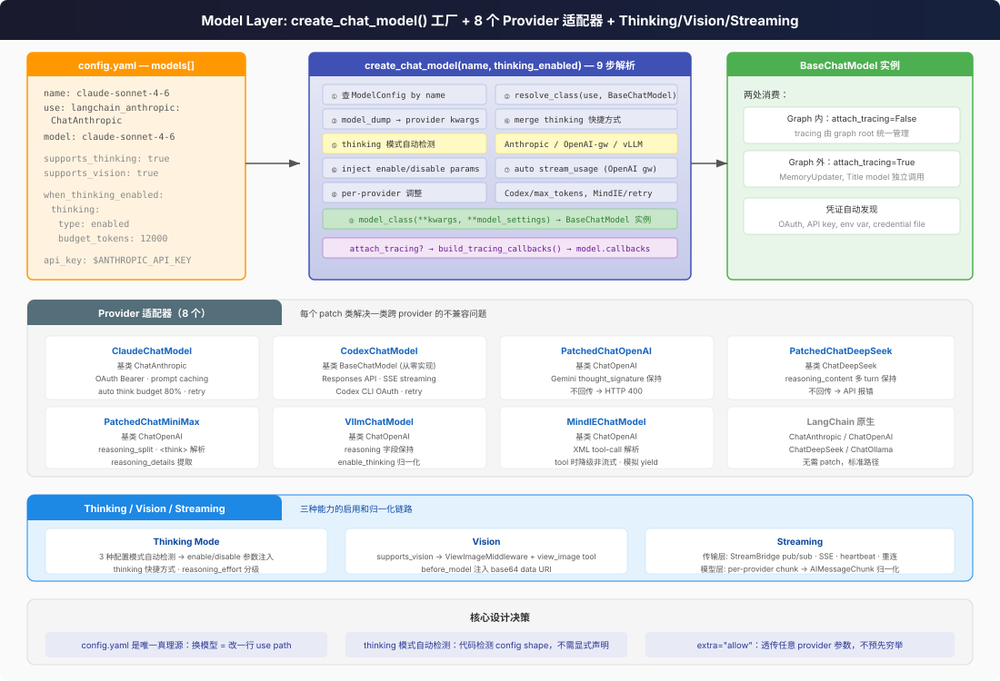

# Model Layer 全景

怎么做到换模型不改代码？thinking/vision 这些新能力怎么统一抽象？这层只有一个公开 API — `create_chat_model()` — 但背后藏着 7 个 DeerFlow 自定义适配器（加上 2 个标准 LangChain 直通路径共 9 条 provider 路由）、3 种 thinking 配置模式、per-provider 的 streaming 归一化。



## 入口处思考

| 我想... | 去哪里 |
|---------|--------|
| 加一个新模型（如 DeepSeek、Qwen） | `config.yaml` → `models[]`，写 `use` + `model` + `api_key` |
| 开关 thinking mode | `config.yaml` → `models[].supports_thinking: true` → 运行时传 `thinking_enabled` |
| 让模型能看图 | `config.yaml` → `models[].supports_vision: true` |
| 用自己的 OAuth token 调 Claude | 设 `CLAUDE_CODE_OAUTH_TOKEN` 环境变量，用 `ClaudeChatModel` provider |
| 接 vLLM 自部署的 Qwen | `use: deerflow.models.vllm_provider:VllmChatModel` + 配 chat_template_kwargs |
| 看 token 用量为什么是 0 | 检查是否用了自定义 base_url — `stream_usage` 可能需要显式开 |

## 核心 API：`create_chat_model()`

```python
# factory.py:50
def create_chat_model(
    name: str | None = None,          # None → 用 config.models[0]
    thinking_enabled: bool = False,    # 运行时开关
    *,
    app_config: AppConfig | None = None,
    attach_tracing: bool = True,       # 独立调用者保持 True，graph 内调用者必须传 False
    **kwargs,                          # 透传：reasoning_effort 等
) -> BaseChatModel:
```

这就是全部公开接口。`deerflow.models` 模块只 export 这一个函数。

## ModelConfig Schema

`config.yaml` 里每个 model 条目对应的 Pydantic model（`model_config.py`）：

| 字段 | 类型 | 说明 |
|------|------|------|
| `name` | `str` | 唯一标识，`create_chat_model("gpt-4")` 按这个找 |
| `use` | `str` | provider class path，如 `langchain_openai:ChatOpenAI` |
| `model` | `str` | 传给 provider 的 model name，如 `gpt-4o` |
| `supports_thinking` | `bool` | 是否支持 extended thinking |
| `supports_reasoning_effort` | `bool` | 是否支持 reasoning_effort 分级 |
| `supports_vision` | `bool` | 是否支持图片输入 |
| `when_thinking_enabled` | `dict\|None` | thinking 开启时注入的额外参数 |
| `when_thinking_disabled` | `dict\|None` | thinking 关闭时注入的额外参数（优先级高于自动检测） |
| `thinking` | `dict\|None` | 快捷方式，等价于 `when_thinking_enabled.thinking` |
| `use_responses_api` | `bool\|None` | OpenAI `/v1/responses` 替代 Chat Completions |
| `output_version` | `str\|None` | Responses API 的 structured output 版本 |
| `extra="allow"` | — | 允许透传任意 provider 参数（`api_key`, `base_url`, `temperature`, `max_tokens`...） |

`extra="allow"` 是关键设计——config.yaml 里可以写任何 provider 需要的参数（`api_key: $OPENAI_API_KEY`, `base_url: https://...`, `temperature: 0.7`），Pydantic 不会拒绝，factory 会把它们全部传给 model 构造函数。

## Provider 适配器全景

DeerFlow 不是简单地把 LangChain 的 ChatModel 包一层——它在 8 个 provider 上做了**针对性的 patch**，解决跨 provider 的不兼容问题：

| Provider | Class | 基类 | 核心 patch |
|----------|-------|------|-----------|
| **Anthropic (API Key)** | `langchain_anthropic:ChatAnthropic` | ChatAnthropic | 标准路径，无额外 patch |
| **Anthropic (OAuth)** | `ClaudeChatModel` | ChatAnthropic | OAuth Bearer token、prompt caching、auto thinking budget (80% max_tokens)、rate-limit retry |
| **OpenAI** | `langchain_openai:ChatOpenAI` | ChatOpenAI | 标准路径，支持 Responses API |
| **OpenAI Codex** | `CodexChatModel` | **BaseChatModel**（从零实现） | 直接调 `chatgpt.com/backend-api/codex/responses`，Responses API 格式，SSE streaming |
| **Gemini (via OpenAI gateway)** | `PatchedChatOpenAI` | ChatOpenAI | 保留 `thought_signature` 跨 turn——不保留则 HTTP 400 |
| **DeepSeek** | `PatchedChatDeepSeek` | ChatDeepSeek | 保留 `reasoning_content` 跨 turn——不保留则 API 报错 |
| **MiniMax** | `PatchedChatMiniMax` | ChatOpenAI | 强制 `reasoning_split=true`，解析 inline `<think>` 标签 |
| **vLLM / Qwen** | `VllmChatModel` | ChatOpenAI | 保留非标 `reasoning` 字段，`enable_thinking` 归一化 |
| **MindIE** | `MindIEChatModel` | ChatOpenAI | XML tool-call 解析、tool 时降级非流式、转义换行解码 |

### 为什么要 patch？

LLM provider 各自实现了 thinking/reasoning 的返回格式，互不兼容：

- **Anthropic** 把 thinking 放在 `content[0].thinking` — 这是标准路径
- **DeepSeek** 把 reasoning 放在 `additional_kwargs.reasoning_content` — 多 turn 时必须回传
- **Gemini** 把思考签名放在 `additional_kwargs.thought_signature` — 不回传就 HTTP 400
- **vLLM** 给 assistant message 加了非标 `reasoning` 字段 — 必须手动保留
- **MiniMax** 把 reasoning 包在 `<think>` 标签里 — 需要解析提取
- **MindIE** 工具调用用 XML 格式 `<tool_call>`/`<tool_response>` — 与 LangChain 的 function-call 格式不同

每个 patch 类的核心职责就是：**把 provider 特有的格式翻译成 LangChain 标准格式，并在多 turn 对话中保持这些特有字段不丢失。**

### 标准 LangChain 直通路径（无需 DeerFlow 适配器）

`config.example.yaml` 中预配置了以下可直接使用的 provider 路由，使用标准 LangChain 类，无需 DeerFlow patch：

| Provider | `use` 值 | 说明 |
|----------|---------|------|
| **Ollama** | `langchain_ollama:ChatOllama` | 支持 thinking（通过 `reasoning_effort`），适合本地模型 |
| **Google Gemini (原生 SDK)** | `langchain_google_genai:ChatGoogleGenerativeAI` | 使用 Google 原生 SDK 而非 OpenAI 网关 |
| **OpenRouter** | `langchain_openai:ChatOpenAI` + `base_url` | 标准 OpenAI 类，切换 `base_url` 即可 |
| **Novita AI** | `langchain_openai:ChatOpenAI` + `base_url` | 同上，切 `base_url` |
| **火山引擎/豆包** | `deerflow.models.patched_deepseek:PatchedChatDeepSeek` | 复用 DeepSeek 适配器 |
| **Kimi K2.5** | `deerflow.models.patched_deepseek:PatchedChatDeepSeek` | 复用 DeepSeek 适配器 |

**总计**：7 个 DeerFlow 自定义适配器 + 2 个标准 LangChain 直通 = **9 条独立 provider 路由**，外加 4 个仅换 `base_url` 的变体。

## Factory 流程

`create_chat_model()` 的 9 步解析流程：

```
① name=None → 取 config.models[0]
② 按 name 查 ModelConfig → 找不到抛 ValueError
③ resolve_class(model_config.use, BaseChatModel) → 反射加载 provider 类
④ model_dump(exclude={metadata fields}) → 提取透传 kwargs
⑤ 合并 thinking 快捷方式到 when_thinking_enabled
⑥ thinking_enabled=True  → 注入 when_thinking_enabled 的设置
   thinking_enabled=False → 注入 when_thinking_disabled（优先）
                           → 或自动检测 3 种 thinking 模式并 disable
⑦ 自动启用 stream_usage（OpenAI-compatible + 自定义 base_url）
⑧ per-provider 调整：Codex 去掉 max_tokens，MindIE max_retries=1
⑨ model_class(**kwargs, **model_settings_from_config) → 实例化
```

## 凭证加载

`credential_loader.py` 自动发现 OAuth 凭证：

| 凭证类型 | 来源 |
|----------|------|
| Claude Code OAuth | `~/.claude/.credentials.json` → `CLAUDE_CODE_OAUTH_TOKEN` → `ANTHROPIC_AUTH_TOKEN` → fd 3 |
| Codex CLI | `~/.codex/auth.json` |

辅助函数 `is_oauth_token()` 检测 `sk-ant-oat` 前缀来决定走 API Key 还是 OAuth 路径。

## 两条消费路径

Model 层被两条路径消费：

1. **Graph 内（lead agent, subagent）** — `attach_tracing=False`。Tracing 已在 graph invocation root 统一挂载，model 层不再重复挂，否则产生重复 span。
2. **Graph 外（MemoryUpdater, TitleMiddleware 的 title model）** — `attach_tracing=True`。这些调用者不在 graph 内，需要 model 层自己挂 tracing callback。

这个 `attach_tracing` 的 true/false 判断是经历了 bug 之后才稳定下来的——注释里写了 19 行的原因说明。

## 与 LangChain 的关系

DeerFlow 的 model 层**不是替代 LangChain 的 ChatModel 抽象**，而是增强它：

- 模型本身还是 LangChain 的 `BaseChatModel` 子类
- `create_chat_model()` 负责**配置解析 + thinking 逻辑 + provider 选择**
- Provider patch 类负责**格式差异抹平 + 多 turn 状态保持**
- LangChain 负责 **invoke/stream/batch 基础设施**
