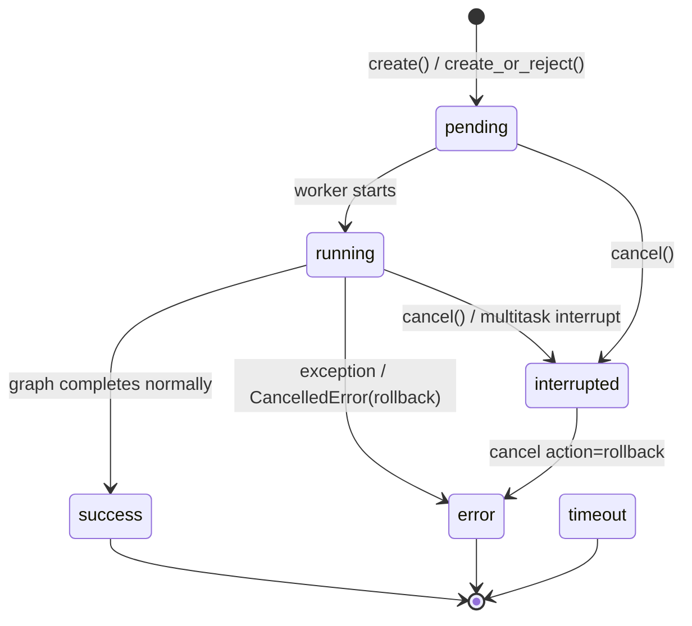

# RunManager — 运行生命周期管理

## 文件

`backend/packages/harness/deerflow/runtime/runs/manager.py` (655 行)

## 功能概述

`RunManager` 是 DeerFlow 的"运行注册表"。它是一个内存注册表（支持可选持久化 RunStore 后盾），管理每次 agent 运行的完整生命周期。

## 运行状态机



**状态定义** (`runs/schemas.py`):

| 状态 | 含义 |
|------|------|
| `pending` | 创建后等待执行 |
| `running` | 正在执行 |
| `success` | 正常完成 |
| `error` | 异常失败 |
| `timeout` | 超时 |
| `interrupted` | 用户取消/多任务中断 |

## RunRecord 数据结构

每个运行的核心数据结构（`manager.py:74-103`）：

```
RunRecord:
  - run_id, thread_id, assistant_id  # 标识
  - status: RunStatus                 # 当前状态
  - on_disconnect: DisconnectMode    # cancel | continue
  - multitask_strategy: str           # reject | interrupt | rollback
  - task: asyncio.Task               # 协程任务引用
  - abort_event: asyncio.Event       # 取消信号
  - abort_action: str                 # interrupt | rollback
  - store_only: bool                  # 是否仅持久化（无活跃任务）
  # Token/消息统计
  - total_input_tokens, total_output_tokens, total_tokens
  - llm_call_count, message_count
  - lead_agent_tokens, subagent_tokens, middleware_tokens
  - last_ai_message, first_human_message
```

## 多任务策略

`create_or_reject()` (行 497-579) 原子性地检查活跃运行并创建新的运行：

| 策略 | 行为 |
|------|------|
| `reject` | 如果线程已有运行，抛出 `ConflictError` |
| `interrupt` | 取消现有运行，保留 checkpoint |
| `rollback` | 取消现有运行，回滚到运行前 checkpoint |

关键设计：**持有锁期间完成检查和插入**，消除 check-then-act 的 TOCTOU 竞态条件。

## 取消机制

`cancel()` (行 466-495) 使用双信号模型：
1. 设置 `abort_event` → worker 中 `astream` 循环检测到并停止
2. 取消 `asyncio.Task` → 触发 `CancelledError` 异常路径

支持幂等取消（已 interrupted 的运行再次取消返回 `True`）。

## 持久化与重试

### RunStore 可选后盾

当配置了 `RunStore`（如 SQLite/PG），RunManager 将元数据同步持久化：
- `_persist_new_run_to_store()` — 新运行时强制写入（失败则回滚内存记录）
- `_persist_status()` — 状态转换时 best-effort 写入
- `_persist_model_name()` — 模型名称更新时 best-effort 写入

### SQLite 锁保护

`_is_retryable_persistence_error()` (行 34-61) 检测可重试的 SQLite 错误（`SQLITE_BUSY`、`SQLITE_LOCKED`、"database is locked"）。

`_call_store_with_retry()` (行 139-167) 实现指数退避重试（默认 5 次，50ms → 1s，2x 因子）。

## 存储回退

`get()` (行 355-385) 的三层查找策略：
1. 内存哈希表 `_runs[run_id]`
2. 持久化 `RunStore`（如果配置）
3. 双重检查：store await 期间可能并发 `create()` 插入了记录

存储回退的记录标记为 `store_only=True` — 没有活跃的 `asyncio.Task` 或控制状态，只能读取历史。

## 孤儿协调

`reconcile_orphaned_inflight_runs()` (行 581-633)：

重启后，SQLite 中可能遗留 `pending`/`running` 状态的记录（没有活跃 task）。此方法：
1. 从 `RunStore.list_inflight()` 获取所有活跃行
2. 过滤掉内存中确实有活跃记录的
3. 将剩余的标记为 `error` 状态

这防止 UI 显示"永久运行中"的幽灵运行。

## 进度更新

`update_run_progress()` (行 296-312) 和 `update_run_completion()` (行 259-294)：

- **进度**：运行中定期快照（token/消息计数），仅当 `status == running` 时持久化
- **完成**：运行结束后一次性写入 token 统计 + 便利字段（`last_ai_message`、`first_human_message`）
- 完成持久化失败时会尝试通过 `put` 重建行记录，然后重试 `update`
