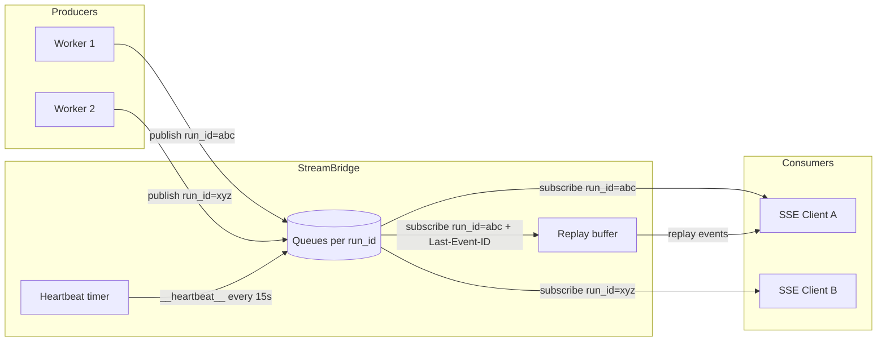

# StreamBridge — 流发布/订阅协议

## 文件

- `runtime/stream_bridge/base.py` (115 行，v2.1.0 实测) — 抽象协议 + `StreamEvent`/`StreamGap`/两个哨兵
- `runtime/stream_bridge/memory.py` (192 行，v2.1.0 实测) — 内存实现
- `runtime/stream_bridge/redis.py` (384 行，v2.1.0 实测) — 🆕 Redis Streams 跨进程实现（`supports_cross_process = True`）
- `runtime/stream_bridge/async_provider.py` (101 行，v2.1.0 实测) — 后端工厂
- `runtime/stream_modes.py` (47 行) — 🆕 对外 stream mode 词表与 `messages-tuple → messages` 映射

## 协议设计

`StreamBridge` 是一个抽象类，解耦 **生产者**（agent worker）和 **消费者**（SSE 端点）。



### StreamEvent 数据结构

```python
@dataclass(frozen=True)
class StreamEvent:
    id: str      # 单调递增事件 ID（用于 SSE id: 字段，支持 Last-Event-ID 重连）
    event: str   # SSE 事件名：metadata, updates, values, messages, error, end
    data: Any    # JSON 可序列化的负载
```

### 两个哨兵事件

- `HEARTBEAT_SENTINEL` — `event="__heartbeat__"`，当无事件时每 15 秒发送
- `END_SENTINEL` — `event="__end__"`，生产者完成时发送

### 核心接口

| 方法 | 角色 | 说明 |
|------|------|------|
| `publish(run_id, event, data)` | 生产者 | 入队一个事件 |
| `publish_end(run_id)` | 生产者 | 标记流结束 |
| `subscribe(run_id, last_event_id, heartbeat)` | 消费者 | 返回 `AsyncIterator[StreamEvent]` |
| `cleanup(run_id, delay=0)` | 双方 | 释放资源，delay>0 给迟到的订阅者排空事件的机会 |

## MemoryStreamBridge

基于 `asyncio.Queue` 的内存实现，是默认选择（用于本地开发和 SQLite 后盾部署）：

```python
class MemoryStreamBridge(StreamBridge):
    _queues: dict[str, asyncio.Queue[StreamEvent]]

    async def publish(self, run_id, event, data):
        queue = self._queues.get(run_id)
        if queue:
            await queue.put(StreamEvent(...))

    async def subscribe(self, run_id, *, last_event_id=None, heartbeat_interval=15.0):
        # 返回 async generator，从 Queue 中读取
        # 支持 Last-Event-ID 重连（replay 事件）
        # 15 秒无事件时发送心跳
```

## SSE 事件名称映射

Worker 中 `_lg_mode_to_sse_event()` (worker.py:545-554) 将 LangGraph 流模式映射到 SSE 事件名：

| LangGraph 模式 | SSE 事件名 |
|---------------|-----------|
| `values` | `values` |
| `updates` | `updates` |
| `messages` | `messages` |
| `custom` | `custom` |
| `tasks` | `tasks` |

注意：`events` 模式不支持（需要 LangGraph Platform 闭源组件）。

## Worker ↔ StreamBridge 交互

Worker (`run_agent()`) 是生产者：

```python
# 1. 发布元数据（useStream 需要 run_id 和 thread_id）
await bridge.publish(run_id, "metadata", {"run_id": run_id, "thread_id": thread_id})

# 2. 流式循环
async for chunk in agent.astream(graph_input, ...):
    sse_event = _lg_mode_to_sse_event(mode)
    await bridge.publish(run_id, sse_event, serialize(chunk, mode=mode))

# 3. 结束时发布 end 哨兵
await bridge.publish_end(run_id)

# 4. 60 秒后清理（给迟到订阅者机会）
asyncio.create_task(bridge.cleanup(run_id, delay=60))
```

## 后端选择

`stream_bridge/async_provider.py` 根据 `config.yaml` 自动选择 —— **只有两个后端**（此表在 v2.1.0 前写的 "SQLite-backed / PostgreSQL-backed" 是错的，代码里不存在这两种 bridge）：

| 后端 | 实现 | 适用场景 |
|------|------|---------|
| `memory`（默认） | `MemoryStreamBridge`（192 行） | 本地开发、**单进程** Gateway |
| `redis` | `RedisStreamBridge`（384 行） | 多 worker / 多进程 Gateway（`supports_cross_process = True`） |

选择顺序：`app_config.stream_bridge`（或全局 `get_stream_bridge_config()`）→ 若配置为 `None` 再看环境变量 `DEER_FLOW_STREAM_BRIDGE_REDIS_URL`（有值就合成一个 `type="redis"` 的配置）→ 都没有则 memory。未知 `type` 抛 `ValueError`。

## 🆕 订阅游标落后：`StreamGap`

`subscribe()` 的产出类型是 `StreamItem = StreamEvent | StreamGap`（`base.py:60`）。`StreamGap` 是 v2.1.0 新增的**第三个**哨兵形态（除 heartbeat/end 之外），表示"订阅者游标已无法完整重放"：

```python
@dataclass(frozen=True)
class StreamGap:
    requested_event_id: str | None        # 重连游标，或"活着但落后"的订阅者最后收到的事件 id
    earliest_available_event_id: str | None  # 保留缓冲区的最早边界；缓冲为空则 None
    latest_available_event_id: str | None
```

契约要点：抛出 `StreamGap` **同时终止迭代**（`return`）；调用方据此**重载持久状态**并从当前尾部续订，而不会把"部分重放"误当"完整重放"。`StreamBridge` 还有实例级能力位 `supports_cross_process: bool = False`（memory 保持 False），供上层判断订阅是否可能跨进程。

## 🆕 `RedisStreamBridge`（`stream_bridge/redis.py`，384 行）

每个 run 一个 Redis Stream，订阅者直接 `XREAD`。这让 SSE bridge 在多 worker 下可用，同时保住 `Last-Event-ID` 重放语义。

| 机制 | 实现 |
|------|------|
| Stream 键 | `f"{key_prefix}:{run_id}"`，`key_prefix` 默认 `deerflow:stream_bridge`（`rstrip(":")`） |
| 保留上限 | `queue_maxsize`（默认 256）作为 `XADD ... MAXLEN`（`approximate=False`，精确裁剪）；`publish_end` 用 `maxlen + 1` 保住"配置数量的数据事件 + 一个内部 end 标记" |
| 过期 | `stream_ttl_seconds`（默认 86400）与 `XADD` 同一条 **事务 pipeline** 里 `EXPIRE`；`None`/`<=0` 关闭过期 |
| 记录格式 | `{kind: "event"\|"end", event: <name>, data: <json>}`；end 记录只带 `kind`，读出即 `END_SENTINEL` |
| 连接池 | `max_connections` 限制池大小——**每个活跃 SSE 订阅者占一条连接**阻塞在 `XREAD ... BLOCK` 上；`None` 保持 redis-py 的（实际上无界）默认 |
| 缺包 | `redis` 是可选 extra，模块级 import 失败时抛带安装命令的 `ImportError`（`stream_bridge.type: redis` 时才惰性 import） |

订阅循环里几个刻意的设计（都是正确性问题）：

1. **阻塞 `XREAD` 不能参与 Redis 事务**，所以正确性靠**非阻塞原子快照**：`_read_retained_snapshot()` 在一条 `pipeline(transaction=True)` 里同时做 `XRANGE(count=1)`（最早边界）、`XREVRANGE(count=1)`（最新边界）、`XREAD`（`stream_id` 之后的数据）。代价是每次轮询三条命令（空闲时还要第二条往返），换来"保留边界检查不可能与读取竞态"。
2. **gap 检测只在游标是合法 Redis stream id 时启用**（`gap_detection_enabled = last_event_id is not None and _parse_stream_id(...) is not None`）。快照的 `earliest` 比当前游标更新 → 抛 `StreamGap(requested_event_id=..., earliest_available_event_id, latest_available_event_id)` 并结束。恶意/畸形游标退回 live tailing 而不是重放整个缓冲区。
3. **`ResponseError` 与其它 `RedisError` 分道**：Redis 拒绝客户端可控的 stream id（`ResponseError`）→ 记 warning 后**直接 raise**——绝不能重置到 `0-0`，否则重连会重放整个保留缓冲区。暂态 `RedisError` → 指数退避重试，上限 `_MAX_SUBSCRIBE_RETRIES = 3` 次后上抛；退避封顶 `heartbeat_interval`。
4. **"空快照"不重置错误计数**：只有非空响应（前向进展）才把 `consecutive_errors` 清零；否则一个永久失败的阻塞读会因为中间的非阻塞事务成功而无限重试。
5. **首次唤醒不丢**：对"已被证明为空"的 stream，第一个阻塞 `XREAD` 的响应先作为 `pending_initial_response` 暂存，与下一次原子边界检查一起校验，让**无游标**订阅者也拿到与 memory 相同的 fell-behind 信号。
6. **end 标记的两条判定路径**：已无新数据时若最新条目正是 end → 发 `END_SENTINEL`；否则阻塞读（`block_ms = max(1, int(heartbeat_interval*1000))`）超时后发 `HEARTBEAT_SENTINEL`，有数据则继续。

其它 API：`cleanup(run_id, delay=0)` 延迟后 `DEL` 整个 stream；`stream_exists(run_id)`（`EXISTS`）供"该 run 是否还有保留数据"判断；`close()` 只在**自己创建** client 时关闭（`client=` 注入的由调用方负责，用 `aclose()` 优先、回退 `close()`，并兼容非 awaitable 返回）。

## 🆕 公开 stream mode 词表（`runtime/stream_modes.py`）

LangGraph 兼容边界的**对外** stream mode 是独立词表，不等于 `graph.astream` 的 mode：

```python
RunStreamMode = Literal["values","messages-tuple","updates","debug","tasks","checkpoints","custom"]
SUPPORTED_RUN_STREAM_MODES = frozenset(...)
```

- `normalize_stream_modes(raw)`：`None` → `["values"]`，`str` → 单元素列表，列表原样；出现不支持的值（含非字符串，报类型名）→ `UnsupportedStreamModeError`（`ValueError` 子类，保留去重后的 `modes` 元组）。
- `to_langgraph_stream_modes(raw)`：唯一的映射是 **`messages-tuple` → `messages`**，结果去重，**没有静默 fallback**——不支持的模式在归一化阶段已经报错。

这解释了为什么 worker 里 `_lg_mode_to_sse_event()` 的输入含 `messages` 而对外 API 接受 `messages-tuple`。

## 心跳间隔校验（`base.py`）

`heartbeat_interval` 由 `StreamBridge._validate_heartbeat_interval()` 统一校验：必须是**非 bool** 的有限数值、`> 0` 且 `<= MAX_HEARTBEAT_INTERVAL_SECONDS`（`config/stream_bridge_config.py`，即 86400），否则 `ValueError`。构造期（`__init__`）与每次订阅覆盖（`_resolve_heartbeat_interval`）都过同一校验，所以**单次订阅可以覆盖** bridge 默认值，但覆盖值同样受限。

## 设计对齐

`StreamBridge` 的设计对齐了 LangGraph Platform 的 Queue + StreamManager 架构，但不直接依赖其闭源实现。

## 🆕 心跳间隔可配（#5017，sync #6）

心跳不再硬编码 15s：`heartbeat_interval_seconds` 配置项（最大 86400）经 `stream_bridge/async_provider.py`
传入 bridge 构造函数（memory/redis 实现均支持），`subscribe()` 也可按订阅覆盖。默认仍是
`DEFAULT_HEARTBEAT_INTERVAL_SECONDS = 15`。
