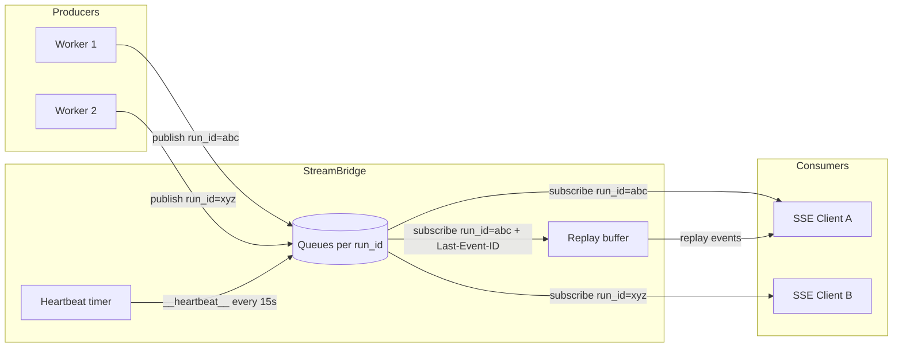

# StreamBridge — 流发布/订阅协议

## 文件

- `runtime/stream_bridge/base.py` (73 行) — 抽象协议
- `runtime/stream_bridge/memory.py` (~80 行) — 内存实现
- `runtime/stream_bridge/async_provider.py` (~80 行) — 后端工厂

## 协议设计

`StreamBridge` 是一个抽象类，解耦 **生产者**（agent worker）和 **消费者**（SSE 端点）。



### StreamEvent 数据结构

```python
@dataclass(frozen=True)
class StreamEvent:
    id: str      # 单调递增事件 ID（用于 SSE id: 字段，支持 Last-Event-ID 重连）
    event: str   # SSE 事件名：metadata, updates, values, messages, error, end
    data: Any    # JSON 可序列化的负载
```

### 两个哨兵事件

- `HEARTBEAT_SENTINEL` — `event="__heartbeat__"`，当无事件时每 15 秒发送
- `END_SENTINEL` — `event="__end__"`，生产者完成时发送

### 核心接口

| 方法 | 角色 | 说明 |
|------|------|------|
| `publish(run_id, event, data)` | 生产者 | 入队一个事件 |
| `publish_end(run_id)` | 生产者 | 标记流结束 |
| `subscribe(run_id, last_event_id, heartbeat)` | 消费者 | 返回 `AsyncIterator[StreamEvent]` |
| `cleanup(run_id, delay=0)` | 双方 | 释放资源，delay>0 给迟到的订阅者排空事件的机会 |

## InMemoryStreamBridge

基于 `asyncio.Queue` 的内存实现，是默认选择（用于本地开发和 SQLite 后盾部署）：

```python
class InMemoryStreamBridge(StreamBridge):
    _queues: dict[str, asyncio.Queue[StreamEvent]]

    async def publish(self, run_id, event, data):
        queue = self._queues.get(run_id)
        if queue:
            await queue.put(StreamEvent(...))

    async def subscribe(self, run_id, *, last_event_id=None, heartbeat_interval=15.0):
        # 返回 async generator，从 Queue 中读取
        # 支持 Last-Event-ID 重连（replay 事件）
        # 15 秒无事件时发送心跳
```

## SSE 事件名称映射

Worker 中 `_lg_mode_to_sse_event()` (worker.py:545-554) 将 LangGraph 流模式映射到 SSE 事件名：

| LangGraph 模式 | SSE 事件名 |
|---------------|-----------|
| `values` | `values` |
| `updates` | `updates` |
| `messages` | `messages` |
| `custom` | `custom` |
| `tasks` | `tasks` |

注意：`events` 模式不支持（需要 LangGraph Platform 闭源组件）。

## Worker ↔ StreamBridge 交互

Worker (`run_agent()`) 是生产者：

```python
# 1. 发布元数据（useStream 需要 run_id 和 thread_id）
await bridge.publish(run_id, "metadata", {"run_id": run_id, "thread_id": thread_id})

# 2. 流式循环
async for chunk in agent.astream(graph_input, ...):
    sse_event = _lg_mode_to_sse_event(mode)
    await bridge.publish(run_id, sse_event, serialize(chunk, mode=mode))

# 3. 结束时发布 end 哨兵
await bridge.publish_end(run_id)

# 4. 60 秒后清理（给迟到订阅者机会）
asyncio.create_task(bridge.cleanup(run_id, delay=60))
```

## 后端选择

`stream_bridge/async_provider.py` 根据 `config.yaml` 自动选择：

| 后端 | 适用场景 |
|------|---------|
| `InMemoryStreamBridge` | 本地开发、单进程 |
| SQLite-backed | 轻量生产 |
| PostgreSQL-backed | 多 worker 生产 |

## 设计对齐

`StreamBridge` 的设计对齐了 LangGraph Platform 的 Queue + StreamManager 架构，但不直接依赖其闭源实现。
