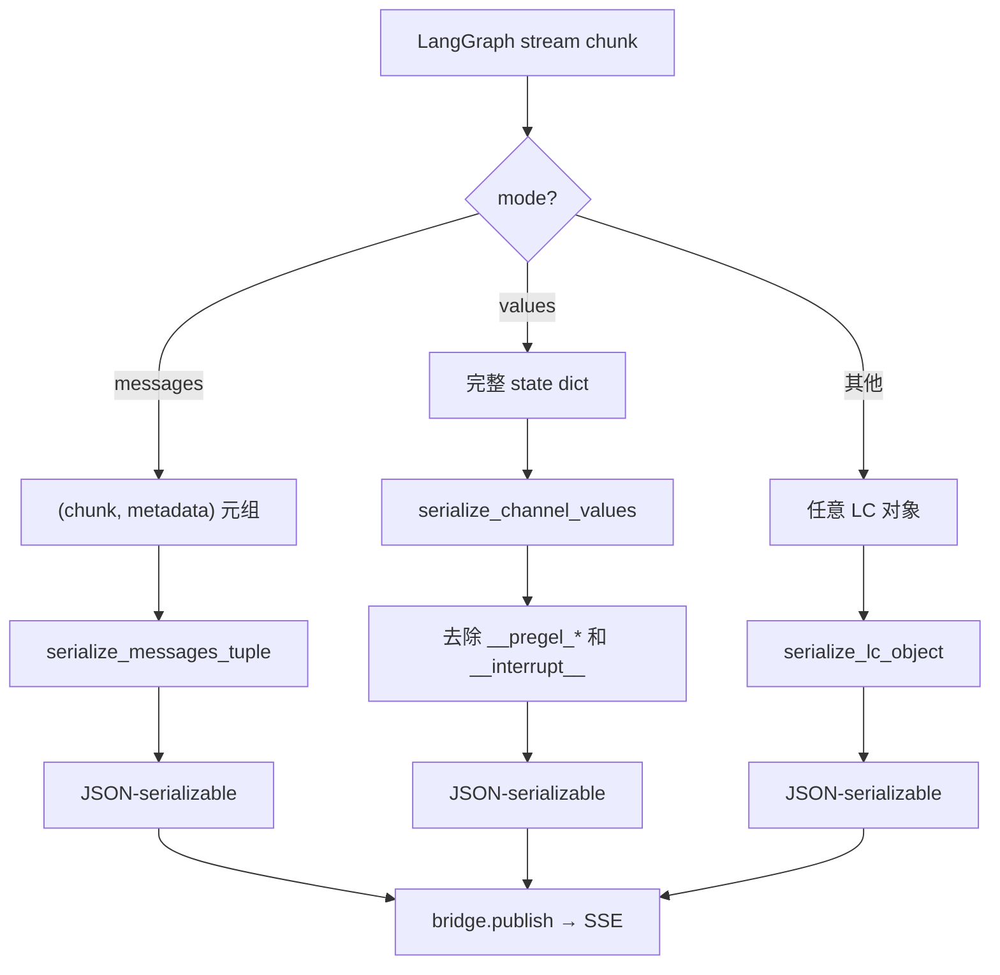
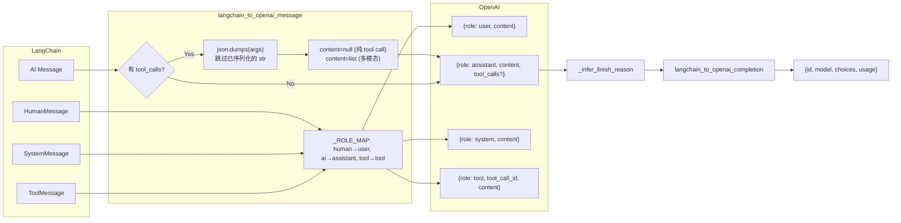

# 序列化层

## 文件

- `runtime/serialization.py` (79 行) — 规范序列化入口
- `runtime/converters.py` (137 行) — LangChain → OpenAI 格式转换

## serialization.py — 规范序列化

### 设计目标

提供 LangChain 对象到 JSON 可序列化 Python 结构的唯一转换源，供以下消费者共用：
- `runtime/runs/worker.py` — SSE 发布
- `app/gateway/routers/threads.py` — REST 响应

### 分发流程



### API

```python
def serialize(obj, *, mode="") -> Any
```

三种模式：

| mode | 输入 | 处理 |
|------|------|------|
| `"messages"` | `(chunk, metadata)` 元组 | 调用 `serialize_messages_tuple()` |
| `"values"` | 完整 state dict | 调用 `serialize_channel_values()` 去除 `__pregel_*` 内部键 |
| 其他 | 任意 LangChain 对象 | 递归 `model_dump()` / `dict()` 回退 |

### serialize_lc_object() — 递归序列化

```python
def serialize_lc_object(obj):
    - None/str/int/float/bool → 原样返回
    - dict → {k: serialize_lc_object(v) for k, v in obj.items()}
    - list/tuple → [serialize_lc_object(item) for item in obj]
    - 有 model_dump() → obj.model_dump()  (Pydantic v2)
    - 有 dict() → obj.dict()  (Pydantic v1 回退)
    - 最后手段 → str(obj) 或 repr(obj)
```

### serialize_channel_values() — 去除内部键

去除 `__pregel_*` 和 `__interrupt__` 内部通道键，以匹配 LangGraph Platform API 的返回格式。

## converters.py — OpenAI 格式转换

提供将 LangChain 消息转换为 OpenAI Chat Completions 格式的纯函数。目前未接入 RunJournal（RunJournal 直接使用 `message.model_dump()`），但可供需要 OpenAI 线路格式的消费者使用。

### 转换管线



### langchain_to_openai_message()

转换单个消息：

| 输入类型 | 输出 |
|---------|------|
| `HumanMessage` | `{"role": "user", "content": "..."}` |
| `AIMessage` (纯文本) | `{"role": "assistant", "content": "..."}` |
| `AIMessage` (含 tool_calls) | `{"role": "assistant", "content": null, "tool_calls": [...]}` |
| `AIMessage` (多模态) | content 保留为 list |
| `SystemMessage` | `{"role": "system", "content": "..."}` |
| `ToolMessage` | `{"role": "tool", "tool_call_id": "...", "content": "..."}` |

Tool call 参数处理：
```python
"arguments": json.dumps(args) if not isinstance(args, str) else args
```
避免对已序列化的 JSON 字符串进行二次编码。

### _infer_finish_reason()

推断完成原因：
1. 有 `tool_calls` → `"tool_calls"`
2. `response_metadata.finish_reason` → 使用其值
3. 默认 → `"stop"`

### langchain_to_openai_completion()

完整构造 OpenAI completion 格式：
```python
{
    "id": message.id,
    "model": message.response_metadata.model_name,
    "choices": [{"index": 0, "message": <openai_message>, "finish_reason": <inferred>}],
    "usage": {"prompt_tokens": ..., "completion_tokens": ..., "total_tokens": ...}
}
```
