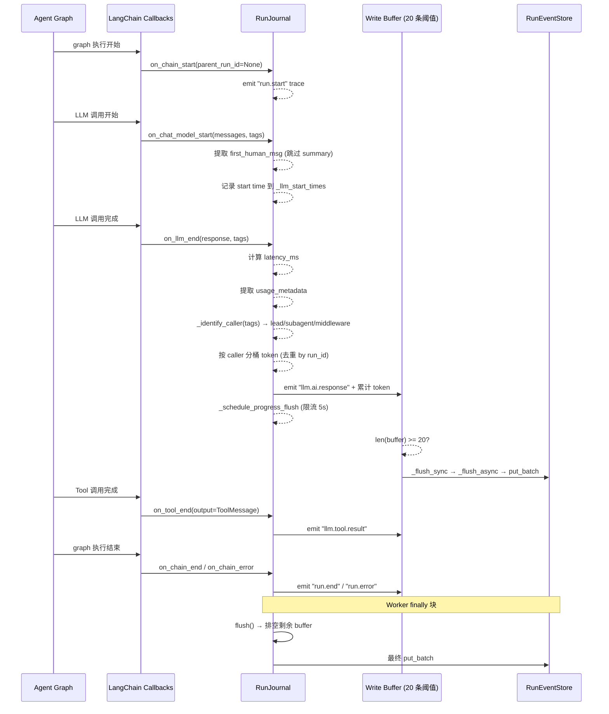

# RunJournal — LLM 调用日志与 Token 统计

## 文件

`runtime/journal.py` (572 行)

## 功能概述

`RunJournal` 是一个 **LangChain CallbackHandler**，位于 LangChain 回调机制和 `RunEventStore` 之间。它：
1. 将回调数据标准化为 `RunEvent` 记录
2. 累计 token 用量（按 caller 分桶）
3. 管理写入缓冲区和进度刷盘

### 回调触发流程



## 设计决策

### on_llm_new_token 不写事件

DeerFlow 选择**不在** `on_llm_new_token` 中写入事件。只在 `on_llm_end` 写入完整消息。这避免了部分数据污染事件存储。

### on_chat_model_start 优先于 on_llm_start

`on_chat_model_start` (行 180-225) 是捕获结构化 prompt 的标准位置：
- 消息在此处已完全结构化
- 它只在真实 LLM 调用时触发（不是每个图节点）
- 内容不受 checkpoint 压缩影响

### 第一条人类消息提取

在 `on_chat_model_start` 中提取 `first_human_msg`，过滤掉名为 `"summary"` 的人类消息（这是 summarization 中间件生成的）。

## Token 累计

### 按调用者分桶

Token 被分配到三个桶中（行 298-305）：

```python
if caller.startswith("subagent:"):
    self._subagent_tokens += total_tk
elif caller.startswith("middleware:"):
    self._middleware_tokens += total_tk
else:
    self._lead_agent_tokens += total_tk
```

调用者识别通过 `_identify_caller()` (行 403-410)：
1. 检查 tags 中的 `subagent:*`、`middleware:*`、`lead_agent` 标签
2. 默认为 `"lead_agent"`（主 agent 图不注入回调标签）

### 去重

三种去重保护：
- `_counted_llm_run_ids` — 防止同一 langchain run_id 的双重计数
- `_counted_external_source_ids` — 防止子 agent 使用报告的双重计数
- `_counted_message_llm_run_ids` — 防止消息计数重复

## 写入缓冲区

### 缓冲策略 (行 342-355)

事件不是即写即存储的：

```python
_PUT_BUFFER_SIZE = 20  # 默认阈值

def _put(self, *, event_type, category, content, metadata):
    self._buffer.append({...})
    if len(self._buffer) >= self._flush_threshold:
        self._flush_sync()  # 同步触发异步 flush
```

### 同步→异步桥接

`_flush_sync()` (行 357-380) 处理同步 LangChain 回调方法：

```python
def _flush_sync(self):
    # 如果已有 flush 在进行中，跳过（避免并发 SQLite 写入）
    if self._pending_flush_tasks:
        return
    # 如果没有事件循环，保留在缓冲区中
    # 如果有事件循环，创建异步 flush 任务
    task = loop.create_task(self._flush_async(batch))
```

刷新失败时（行 382-393），事件会被放回缓冲区前部（`batch + self._buffer`），等待下次重试。

### 最终刷新

`flush()` (行 485-505) 在 worker 的 `finally` 块中调用：
1. 等待所有待处理的 flush 任务
2. 取消延迟的进度刷新
3. 串行排空剩余缓冲区

## 进度报告

`_schedule_progress_flush()` (行 507-556) 实现限流进度快照：

- `progress_flush_interval` 默认 5 秒
- 通过 `RunManager.update_run_progress()` 写入进度到 RunStore
- 防抖：如果在间隔内多次触发，推迟到间隔结束
- 脏标记：如果在推迟期间有新数据，在刷新后再次调度

## 完整数据快照

`get_completion_data()` (行 558-571) 返回运行完成时的完整数据：

```python
{
    "total_input_tokens": ...,
    "total_output_tokens": ...,
    "total_tokens": ...,
    "llm_call_count": ...,
    "lead_agent_tokens": ...,
    "subagent_tokens": ...,
    "middleware_tokens": ...,
    "message_count": ...,
    "last_ai_message": ...,
    "first_human_message": ...,
}
```

这会被 worker 的 `finally` 块写入 `RunManager.update_run_completion()`。

## 中间件审计事件

`record_middleware()` (行 464-483) 允许中间件记录状态变更事件：

```python
journal.record_middleware(
    tag="title",
    name="TitleMiddleware",
    hook="after_model",
    action="generate_title",
    changes={"title": "..."}
)
```

事件类型格式为 `middleware:{tag}`，类别为 `"middleware"`。

## last_ai_message 保护

`_record_message_summary()` (行 130-141) 有保护逻辑：

- **仅 lead_agent 调用者**可以覆盖 `last_ai_message`（子 agent 和中间件的 AI 消息不会覆盖）
- **空 tool-call-only 消息**不覆盖（必须有实际文本内容）
- 内容截断到 2000 字符

这确保 UI 显示的"最后一条 AI 消息"是主 agent 对用户说的最后一句话。
