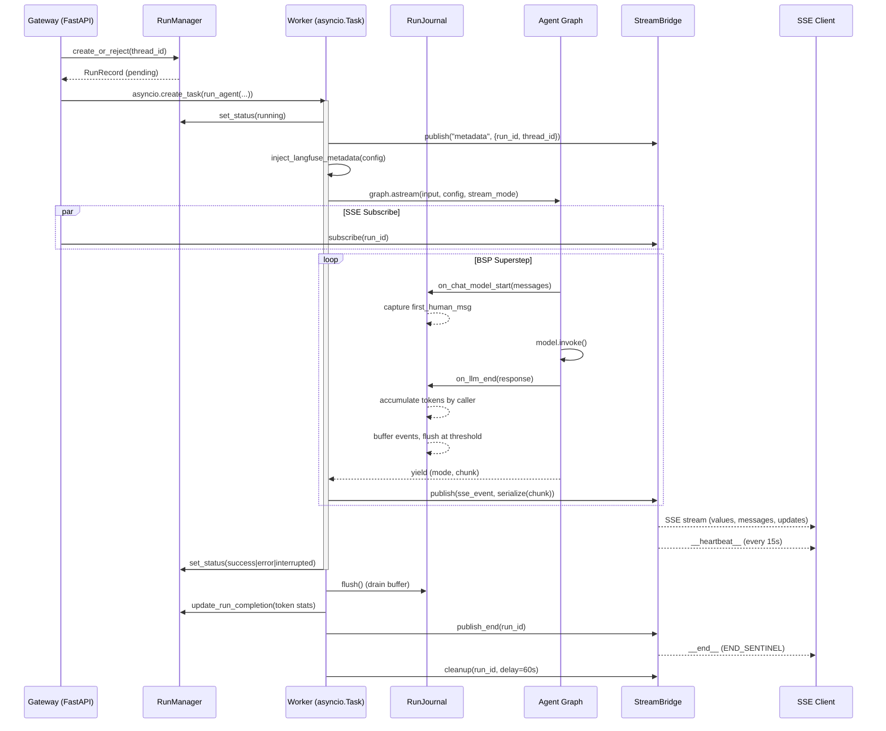

# Runtime — 运行基础设施

## 概览

`deerflow.runtime` 是 DeerFlow 的运行基础设施层，相当于一个小型 LangGraph Platform 运行时的自实现。它将 Agent 图执行、事件流发布/订阅、运行生命周期管理、序列化、以及 LLM 调用日志整合为一个完整的后台运行管道。

### 为什么自建 Runtime

LangGraph Platform 的 Python 闭源部分不开放，DeerFlow 需要自己实现：
- **运行生命周期管理**（创建、取消、状态流转、多任务策略）
- **SSE 流式发布**（StreamBridge 协议替代 LangGraph 的 Queue + StreamManager）
- **运行事件存储**（持久化的 LLM 请求/响应日志、token 统计）
- **序列化层**（LangChain 对象 → JSON 的规范转换）
- **Langfuse/LangSmith 追踪集成**

### 核心架构

### 文件索引

| 文件 | 行数 | 职责 |
|------|------|------|
| `runs/manager.py` | 2254 | RunManager — 运行 CRUD、状态机、多任务策略、SQLite 事务保护、孤儿协调、multi-worker lease |
| `runs/worker.py` | 2359 | run_agent() — 后台图执行、流式发布、Langfuse 注入、checkpoint 回滚、delivery receipt、workspace 快照 |
| `journal.py` | 982 | RunJournal — LangChain 回调处理器、token 累计（按 lead/subagent/middleware 分桶）、消息去重、进度刷盘、delivery receipt |
| `serialization.py` | 79 | serialize() — 规范序列化，支持 values/messages/custom 三种模式 |
| `converters.py` | 137 | LangChain → OpenAI Chat Completions 格式转换 |
| `stream_bridge/base.py` | 73 | StreamBridge ABC — publish/subscribe/cleanup 协议、心跳/结束哨兵 |
| `stream_bridge/memory.py` | ~80 | InMemoryStreamBridge — asyncio.Queue 实现 |
| `stream_bridge/async_provider.py` | ~80 | 后端感知工厂（memory/SQLite/Postgres） |
| `user_context.py` | 196 | ContextVar 用户上下文（set/get/require）、effective_user_id 三级解析 |
| `runs/schemas.py` | 30 | RunStatus、DisconnectMode 枚举 |
| `runs/naming.py` | ~30 | 根运行名解析 |
| `store/async_provider.py` | 115 | LangGraph async store 工厂（匹配 checkpointer 后端） |
| `goal.py` | 522 | Goal 自动续跑 — evaluator 模型、blocker 类型、no-progress breaker |
| `goal-continuation.md` | — | 开发者文档：Goal 续跑循环完整说明 |
| `05-run-ownership-and-rollback.md` | — | Multi-worker ownership / rollback / delivery receipt 完整说明 |
| `keyed_lock.py` | 147 | 🆕 按键串行化锁表 — `AsyncKeyedLockTable`（asyncio，按 loop 分桶）+ `KeyedLockTable`（线程版），waiter-aware 空闲条目回收 |
| `events/message_identity.py` | 60 | 🆕 消息稳定身份规则的后端半边 — ToolMessage 按 `tool_call_id`、human 的 `X`/`X__user` 副本折叠为同一身份 |
| `events/message_seq.py` | 52 | 🆕 REST 读路径（GET state / POST history）批量盖 `deerflow_seq` 章 — 流式 values 帧的 request-scoped 对应物 |
| `task-continuity.md` | — | 🆕 任务连续性子系统文档：task notes + compacted history recall（见下方同步 #6） |

### 同步 #6（ce635b7d）：线程生命周期、幂等与事件循环卫生

#### 1. Thread incarnations（expand-phase 存储，#5216）

迁移 `0019_thread_incarnations` 给 `threads_meta` 加可空 `incarnation`、`mcp_tasks` 加可空 `thread_incarnation`（均 VARCHAR(32)，无 server default）——**纯 expand 步骤，本阶段无任何运行时行为消费这两列**。新 thread 行写入随机 32 字符 incarnation；内存变更按 thread 串行化，覆写继承现有 incarnation，删除重建才有新值。迁移链细节：该 revision 复用回滚底线 binary 已审计的 revision id，按 `down_revision` 链在 `0021_batch_acceptance` 之后（Alembic 按 down_revision 而非数字前缀排序）；DDL 前先对两表做 preflight（拒绝窄型/NOT NULL/带默认值的既有列）。

**回滚安全性（#5219）**：0020 回滚底线 binary 把且仅把 incarnation revision 视为前向兼容——反射确认自身 ORM schema 后允许 stamp 存在；0021 接受列同样可空可省略。原有 0018+incarnation 形状的库走 [docs/database-forward-revision-recovery.md](../../../docs/database-forward-revision-recovery.md) 离线恢复。线程生命周期不变量（branch/regenerate 的 checkpoint lineage、settled checkpoint 规则）见 `backend/docs/THREAD_LIFECYCLE.md`。

#### 2. 幂等 thread runs（#5258）

Thread 级 run 创建端点（`POST /{thread_id}/runs`、`/stream`、`/wait`）接受可选 `Idempotency-Key` header。Gateway 用认证 owner + thread_id 对 key 做哈希后才进 RunManager 的进程级持久化索引（不透传外部裸 key）；三个端点共享同一 scoped key。重放命中时：stored `input`/`assistant_id` 与重试不同 → 409；`/wait` 返回持久化 `status`/`error` 而非序列化当前 checkpoint（head 可能已被后续 run 推进）；创建端点重放终态记录且流已消失时发 SSE `gap`（`recovery: reload_durable_state`）。`Idempotency-Key` 为空白字符串 422。测试：`backend/tests/test_thread_run_idempotency.py`（793 行，issue #5257 契约）。

#### 3. 分页 run history（#5283）+ 早期用户消息丢失修复（#4696）

- **keyset 分页**：`GET /api/threads/{thread_id}/runs/page` 返回 `{data, has_more, next_before_created_at, next_before_run_id}`，`limit` 1–200（默认 50），`before_created_at` + `before_run_id` 必须成对传入（422），newest-first。`RunManager.list_by_thread()` 与 `RunStore` 底层增加游标参数。
- **#4696（分页与压缩重叠时早期用户消息消失/跳动）**：根因是 checkpoint 不携带自己在 feed 中的位置，压缩救回的早期 turn 在客户端已加载的分页窗口之外无法定位。修复 = `deerflow_seq` 盖章（见 `events/message_identity.py` / `events/message_seq.py` 文件索引）：流式 `values` 帧由 worker 的 `_MessageSeqStamper` 盖章，REST 读（`GET /threads/{id}/state`、`POST /threads/{id}/history`）由 `stamp_messages_with_seq()` 一次批量查询解决；身份规则两端（后端 `message_identity()` / 前端 `hooks.ts::messageIdentity`）必须保持同步，错配是静默降级不报错。

#### 4. Checkpoint retention 契约（#5051 / #5255）

`backend/docs/checkpoint-retention-contract.md`（**draft**，#4189 item 3）：LangGraph checkpoint 是 per-thread parent chain，branch/regenerate 与显式 resume 都依赖链完整——按表大小/时间删行会**静默**破坏这些功能（`CheckpointLineageIntegrityError`）。契约划定：

- **保护集**（不可删，除非有明确补偿）：显式 resume 目标、branch 祖先链（含最老可 branch 消息之前的 checkpoint）、pending writes（是未提交状态不是垃圾）、被 fork 过的 duration-only 链节点（删除需 graft 到祖父）、每线程最新可 resume 状态。
- **可证安全删除**（测试钉住）：无子节点的叶子 sibling branch、未被 fork 的尾部 duration-only 叶子。
- **删除机制**：blob 可达性必须从**幸存 checkpoint 的整 thread 遍历**计算（duration-only checkpoint 是父 head 的完整拷贝、共享 blob 行——按被删行自身 `channel_versions` 删 blob 会毁掉线程最新状态）；证明不安全就不得上线。
- 测量先行：#5051 Postgres 存储增长测量 + #5255 删除契约测试与增长基线（`scripts/benchmark/checkpoint/bench_channels.py` / `bench_production.py`，`backend/tests/test_checkpoint_retention_contract.py`）。

#### 5. 事件循环卫生与内存边界

| commit | 内容 |
|--------|------|
| `#5217` | Agent 构造移出事件循环（`gateway/services.py`），blocking-io 套件 `test_agent_factory_construction.py` 钉住 |
| `#5224` | 异步入口点的 tool 装配移出循环（`utils/assembly_io.py` 共享 offload 辅助），`keyed_lock.py` 服务于 per-key 串行化 |
| `#5335` | 确定性 executor 饥饿回归测试 |
| `#5112` | 终态 run 后 Gateway 内存有界化：worker teardown guard 显式断开 `astream` 迭代器与图作用域引用、清理 `__pregel_runtime` 等运行时 context、合并式全量 cyclic GC（≤每 10s 一次，走默认 executor） |

`runtime/keyed_lock.py`（147 行）：`AsyncKeyedLockTable` 供 asyncio 调用方——每条目带 participants 计数（持有人 + 排队者），**先计数再 await**，保证新调用方无法绕过已排队的 waiter 另建第二把锁；`asyncio.Lock` 一旦竞争就有 loop 亲和性，所以表按 event loop 分桶（`WeakKeyDictionary`），guard 锁只保护注册表、临界区绝不持有它；最后一个参与者离开时回收空闲条目。`KeyedLockTable` 是 worker 线程侧的同构对应物。

#### 6. 压缩/摘要修复

- **#5248**：compaction summary 保留 assistant/tool 历史（不再只剩人类消息），摘要素材完整。
- **#4901**：summarization fraction 触发器导致 agent build 崩溃的修复。
- **#5249**：嵌入客户端 `DeerFlowClient` 的 `values` 事件暴露 `summary_text`（含空摘要/reset 转发）。

### 🆕 sync #6（431892e1..769589e8）要点

- **run change_seq**（migration `0023_run_change_seq`）— 稳定分页游标，`GET /runs/page` keyset 翻页（`01-run-manager.md`）
- **thread incarnations**（migration `0019_thread_incarnations`，#5216）— expand-phase 可空列，暂无行为消费（`01-run-manager.md`）
- **events store 加固** — `runtime/events/` 新增 `message_identity.py`（消息稳定身份：ToolMessage 按 `tool_call_id`、注入副本折叠）与 `message_seq.py`（checkpoint 消息批量回填 `deerflow_seq`，修复分页+压缩重叠时早期消息错位 #4696）；DB/JSONL store 的 lock 生命周期修复（删除期间保持锁 generation 稳定 #5462/#5455）、cancellation 前先排空 JSONL 变更（#5439）、JSONL 记录保留 Unicode 分隔符（#5429）
- **Gateway 内存回收**（#5112）— 终态 run 释放引用、丢弃 fenced journal 缓冲（`01-run-manager.md`）
- **keyed lock 安全回收**（#5176）— waiter-aware 锁表，计数持有者+排队者后才回收空闲项
- **心跳间隔可配**（#5017）— `heartbeat_interval_seconds`（`02-stream-bridge.md`）
- worker trace binding（#5119 配套，trace id 无条件下发详见 observability digest）

### 🆕 sync #7（v2.1.0-rc0..v2.1.0）要点

- **事件存储变更串行域**（#5535）— `put` / `put_batch` / `put_if_absent` / `delete_by_thread` / `delete_by_run` 共享同一临界区：每线程 `asyncio` 锁 +（PostgreSQL）事务级 advisory lock（`DbRunEventStore._acquire_thread_mutation_fence()`）；删除签名统一为 owner-scoped（`user_id` 三态，memory/JSONL 只为接口一致性接受并忽略）。详见 observability digest。
- **线程删除清理**（#5535）— `RunRepository.delete_by_thread()` 只删 `operation_kind == "run"` 的历史 run（保留保护本次 `DELETE` 的 reservation 行），且**不 bump change clock**；`MemoryRunStore.delete_by_thread()` 同规则。详见 `05-run-ownership-and-rollback.md`。
- **0025 修复型迁移**（#5517）— 幂等重放被"插队"的 `0023_run_change_seq` 的 DDL，并把 `RunChangeClockRow` / `UserPreferenceRow` 补进 ORM 注册表。详见 persistence digest。

### 关键设计决策

1. **RunJournal 不在 `on_llm_new_token` 中写事件** — 只在 `on_llm_end` 写入完整消息，避免部分数据污染存储。
2. **`on_chat_model_start` 优先于 `on_llm_start`** — 消息在此处已完全结构化，不受 checkpoint 压缩影响。
3. **LangGraph `events` 模式不支持** — 需要 `astream_events()` + 内部 checkpoint 回调（LangGraph Platform 闭源部分），DeerFlow 通过 `values` + `messages` 模式达到等效结果。
4. **ContextVar 任务隔离** — `asyncio` 下 ContextVar 是 task-local 而非 thread-local，自然每个请求一个 task。
5. **双路径 Langfuse 注入** — `worker.py` 和 `client.py` 共享 `inject_langfuse_metadata()` 防止漂移。
