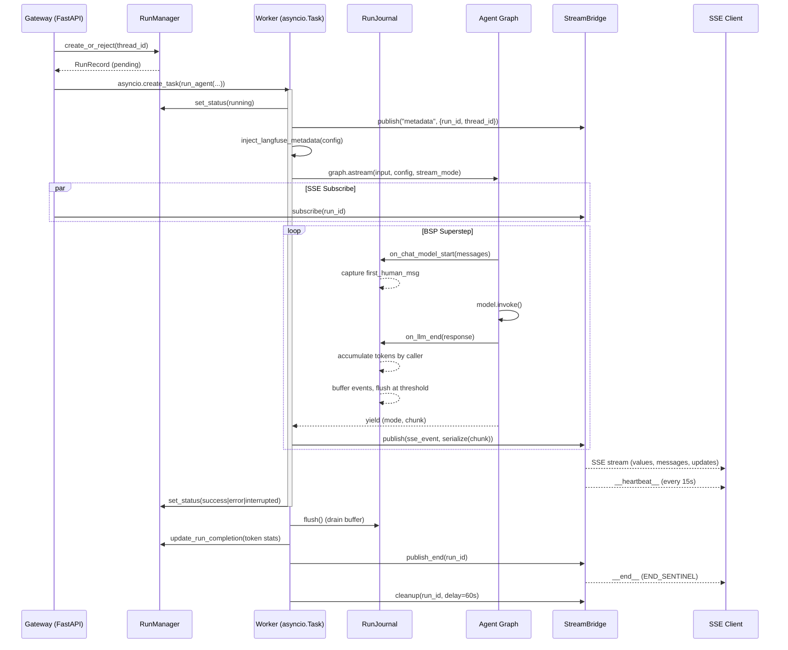

# Runtime — 运行基础设施

## 概览

`deerflow.runtime` 是 DeerFlow 的运行基础设施层，相当于一个小型 LangGraph Platform 运行时的自实现。它将 Agent 图执行、事件流发布/订阅、运行生命周期管理、序列化、以及 LLM 调用日志整合为一个完整的后台运行管道。

### 为什么自建 Runtime

LangGraph Platform 的 Python 闭源部分不开放，DeerFlow 需要自己实现：
- **运行生命周期管理**（创建、取消、状态流转、多任务策略）
- **SSE 流式发布**（StreamBridge 协议替代 LangGraph 的 Queue + StreamManager）
- **运行事件存储**（持久化的 LLM 请求/响应日志、token 统计）
- **序列化层**（LangChain 对象 → JSON 的规范转换）
- **Langfuse/LangSmith 追踪集成**

### 核心架构

### 文件索引

| 文件 | 行数 | 职责 |
|------|------|------|
| `runs/manager.py` | 2254 | RunManager — 运行 CRUD、状态机、多任务策略、SQLite 事务保护、孤儿协调、multi-worker lease |
| `runs/worker.py` | 2359 | run_agent() — 后台图执行、流式发布、Langfuse 注入、checkpoint 回滚、delivery receipt、workspace 快照 |
| `journal.py` | 982 | RunJournal — LangChain 回调处理器、token 累计（按 lead/subagent/middleware 分桶）、消息去重、进度刷盘、delivery receipt |
| `serialization.py` | 79 | serialize() — 规范序列化，支持 values/messages/custom 三种模式 |
| `converters.py` | 137 | LangChain → OpenAI Chat Completions 格式转换 |
| `stream_bridge/base.py` | 73 | StreamBridge ABC — publish/subscribe/cleanup 协议、心跳/结束哨兵 |
| `stream_bridge/memory.py` | ~80 | InMemoryStreamBridge — asyncio.Queue 实现 |
| `stream_bridge/async_provider.py` | ~80 | 后端感知工厂（memory/SQLite/Postgres） |
| `user_context.py` | 196 | ContextVar 用户上下文（set/get/require）、effective_user_id 三级解析 |
| `runs/schemas.py` | 30 | RunStatus、DisconnectMode 枚举 |
| `runs/naming.py` | ~30 | 根运行名解析 |
| `store/async_provider.py` | 115 | LangGraph async store 工厂（匹配 checkpointer 后端） |
| `goal.py` | 522 | 🆕 Goal 自动续跑 — evaluator 模型、blocker 类型、no-progress breaker |
| `goal-continuation.md` | — | 🆕 开发者文档：Goal 续跑循环完整说明 |
| `05-run-ownership-and-rollback.md` | — | 🆕 Multi-worker ownership / rollback / delivery receipt 完整说明 |

### 🆕 sync #6（431892e1..769589e8）要点

- **run change_seq**（migration `0023_run_change_seq`）— 稳定分页游标，`GET /runs/page` keyset 翻页（`01-run-manager.md`）
- **thread incarnations**（migration `0019_thread_incarnations`，#5216）— expand-phase 可空列，暂无行为消费（`01-run-manager.md`）
- **events store 加固** — `runtime/events/` 新增 `message_identity.py`（消息稳定身份：ToolMessage 按 `tool_call_id`、注入副本折叠）与 `message_seq.py`（checkpoint 消息批量回填 `deerflow_seq`，修复分页+压缩重叠时早期消息错位 #4696）；DB/JSONL store 的 lock 生命周期修复（删除期间保持锁 generation 稳定 #5462/#5455）、cancellation 前先排空 JSONL 变更（#5439）、JSONL 记录保留 Unicode 分隔符（#5429）
- **Gateway 内存回收**（#5112）— 终态 run 释放引用、丢弃 fenced journal 缓冲（`01-run-manager.md`）
- **keyed lock 安全回收**（#5176）— waiter-aware 锁表，计数持有者+排队者后才回收空闲项
- **心跳间隔可配**（#5017）— `heartbeat_interval_seconds`（`02-stream-bridge.md`）
- worker trace binding（#5119 配套，trace id 无条件下发详见 observability digest）

### 关键设计决策

1. **RunJournal 不在 `on_llm_new_token` 中写事件** — 只在 `on_llm_end` 写入完整消息，避免部分数据污染存储。
2. **`on_chat_model_start` 优先于 `on_llm_start`** — 消息在此处已完全结构化，不受 checkpoint 压缩影响。
3. **LangGraph `events` 模式不支持** — 需要 `astream_events()` + 内部 checkpoint 回调（LangGraph Platform 闭源部分），DeerFlow 通过 `values` + `messages` 模式达到等效结果。
4. **ContextVar 任务隔离** — `asyncio` 下 ContextVar 是 task-local 而非 thread-local，自然每个请求一个 task。
5. **双路径 Langfuse 注入** — `worker.py` 和 `client.py` 共享 `inject_langfuse_metadata()` 防止漂移。
