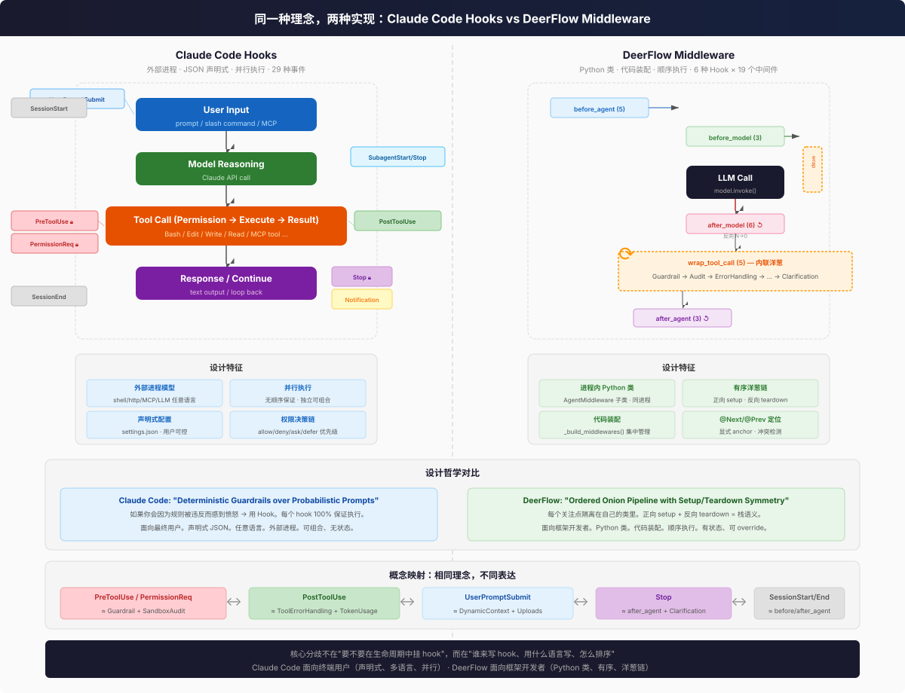

# Claude Code Hooks vs DeerFlow Middleware

同一种理念，两种实现。两者都在 Agent 生命周期的关键节点挂入自定义逻辑，但面向不同的用户、用不同的方式。



## 为什么这个对比很重要

当你已经熟悉一个概念时，理解新概念最快的方式就是**找映射**。如果你用过 Claude Code 的 Hooks，DeerFlow 的 Middleware 就是同一件事的不同实现——就像你学会了 Express.js 的 middleware，再看 Django 的 middleware 就不会从零开始。

**DeerFlow 本身没有独立的 "Hooks" 概念。** Hooks 就长在 Middleware 里面——6 个 hook 方法（`before_agent`、`wrap_tool_call` 等）定义在 `AgentMiddleware` 基类上，每个 middleware 子类选择自己要 override 哪几个。这和 Claude Code 不同：Claude Code 的 hook 是**独立的 JSON 条目**（"当 PreToolUse 事件触发时，跑这个 shell 脚本"），不依附于任何 middleware 类。

| 概念 | Claude Code | DeerFlow |
|------|------------|----------|
| **Hook** | 独立实体：JSON 配置中的一个条目，指定事件 + 处理命令 | 依附于 Middleware：`AgentMiddleware` 基类上的方法，由子类 override |
| **Middleware** | 不存在这个概念 | 核心抽象：包装多个 hook 方法的 Python 类，按顺序排列成链 |
| **Hook 和 Middleware 的关系** | 没有 middleware 层——hook 直接注册到事件上 | 一个 middleware = 一组相关 hook 的容器（如 SandboxMiddleware 同时 override `before_agent` 和 `after_agent`） |

**简单说：** Claude Code 是"事件 → 处理脚本"的扁平映射，DeerFlow 是"事件 → Middleware 链 → 每个 Middleware 内部决定响应哪些 hook"的两层结构。DeerFlow 多了一层抽象（middleware 类），换来的是更好的组织性（相关 hook 封装在一起）和顺序控制。

## 一句话对比

| | Claude Code Hooks | DeerFlow Middleware |
|---|---|---|
| **面向谁** | 终端用户、团队 | 框架开发者、平台团队 |
| **怎么配** | JSON 文件（`settings.json`） | Python 代码（`_build_middlewares()`） |
| **怎么写** | 任意语言（shell/Python/Node/HTTP/MCP） | Python `AgentMiddleware` 子类 |
| **怎么跑** | 外部进程（stdin JSON → stdout JSON） | 进程内 Python 对象 |
| **怎么排** | 并行（无顺序保证） | 顺序链（正向 setup / 反向 teardown） |
| **多少个** | 29 种事件 | 6 种 hook 点 |
| **多少个处理者** | 用户定义，无上限 | 19 个内置 + 用户可追加 |
| **能阻塞吗** | 能（exit code 2） | 能（不调 handler()） |
| **能修改输入吗** | 能（`updatedInput`） | 能（`request.override()`） |
| **能注入上下文吗** | 能（`additionalContext`） | 能（返回 `{"messages": [...]}`） |

## 概念映射

Claude Code 的 29 种事件可以映射到 DeerFlow 的 6 种 hook 点：

| Claude Code 事件 | ≈ DeerFlow Hook | 说明 |
|---|---|---|
| `UserPromptSubmit` | `before_agent` / `before_model` | 用户输入前注入上下文 |
| `UserPromptExpansion` | （无直接对应） | 斜杠命令展开是 Claude Code 特有 |
| `PreToolUse` | `wrap_tool_call` (Guardrail, SandboxAudit) | Tool 执行前校验/拒绝 |
| `PermissionRequest` | `wrap_tool_call` (Guardrail) | 权限决策 |
| `PostToolUse` | `wrap_tool_call` (ToolErrorHandling) + `after_model` (TokenUsage) | Tool 执行后处理 |
| `PostToolUseFailure` | `wrap_tool_call` (ToolErrorHandling) | Tool 失败兜底 |
| `PostToolBatch` | （无直接对应） | DeerFlow tool 是逐个执行的 |
| `Stop` | `after_model` (无 tool_calls 分支) + `after_agent` | Agent 结束处理 |
| `StopFailure` | （无直接对应） | API error 终止是 Claude Code 特有 |
| `SubagentStart` / `SubagentStop` | （无直接对应，subagent 自己有一套 middleware 链） | 子 agent 生命周期 |
| `SessionStart` / `SessionEnd` | `before_agent` / `after_agent` | 会话生命周期 |
| `PreCompact` / `PostCompact` | `before_model` (Summarization) | 上下文压缩 |
| `Notification` | （无直接对应） | UI 通知是 Claude Code 特有 |
| `InstructionsLoaded` | `before_agent` (DynamicContext) | 加载系统指令 |
| `PermissionDenied` | `wrap_tool_call` 被拒绝后 | 权限被拒绝 |
| `CwdChanged` / `FileChanged` | （无直接对应） | 文件监控是 Claude Code 特有 |
| `WorktreeCreate` / `WorktreeRemove` | （无直接对应） | Worktree 是 Claude Code 特有 |

**核心差异：** Claude Code 把同一个 lifecycle 点拆得更细（`PreToolUse`、`PermissionRequest`、`PostToolUse`、`PostToolUseFailure` 是 4 个独立事件），DeerFlow 把它们合并到 `wrap_tool_call` 一个 hook 中，靠 middleware 顺序区分职责。

## 设计哲学对比

### Claude Code: Deterministic Guardrails

> "If you'd be angry when a rule is violated, make it a hook. If you'd be mildly annoyed, put it in CLAUDE.md."

核心理念：**确定性 > 概率性**。模型可能忽略 prompt 中的规则，但 hook 100% 执行。

- **外部进程模型** — hook 是独立进程，通过 stdin/stdout JSON 通信。隔离性好，hook 崩溃不影响 agent。
- **并行执行** — 同一事件的所有匹配 hook 并行运行，互不阻塞。适合独立校验。
- **声明式配置** — 用户在手写 JSON，不在代码里写装配逻辑。接入门槛极低。
- **多语言** — shell script、Python、Node、HTTP webhook、MCP tool、LLM prompt、subagent 都能做 hook。
- **权限决策链** — `deny > defer > ask > allow` 优先级，多个 hook 的结果自动合并。

### DeerFlow: Ordered Onion Pipeline

> 正向 setup、反向 teardown、洋葱组合。middleware 是栈，不是链。

核心理念：**顺序 > 并行**。middleware 之间有依赖关系，必须按特定顺序执行。

- **进程内 Python 类** — 零序列化开销，共享内存。但 middleware bug 可能影响 agent 稳定性。
- **顺序执行** — 洋葱组合（`wrap_*`）+ 正向/反向图节点（`before_*`/`after_*`）。设计保证 setup/teardown 对称。
- **代码装配** — 顺序硬编码在 `_build_middlewares()` 中。一目了然，但不够"开放"。
- **Python only** — 必须继承 `AgentMiddleware`。类型安全但限制了实现语言。
- **@Next/@Prev 定位** — 显式声明位置相对于已知 anchor，带冲突检测。比 Claude Code 的"无顺序保证"精确但使用门槛高。

## 互相可以学什么

### Claude Code → DeerFlow

1. **声明式配置层** — DeerFlow 的 middleware 装配全在 Python 代码里。加一层类似 `hooks.json` 的 YAML 声明式配置，让非 Python 用户也能开关/配置 middleware。
2. **外部进程隔离** — 第三方 middleware 如果跑在子进程中，它的崩溃不会拖垮整个 agent。DeerFlow 目前没有 middleware 间的错误隔离。
3. **权限决策优先级链** — Claude Code 的 `deny > defer > ask > allow` 多级决策比 DeerFlow 的 allow/deny 二元更细粒度。
4. **更多生命周期事件** — DeerFlow 的 6 种 hook 比较粗。Claude Code 的 29 种事件覆盖了很多 DeerFlow 没有的点（文件监控、权限拒绝、指令加载）。

### DeerFlow → Claude Code

1. **有序执行** — Claude Code 的并行执行语义导致 "没有顺序保证"。当 hook 之间有依赖关系时（"先校验权限，再审计命令"），并行模型迫使用户把逻辑塞进一个 hook 脚本。DeerFlow 的顺序链更清晰。
2. **洋葱组合** — `wrap_model_call`/`wrap_tool_call` 的嵌套 callable 模式让 middleware 同时看到 request 和 response。Claude Code 用 `PreToolUse` + `PostToolUse` 两个分离事件来实现类似效果，但不如洋葱模式直观。
3. **位置声明** — `@Next(GuardrailMiddleware)` / `@Prev(ClarificationMiddleware)` 比 Claude Code 的 "所有 hook 并行" 更精确。如果 Claude Code 支持 `@After(PreToolUse)` 或 `@Before(PostToolUse)` 定位，体验会更好。
4. **框架内置 hook** — Claude Code 的 hook 全由用户定义，没有内置的。DeerFlow 的 19 个内置 middleware 提供了开箱即用的安全/观测/资源管理能力。

## 为什么理念如此相似？

因为两者解决的问题是**同构的**：

```
Agent = Model + Tools 的循环
Hook/Middleware = 在这个循环的关键节点插入自定义逻辑
```

这是 Agent 架构的必然需求。不管是 Claude Code 的 "我是一个 CLI 工具，用户需要 guardrails" 还是 DeerFlow 的 "我是一个框架，平台团队需要 extensibility"，只要你的系统是 Model→Tools 循环，你就需要一个机制在循环节点上挂逻辑。

**这不是谁抄谁——而是 Agent 架构的内在规律。** 就像 Web 框架都有 middleware（Express、Django、Flask、Rails），Agent 框架也会有。只是 Claude Code 选择了"给用户最大的自由（任何语言、任何进程）"，DeerFlow 选择了"给开发者最强的控制（有序洋葱链、类型安全的 Python 类）"。

## 关键差异的根源

Claude Code 是一个 **CLI 产品**，DeerFlow 是一个 **Python 框架**。这个身份决定了所有差异：

| 因为是... | 所以... |
|---|---|
| CLI 产品 | hook 用 JSON 配置，用户手写就行 |
| CLI 产品 | hook 是外部进程，用 stdin/stdout 通信 |
| CLI 产品 | 并行执行，不阻塞用户 |
| Python 框架 | middleware 是 Python 类，类型安全 |
| Python 框架 | middleware 在进程内，零序列化开销 |
| Python 框架 | 顺序链，保证 setup/teardown 对称 |
