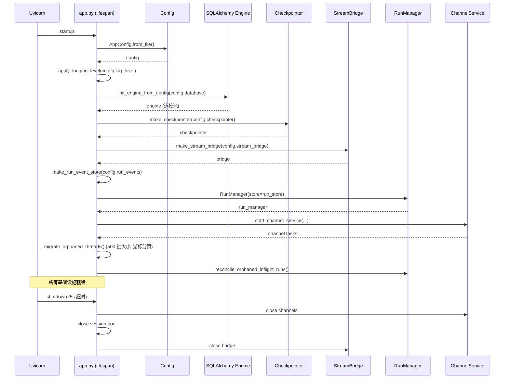

# 网关架构全景

## 文件

- `app/gateway/app.py` — FastAPI 应用 + lifespan
- `app/gateway/deps.py` — 依赖注入
- `app/gateway/auth_middleware.py` — JWT 认证中间件
- `app/gateway/csrf_middleware.py` — CSRF 双重提交 Cookie 模式
- `app/gateway/internal_auth.py` — 内部服务认证
- `app/gateway/authz.py` — 基于角色的权限装饰器
- `app/gateway/services.py` — 后台服务编排

## 认证流程

```mermaid
flowchart TD
    REQ[HTTP 请求] --> AM{AuthMiddleware}
    AM -->|Authorization: Bearer| JWT[JWT 验证]
    AM -->|X-DeerFlow-Internal-Token| IT[内部 Token 验证]
    AM -->|无认证| ANON[匿名 — 公开端点]

    JWT -->|有效| JWT_OK[设置 request.state.auth]
    JWT -->|过期/invalid| JWT_ERR[精细错误: token_expired/token_invalid/user_not_found]

    IT -->|匹配| IT_OK[内部服务 — 无用户上下文]
    IT -->|不匹配| IT_ERR[403]

    ANON -->|公开路径 ✅| PUB[允许通过]
    ANON -->|受保护路径 ❌| AUTH_ERR[401]

    JWT_OK --> CSRF{CSRFMiddleware}
    CSRF -->|有 Cookie + Header| CSRF_OK[传递]
    CSRF -->|不匹配 (常数时间比较)| CSRF_ERR[403]
    CSRF -->|豁免路径: /api/v1/auth/me, login, register| PASS[传递]

    JWT_OK --> AZ{authz 装饰器}
    AZ -->|owner_check| OWN[验证 user_id == resource.owner_id]
    AZ -->|require_existing| EX[缺失行 → 404 拒绝]
```

## Lifespan 启动序列



## 配置热重载边界

```mermaid
flowchart LR
    subgraph 重启必需
        DB[database.*]
        CP[checkpointer.*]
        RE[run_events.*]
        SB2[stream_bridge.*]
        SAND[sandbox.use]
        LOG[log_level]
        IM[channels.*]
    end

    subgraph 热重载
        MOD[models.*.max_tokens]
        SUM[summarization.*]
        TITLE[title.*]
        MEM[memory.*]
        SUB[subagents.*]
        TOOLS[tools[*]]
        PROMPT[system prompt]
    end

    CONFIG[config.yaml 变更] -->|下次请求| HR[get_app_config 返回新值]
    HR --> HOT[热重载字段生效]
    HR --> COLD[重启必需字段: 警告或忽略]
```

## 权限系统 (`authz.py`)

```python
@require_permission("threads", "write", owner_check=True, require_existing=True)
```

三种权限模式：

| 参数 | 行为 |
|------|------|
| 默认 | 检查请求者是否有指定权限 |
| `owner_check=True` | 验证 `request.state.auth.user_id` 与资源所有者匹配 |
| `require_existing=True` | 缺失行 → 404（静默拒绝，防止所有权枚举） |
| `require_existing=False` | 允许缺失行（旧版未跟踪线程的向后兼容） |

6 个已定义权限，所有已认证用户被授予全部。

## 内部认证 (通道 Worker)

IM 通道 worker 发送三头模式：

```
X-DeerFlow-Internal-Token: <auto-generated urlsafe(32)>
X-CSRF-Token: <value from csrf_token cookie>
Cookie: csrf_token=<value>

→ 内部 Token 绕过 JWT
→ CSRF Token/Cookie 对通过 CSRF 检查
→ 所有通道消息以 "default" 用户身份运行
```

## 线程元数据防伪造

```python
_SERVER_RESERVED_METADATA_KEYS = frozenset(["owner_id", "user_id"])
```

这些键通过 Pydantic `@field_validator` 从所有入站元数据中剥离。客户端无法伪造线程所有权。

## 日志注入防护

```python
def sanitize_log_param(value: str) -> str:
    return value.replace("\n", "").replace("\r", "").replace("\x00", "")
```

## 孤儿线程数据迁移

`_migrate_orphaned_threads()` 使用 **游标分页**（每批 500）迭代所有没有 `user_id` 的 LangGraph store 线程，并分配管理员账户。这是旧版本升级路径。

## 🆕 2.1 新增路由

| Router | 端点 | 说明 |
|--------|------|------|
| **Features** | `GET /api/features` | Config-gated feature flags（`agents_api`/`browser_control`/`mcp_tasks`/`subagent_batches`）供前端门控 |
| **Console** | `GET /api/console/stats`, `/runs`, `/usage` | 跨 thread 可观测性面板（需 SQL backend） |
| **Input Polish** | `POST /api/input-polish` | Composer 草稿润色（一次性 LLM，不创建 run） |
| **Channel Connections** | `GET/POST/DELETE /api/channels/*` | 用户绑定的 IM channel 连接管理 |
| **OIDC Auth** | `GET/POST /api/auth/oidc/*` | OIDC/SSO callback + session 管理 |
| **GitHub Webhooks** | `POST /api/webhooks/github` | HMAC 验证的 GitHub event 接收 |
| **Thread Branches** | `POST /api/threads/{id}/branches` | 从 checkpoint 分支创建新 main thread |
| **Manual Compaction** | `POST /api/threads/{id}/compact` | 手动上下文压缩 |
| **Thread Goal** | `GET/PUT/DELETE /api/threads/{id}/goal` | Goal continuation 管理 |
| **Subagents** | `GET/POST /api/subagents`，`PUT/DELETE /api/subagents/{name}` | 托管 subagent 目录 + admin 管理（managed-worker CRUD） |
| **Subagent Batches** | `GET /api/threads/{id}/subagent-batches[/{batch_id}...]` | 持久化原生 subagent 批进度/控制（pause/resume/cancel/retry、`results.jsonl` 导出） |
| **MCP Tasks** | `GET /api/threads/{id}/mcp-tasks[/{task_id}]`，`POST /{task_id}/cancel` | 长时 MCP 持久化任务的 owner-scoped 只读视图 + 取消 |

## 🆕 Cache-aware Cost Accounting

Console 的 cost estimation 支持 **cache-aware pricing**：

- `RunJournal` 从 `usage_metadata.input_token_details.cache_read` 提取 prompt-cache hit tokens
- 存入稀疏 `cache_read_tokens` bucket（按 model name keyed）
- Cache-hit input tokens 按 `input_cache_hit_per_million` 定价
- 未配置 `input_cache_hit_per_million` → 退化为 miss price（保守上界）
- Legacy rows（无 cache 数据）→ 回退到 run-level totals
- 无定价配置的 model → `cost: null`

这使得 Console `/usage` 的 per-model cost breakdown 能区分缓存命中和未命中的实际成本。

## 🆕 Gateway contribution points（打包扩展接线）

`create_app()` 是打包扩展唯一的 Gateway 接线点（`app/gateway/app.py:740-886`），加载模型见 [../../internals/harness-hooks/09-packaged-extensions.md](../../internals/harness-hooks/09-packaged-extensions.md)：

1. **加载一次**：`get_app_config().plugins` 解析配置的 plugin 列表（config.yaml 缺失/损坏是配置失败，不是扩展失败，不套 fail-open guard）→ `load_extensions(configured_plugins)`。`required: true` 的扩展失败时 `ExtensionLoadError` 直接中止启动；可选扩展 fail-open。
2. **两个暴露面**：结果同时存入进程级单例 `set_loaded_extensions()` 和 `app.state.extensions`；`app.state.extension_diagnostics` 是规范 live 诊断列表（`record_runtime_diagnostics()`）。
3. **Principal resolver**：`create_app()` 在 `AuthMiddleware` 之后、贡献路由 mount 之前，把一个 `_resolve_extension_principal(request)` 装到 `app.state`（key = `EXTENSION_PRINCIPAL_RESOLVER_KEY`）。它把 `request.state.user` **投影**成中性 `ExtensionPrincipal`（user_id / is_admin / is_internal / roles），而不是把 host 的 `AuthContext` 句柄交给扩展。
4. **贡献路由最后 mount**：`include_contributed_routers(app, loaded_extensions)`（`deerflow/extensions/gateway.py`）在所有 host 路由（含 `/health`、条件路由）之后执行，host 处理器总是赢；确定阴影被原子拒绝。FastAPI 按注册顺序分发，所以“最后 mount”就是优先级保证。
5. **Service 生命周期**：`start_services` 在持久化引擎 + session factory 就绪后按注册顺序启动，`stop_services` 在 run/subagent drain 之后、store/checkpointer/engine teardown 之前逆序停止（每个 stop 独立有界超时）。
6. **通知 loop**：Gateway 注册一个 canonical extension-notification loop，await 的 lifecycle 钩子与 async system 观察都派发到它；同步 system 回调 fire-and-forget 提交。shutdown 先停止接受 detached 观察，再 memory flush，最后等 in-flight run/subagent drain 才 reset loop。

配套 feature flag：`GET /api/features` 现在上报 `mcp_tasks`（`app.state.mcp_tasks_available`，startup-scoped）与 `subagent_batches`（`repository_available` 与 `worker_running` 分离，worker 停了不隐藏历史/导出），供前端门控。
