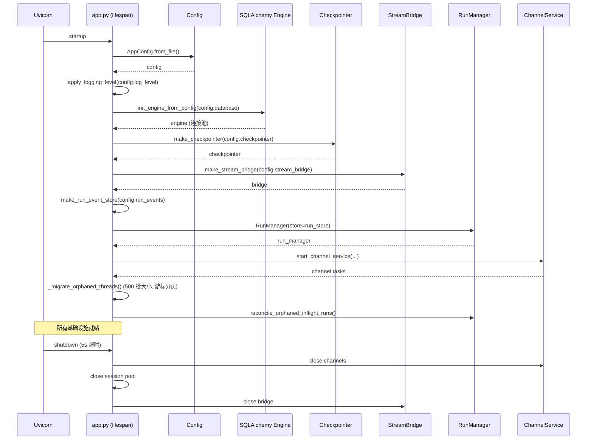

# 网关架构全景

## 文件

- `app/gateway/app.py` — FastAPI 应用 + lifespan
- `app/gateway/deps.py` — 依赖注入
- `app/gateway/health.py` — `/health`（liveness）与 `/health/ready`（数据库就绪探针）🆕
- `app/gateway/auth_middleware.py` — JWT 认证中间件
- `app/gateway/csrf_middleware.py` — CSRF 双重提交 Cookie 模式
- `app/gateway/internal_auth.py` — 内部服务认证
- `app/gateway/authz.py` — 基于角色的权限装饰器
- `app/gateway/services.py` — 后台服务编排
- `app/gateway/artifact_archive.py` — run 产出 ZIP 归档（fail-closed 构建）🆕
- `app/gateway/skill_export.py` — 自定义 Skill 导出 worker 与流式响应 🆕

## 认证流程

```mermaid
flowchart TD
    REQ[HTTP 请求] --> AM{AuthMiddleware}
    AM -->|Authorization: Bearer| JWT[JWT 验证]
    AM -->|X-DeerFlow-Internal-Token| IT[内部 Token 验证]
    AM -->|无认证| ANON[匿名 — 公开端点]

    JWT -->|有效| JWT_OK[设置 request.state.auth]
    JWT -->|过期/invalid| JWT_ERR[精细错误: token_expired/token_invalid/user_not_found]

    IT -->|匹配| IT_OK[内部服务 — 无用户上下文]
    IT -->|不匹配| IT_ERR[403]

    ANON -->|公开路径 ✅| PUB[允许通过]
    ANON -->|受保护路径 ❌| AUTH_ERR[401]

    JWT_OK --> CSRF{CSRFMiddleware}
    CSRF -->|有 Cookie + Header| CSRF_OK[传递]
    CSRF -->|不匹配 (常数时间比较)| CSRF_ERR[403]
    CSRF -->|豁免路径: /api/v1/auth/me, login, register| PASS[传递]

    JWT_OK --> AZ{authz 装饰器}
    AZ -->|owner_check| OWN[验证 user_id == resource.owner_id]
    AZ -->|require_existing| EX[缺失行 → 404 拒绝]
```

## Lifespan 启动序列



## 配置热重载边界

```mermaid
flowchart LR
    subgraph 重启必需
        DB[database.*]
        CP[checkpointer.*]
        RE[run_events.*]
        SB2[stream_bridge.*]
        SAND[sandbox.use]
        LOG[log_level]
        IM[channels.*]
    end

    subgraph 热重载
        MOD[models.*.max_tokens]
        SUM[summarization.*]
        TITLE[title.*]
        MEM[memory.*]
        SUB[subagents.*]
        TOOLS[tools[*]]
        PROMPT[system prompt]
    end

    CONFIG[config.yaml 变更] -->|下次请求| HR[get_app_config 返回新值]
    HR --> HOT[热重载字段生效]
    HR --> COLD[重启必需字段: 警告或忽略]
```

## 权限系统 (`authz.py`)

```python
@require_permission("threads", "write", owner_check=True, require_existing=True)
```

三种权限模式：

| 参数 | 行为 |
|------|------|
| 默认 | 检查请求者是否有指定权限 |
| `owner_check=True` | 验证 `request.state.auth.user_id` 与资源所有者匹配 |
| `require_existing=True` | 缺失行 → 404（静默拒绝，防止所有权枚举） |
| `require_existing=False` | 允许缺失行（旧版未跟踪线程的向后兼容） |

9 个已定义权限（`authz.py:149-158`：threads:read/write/delete、runs:create/read/cancel、projects:read/write/delete），授权关闭时所有已认证用户被授予全部。

## 内部认证 (通道 Worker)

IM 通道 worker 发送三头模式：

```
X-DeerFlow-Internal-Token: <auto-generated urlsafe(32)>
X-CSRF-Token: <value from csrf_token cookie>
Cookie: csrf_token=<value>

→ 内部 Token 绕过 JWT
→ CSRF Token/Cookie 对通过 CSRF 检查
→ 所有通道消息以 "default" 用户身份运行
```

## 线程元数据防伪造

```python
_SERVER_RESERVED_METADATA_KEYS = frozenset(["owner_id", "user_id"])
```

这些键通过 Pydantic `@field_validator` 从所有入站元数据中剥离。客户端无法伪造线程所有权。

## 日志注入防护

```python
def sanitize_log_param(value: str) -> str:
    return value.replace("\n", "").replace("\r", "").replace("\x00", "")
```

## 孤儿线程数据迁移

`_migrate_orphaned_threads()` 使用 **游标分页**（每批 500）迭代所有没有 `user_id` 的 LangGraph store 线程，并分配管理员账户。这是旧版本升级路径。

## 🆕 2.1 新增路由

| Router | 端点 | 说明 |
|--------|------|------|
| **Features** | `GET /api/features` | Config-gated feature flags（`agents_api`/`browser_control`/`mcp_tasks`/`subagent_batches`）供前端门控 |
| **Console** | `GET /api/console/stats`, `/runs`, `/usage` | 跨 thread 可观测性面板（需 SQL backend） |
| **Input Polish** | `POST /api/input-polish` | Composer 草稿润色（一次性 LLM，不创建 run） |
| **Channel Connections** | `GET/POST/DELETE /api/channels/*` | 用户绑定的 IM channel 连接管理 |
| **OIDC Auth** | `GET /api/v1/auth/oauth/{provider}`, `GET /api/v1/auth/callback/{provider}` | OIDC/SSO authorization code flow + session 管理 |
| **GitHub Webhooks** | `POST /api/webhooks/github` | HMAC 验证的 GitHub event 接收 |
| **Thread Branches** | `POST /api/threads/{id}/branches` | 从 checkpoint 分支创建新 main thread |
| **Manual Compaction** | `POST /api/threads/{id}/compact` | 手动上下文压缩 |
| **Thread Goal** | `GET/PUT/DELETE /api/threads/{id}/goal` | Goal continuation 管理 |
| **Subagents** | `GET/POST /api/subagents`，`PUT/DELETE /api/subagents/{name}` | 托管 subagent 目录 + admin 管理（managed-worker CRUD） |
| **Subagent Batches** | `GET /api/threads/{id}/subagent-batches[/{batch_id}...]` | 持久化原生 subagent 批进度/控制（pause/resume/cancel/retry、`results.jsonl` 导出） |
| **MCP Tasks** | `GET /api/threads/{id}/mcp-tasks[/{task_id}]`，`POST /{task_id}/cancel` | 长时 MCP 持久化任务的 owner-scoped 只读视图 + 取消 |

### 🆕 v2.1.0-rc0 新增路由（同步 #6）

| Router | 端点 | 说明 |
|--------|------|------|
| **Projects** | `POST/GET /api/projects`，`GET/PATCH/DELETE /api/projects/{id}`，`POST /{id}/archive`、`/{id}/restore`，`GET /{id}/threads`，`GET /config` | 项目工作区 CRUD + 归档/恢复 + 成员线程列表 + 配置界限（instructions/shelf 上限） |
| **Project Documents** | `GET/POST /api/projects/{id}/documents`，`POST /from-thread`，`POST /{doc}/attach-to-thread/{tid}`，`GET /{doc}/content`，`DELETE /{doc}` | Document shelf：上传（有界 staging）、从线程晋升、附加到线程、内容读取、删除（进 trash） |
| **Trash** | `GET /api/trash/documents`，`POST /documents/{id}/restore`、`/{id}/purge`，`POST /purge` | 回收站：列出/恢复/永久清除（单条+批量）。restore 是 DB 重指向（文件不移动）；purge 行锁事务内 unlink 原件+派生 markdown；`trash_retention_days` 保留期清扫兜底 |
| **User Preferences** | `GET/PATCH /api/v1/auth/preferences` | 账号级偏好持久化（跨浏览器，migration `0023_user_preferences`），前端 settings 同步的后端 |
| **PAT** | `routers/auth.py` 扩展（`auth/pat.py` 核心，migration `0017`） | Personal Access Tokens：程序化 API 访问的令牌签发/吊销 |
| **Skill Export** | `gateway/skill_export.py` | 自定义 skill 包导出 + revision-bound preview |
| **Artifact Archive** | `gateway/artifact_archive.py` | run 文件打包 zip 下载 |
| **Conversation Access/Reader** | `gateway/conversation_access.py`、`conversation_reader.py` | run context 携带 `conversation_references` 的归属与分页读取（供 `read_conversation` 工具，owner 校验每次读取都做） |
| **Upload Ingestion** | `gateway/upload_ingestion.py` | 上传摄取统一入口（去重文件名 255 字节上限） |
| **Readiness** | `GET /health/ready` | 公开无认证探针，探测 Gateway 实际使用的持久化（DB bootstrap 状态）——`make up` 就绪等待用它 |

其他 rc0 Gateway 行为：**idempotent thread runs**（同 run key 重试不重复执行）、**paginated thread run history**（`thread_runs.py` 大改，migration `0023_run_change_seq` 支持稳定分页游标）、renamed thread title 全端同步。

### 🆕 v2.1.0 补丁版变更（同步 #7，upstream #5535 / #5517）

`DELETE /api/threads/{id}` 的清理语义被补全（此前只删文件系统数据 + checkpoints + thread_meta）：整个清理过程持有一条 **durable `delete` reservation**，然后按顺序清除

**文件系统 thread 数据 → checkpoints → 历史 run 行 → run events → feedback → `threads_meta` 行 → 关闭残留 browser session**

其中 filesystem 那步不是 best-effort（`_delete_thread_data()` 会把 `ValueError` 映射成 422、其他异常映射成 500 直接中止），其余各步 best-effort。

关键点：

- 历史 run 行只删 `operation_kind == "run"` 的（`RunRepository.delete_by_thread()`）——**保护本次请求的那条 reservation 行必须活到 `reserve_thread_operation()` 退出**，否则 DELETE 会在中途丢掉自己的跨 worker 互斥；批量删也**故意不 bump run-change clock**（顺带绕开 #5516 的 `run_change_clock` 缺失问题）。
- run events 是**用户可见的会话历史，不是缓存**：不清掉的话，被删线程的 feed 仍能通过 `GET /threads/{id}/messages` 读回来。事件存储的删除与写者共享同一串行域（见 [observability/02-run-events-and-journal.md](../../observability/02-run-events-and-journal.md)）。
- 所有者身份在请求开头**解析一次**：文件系统 bucket、runs / events / feedback、`threads_meta` 用同一个 `user_id`，各步骤不得各自解析作用域。
- 第三方（legacy）`RunEventStore` 的旧签名 `delete_by_thread(thread_id)` 仍兼容：Gateway 先 `inspect.signature` 探测，只有签名接受 `user_id` 时才传；探测失败或后端内部抛出的 `TypeError` 不会触发重试。
- **边界**：本清理只删"已存在的行"，不负责阻止一个**已被准入**的写者在线程删除后把状态写回来——那是 thread incarnation 的独立契约。详见 [internals/runtime/05-run-ownership-and-rollback.md](../../internals/runtime/05-run-ownership-and-rollback.md)、[internals/persistence/db-checkpointer-store-backends.md](../../internals/persistence/db-checkpointer-store-backends.md)。

同一套 thread-operation reservation 也覆盖 **run 之外的 checkpoint 写入**：`services.reserve_checkpoint_write()`（`app/gateway/services.py:98`）组合进程内 `goal_thread_lock()` 与 durable `checkpoint_write` reservation，被手动 compaction、`POST /api/threads/{id}/state`、`PUT`/`DELETE /api/threads/{id}/goal`、以及 `/history` 归因回写后台任务使用；已有 run 挡住写入，该 reservation 也挡住新的 reject/interrupt/rollback run（跨 worker），冲突返回 409。

同一补丁版还把 `RunChangeClockRow` / `UserPreferenceRow` 补进 ORM 模型注册表，并用 `0025_repair_run_change_seq` 修复被"插队"的 `0023_run_change_seq` 留下的 schema 空洞（upstream #5517，见 persistence digest 迁移一节）。

## 🆕 Cache-aware Cost Accounting

Console 的 cost estimation 支持 **cache-aware pricing**：

- `RunJournal` 从 `usage_metadata.input_token_details.cache_read` 提取 prompt-cache hit tokens
- 存入稀疏 `cache_read_tokens` bucket（按 model name keyed）
- Cache-hit input tokens 按 `input_cache_hit_per_million` 定价
- 未配置 `input_cache_hit_per_million` → 退化为 miss price（保守上界）
- Legacy rows（无 cache 数据）→ 回退到 run-level totals
- 无定价配置的 model → `cost: null`

这使得 Console `/usage` 的 per-model cost breakdown 能区分缓存命中和未命中的实际成本。

## 🆕 Gateway contribution points（打包扩展接线）

`create_app()` 是打包扩展唯一的 Gateway 接线点（`app/gateway/app.py:740-886`），加载模型见 [../../internals/harness-hooks/09-packaged-extensions.md](../../internals/harness-hooks/09-packaged-extensions.md)：

1. **加载一次**：`get_app_config().plugins` 解析配置的 plugin 列表（config.yaml 缺失/损坏是配置失败，不是扩展失败，不套 fail-open guard）→ `load_extensions(configured_plugins)`。`required: true` 的扩展失败时 `ExtensionLoadError` 直接中止启动；可选扩展 fail-open。
2. **两个暴露面**：结果同时存入进程级单例 `set_loaded_extensions()` 和 `app.state.extensions`；`app.state.extension_diagnostics` 是规范 live 诊断列表（`record_runtime_diagnostics()`）。
3. **Principal resolver**：`create_app()` 在 `AuthMiddleware` 之后、贡献路由 mount 之前，把一个 `_resolve_extension_principal(request)` 装到 `app.state`（key = `EXTENSION_PRINCIPAL_RESOLVER_KEY`）。它把 `request.state.user` **投影**成中性 `ExtensionPrincipal`（user_id / is_admin / is_internal / roles），而不是把 host 的 `AuthContext` 句柄交给扩展。
4. **贡献路由最后 mount**：`include_contributed_routers(app, loaded_extensions)`（`deerflow/extensions/gateway.py`）在所有 host 路由（含 `/health`、条件路由）之后执行，host 处理器总是赢；确定阴影被原子拒绝。FastAPI 按注册顺序分发，所以“最后 mount”就是优先级保证。
5. **Service 生命周期**：`start_services` 在持久化引擎 + session factory 就绪后按注册顺序启动，`stop_services` 在 run/subagent drain 之后、store/checkpointer/engine teardown 之前逆序停止（每个 stop 独立有界超时）。
6. **通知 loop**：Gateway 注册一个 canonical extension-notification loop，await 的 lifecycle 钩子与 async system 观察都派发到它；同步 system 回调 fire-and-forget 提交。shutdown 先停止接受 detached 观察，再 memory flush，最后等 in-flight run/subagent drain 才 reset loop。

配套 feature flag：`GET /api/features` 现在上报 `mcp_tasks`（`app.state.mcp_tasks_available`，startup-scoped）与 `subagent_batches`（`repository_available` 与 `worker_running` 分离，worker 停了不隐藏历史/导出），供前端门控。

## 🆕 `/health/ready` 数据库就绪探针

`app/gateway/health.py`（#5166）— `GET /health` 保持纯 liveness 信号（进程活着即 200）；`GET /health/ready` 额外并发探测 Gateway 实际依赖的**两个**持久化后端：

| 探针 | 目标 |
|------|------|
| `database` | `database:` 背后的 ORM engine（应用仓储），`SELECT 1` |
| `checkpointer` | 生效的 LangGraph checkpointer/Store 后端（legacy `checkpointer:` 段优先，否则从 `database:` 派生；memory/sqlite/postgres） |

- 单端点 deadline **3s**（`_READINESS_DEADLINE_SECONDS`）覆盖两个并发探针（健康响应耗时不叠加），单探针 **2s**（`_PROBE_TIMEOUT_SECONDS`）；任一 `unreachable` → **503 `degraded`**，否则 200 `ready`
- checkpointer 配置从 **startup 快照**解析（`app.state.checkpointer_config`，`resolve_checkpointer_config` 镜像 runtime 的选择）——探测热重载后的配置可能查到运行进程根本没在用的后端；解析失败 **fail closed** 为 `unreachable` 而非 `not_configured`
- `backend=memory` 与进程内 SQLite（`:memory:`/`mode=memory`）→ `not_configured`（无外部可探）；SQLite 磁盘库用 `mode=rw` **非创建**打开——缺失的库文件报 unreachable，探针绝不重建它
- `/health/ready` 经 `/health` 前缀公开无认证 → 所有开连接的探针经 per-event-loop `asyncio.Lock`（`_PROBE_GATES`，WeakKeyDictionary）**串行化**，并发探针/攻击者无法打开无限个新 PostgreSQL 连接；等待者仍被端点 deadline 甩掉

## 🆕 Projects（项目工作区）

`app/gateway/routers/projects.py`（#5265）+ `deerflow/persistence/projects/` + migrations `0019_projects` / `0020_threads_meta_project_id` — 在 thread 之上引入"项目"组织维度（Phase 1 仅组织，无文档/回收站）：

- **Thread→project 归属只在三个入口写入**：thread 创建（`POST /api/threads` 带服务端校验的 `project_id`，`ProjectNotAssignableError` → 404 fail closed，缺失/他人/已归档项目不可区分）、分支创建（新行继承源 thread 的 project；归档/已删项目**降级为未归属**而非失败）、显式移动（`POST /api/threads/{id}/move`，组织性操作，历史/run state/文件全不动）；run admission 从不改归属
- `deerflow_project_id` 是 `threads_meta.project_id` 列的 server-reserved **只读**暴露键，客户端写入被剥离
- `/api/projects` CRUD + `POST /{id}/archive|restore` + `GET /{id}/threads`（分页，且只列**未归档**成员——与侧边栏 `archived: false` 一致，归档 chat 只能从全局 Archived 标签回来）
- thread `/search` 支持三态 project 过滤（键缺省=不过滤；**显式 null=仅未归属**；字符串=该 project 成员）与 `archived` 三态过滤

## 🆕 Thread 归档与运行历史分页

- **归档/恢复**（#5236）：`PATCH /api/threads/{id}` 的 metadata `deerflow_archived` 布尔键（server-reserved，非布尔 422）；pin/unpin、archive/restore 属于组织性 PATCH，**不 bump `updated_at`**（与会话活跃度契约分离）
- **Keyset 运行历史**（#5283）：`GET /api/threads/{id}/runs/page` — newest-first 游标分页 `{data, has_more, next_before_created_at, next_before_run_id}`；两个游标字段必须成对提供，否则 422

## 🆕 Artifact 归档 ZIP 下载

`app/gateway/artifact_archive.py`（#5117）+ `POST /api/threads/{id}/runs/{rid}/artifacts/archive`（`GET` 同路径返回 `file_count` manifest）— 把一次**已结束** run 的 `present_files` 产出打成 ZIP：

- **Fail-closed 成员校验**：仅 `/mnt/user-data/outputs/` 下常规文件；拒绝符号链接/junction、`..`/空段、Windows 保留设备名与非法字符、控制字符（白名单 U+200C/U+200D）、`.artifact-edit-` 临时前缀、中间 `.skill` 目录段；NFC+casefold 冲突检测
- **边界**：≤50 文件 / 单文件 50MiB / 总量 100MiB / 条目名 1KiB / 构建 60s deadline（超时 503）；Gateway 侧 `Semaphore(4)` 限并发构建（满时 429）
- **TOCTOU 防御**：`O_NOFOLLOW|O_NONBLOCK` 打开 + 拷贝前后 fstat 身份复验（dev/ino/nlink/size/mtime）+ 全量 SHA-256 复核 + 逐路径组件 lstat 复验；路径清单来自 run 的 `run.delivery` 事件，run 未结束 409

## 🆕 Skill 导出路由

`app/gateway/skill_export.py`（#5332）+ `GET /api/skills/custom/{name}/export-manifest`（revision 绑定的预览 manifest：文件/目录/字节计数、requirements、warnings/blockers）与 `GET /api/skills/custom/{name}/export`（下载 `.skill` ZIP）：

- 每进程**全用户共享 2 个导出槽**（`BoundedSemaphore(2)`，满时 429 `skill_export_busy`）；lease 与结果同进同退，失败路径 drain 后释放
- **取消安全**：文件 IO worker 用 `asyncio.shield` + drain 反复吸收取消——取消 asyncio future 不会停掉 IO worker，重复取消绝不空放槽位或关闭仍在用的文件
- 传输侧 `SkillExportResponse`：120s **idle** 超时（每次 transport 成功 accept 后重排，慢但健康的客户端能完成）；超时按 `ClientDisconnect` 中止——不报成功、不给部分 ZIP 补 JSON

## 🆕 运行幂等与 SSE join 语义

- **幂等 thread runs**（#5258）：thread-scoped 创建端点（`/runs`、`/runs/stream`、`/runs/wait`）接受 `Idempotency-Key` 头；Gateway 把调用方键与 owner+thread_id 一起哈希后进进程级索引（外部裸键绝不能直接进索引）。同键复用但 input/assistant_id 不同 → 409；复用的 `/wait` 返回持久 `status`/`error`（绝不序列化可能已被后续 run 推进的最新 checkpoint）；创建端点复用终态记录且流已消失时发 SSE `gap`/`stream_replay_gap`（`recovery: reload_durable_state`）——观察者 join 仍发 `end`。Stateless `/api/runs/*` 不在此契约内（无显式 thread 的请求会先建临时 thread）
- **GET stream join 只读**（#5092）：`GET /{id}/runs/{rid}/stream` 对 `action` 参数 **405**（SameSite=Lax 下跨站顶层安全导航仍带 session cookie，必须在所有权检查之前拒绝状态变更）；`GET join` 与无 action 的 stream 均为只读观察（`apply_on_disconnect=False`）——观察者断开绝不触发创建者的 cancel-on-disconnect。观察者断连语义由 `tests/test_sse_observer_disconnect.py` 钉住
- **Stateless 端点强制 run-create 授权**（#5030）：`POST /api/runs/stream|/wait` 要求 `runs:create`，可选 body `thread_id` 做 owner 检查
- **事件分页之外的精确 history 归因**（#4953）：`POST /threads/{id}/history` 对 duration 元数据缺失/legacy 的 AI 消息，经 `find_latest_ai_message_run_ids`（事件存储上有界窗口回溯分页）把 message id 精确归因到 run_id，并以后台任务把精确归因与 duration 写回 checkpoint（read-on-read 迁移，含"无事件"负缓存条目避免重复扫描）；精确查找失败时降级为**移除**综合 run_id（响应不完整优于确定性错误）

## 🆕 扩展原地升级与配置中间件构造参数

- **扩展原地升级保留私有配置**（#5347）：`deerflow extensions upgrade SOURCE` = `install(replace=True)` —— staging 目录 + rename 原子替换受管源码快照（失败恢复现场），并保留该扩展在 `plugins:` 里的私有 `config` 与 enabled 状态（`preserve_enabled=True`）
- **配置声明的中间件支持构造 kwargs**（#5312）：`extensions.middlewares` 条目可以是 `module.path:ClassName` 字符串（保持零参构造）或 `{class, kwargs}` 对象；kwargs 必须是 JSON 类型（YAML 日期/时间戳强转为 ISO 字符串以对齐 JSON，拒绝 NaN 等非 JSON 值），未知字段与空 class path 在**配置校验期**失败，构造错误仍在 agent 创建时失败
