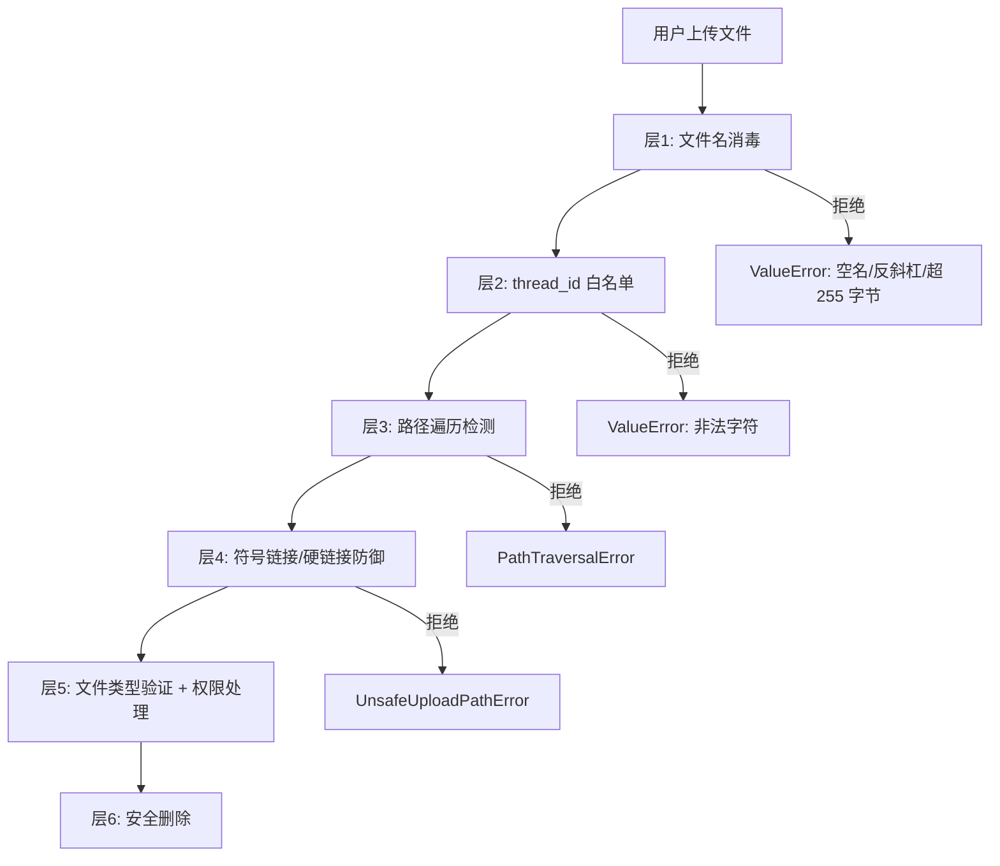
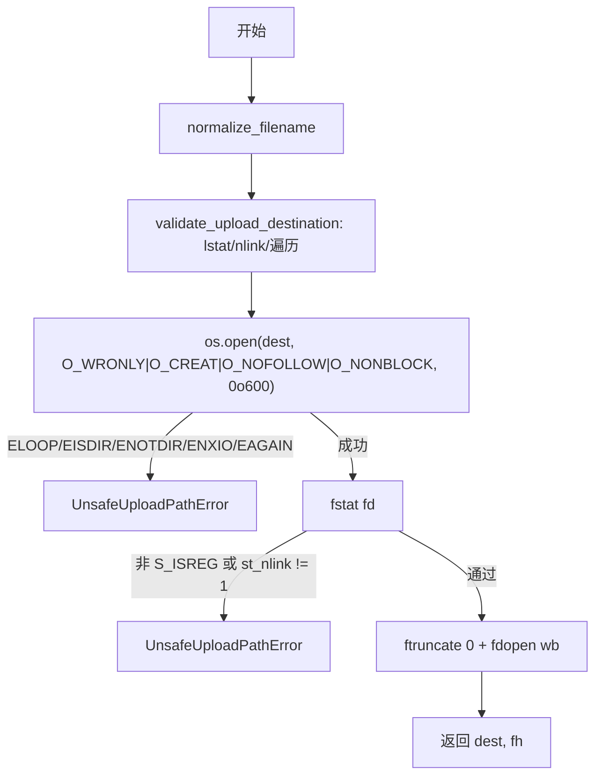
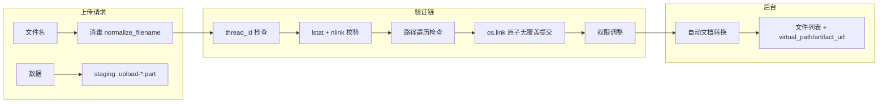

# 上传安全管道

## 文件

`packages/harness/deerflow/uploads/manager.py` (390 行，v2.1.0 实测) — 与 FastAPI 无关的纯业务逻辑。Gateway 侧的 HTTP 适配层在 `app/gateway/routers/uploads.py` 与 `app/gateway/upload_ingestion.py`（见 §HTTP 状态码）。

`manager.py` 公开入口（行号为 v2.1.0 实测）：

| 符号 | 行 | 作用 |
|------|----|------|
| `PathTraversalError(ValueError)` | `:19` | 路径逃出 base |
| `UnsafeUploadPathError(ValueError)` | `:23` | 目标不是独占常规文件 |
| `_MAX_FILENAME_BYTES = 255` | `:32` | 文件名 UTF-8 字节上限 |
| `UPLOAD_STAGING_PREFIX/SUFFIX = ".upload-" / ".part"` | `:29-30` | Gateway staging 文件命名 |
| `get_uploads_dir` / `ensure_uploads_dir` | `:35` / `:41` | 解析（并创建）thread uploads 目录，先 `validate_thread_id` |
| `normalize_filename` | `:48` | 层 1 文件名消毒 |
| `_fit_utf8_bytes` | `:76` | 按 UTF-8 边界截断（不劈开码点） |
| `claim_unique_filename` | `:84` | 层 4 去重命名（含字节预算） |
| `is_upload_staging_file` | `:124` | 识别 `.upload-*.part` |
| `validate_path_traversal` | `:129` | 层 2 路径遍历检测 |
| `validate_upload_destination` | `:141` | 打开**之前**的目的地校验（不改动已有文件） |
| `cleanup_stale_upload_staging_files` | `:165` | 启动时清扫硬崩溃残留的 staging 文件 |
| `open_upload_file_no_symlink` | `:191` | 层 3 符号链接/硬链接防御（POSIX 与 Windows 两条路径） |
| `write_upload_file_no_symlink` | `:279` | 上面的薄封装 |
| `list_files_in_dir` | `:287` | 列目录 |
| `delete_file_safe` | `:321` | 层 6 安全删除（含伴随 `.md`） |
| `upload_artifact_url` / `upload_virtual_path` / `output_artifact_url` / `output_virtual_path` / `enrich_file_listing` | `:355`–`:381` | URL/虚拟路径构造 |

## 防御层次

上传文件经过 6 层防御才能到达磁盘（**HTTP 上传**走的是「staging → 原子 link 提交」，见 §Gateway 的 staging 提交路径；`open_upload_file_no_symlink` 是**直接写入**路径的守卫）：



## 层 1：文件名消毒 (`normalize_filename()`，`:48-73`)

```python
_MAX_FILENAME_BYTES = 255            # :32

def normalize_filename(filename: str) -> str:
    if not filename:
        raise ValueError("Filename is empty")
    safe = Path(filename).name                     # 2. basename 提取
    if not safe or safe in {".", ".."}:
        raise ValueError(f"Filename is unsafe: {filename!r}")
    if "\\" in safe:                               # 4. 反斜杠拒绝（Linux 上 Path.name 会保留）
        raise ValueError(f"Filename contains backslash: {filename!r}")
    if len(safe.encode("utf-8")) > _MAX_FILENAME_BYTES:
        raise ValueError(f"Filename too long: {len(safe)} chars")   # 注意 detail 报的是「字符数」不是字节数
    return safe
```

### thread_id 白名单 (`validate_thread_id()`)

```python
# deerflow/utils/thread_id.py（不在 uploads/manager.py 里）
THREAD_ID_PATTERN = r"^[A-Za-z0-9_-]{1,64}$"   # 无点号，长度 1-64
_THREAD_ID_RE = re.compile(THREAD_ID_PATTERN)

def validate_thread_id(thread_id: str) -> str:
    if not isinstance(thread_id, str) or _THREAD_ID_RE.fullmatch(thread_id) is None:
        raise ValueError("Invalid thread_id: expected 1-64 ASCII letters, digits, hyphens, or underscores")
    return thread_id
```

`get_uploads_dir()`（`:35`）第一件事就是 `validate_thread_id(thread_id)`，所以非法 thread_id 永远不会被插进主机路径。

## 层 2：路径遍历检测 (`validate_path_traversal()`，`:129-138`)

```python
def validate_path_traversal(path: Path, base: Path) -> None:
    try:
        path.resolve().relative_to(base.resolve())
    except ValueError:
        raise PathTraversalError("Path traversal detected") from None
```

使用 `Path.resolve()`（解析所有符号链接和 `..`）进行真正的绝对路径比较，而不只是检查字符串前缀。

## 层 3：打开前目的地校验 (`validate_upload_destination()`，`:141-158`)

打开文件**之前**的三步校验（顺序重要，且**不改动**已存在的文件）：

```python
def validate_upload_destination(base_dir: Path, filename: str) -> Path:
    safe_name = normalize_filename(filename)
    dest = base_dir / safe_name
    try:
        st = os.lstat(dest)
    except FileNotFoundError:
        st = None
    if st is not None and not stat.S_ISREG(st.st_mode):
        raise UnsafeUploadPathError(f"Upload destination is not a regular file: {safe_name}")
    if st is not None and st.st_nlink > 1:                      # 硬链接拒绝
        raise UnsafeUploadPathError(f"Upload destination has multiple links: {safe_name}")
    validate_path_traversal(dest, base_dir)                     # 遍历检查放最后
    return dest
```

## 层 4：重复文件名处理 (`claim_unique_filename()`，`:84-121`)

```python
def claim_unique_filename(name: str, seen: set[str]) -> str:
    if name not in seen:
        seen.add(name)
        return name
    stem, suffix = Path(name).stem, Path(name).suffix
    counter = 1
    while True:
        tag = f"_{counter}"
        budget = _MAX_FILENAME_BYTES - len(tag.encode("utf-8")) - len(suffix.encode("utf-8"))
        if budget < 1:
            candidate = _fit_utf8_bytes(stem + suffix, _MAX_FILENAME_BYTES - len(tag.encode("utf-8"))) + tag
        else:
            candidate = f"{_fit_utf8_bytes(stem, budget)}{tag}{suffix}"
        if candidate not in seen:
            break
        counter += 1
    seen.add(candidate)
    return candidate
```

同一上传请求中的重复文件名通过 `_1`、`_2` 等后缀自动重命名，因此后续文件不会截断先前的文件。**去重后的名字仍受 255 字节上限约束**：当追加 `_N`（并保留扩展名）会超限时，stem 会在 UTF-8 边界上被截断让位（否则一个最长长度的上传在碰撞后会产生文件系统与后续 `normalize_filename` 都会拒绝的名字）。

## 层 5：符号链接 / 硬链接防御 (`open_upload_file_no_symlink()`，`:191-276`)

这是整个上传管道中**最关键的安全功能**。

### 威胁模型

上传目录可能被挂载到本地沙箱中。恶意沙箱进程可以在未来上传文件名的位置放置符号链接。普通的 `Path.write_bytes()` 会跟随该链接，以 gateway 权限覆盖上传目录之外的文件。

### POSIX 路径（Linux/macOS，`:210-235`）



关键的安全属性：

- `O_NOFOLLOW` 使 `open()` 在目标是符号链接时以 `ELOOP` 失败 — **完全消除**该处 TOCTOU 窗口（并额外带上 `O_NONBLOCK`，避免 FIFO/设备文件把打开挂住）
- 打开后 `fstat` 确认文件描述符指向**独占**常规文件（`st_nlink != 1` 即拒绝）— 防硬链接攻击
- `ftruncate(fd, 0)` 确保文件为空 — 防追加投毒

### Windows 回退（`:237-276`）

Windows 缺乏 `O_NOFOLLOW`。回退策略：

1. 打开前 `lstat` — 拒绝非 `S_ISREG` 与 `st_nlink > 1`
2. **紧接着第二次 `lstat`**（进一步收窄窗口）后再 `open()`
3. 打开后 `fstat` — 额外防御（再次验证文件类型与链接计数）

路径遍历检查在此窗口期间减轻了 `base_dir` 逃逸，尽管它无法处理原子 `replace-with-symlink` 攻击。

## 层 6：安全删除 (`delete_file_safe()`，`:321-352`)

```python
def delete_file_safe(base_dir: Path, filename: str, *, convertible_extensions: set[str] | None = None) -> dict:
    file_path = (base_dir / filename).resolve()
    validate_path_traversal(file_path, base_dir)   # 先验证！

    if not file_path.is_file():
        raise FileNotFoundError(f"File not found: {filename}")

    file_path.unlink()

    if convertible_extensions and file_path.suffix.lower() in convertible_extensions:
        file_path.with_suffix(".md").unlink(missing_ok=True)

    return {"success": True, "message": f"Deleted {filename}"}
```

在取消链接之前，路径遍历检查确保被删除的文件在允许的目录内。注意 `convertible_extensions` 是**仅关键字**参数，函数**返回 dict**（不是路径）。

## Gateway 的 staging 提交路径（HTTP 上传，v2.1.0）

HTTP 上传**不再**直接调用 `open_upload_file_no_symlink` 写目标文件，而是「staging + 原子无覆盖 link 提交」（`app/gateway/upload_ingestion.py`）：

```
open()  → claim_unique_filename（在请求内去重）
        → run_file_io(uploads._prepare_upload_destination, ...)   写 .upload-*.part
        → 逐 chunk 累计 file_size / total_size，超限即 413
        → run_file_io(uploads._commit_upload_temp_no_overwrite, ...)  os.link 提交
            FileExistsError → 释出下一个 _N 后缀重试（staging 文件保留）
        → finalize(): 权限调整 + 非 mounted provider 的 sandbox 同步
```

对应实现与安全属性：

- `app/gateway/routers/uploads.py:245 _link_staged_no_overwrite()`、`:283 _commit_upload_temp_no_overwrite()` — 用 `os.link`（**no-overwrite**）而非 `rename`，目标已存在时抛 `FileExistsError` 触发重试，绝不静默覆盖
- `manager.py:124 is_upload_staging_file()` / `:165 cleanup_stale_upload_staging_files()` — staging 文件 `.upload-*.part` 对上传列表、agent 上传上下文、sandbox 列目录/搜索工具**隐藏**，Gateway 启动时清扫硬崩溃残留
- `uploads.py:202 _pure_destination()`、`:225 _prepare_upload_destination()`、`:245 _link_staged_no_overwrite()`（`UnsafeUploadPathError` 在 `:269` 抛）— 目标是目录/符号链接/多链接时拒绝
- 上传目录被挂载（`sandbox.thread_data_mounts: true`）时跳过 sandbox acquire/sync；非 mounted provider 走 `SandboxProvider.acquire_async()` 的 request lease

## HTTP 状态码（Gateway 层，v2.1.0 实测）

「与 FastAPI 无关」的 `manager.py` **不产生任何 HTTP 状态码**；状态码全部由 Gateway 适配层映射：

| 码 | 触发点 | detail 摘要 | 源码锚点 |
|----|--------|------------|---------|
| 400 | 未提供文件 | `No files provided` | `routers/uploads.py:376` |
| 400 | `service.open()` 的 `ValueError`（配置/目录初始化非法） | `str(e)` | `routers/uploads.py:392-393` |
| 400 | list 的 `ValueError` | `str(e)` | `routers/uploads.py:448-449` |
| 400 | delete：`PathTraversalError` | `Invalid path` | `routers/uploads.py:462-463` |
| 400 | delete：`normalize_filename` 的 `ValueError` | `str(e)` | `routers/uploads.py:464-465` |
| 404 | delete 时文件不存在（`FileNotFoundError`） | `File not found: <name>` | `routers/uploads.py:460-461` |
| **413** | 文件数 > `uploads.max_files`（默认 **10**） | `Too many files: maximum is <n>` | `routers/uploads.py:379-380`（默认值 `:66`） |
| **413** | 单文件 > `uploads.max_file_size`（默认 **50 MiB**） | `File too large: <safe_name>` | `app/gateway/upload_ingestion.py:200-201`（默认值 `routers/uploads.py:67`） |
| **413** | 单请求总量 > `uploads.max_total_size`（默认 **100 MiB**） | `Total upload size too large` | `app/gateway/upload_ingestion.py:202-203`（默认值 `routers/uploads.py:68`） |
| 500 | 摄取过程中的其它异常（已 `cleanup_written()`） | `Failed to upload <name>: <e>` | `routers/uploads.py:409-412` |
| 500 | delete 的其它异常 | `Failed to delete <name>: <e>` | `routers/uploads.py:466-468` |
| — | `UnsafeFilenameError`（文件名消毒失败） | **静默跳过**（记 warning，计入 `skipped_files`，不算错误） | `routers/uploads.py:399-401` |
| — | `UnsafeUploadDestinationError` | **静默跳过**并加入 `skipped_files`（`success=false`） | `routers/uploads.py:402-405` |

> 上传/列表/删除的线程鉴权：`require_permission("threads", "write"|"read"|"delete", owner_check=True)` — 未认证 **401**、owner 不匹配 **404**（`uploads.py:357/432/443/456`）。项目 shelf 的同类上传在 `routers/project_documents.py:194/306` 也是 **413**，但 `UnsafeFilenameError`/`UnsafeUploadDestinationError` 在那里映射 **500**（`:385`、`:388`）。
>
> 配置键兼容：`_get_upload_limit()`（`uploads.py:168`）接受 legacy key `max_file_count` → `max_files`、`max_single_file_size` → `max_file_size`。

## 上传管道总结


