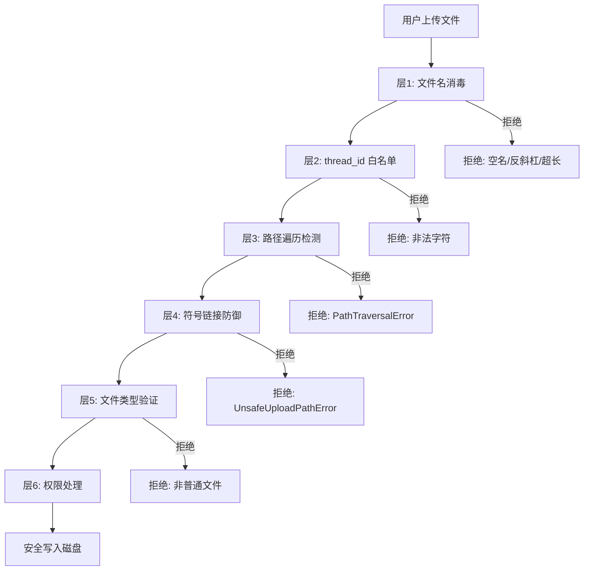
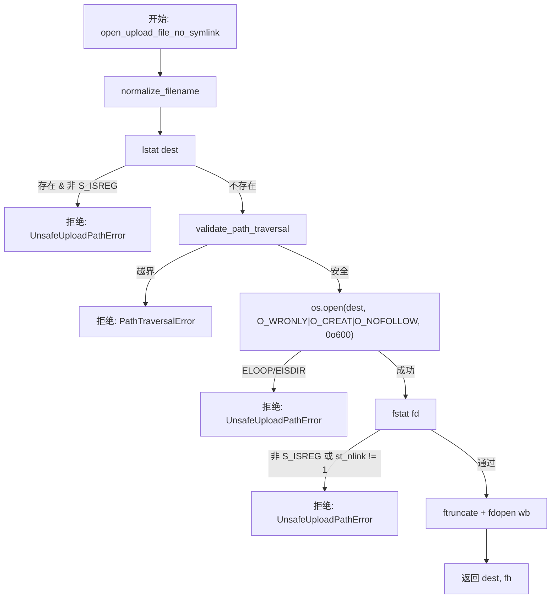
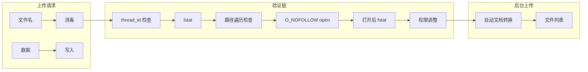

# 上传安全管道

## 文件

`deerflow/uploads/manager.py` (311 行) — 与 FastAPI 无关的纯业务逻辑

## 防御层次

上传文件经过 6 层防御才能到达磁盘：



## 层 1：文件名消毒 (`normalize_filename()`)

```python
def normalize_filename(filename: str) -> str:
    # 1. 空名拒绝
    if not filename:
        raise ValueError("Filename is empty")

    # 2. basename 提取 — 剥离目录组件
    safe = Path(filename).name

    # 3. 特殊名拒绝
    if not safe or safe in {".", ".."}:
        raise ValueError(f"Filename is unsafe: {filename!r}")

    # 4. 反斜杠拒绝 — 在 Linux 上，Path.name 将反斜杠作为字面字符保留
    if "\\" in safe:
        raise ValueError(f"Filename contains backslash: {filename!r}")

    # 5. 长度限制 — 255 字节 UTF-8
    if len(safe.encode("utf-8")) > 255:
        raise ValueError(f"Filename too long: {len(safe)} chars")

    return safe
```

### thread_id 白名单 (`validate_thread_id()`)

```python
_SAFE_THREAD_ID = re.compile(r"^[a-zA-Z0-9._-]+$")

def validate_thread_id(thread_id: str) -> None:
    if not thread_id or not _SAFE_THREAD_ID.match(thread_id):
        raise ValueError(f"Invalid thread_id: {thread_id!r}")
```

## 层 2：路径遍历检测 (`validate_path_traversal()`)

```python
def validate_path_traversal(path: Path, base: Path) -> None:
    try:
        path.resolve().relative_to(base.resolve())
    except ValueError:
        raise PathTraversalError("Path traversal detected") from None
```

使用 `Path.resolve()`（解析所有符号链接和 `..`）进行真正的绝对路径比较，而不只是检查字符串前缀。

## 层 3：符号链接防御 (`open_upload_file_no_symlink()`)

这是整个上传管道中**最关键的安全功能**。

### 威胁模型

上传目录可能被挂载到本地沙箱中。恶意沙箱进程可以在未来上传文件名的位置放置符号链接。普通的 `Path.write_bytes()` 会跟随该链接，以 gateway 权限覆盖上传目录之外的文件。

### POSIX 路径（Linux/macOS）



关键的安全属性：
- `O_NOFOLLOW` 使 `open()` 在目标是符号链接时以 `ELOOP` 失败 — **完全消除** TOCTOU 窗口
- `fstat` 后验证确认打开的文件描述符指向独占常规文件 (`st_nlink == 1`) — 防止硬链接攻击
- `ftruncate` 确保文件为空 — 防止追加投毒

### Windows 回退

Windows 缺乏 `O_NOFOLLOW`。回退策略：
1. 打开前 `lstat` — 拒绝符号链接/硬链接
2. `open()` — 存在狭窄的 TOCTOU 窗口
3. 打开后 `fstat` — 额外防御（验证链接计数、文件类型）

路径遍历检查在此窗口期间减轻了 `base_dir` 逃逸，尽管它无法处理原子 `replace-with-symlink` 攻击。

## 层 4：重复文件名处理 (`claim_unique_filename()`)

```python
def claim_unique_filename(name, seen):
    if name not in seen:
        seen.add(name)
        return name
    stem, suffix = Path(name).stem, Path(name).suffix
    counter = 1
    while f"{stem}_{counter}{suffix}" in seen:
        counter += 1
    candidate = f"{stem}_{counter}{suffix}"
    seen.add(candidate)
    return candidate
```

同一上传请求中的重复文件名通过 `_1`、`_2` 等后缀自动重命名，因此后续文件不会截断先前的文件。

## 层 5：沙箱权限处理

上传的文件需要对沙箱进程可访问：

```python
# 可写：添加 world-writable 位
def _make_file_sandbox_writable(path):
    os.chmod(path, stat.S_IRUSR | stat.S_IWUSR | stat.S_IROTH | stat.S_IWOTH)

# 可读：添加 group/other 读位
def _make_file_sandbox_readable(path):
    os.chmod(path, st.st_mode | stat.S_IRGRP | stat.S_IROTH)
```

两者在修改权限前都会跳过符号链接。

## 层 6：安全删除 (`delete_file_safe()`)

```python
def delete_file_safe(base_dir, filename, convertible_extensions=None):
    file_path = (base_dir / filename).resolve()
    validate_path_traversal(file_path, base_dir)   # 先验证！

    if not file_path.is_file():
        raise FileNotFoundError(f"File not found: {filename}")

    file_path.unlink()

    # 清理伴随的 markdown（自动文档转换）
    if convertible_extensions and file_path.suffix.lower() in convertible_extensions:
        file_path.with_suffix(".md").unlink(missing_ok=True)
```

在取消链接之前，路径遍历检查确保被删除的文件在允许的目录内。

## 上传管道总结


