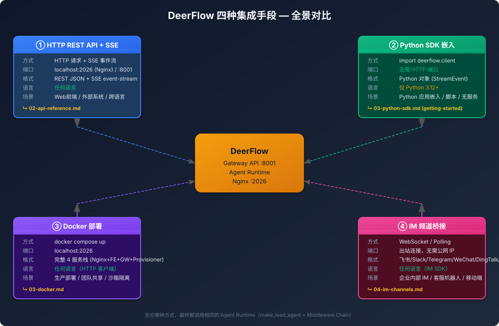

# 集成总览：4 种手段，一张图看懂

> **不读大块文章，先看图。**

---

## 全景图



---

## 一句话总结

| # | 手段 | 一句话 | 适合 |
|---|------|--------|------|
| ① | **HTTP API** | 发 HTTP 请求调 Agent，SSE 收流式结果 | 任何语言、Web 前端 |
| ② | **Python SDK** | `pip install` 后直接在代码里 `client.chat()` | Python 项目嵌入 |
| ③ | **Docker** | `make up` 一条命令，全套环境起来 | 生产部署、团队协作 |
| ④ | **IM 频道** | Agent 直接接入飞书/Slack/Telegram | 企业内部、移动端 |

---

## 决策树：你该选哪个？

```
                        "我要集成 DeerFlow"
                              │
              ┌───────────────┼───────────────┐
              │               │               │
         部署为主?        写代码为主?       对话为主?
              │               │               │
         ┌────┴────┐    ┌────┴────┐    ┌────┴────┐
         │ 生产环境 │    │ Python  │    │ IM 平台 │
         │ 团队共享 │    │ 项目    │    │ 移动端  │
         └────┬────┘    └────┬────┘    └────┬────┘
              │               │               │
              ▼               ▼               ▼
         ③ Docker         ② Python SDK    ④ IM 频道
        (然后接 ①)      (最简单直接)    (飞书/Slack/...)
              │               │               │
              └───────────────┼───────────────┘
                              │
                     底层都是 ① HTTP API
```

---

## 对比矩阵

| 维度 | ① HTTP API | ② Python SDK | ③ Docker | ④ IM 频道 |
|------|-----------|-------------|----------|-----------|
| **上手难度** | ⭐⭐ 需调 API | ⭐ 最简单 | ⭐⭐⭐ 需 Docker | ⭐⭐ 需配置 |
| **语言限制** | 无 | 仅 Python 3.12+ | 无 | 无 |
| **需要 Gateway 进程** | 是 | **否** | 已内置 | 是 |
| **部署复杂度** | 中 | 低 | 低 (make up) | 中 |
| **流式支持** | SSE | StreamEvent 生成器 | SSE | SSE/轮询 |
| **沙箱隔离** | 依赖 Gateway 配置 | 依赖 Gateway 配置 | ✅ Docker 隔离 | 依赖 Gateway 配置 |
| **认证** | JWT / OAuth | 无（本地） | JWT / OAuth | 平台自有 |
| **生产就绪** | 需自己搭 | 仅嵌入式 | ✅ 开箱即用 | ✅ |
| **典型场景** | Web 应用 | 脚本/CLI/嵌入 | 团队部署 | 企业内部 |

---

## 四种手段的本质

```
  ┌─────────────────────────────────────────────────────────┐
  │                                                         │
  │  ② Python SDK ────── 直接调用 ──────┐                   │
  │                                      │                  │
  │  ① HTTP API  ──── REST/SSE ─────►  AGENT RUNTIME       │
  │                                      │                  │
  │  ④ IM 频道   ──── langgraph-sdk ────┘                  │
  │       (内部也是 HTTP API)                               │
  │                                                         │
  │  ③ Docker ──── 容器化 ① + Frontend + Nginx             │
  │       (本质是部署了整套 ①)                               │
  └─────────────────────────────────────────────────────────┘
```

**核心事实**：无论哪种手段，最终调用的都是同一个 Agent Runtime。
- ① HTTP API — 通过网络调
- ② Python SDK — 直接内存调（同进程）
- ④ IM 频道 — IM 消息触发，内部用 langgraph-sdk 调 ①
- ③ Docker — 把 ① 和前端打包成容器

---

## 每种手段的最小启动代码

### ① HTTP API

```bash
# 启动 Gateway（假设已有 config.yaml）
make dev

# 另开一个终端
curl -X POST http://localhost:8001/api/threads/test/runs/stream \
  -H "Content-Type: application/json" \
  -d '{"input":{"messages":[{"role":"user","content":"Hello"}]}}'
```

### ② Python SDK

```python
from deerflow.client import DeerFlowClient

client = DeerFlowClient()
response = client.chat("Hello")
print(response)
```

只需要 3 行代码，不需要启动任何服务。

### ③ Docker

```bash
make config     # 首次：生成 config.yaml
make up         # 构建 + 启动
open http://localhost:2026
```

### ④ IM 频道

```yaml
# config.yaml 添加:
channels:
  feishu:
    enabled: true
    app_id: $FEISHU_APP_ID
    app_secret: $FEISHU_APP_SECRET
```

然后用户直接在飞书里 @机器人 聊天。

---

## 快速上手路径

```
想快速试玩?
  → ③ Docker (make up, 3 分钟)
  → 或 ② Python SDK (3 行代码)

想写 Web 应用?
  → ① HTTP API (REST + SSE)
  → 前端看: 03-api-reference.md

想嵌入 Python 项目?
  → ② Python SDK
  → 详看: 04-python-sdk.md

想部署到服务器?
  → ③ Docker (docker-compose up)
  → 详看: 05-docker.md

想接入企业 IM?
  → ④ IM 频道
  → 详看: 07-im-channels.md
```

---

## 深入各手段

| 手段 | 详细文档 | 相关配置 |
|------|----------|----------|
| ① HTTP API | [02-api-reference.md](02-api-reference.md) | `config.yaml` models |
| ② Python SDK | [03-python-sdk.md](../../getting-started/03-python-sdk.md) | 同 config.yaml |
| ③ Docker | [03-docker.md](03-docker.md) | `docker-compose.yaml` |
| ④ IM 频道 | [04-im-channels.md](04-im-channels.md) | `config.yaml` channels |
