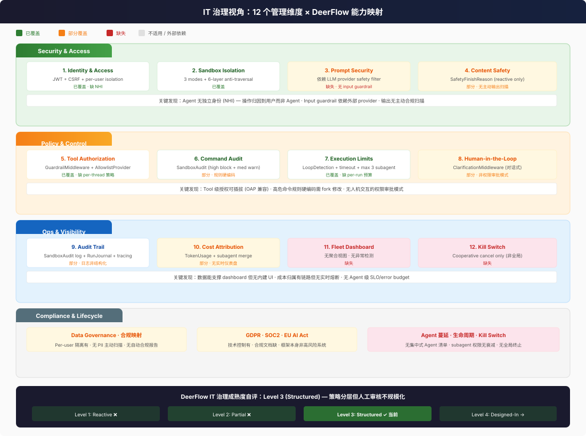
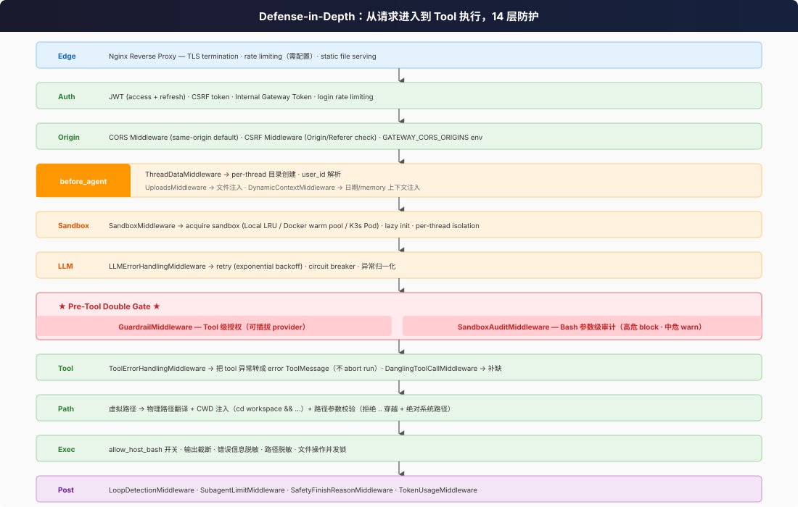

# IT 治理全景：Agent 时代的 12 个管理维度

2026 年是 Agent 治理的分水岭。EU AI Act 8 月生效，OWASP 在 2025 年 12 月发布了首个 Agentic AI Top 10，Gartner 预测到 2028 年 Fortune 500 每家跑 15 万+ agent。但 Deloitte 2026 年调查显示：**只有 21% 的企业有成熟的 Agent 治理体系**。

DeerFlow 作为一个 Agent 框架，不是完整的 IT 管理平台。但它内建了大量治理原语——理解这些原语在哪里、覆盖了什么、缺什么，是 IT 管理者评估部署风险的前提。

## 12 个 IT 管理维度 × DeerFlow 能力矩阵

| # | 维度 | 核心问题 | DeerFlow 能力 | 缺口 |
|---|------|---------|-------------|------|
| 1 | **Identity & Access** | Agent 用谁的身份跑？ | JWT + CSRF + internal gateway token + per-user isolation | 无 Agent 独立身份（NHI），agent 继承用户权限 |
| 2 | **Sandbox Isolation** | Agent 能碰到系统文件吗？ | 3 种沙箱模式 + 6 层路径防穿透 + per-thread 隔离 | Local 模式共享 host 内核 |
| 3 | **Tool Authorization** | 谁能决定 agent 调什么 tool？ | GuardrailMiddleware（可插拔 provider）+ AllowlistProvider | 无 per-thread 策略、无 subagent 区分 |
| 4 | **Command Audit** | bash 里能写危险命令吗？ | SandboxAuditMiddleware（高危 block + 中危 warn） | 规则硬编码，不可配置 |
| 5 | **Execution Limits** | Agent 能无限跑下去吗？ | LoopDetection（循环检测）+ SubagentLimit（并发≤3）+ timeout（15min） | 无 per-run 预算上限 |
| 6 | **Content Safety** | Agent 输出有害内容怎么办？ | SafetyFinishReasonMiddleware（被动清除被污染的 tool_calls） | 无主动输出扫描；无独立 input guardrail |
| 7 | **Audit Trail** | 出事了能查到谁干的吗？ | SandboxAudit logger + RunJournal + tracing (Langfuse/LangSmith) | 审计日志非结构化；Guardrail deny 不写 RunJournal |
| 8 | **Cost Attribution** | Agent 花了多少钱？ | TokenUsageMiddleware + subagent usage 合并 + per-model stream_usage | 无实时成本仪表盘；无 per-agent 预算 |
| 9 | **Observability** | Agent 现在在干什么？ | StreamBridge SSE events + heartbeat + tracing spans | 无 agent 行为异常检测；无 fleet dashboard |
| 10 | **Data Governance** | 用户数据隔离吗？PII 安全吗？ | Per-user 存储 + 虚拟路径 + host 路径脱敏 + 文件上传安全 | 无 PII 主动扫描；无数据分类标签 |
| 11 | **Reliability** | Agent 挂了怎么恢复？ | LLMErrorHandlingMiddleware (retry + circuit breaker) + ToolErrorHandlingMiddleware + 熔断 | 无 agent 级 SLO；无 error budget；无 chaos engineering |
| 12 | **Lifecycle** | Agent 怎么上线、回滚、下架？ | Config hot-reload + skills 生命周期 + agent config 热更新 | 无 agent 版本管理；无灰度发布；无 kill switch |

## 行业对标：DeerFlow 处于哪个成熟度？

| 成熟度 | 描述 | DeerFlow 自评 |
|--------|------|-------------|
| Level 1: Reactive | 事后人工审核，无自动控制 | — |
| Level 2: Partial | 输出过滤，全局策略，无决策级审计 | — |
| **Level 3: Structured** | 多策略分层，但人工审核不规模化 | **← DeerFlow 大致在这里** |
| Level 4: Designed-In | 实时强制执行，决策级审计，per-agent 域隔离，按需合规报告 | 部分达到（Guardrail 实时 deny，SandboxAudit 实时 block） |

DeerFlow 在 **tool 执行时拦截**的能力较强（Level 4），但在 **审计可追溯**和 **合规自动化**方面偏弱（Level 2-3）。整体处于 3 级偏上。

## Defense-in-Depth 全景

从请求进入到 agent 执行 tool，DeerFlow 在每一层都有对应的防护：

## 从 IT 管理者视角看：最该担心的 3 件事

### 1. Agent 权限继承问题

Agent **没有独立身份**。它在 user 的上下文里跑，继承 user 看到的一切。这意味着：
- 如果一个用户有写权限，agent 就能写
- No-auth 模式下所有人都用 `default` user，无法区分操作来源
- 无法实现 "agent A 只能读，agent B 可以写" 的细粒度权限

### 2. 审计 gap

Guardrail 的 deny 决定没有写入结构化的 RunJournal。SandboxAudit 的日志是纯文本 logger.info。Tracing 依赖 Langfuse/LangSmith 的外部配置。如果你被合规审计要求提供 "某个时间段内 agent 被拒绝了哪些操作"——目前你需要 grep 日志文件，而非打开一个仪表盘。

### 3. 成本失控风险

Agent 可以无限循环（LoopDetection 能检测重复模式但首次检测需要若干轮）。Subagent dispatch 没有预算上限。Token 消耗是事后统计的，没有实时熔断。一个配置不当的 agent + 一个复杂的用户请求 = 一次昂贵的 token 账单。
