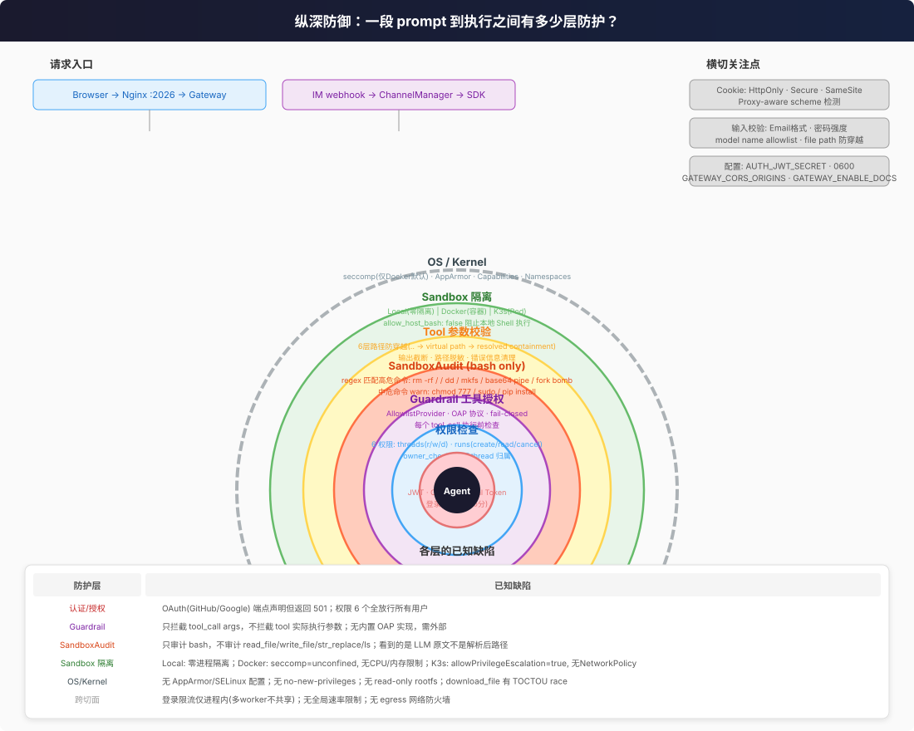

# 安全全景

一段用户 prompt 到 `rm -rf /` 被执行 — 中间到底隔了多少层防护？

## 核心问题

| 问题 | 答案 |
|------|------|
| **纵深多少层？** | 粗粒度 7 层 / 细粒度 14 层。详见 [04-trust-boundary.md](04-trust-boundary.md) 逐层代码定位 |
| **五种沙箱差多少？** | Local(零隔离) → Docker(容器,但 seccomp=unconfined) → K3s(Pod,有资源限制但 allowPrivilegeEscalation) |
| **三种认证方式的区别？** | Browser(JWT+CSRF) → Internal(共享 token,跳过全部检查) → IM Channel(已有签名+内部 token) |
| **Guardrail 拦截什么？** | 可插拔的 tool_call 执行前授权检查；内置 AllowlistProvider；默认 fail-closed |
| **哪些命令会被审计拒绝？** | `rm -rf /`、`dd if=`、`mkfs`、base64 管道执行、fork bomb 等 ~20 种高危模式 |
| **最大的安全短板？** | OAuth 未实现；权限全放行；Docker seccomp=unconfined；K3s 无 NetworkPolicy；登录限流单进程 |

---

## 纵深防御全景

粗粒度 7 层同心圆，从外到内逐层收窄（细粒度 14 层见 [04-trust-boundary.md](04-trust-boundary.md)）：

| 层 | 拦截什么 | 失效后果 |
|----|---------|---------|
| **Auth** | 无凭据的请求 | 任何人都能调 API |
| **Permissions** | 别人的 thread/run | 用户间数据泄露 |
| **Guardrail** | 未授权的 tool | LLM call 任意 tool |
| **SandboxAudit** | 高危 bash 命令 | `rm -rf /` 被执行 |
| **Tool 校验** | 路径穿越、过大输出 | 读越界文件、OOM |
| **Sandbox 隔离** | 逃逸到 host | host 被控制 |
| **OS/Kernel** | 内核漏洞利用 | 整机沦陷 |

---

## 三条认证路径

| 路径 | 认证方式 | 用户标识 | 适用场景 |
|------|---------|---------|---------|
| **Browser** | JWT cookie + CSRF double-submit | 登录用户 ID | Web UI |
| **Internal** | `X-DeerFlow-Internal-Token` | `"default"` | 组件间调用 |
| **IM Channel** | 平台签名 + Internal Token + CSRF | `"default"` | 飞书/Slack/Telegram |

Internal 路径的 `DEER_FLOW_INTERNAL_AUTH_TOKEN` 在模块加载时自动生成（`secrets.token_urlsafe(32)`），多 worker 部署必须手动设同一个值。

---

## 沙箱隔离速览

| 维度 | Local | Docker | K3s |
|------|-------|--------|-----|
| 进程隔离 | 无 | 容器 namespace | Pod namespace |
| 文件隔离 | 路径映射+穿越检查 | 容器 FS + bind mount | 容器 FS + volume |
| Shell 执行 | `allow_host_bash=false` 阻止 | 完全允许 | 完全允许 |
| CPU 限制 | 无 | 无 | 100m-1000m |
| 内存限制 | 无 | 无 | 256Mi-1Gi |
| seccomp | host 默认 | **unconfined(显式禁用)** | host 默认 |
| 提权 | N/A | Docker 默认 | **allow=true** |
| 网络出站 | 全通 | 全通(无限制) | 全通(无 NetworkPolicy) |
| 适用场景 | 单用户开发 | 团队测试 | 生产 |

详见 `02-sandbox-isolation.md`。

---

## 已知主要缺陷

- **OAuth 未实现** — GitHub/Google 端点声明但返回 501
- **权限全放行** — 6 个权限定义但所有 authenticated user 都获得全部
- **Docker seccomp 显式禁用** — `--security-opt seccomp=unconfined` 移除 ~44 个系统调用过滤
- **K3s 允许提权** — `allow_privilege_escalation: true`，setuid 程序可用
- **SandboxAudit 只覆盖 bash** — read_file/write_file/str_replace 无高危内容检测
- **登录限流仅进程内** — 多 worker 共享同一 IP 可绕过 5 次限制
- **无 egress 防火墙** — 任何沙箱模式的 Agent 都能自由访问外网
