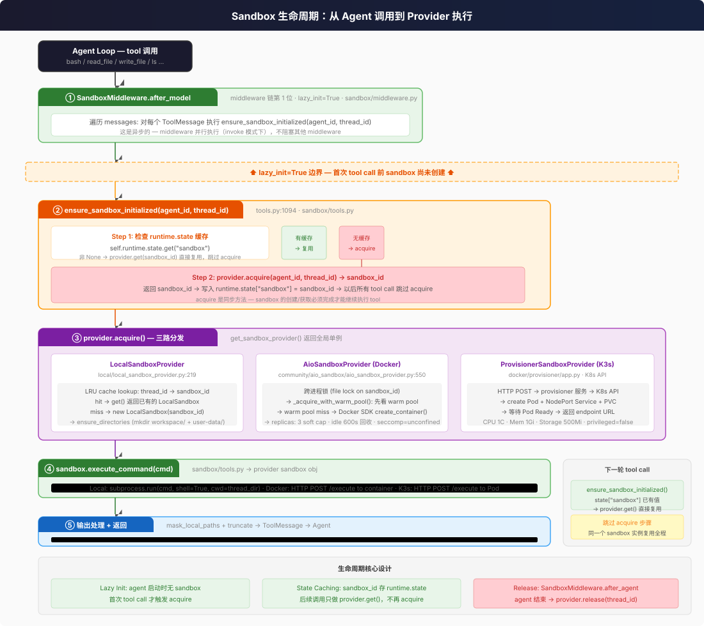

# 沙箱隔离

五种沙箱提供三种完全不同的隔离级别。Local 不是沙箱 — 是路径映射。

> **交叉引用：** Sandbox ABC 抽象 + 五种实现架构见 [concepts/sandbox/abstract-interface-and-three-impls.md](../../concepts/sandbox/abstract-interface-and-three-impls.md)。IT 治理视角（策略执行、审计可观测性）见 [it-ops/02-sandbox-governance.md](../it-ops/02-sandbox-governance.md)。

## 挂入方式

Sandbox 如何挂入 Agent 执行流？核心是 **SandboxMiddleware** + **lazy init**。



### 入口处思考

作为使用者，sandbox 对你来说是**完全透明的** — 你只需要在配置文件里选一个 provider，Agent 自动在首次 tool call 时创建 sandbox，后续同 thread 的 tool call 全部复用同一个 sandbox 实例。

| 我想... | 去哪里改 |
|---------|---------|
| 用本地沙箱（默认，零隔离） | 无需配置 |
| 换成 Docker 沙箱 | `config.yaml` → `sandbox.use: "deerflow.community.aio_sandbox:AioSandboxProvider"` |
| 换成 K3s 生产沙箱 | `config.yaml` → `sandbox.use: "deerflow.sandbox.k3s:K3sSandboxProvider"` |
| 允许 host 上执行 bash | `config.yaml` → `sandbox.allow_host_bash: true` |
| 调整 Docker warm pool 大小 | `config.yaml` → `sandbox.config.replicas: 5` |
| 看 sandbox 创建/复用日志 | 日志级别 DEBUG，搜索 `ensure_sandbox_initialized` |

### 技术细节

**SandboxMiddleware** 在 middleware 链第 1 位（`sandbox/middleware.py`），`lazy_init=True`：

```
Agent Loop 每轮 step 开始
  → SandboxMiddleware.after_model(state, runtime)
    → 遍历 messages 中的所有 ToolMessage
      → 对每个调用 ensure_sandbox_initialized(agent_id, thread_id)
```

`ensure_sandbox_initialized()` (`tools.py:1094`) 的核心逻辑只有两步：

1. **检查 state 缓存** — `runtime.state.get("sandbox")` 非 None？→ `provider.get(sandbox_id)` 直接复用，跳过 acquire
2. **没有缓存** → `provider.acquire(agent_id, thread_id)` → 存 `runtime.state["sandbox"] = sandbox_id`

**Provider 单例** — `get_sandbox_provider()` 返回全局唯一的 provider 实例，创建一次后缓存在模块级变量。三种 provider 的 acquire 差异：

| Provider | acquire 做了什么 | 复用机制 |
|----------|-----------------|---------|
| **Local** | `new LocalSandbox(sandbox_id)` + mkdir workspace | LRU cache: thread_id → sandbox_id |
| **Docker (AIO)** | 跨进程 file lock → warm pool 优先 → `docker create_container()` | warm pool + replicas soft cap |
| **K3s** | HTTP POST → provisioner → `kubectl create Pod+Service` → 等 Ready | Pod 存活期间复用 |

**Release** — `SandboxMiddleware.after_agent()` 在 agent 结束时调用 `provider.release(thread_id)`：
- Local: no-op（不清理，文件保留在 host）
- Docker: 容器放回 warm pool（idle 600s 后回收）
- K3s: 删除 Pod + Service

**关键设计决策：** sandbox 和 thread 是 1:1 绑定，不是 1:1 per tool call。这意味同一 thread 内的所有 tool call 共享同一个文件系统，Agent 可以在多轮 tool call 之间积累状态（写文件 → bash 操作 → 读结果）。

## 三维度对比

| 维度 | Local | Docker (AIO) | K3s (Provisioner) |
|------|-------|-------------|-------------------|
| **进程隔离** | 无 — `subprocess.run()` 直接在 host | Docker namespace | K8s Pod namespace |
| **文件隔离** | 路径映射 + `..` 遍历检查 | 容器 FS + bind mounts | 容器 FS + volumes |
| **Shell 执行** | `allow_host_bash` 控制 | 完全允许 | 完全允许 |
| **CPU 限制** | 无 | 无 | 100m req / 1000m limit |
| **内存限制** | 无 | 无 | 256Mi req / 1Gi limit |
| **存储限制** | 无 | 无 | 500Mi ephemeral-storage |
| **seccomp** | host 默认 | **`unconfined`（显式禁用）** | host 默认 |
| **特权模式** | N/A（已是 host） | 非特权 | `privileged: false` |
| **setuid** | N/A | Docker 默认 | **`allowPrivilegeEscalation: true`** |
| **网络出站** | 全通 | 全通（无限制） | 全通（无 NetworkPolicy） |
| **AppArmor/SELinux** | 无 | 无 | 无 |
| **只读 rootfs** | N/A | 未配置 | 未配置 |
| **no-new-privileges** | N/A | 未配置 | 未配置 |

---

## LocalSandbox — 零隔离

`deerflow/sandbox/local/local_sandbox.py:311` — `execute_command()` 就是 `subprocess.run()`，在 host 进程所在的操作系统和用户权限下直接执行。

### `allow_host_bash: false`（默认）

bash tool 直接返回错误，不执行任何命令。但 file 操作（read_file, write_file, ls, glob, grep）仍正常工作 — 在 host 文件系统上，通过路径映射限制在 thread 专属目录。

```python
# tools.py:1344
if not is_host_bash_allowed():
    return "Host bash execution is disabled for LocalSandboxProvider..."
```

### `allow_host_bash: true`

解锁完整 Shell。但 `validate_local_bash_command_paths()` 做了一层 **best-effort** 正则验证（`tools.py:930`），只允许 `/bin/`、`/usr/bin/`、虚拟路径等前缀。代码自己声明了：*"not a secure sandbox boundary"*。

---

## AioSandbox (Docker) — 容器隔离

`deerflow/community/aio_sandbox/` — 通过 `agent-sandbox` 库管理 Docker 容器，所有操作经容器内 HTTP API。

### Docker-out-of-Docker

Gateway 容器本身在 Docker 里时，通过挂载 host 的 `/var/run/docker.sock` 来创建沙箱容器：

```
Gateway 容器 → docker.sock → Host Docker Daemon → 沙箱容器
```

### 关键安全设置

`local_backend.py:508` — 容器启动参数：

```
docker run --rm -d -p <port>:8080 --security-opt seccomp=unconfined ...
```

**seccomp=unconfined 是最大的安全妥协。** Docker 默认的 seccomp profile 禁用了约 44 个系统调用（包括很多内核漏洞利用常用的）。显式设为 unconfined 是为了 AIO sandbox 功能完整性，但显著扩大了内核攻击面。

### LRU 淘汰 + 空闲回收

- `replicas: 3` soft cap — 活跃容器不杀，超出后最久未用的被 evict
- 空闲 600s 后容器被回收
- 后台线程每 60s 检查一次

---

## K3s (Provisioner) — 生产级

`docker/provisioner/app.py` — 独立的 FastAPI 服务，通过 K8s API 为每个 sandbox 创建 Pod + NodePort Service。

### 资源限制

```yaml
resources:
  requests:  {cpu: 100m, memory: 256Mi, ephemeral-storage: 500Mi}
  limits:    {cpu: 1000m, memory: 1Gi, ephemeral-storage: 500Mi}
```

这是唯一有资源限制的模式，适合生产。

### 安全缺口

```yaml
securityContext:
  privileged: false
  allowPrivilegeEscalation: true   # ← setuid 程序可用
```

未配置 `no-new-privileges`、`readOnlyRootFilesystem`、NetworkPolicy。

---

## 6 层路径防穿越

文件操作经过 6 层验证，任何一层失败都返回 `PermissionError`：

| 层 | 位置 | 机制 |
|----|------|------|
| ① `..` 拒绝 | `tools.py:615` | Normalize 后检查 `..` 段 |
| ② 虚拟路径族 | `tools.py:624` | 必须属于 `/mnt/user-data`/`/mnt/skills`/`/mnt/acp-workspace` |
| ③ mount read_only | `tools.py:624` | skills + acp-workspace 写操作直接拒绝 |
| ④ 解析后 containment | `tools.py:678` | `resolved_path.relative_to(thread_dir)` |
| ⑤ 沙箱层 containment | `local_sandbox.py:127` | `resolved_path.relative_to(local_root)` |
| ⑥ symlink 过滤 | `list_dir.py:42` / `search.py:186` | 越界 symlink 跳过 |

---

## 其他安全机制

**输出截断：**
- bash: middle-truncation, 20000 字符
- read_file: head-truncation, 50000 字符
- write_file: error 截断 2000 字符
- glob: max 200 results
- grep: max 100 results

**输出脱敏：** 在 local 模式下，所有命令输出中的 host 路径被正则替换回虚拟路径（`mask_local_paths_in_output`），防止 host 目录结构泄露给 LLM。

**文件操作加锁：** `str_replace` 和 `write_file` 对 `(sandbox_id, path)` 做细粒度锁，防止同一 sandbox 内并发写冲突。

**TOCTOU race：** `download_file` 在 `getsize()` 和 `read()` 之间有竞争窗口。代码明确接受（`local_sandbox.py:400`）— 因为这是 "controlled sandbox environment"。
