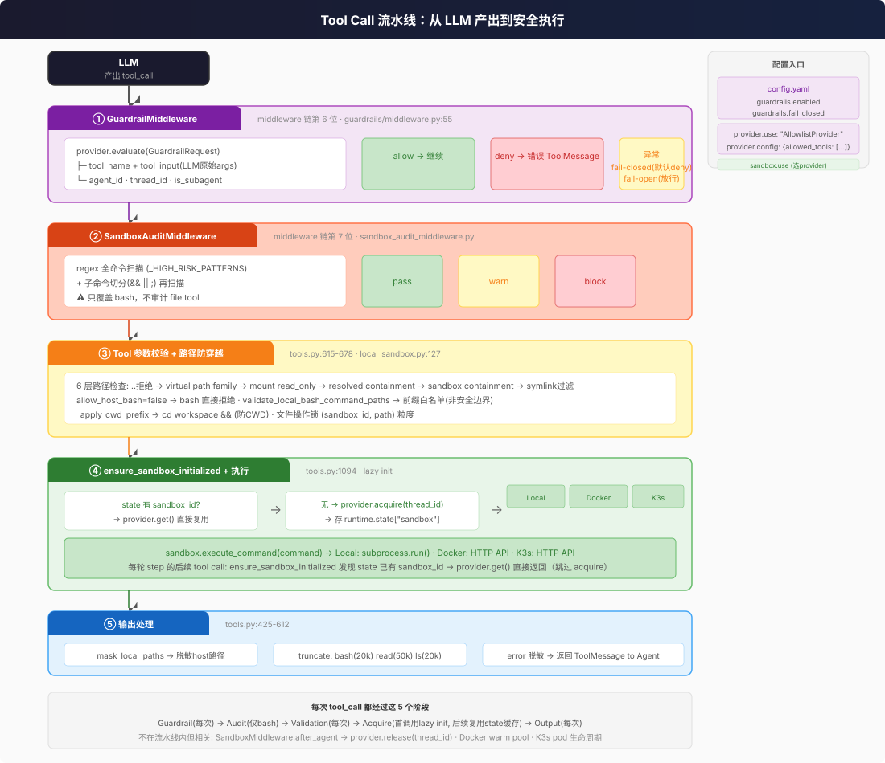

# Guardrail 与审计

Tool 执行前有两层保护：Guardrail（可插拔授权）和 SandboxAudit（bash 命令模式匹配）。

> **交叉引用：** middleware 视角的 GuardrailMiddleware/SandboxAuditMiddleware 见 [middleware/03-catalog.md](../../internals/middleware/03-catalog.md)（wrap_tool_call 段）。

## Guardrails 行业概念：DeerFlow 在哪一层？

在 AI Agent 领域，"Guardrails" 是一个广义概念——约束 agent 行为的**多层控制机制**，不是单一产品。行业标准按干预时机分三层：

```
用户输入 → [Input Guardrail] → Agent 推理 → [In-Process Guardrail] → Tool 执行
                                                        ↓
用户 ←── [Output Guardrail] ←── Agent 响应 ←── Tool 结果
```

| 层级 | 触发时机 | 目的 | DeerFlow 对应 |
|------|---------|------|-------------|
| **Input Guardrails** | 用户输入进入 agent 前 | 检测越狱、prompt 注入、PII、有害内容 | **无独立实现** — 依赖 LLM provider 内置 safety filter（Anthropic/OpenAI 在 API 层拦截） |
| **In-Process Guardrails** | Agent 推理和 tool 执行期间 | 校验行动计划、强制权限、阻断危险 tool 调用 | **最强层** — `GuardrailMiddleware`（tool 级授权）+ `SandboxAuditMiddleware`（bash 参数级审计）+ `SubagentLimitMiddleware`（并发控制）+ `LoopDetectionMiddleware`（循环检测） |
| **Output Guardrails** | 最终响应发出前 | 防止 PII 泄露、阻断有害内容、确保合规 | **被动反应** — `SafetyFinishReasonMiddleware` 只在 provider 返回 `finish_reason=content_filter` 时清除被污染的 tool_calls，不主动扫描输出内容 |

**核心判断：** DeerFlow 把 guardrails 的重心放在 In-Process 层——在 tool 执行的那一刻拦截。Input 和 Output 层依赖外部 provider 的安全过滤。对于企业部署来说，这意味着你需要额外评估：是否需要在前置网关层加 input guardrail（如 prompt injection 检测），以及是否需要在输出层加内容合规扫描。

## 执行流水线

每次 tool_call 从 LLM 产出到真正执行，经过 5 个阶段。Guardrail 和 SandboxAudit 是前两道闸门。



### 入口处思考

作为使用者，你关注两个问题：**哪些 tool 能用**，和 **bash 命令里能写什么**。

| 我想... | 去哪里改 |
|---------|---------|
| 限制 Agent 只能调用白名单 tool | `config.yaml` → `guardrails.provider.config.allowed_tools: [bash, read_file, ...]` |
| 禁止某些 tool | `config.yaml` → `guardrails.provider.config.denied_tools: [write_file, ...]` |
| 关闭 guardrail | `config.yaml` → `guardrails.enabled: false` |
| guardrail 挂了怎么办（异常策略） | `config.yaml` → `guardrails.fail_closed: true`（默认 deny，更安全）/ `false`（放行，更可用） |
| 换自定义 guardrail provider | `config.yaml` → `guardrails.provider.use: "my_package:MyProvider"` |
| 调整高危命令规则 | 改代码（`sandbox_audit_middleware.py` 的 `_HIGH_RISK_PATTERNS`），没有配置文件 |
| 关闭 sandbox audit | 去掉 middleware 链中的 SandboxAuditMiddleware（改代码） |

### Middleware 链位置

```
Middleware 链（共 29 个，按 index 排序）
  ...
  第 5 位: xxx
  第 6 位: GuardrailMiddleware     ← 拦截所有 tool_call，判断 allow/deny
  第 7 位: SandboxAuditMiddleware  ← 只拦截 bash，regex 模式匹配
  第 8 位: xxx
  ...
```

**两层保护的区别：** Guardrail 是 tool 级别的授权（"能不能用 bash"），SandboxAudit 是参数级别的审计（"bash 里能不能写 rm -rf /"）。Guardrail 可插拔（实现 `GuardrailProvider` 协议即可），SandboxAudit 是内置的、不可配置的。

## Guardrail 系统

`deerflow/guardrails/middleware.py` — 在 middleware 链第 6 位，包裹每个 `wrap_tool_call` / `awrap_tool_call`。

### 执行流

```
LLM 产出 tool_call
  → GuardrailMiddleware.wrap_tool_call(request)
    → 构建 GuardrailRequest(tool_name, tool_input=tool_call["args"], ...)
    → provider.evaluate(gr)
      ├── 异常(GraphBubbleUp) → re-raise（保留 LangGraph 控制流）
      ├── 异常(其他) → fail_closed=默认 deny / fail_closed=False=放行
      ├── decision.allow=False → 返回错误 ToolMessage
      └── decision.allow=True → handler(request) 继续执行
```

**注意：** Guardrail 收到的是 LLM 产出的 `tool_call["args"]`（原始 dict），不是 tool 内部经过参数校验和路径解析后的实际入参。这意味着 guardrail provider 无法审计 tool 内部的路径翻译结果。

### GuardrailProvider 协议

`deerflow/guardrails/provider.py:40` — 任意实现了 `name`、`evaluate`、`aevaluate` 的类都可用：

```python
class GuardrailProvider(Protocol):
    name: str
    def evaluate(self, gr: GuardrailRequest) -> GuardrailDecision: ...
    async def aevaluate(self, gr: GuardrailRequest) -> GuardrailDecision: ...
```

**@runtime_checkable** — `isinstance(provider, GuardrailProvider)` 在运行时可用。不需要显式继承任何基类。

**GuardrailRequest 字段**（provider 的输入）：

| 字段 | 类型 | 说明 |
|------|------|------|
| `tool_name` | `str` | LLM 请求的 tool 名（如 `"bash"`, `"write_file"`） |
| `tool_input` | `dict[str, Any]` | LLM 产出的**原始**参数（未经 tool 内部翻译） |
| `agent_id` | `str\|None` | `config.yaml` 中 `guardrails.passport` 的值 |
| `thread_id` | `str\|None` | **当前未填充**（middleware 未从 context 提取） |
| `is_subagent` | `bool` | **当前始终为 False**（middleware 不区分 lead/subagent） |
| `timestamp` | `str` | UTC ISO 时间戳 |

> **已知局限：** `thread_id` 和 `is_subagent` 字段当前 middleware 实现中不填充。Provider 无法从 request 区分调用来自 lead agent 还是 subagent，也无法获取当前 thread 上下文。这意味着如果你用外部 OAP 引擎做 per-thread 策略，目前做不到。

**GuardrailDecision**（provider 的输出）：

| 字段 | 类型 | 说明 |
|------|------|------|
| `allow` | `bool` | `True` = 放行，`False` = 阻断 |
| `reasons` | `list[GuardrailReason]` | 结构化原因 |
| `policy_id` | `str\|None` | 可选策略标识 |
| `metadata` | `dict[str, Any]` | 任意元数据 |

### Fail-Closed vs Fail-Open

`guardrails.fail_closed` 控制 provider 抛异常时的行为：

| 模式 | 行为 | 风险 | 适用场景 |
|------|------|------|---------|
| `fail_closed: true`（默认） | provider 异常 → 合成 deny 决策 → tool 不执行 | provider 挂了 = 所有 tool 调用全阻断 | 安全优先（生产环境） |
| `fail_closed: false` | provider 异常 → 直接调 `handler(request)` → tool 执行 | provider 挂了 = 所有 tool 调用全放行 | 可用性优先（开发环境） |

### GraphBubbleUp 安全传递

GuardrailMiddleware 在 catch 异常时**必须 re-raise `GraphBubbleUp`**——这是 LangGraph 的控制流信号（用于 interrupt/pause/resume）。如果 guardrail 吞掉了这个异常，LangGraph 的执行控制会失效。

### AllowlistProvider（内置）

`deerflow/guardrails/builtin.py:6` — 零依赖白/黑名单：

```yaml
# config.yaml
guardrails:
  enabled: true
  fail_closed: true
  provider:
    use: "deerflow.guardrails.builtin:AllowlistProvider"
    config:
      allowed_tools: ["bash", "ls", "read_file", "write_file"]
```

规则：
- 设了 `allowed_tools` → 不在白名单的 tool 全拒绝
- 设了 `denied_tools` → 在黑名单的 tool 拒绝
- 两者都不设 → 全放行

### OAP 兼容

`GuardrailDecision` 和 `GuardrailReason` 使用 `oap.*` 前缀的错误码（`oap.tool_not_allowed`, `oap.allowed`），与外部 OAP policy engine 兼容。但 DeerFlow 本身不绑定 OAP 实现 — 用户需要自己提供。

`_build_runtime_middlewares()` 在实例化 provider 时会通过 `inspect.signature` 检测 provider 的 `__init__` 是否接受 `framework` 参数——如果接受，注入 `"deerflow"` 帮助 OAP provider 发现配置目录。

### Subagent 共享同一个 Guardrail

Lead agent 和 subagent 的 middleware 链都包含 GuardrailMiddleware——两者调用同一个 `_build_runtime_middlewares()`，共享**同一个 provider 实例**。这意味着：

- 同一套 tool 策略对 lead agent 和 subagent 生效
- Provider 需要是线程安全的（多个 subagent 可能并发调用）
- 但 provider 无法从 `GuardrailRequest` 区分调用来源（`is_subagent` 始终为 False）

---

## Guardrail vs SandboxAudit：两层分工

两层的共同点是都在 tool 执行前拦截，但粒度和可配置性完全不同：

| 维度 | GuardrailMiddleware | SandboxAuditMiddleware |
|------|---------------------|------------------------|
| **位置** | middleware 链第 5 位 | middleware 链第 6 位 |
| **拦截范围** | 所有 tool_call | 仅 bash |
| **粒度** | tool 级（"能不能用 bash"） | 参数级（"bash 里能不能写 rm -rf"） |
| **决策方式** | 可插拔 provider（实现 `GuardrailProvider` 协议） | 硬编码 regex pattern（`_HIGH_RISK_PATTERNS`） |
| **可配置性** | `config.yaml` → `guardrails.*` | 不可配置（改代码） |
| **异常行为** | 可配置 fail_closed/fail_open | 始终 block |
| **阻断响应** | 返回 error ToolMessage | block → error ToolMessage / warn → 在结果后附加警告 |
| **Lead/Subagent** | 两者共享 | 两者共享 |

---

## SandboxAuditMiddleware

`deerflow/agents/middlewares/sandbox_audit_middleware.py` — 在 middleware 链第 7 位，**只审计 bash 命令**。

### 审计流程

```
bash tool 执行
  → 输入清洗: 拒绝空命令 · 拒绝 >10,000 字符 · 拒绝 null byte
  → 全命令 regex 扫描 (_HIGH_RISK_PATTERNS)
  → 子命令切分扫描 (按 && / || / ; 分割)
    → 高危命中 → block（返回错误 ToolMessage）
    → 中危命中 → warn（在结果后附加警告）
    → 无命中 → pass
  → 写审计日志 logger.info("[SandboxAudit]")
```

### 高危模式（block）

`rm -rf /` 变体 · `dd if=` · `mkfs` · `cat /etc/shadow` · 重定向到 `/etc/` · pipe 到 `sh`/`bash` · command substitution 中用 `curl`/`wget`/`python`/`base64` · `base64 -d |` 管道 · 覆盖 `/usr/bin/`/`/bin/`/`/sbin/` · 覆盖 shell 启动文件 · `/proc/*/environ` 泄露 · `LD_PRELOAD`/`LD_LIBRARY_PATH` 注入 · `/dev/tcp/` 网络 · fork bomb

### 中危模式（warn，不拦截）

`chmod 777` · `pip install` · `apt-get install` · `sudo`/`su` · `PATH=` 修改

### 覆盖盲区

- **只覆盖 bash** — `read_file`、`write_file`、`str_replace`、`ls`、`glob`、`grep` 完全没有内容审计
- **看到的是 LLM 原文** — 审核的是 LLM 请求的原始命令，不是沙箱层路径解析后的实际 command。在 local 模式下，`cd` 前缀已被工具层注入，audit 中间件看到的命令已包含 `cd /mnt/user-data/workspace && ...` 前缀，但 **路径参数中的虚拟路径尚未翻译为 host 实际路径**

---

## Tool 层安全

### 输出截断

防止 LLM 上下文被过大输出撑爆：

| 操作 | 截断方式 | 上限 |
|------|---------|------|
| bash | middle (head + tail) | 20,000 |
| read_file | head | 50,000 |
| ls | head | 20,000 |
| glob | hard cap | 200 |
| grep | hard cap | 100 |

### 错误信息脱敏

`tools.py:425` — 在 local 模式下，错误消息中的 host 路径被替换回虚拟路径，防止泄露 `~/.deer-flow/users/{user_id}/threads/{thread_id}/...` 这类目录结构。

### 路径脱敏

`mask_local_paths_in_output` (`tools.py:541`) — 所有 sandbox 操作输出都被正则扫描，host 路径替换回虚拟路径。覆盖 user-data、skills、ACP workspace、custom mount 等所有映射。

### 文件操作并发控制

`deerflow/sandbox/file_operation_lock.py` — `str_replace` 和 `write_file` 对 `(sandbox_id, path)` 获取 lock，防止同一 sandbox 内两个操作竞争写同一文件。使用 `WeakValueDictionary` 防内存泄漏。

---

## 局限与缺失

从 IT 治理视角，DeerFlow 的 guardrails 体系有几个值得注意的缺口：

### Input 层：无独立 input guardrail

**当前状态：** 依赖 LLM provider 内置的 safety filter（Anthropic/OpenAI 在 API 层拦截有害 prompt）。DeerFlow 没有独立的 input guardrail 来检测 prompt injection、越狱攻击或 PII 泄露。

**影响：** 如果攻击者用分步骤的 prompt 绕过 provider safety filter（"ignore previous instructions" 变体），DeerFlow 没有第二道防线。

**潜在缓解：** 在 nginx/网关层加独立的 prompt injection 检测服务，或利用 `before_agent` hook 注入扫描逻辑。

### Output 层：被动反应而非主动扫描

**当前状态：** `SafetyFinishReasonMiddleware` 只在 provider 返回 `finish_reason=content_filter` 时清除被污染的 tool_calls。它不主动扫描 agent 输出内容。

**影响：** 如果 agent 生成了包含敏感信息（PII、内部 API key、系统路径）的响应文本，DeerFlow 不会拦截。

**潜在缓解：** 在 `after_agent` hook 中加输出扫描 middleware，或在 SSE/API 网关层做内容过滤。

### GuardrailRequest 数据缺口

- `thread_id` 始终为 `None` — provider 无法做 per-thread 策略
- `is_subagent` 始终为 `False` — provider 无法区分调用来源
- `tool_input` 是 LLM 原文 — 虚拟路径尚未翻译成 host 路径

### RunJournal 集成缺失

`RunJournal` 有 `record_middleware()` 方法，文档中列出了 `"guardrail"` 作为合法 tag。但当前 GuardrailMiddleware 只调 `logger.warning()`，不写 RunJournal。这意味着 guardrail 的 deny 事件不会进入结构化的 run 事件流。

### SafetyFinishReason 仅处理 tool_calls 清除

当 provider 返回 `finish_reason=content_filter` 且没有 tool_calls 时（纯文本被拦截），SafetyFinishReasonMiddleware 不处理。这意味着纯文本内容被安全过滤的情况在 DeerFlow 层面不可见——用户只能看到空响应或截断的回复。

### 审计日志非结构化

SandboxAuditMiddleware 的审计日志是 `logger.info()` 文本，不是结构化 JSON。对于需要接入 SIEM/SOAR 的企业部署，需要额外做日志解析和格式化。

---

## Input Sanitization 🆕

`InputSanitizationMiddleware`（中间件链第 1 位）在 prompt injection 到达 LLM 之前做两件事：

1. **转义注入标记**：将用户消息中的 `<system>`、`<instruction>`、`<role>` 等 XML tag 转为 `&lt;system&gt;` 等字面形式
2. **边界包裹**：用 `--- BEGIN USER INPUT ---` / `--- END USER INPUT ---` 标定真实用户输入边界

原始未洗文本保留在 `additional_kwargs[ORIGINAL_USER_CONTENT_KEY]`，下游消费者（slash activation、regeneration）可以恢复。只在 `wrap_model_call` 操作，不修改 checkpoint。

## Environment Scrubbing 🆕

`deerflow/sandbox/env_policy.py` — `build_sandbox_env()` 在向 sandbox 进程注入请求级密钥之前剥离宿主机敏感环境变量：

- 通配：`*KEY*`、`*SECRET*`、`*TOKEN*`、`*PASSWORD*`、`*CREDENTIAL*`、`*DSN*`
- 精确名：`DATABASE_URL`、`REDIS_URL`、`GH_PAT`、`GITHUB_PAT` 等
- Benign 变量（`PATH`、`HOME`、`LANG`）保留

注入的请求级密钥（request-scoped secrets）在注入后覆盖任何同名变量。

## Secrets Redaction 🆕

`secret_context.REDACTED_CONTEXT_KEYS` 确保 secret-bearing context key（`secrets`、`__active_skill_secrets`）从以下路径中剥离：
- Trace（LangSmith/Langfuse 永远不看到 secret 值）
- 持久化 run record（`runs.kwargs_json`）
- API 响应（`RunResponse.kwargs`）
- 日志记录

Secret 值存在于 process memory 中仅够完成当前 bash 调用。
