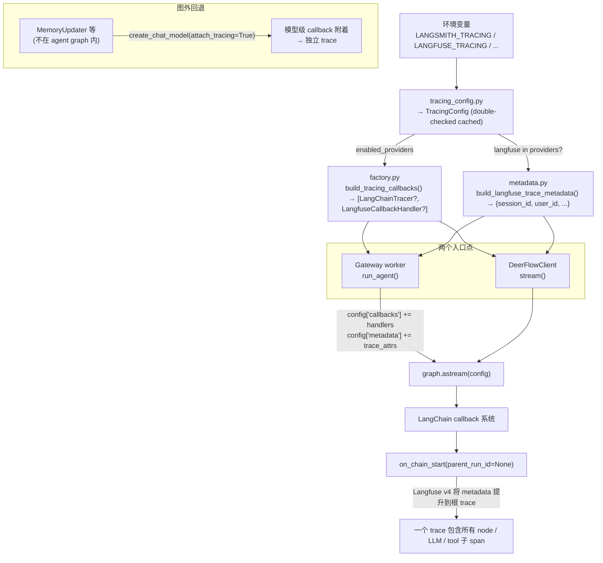

# Tracing — 追踪系统

## 源文件

| 文件 | 行数 | 职责 |
|------|------|------|
| `tracing/__init__.py` | — | 导出 `build_tracing_callbacks`、`inject_langfuse_metadata` |
| `tracing/factory.py` | 55 | CallbackHandler 工厂，懒加载 + 错误包装 |
| `tracing/metadata.py` | 106 | Langfuse v4 元数据构建器，双注入点共享 |
| `config/tracing_config.py` | 161 | Tracing 配置解析、env var 检测、double-checked 缓存 |

## 整体数据流



## 两层附着策略

### 层 1：图根级别（入口点附着）

`make_lead_agent` 和 `DeerFlowClient.stream` 在调用 `graph.astream()` **之前**，将 handler 追加到 `config["callbacks"]`。

**worker.py 实际代码（行 233-247）：**

```python
# 注入 RunJournal 作为 LangChain callback handler（token 统计 + 生命周期）
if journal is not None:
    config.setdefault("callbacks", []).append(journal)

# 注入 Langfuse trace 元数据，Caller 提供的值通过 setdefault 优先
inject_langfuse_metadata(
    config,
    thread_id=thread_id,
    user_id=get_effective_user_id(),
    assistant_id=record.assistant_id,
    model_name=record.model_name,
    environment=os.environ.get("DEER_FLOW_ENV") or os.environ.get("ENVIRONMENT"),
)
```

**client.py 实际代码（行 595-608）：**

```python
# 在图调用根注入 tracing callback + Langfuse metadata
tracing_callbacks = build_tracing_callbacks()
if tracing_callbacks:
    existing_callbacks = list(config.get("callbacks") or [])
    config["callbacks"] = [*existing_callbacks, *tracing_callbacks]

inject_langfuse_metadata(
    config,
    thread_id=thread_id,
    user_id=get_effective_user_id(),
    assistant_id=self._agent_name or "lead-agent",
    model_name=configurable.get("model_name") or self._model_name,
    environment=self._environment or os.environ.get("DEER_FLOW_ENV") or os.environ.get("ENVIRONMENT"),
)
```

**为什么必须是图根？** Langfuse v4 的 `CallbackHandler._parse_langfuse_trace_attributes()` 只在 `on_chain_start(parent_run_id=None)` 时触发。如果 callback 附着在模型级别，每个 LLM 调用都会成为独立的 trace，metadata 永远到不了根 trace。

### 层 2：模型级别（图外调用者回退）

`create_chat_model(attach_tracing=True)` 为不在 agent graph 内运行的调用者提供模型级附着。例如 `MemoryUpdater` 绕过了 graph，所以它只能靠模型级 callback。

## 配置检测三层

### 第一层：环境变量 → TracingConfig

`config/tracing_config.py` 从环境变量构建 `TracingConfig`（Pydantic model）：

```python
class TracingConfig(BaseModel):
    langsmith: LangSmithTracingConfig  # enabled + api_key + project + endpoint
    langfuse: LangfuseTracingConfig    # enabled + public_key + secret_key + host

    @property
    def enabled_providers(self) -> list[str]:
        """已启用且完全配置的 provider 列表"""
        enabled = []
        if self.langsmith.is_configured:   # enabled=True AND api_key 非空
            enabled.append("langsmith")
        if self.langfuse.is_configured:    # enabled=True AND public_key AND secret_key
            enabled.append("langfuse")
        return enabled

    @property
    def explicitly_enabled_providers(self) -> list[str]:
        """显式启用但可能未完整配置的 provider 列表"""
        enabled = []
        if self.langsmith.enabled:
            enabled.append("langsmith")
        if self.langfuse.enabled:
            enabled.append("langfuse")
        return enabled
```

两套列表的区别：
- **`enabled_providers`** — provider 通过 env flag 启用 **且** 必需凭证已设置。用于实际决定是否创建 callback。
- **`explicitly_enabled_providers`** — provider 的 env flag 为 true，但凭证可能缺失。用于 `validate_enabled_tracing_providers()` 报错。

### 第二层：env flag 检测

```python
_TRUTHY_VALUES = {"1", "true", "yes", "on"}

def _env_flag_preferred(*names: str) -> bool:
    """返回第一个存在且非空的 env var 的布尔值"""
    for name in names:
        value = os.environ.get(name)
        if value is not None and value.strip():
            return value.strip().lower() in _TRUTHY_VALUES
    return False
```

LangSmith 支持三个备选 env var（兼容旧版 LangChain 命名）：
- `LANGSMITH_TRACING` / `LANGCHAIN_TRACING_V2` / `LANGCHAIN_TRACING`
- `LANGSMITH_API_KEY` / `LANGCHAIN_API_KEY`
- `LANGSMITH_PROJECT` / `LANGCHAIN_PROJECT`（默认 `"deer-flow"`）
- `LANGSMITH_ENDPOINT` / `LANGCHAIN_ENDPOINT`（默认 `"https://api.smith.langchain.com"`）

Langfuse：
- `LANGFUSE_TRACING`
- `LANGFUSE_PUBLIC_KEY`、`LANGFUSE_SECRET_KEY`
- `LANGFUSE_BASE_URL`（默认 `"https://cloud.langfuse.com"`）

### 第三层：double-checked 缓存

```python
_tracing_config: TracingConfig | None = None
_config_lock = threading.Lock()

def get_tracing_config() -> TracingConfig:
    global _tracing_config
    if _tracing_config is not None:          # 快速路径：无锁
        return _tracing_config
    with _config_lock:                        # 慢路径：加锁
        if _tracing_config is not None:       # double-check
            return _tracing_config
        _tracing_config = TracingConfig(...)  # 实际构建
        return _tracing_config
```

标准 double-checked locking 模式：`TracingConfig` 在进程启动后只构建一次，后续调用走快速路径。`reset_tracing_config()` 用于测试清理。

## 工厂实现 (`factory.py`)

### build_tracing_callbacks()

```python
def build_tracing_callbacks() -> list[Any]:
    validate_enabled_tracing_providers()          # 1. 验证显式启用的 provider 凭证完整
    enabled_providers = get_enabled_tracing_providers()  # 2. 获取完全配置的 provider
    if not enabled_providers:
        return []

    tracing_config = get_tracing_config()
    callbacks = []

    for provider in enabled_providers:
        if provider == "langsmith":
            callbacks.append(_create_langsmith_tracer(tracing_config.langsmith))
        elif provider == "langfuse":
            callbacks.append(_create_langfuse_handler(tracing_config.langfuse))
    return callbacks
```

三步执行：
1. `validate_enabled_tracing_providers()` — 检查显式启用的 provider 凭证是否完整，不完整则抛 `ValueError`
2. `get_enabled_tracing_providers()` — 返回已完整配置的 provider 列表
3. 遍历构建 callback

**关键：第 1 步和第 2 步使用不同的 provider 列表。** 如果用户设置了 `LANGFUSE_TRACING=true` 但忘了设置 `LANGFUSE_PUBLIC_KEY`，第 1 步会抛出清晰的 `ValueError` 报错，而不是静默跳过。

### 懒加载与错误包装

```python
def _create_langfuse_handler(config) -> Any:
    from langfuse import Langfuse                           # 懒 import
    from langfuse.langchain import CallbackHandler

    Langfuse(secret_key=..., public_key=..., host=...)     # 初始化 client 单例
    return LangfuseCallbackHandler(public_key=...)          # 创建 handler
```

- **延迟 import** — 未配置 Langfuse 的部署不会触发 `import langfuse`
- **错误包装** — `try/except` 转换为 `RuntimeError("Langfuse tracing initialization failed: ...")`
- **Langfuse v4 合约** — `CallbackHandler` 只接受 `public_key`，client 配置通过 `Langfuse()` 单例完成

## Langfuse v4 元数据合约 (`metadata.py`)

### 保留键映射

Langfuse v4 `CallbackHandler._parse_langfuse_trace_attributes()` 从 `RunnableConfig.metadata` 读取：

| metadata 键 | Langfuse 目标 | 来源 | 空值回退 |
|-------------|--------------|------|---------|
| `langfuse_session_id` | Session（分组 traces） | `thread_id` | `None`（stateless run 允许） |
| `langfuse_user_id` | User（Users 页面） | `get_effective_user_id()` | `"default"`（无认证时） |
| `langfuse_trace_name` | Trace name | `assistant_id` / `agent_name` | `"lead-agent"` |
| `langfuse_tags` | Tags | `env:<ENV>` + `model:<NAME>` | 省略（无 tags 时不设键） |

### build_langfuse_trace_metadata()

```python
def build_langfuse_trace_metadata(*, thread_id, user_id, assistant_id,
                                   model_name, environment) -> dict:
    if "langfuse" not in get_enabled_tracing_providers():
        return {}                          # LangSmith-only 部署：零影响

    from deerflow.runtime.user_context import DEFAULT_USER_ID  # 懒 import 防循环

    metadata = {
        "langfuse_session_id": thread_id,
        "langfuse_user_id": user_id or DEFAULT_USER_ID,
        "langfuse_trace_name": assistant_id or "lead-agent",
    }
    tags = []
    if environment:
        tags.append(f"env:{environment}")
    if model_name:
        tags.append(f"model:{model_name}")
    if tags:
        metadata["langfuse_tags"] = tags
    return metadata
```

设计要点：
- **LangSmith-only 零影响** — Langfuse 未启用时返回 `{}`，调用方可无条件 merge
- **循环导入规避** — `DEFAULT_USER_ID` 在函数内懒 import。`runtime` 包启动时导入 worker → worker 需要 `tracing` → 如果 `tracing/metadata.py` 顶层 import `runtime` 会形成循环
- **`thread_id=None` 合法** — stateless run 路径没有 thread_id，但 user_id/trace_name 仍需传递

### inject_langfuse_metadata() — 双路径共享

```python
def inject_langfuse_metadata(config, *, thread_id, user_id, ...):
    langfuse_metadata = build_langfuse_trace_metadata(...)
    if not langfuse_metadata:
        return

    merged_metadata = dict(config.get("metadata") or {})
    for key, value in langfuse_metadata.items():
        merged_metadata.setdefault(key, value)   # 调用者优先
    config["metadata"] = merged_metadata
```

`setdefault` 确保前端设置的 `langfuse_session_id` 不被覆盖 — 外部系统可以注入自己的 session ID 来关联 DeerFlow trace 和外部 trace。

## 双入口点一致性

Gateway worker 和嵌入式 client 都调用同一个 `inject_langfuse_metadata()`，参数来源略有不同：

| 参数 | Worker（worker.py:240） | Client（client.py:601） |
|------|------------------------|------------------------|
| `thread_id` | `thread_id`（请求参数） | `thread_id`（参数或 UUID4） |
| `user_id` | `get_effective_user_id()` | `get_effective_user_id()` |
| `assistant_id` | `record.assistant_id` | `self._agent_name or "lead-agent"` |
| `model_name` | `record.model_name` | `configurable.get("model_name") or self._model_name` |
| `environment` | `DEER_FLOW_ENV` / `ENVIRONMENT` | `self._environment` / `DEER_FLOW_ENV` / `ENVIRONMENT` |

## 配置

```yaml
# config.yaml 的 tracing 节（仅供参考 — 实际值从环境变量读取）
tracing:
  providers:
    - langsmith    # 对应 LANGSMITH_TRACING=true
    - langfuse     # 对应 LANGFUSE_TRACING=true
  langsmith:
    project: "deer-flow"
  langfuse:
    secret_key: "$LANGFUSE_SECRET_KEY"
    public_key: "$LANGFUSE_PUBLIC_KEY"
    host: "$LANGFUSE_HOST"
```

`config.yaml` 中的 `tracing` 节定义**哪些 provider 被声明启用**，但实际凭证和开关都来自环境变量。`$` 前缀的值从环境变量解析。

## 环境标签

设置 `DEER_FLOW_ENV`（或 `ENVIRONMENT`）为追踪添加环境标签。最终在 Langfuse UI 中可按 tag 过滤：

```
langfuse_tags: ["env:production", "model:claude-sonnet-4-6"]
```

## 测试覆盖

| 测试文件（4 个） | 覆盖 |
|-----------------|------|
| `test_tracing_factory.py` | 空 provider → `[]`、双 provider 同时启用、初始化失败 → `RuntimeError`、凭证缺失 → `ValueError`、`Langfuse()` 在 `CallbackHandler` 之前调用 |
| `test_tracing_metadata.py` | 所有字段映射、`user_id=None` → `"default"`、`thread_id=None` 合法、tags 条件生成、LangSmith-only 返回 `{}` |
| `test_worker_langfuse_metadata.py` | `inject_langfuse_metadata()` 在 worker 路径正确合并 |
| `test_client_langfuse_metadata.py` | `stream()` 同样调用共享 helper，双路径不漂移 |

所有测试通过 `monkeypatch` + `reset_tracing_config()` 模拟，无需真实的外部追踪服务。`test_tracing_factory.py` 甚至用 `types.ModuleType` 构造 fake `langfuse` 模块来验证调用顺序（client 在 handler 之前初始化）。
