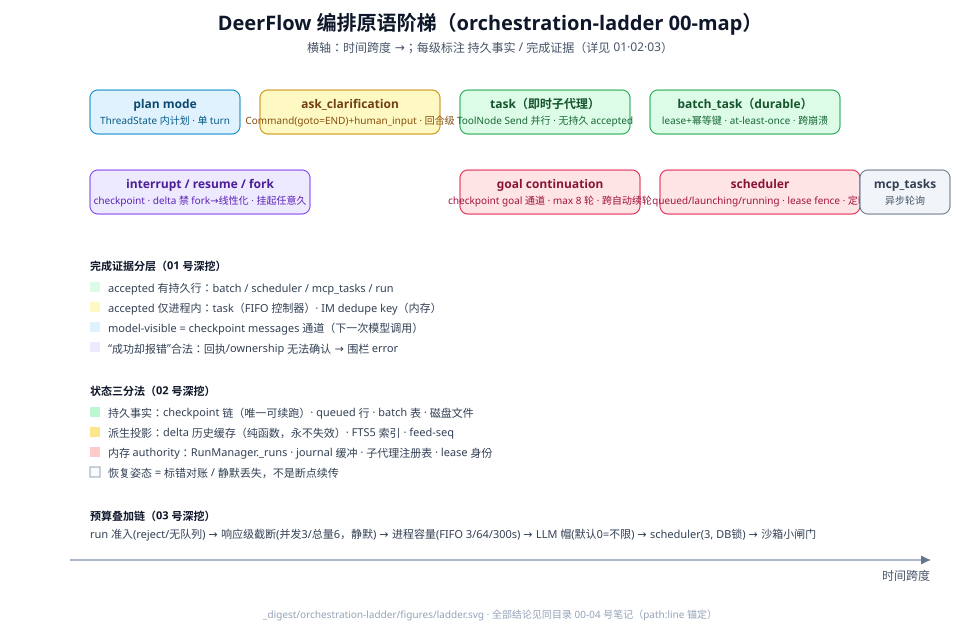

# Work Orchestration Primitives Ladder · DeerFlow 编排原语阶梯

> 方法论借鉴自 DSH 仓库的 `_digested/orchestration-ladder/` 同名专题：
> **不做理想化叙事、每个结论带 path:line 锚点、按问题登记驱动、把最容易混淆的词拆开核验**。
> 本目录把这套镜头对准 DeerFlow——所有事实只来自本仓库源码核验。

## 一句话

DeerFlow 给使用者的编排原语不是一棵中心调度树，而是一组**架在两节点固定元图之上的、时间跨度与持久性各异的阶梯**：上下文内计划（plan mode）→ 回合级 HITL（`ask_clarification`）→ 即时委派（`task` + Send 并行）→ durable 批处理（`batch_task` + lease 认领）→ 跨轮长目标（goal continuation）→ 定时触发（scheduler）→ 图级挂起/恢复/分叉（`interrupt_before` / `command:resume` / `checkpoint_id` fork）。**没有任何任务 DAG 引擎**——依赖是政策硬否决而非数据结构，动态性全部下放到工具层与模型（判定见 [../graph-engineering/01-support-map.md](../graph-engineering/01-support-map.md)）。

## 与既有目录的分工

| 位置 | 分工 |
|------|------|
| [../graph-engineering/](../graph-engineering/README.md) | 图工程标尺对表、操作面旋钮（07）、注入入口（08-09）——"用/扩"的视角 |
| [../internals/runtime/](../internals/runtime/README.md) | RunManager / StreamBridge / journal 的机制解剖 |
| [../concepts/subagent/](../concepts/subagent/README.md)、[../operations/scheduler.md](../operations/scheduler.md) | 单原语深挖 |
| **本目录** | **跨原语统一视角**：阶梯位置、完成语义、状态分类、预算叠加——回答"这些原语组合起来时系统到底保证了什么" |

## 统一维度矩阵（初版，随深挖修订）

| 原语 | 执行者 | 主要持久事实 | 派发/推进者 | 完成证据 | 时间跨度 |
|------|--------|--------------|--------------|----------|----------|
| plan mode | lead agent 同上下文 | ThreadState 内 plan 通道 | 模型自觉 + 用户批准 | 消息内 plan 展示 | 单 turn |
| `ask_clarification` | 用户 | `human_input` artifact + `Command(goto=END)`（`agents/middlewares/clarification_middleware.py:497`-`516`） | 下一轮用户对话 | 用户回复消息 | 回合级 |
| `task`（即时子代理） | 子代理线程（共享沙箱） | 子代理 thread checkpoint | ToolNode Send 并行 | 工具结果回主上下文 | 单 run 内 |
| `batch_task`（durable） | worker 认领 + lease 续租 | batch/item 落库、JSONL 结果（`subagents/batch_service.py:243` 幂等键注入、`:247` 每 lease/3 续租） | worker 轮询 claim | item 终态 + 验收 verdict | 跨进程、跨崩溃 |
| goal continuation | lead agent 跨轮 | goal state 落 checkpoint（`runtime/goal.py:464`-`540` 读写） | 轮次准入（max_continuations=8、no-progress 检测，`goal.py:33`、`:332`） | phase 终态 + wrapup | 跨自动续轮 |
| scheduler | 后台 scheduler 服务 | 任务表（queued/launching/running，非终态部分唯一索引 `persistence/scheduled_task_runs/model.py:51`；lease fence `sql.py:474`-`487`） | wall-clock + lease 续租 | occurrence 终态 | 定时触发 |
| interrupt / resume / fork | LangGraph 图 | checkpoint（fork 校验见 `app/gateway/checkpoint_lineage.py:76`-`181`） | 客户端 command（`run_models.py:46`-`55`） | run 终态 | 挂起任意久 |
| `mcp_tasks` | MCP server | 任务面 | 外部 | 轮询 | 异步 |

## 问题登记

| 问题 | 状态 |
|------|------|
| 阶梯全景：DeerFlow 有哪些编排原语，各在什么位置？ | 本页（初版） |
| 「完成」到底分几个时刻？accepted / model-visible / 静止 / 处置各由什么证明？崩溃窗口在哪、哪些重复投递是允许的？ | [01](01-完成语义与崩溃窗口-接受可见静止处置.md)（已答：五时刻 × 七原语证据表、run 终态十步持久化顺序、九行崩溃窗口表、at-least-once 清单、"成功却报错"合法路径） |
| 哪些是持久事实、派生投影、内存 authority？重启 Gateway 后各会发生什么？ | [02](02-状态三分法-持久事实派生投影与内存权限.md)（已答：25 行主表 + 八节深挖 + 六条危险点；核心结论——恢复姿态是"标错对账/静默丢失"而非断点续传，唯一可续跑的是 checkpoint 链） |
| 一个请求会被多少层预算卡住？限制如何叠加、公平性如何？ | [03](03-资源预算与公平性-并发深度总量与容量边界.md)（已答：六层闸门叠加链、clamp 关系、超限三态、默认无限制三处） |
| LangGraph 已依赖但 DeerFlow 未使用的能力面（interrupt() / Send / fork）还能榨出什么？ | [04](04-LangGraph能力面榨取-未用原语与接入设计.md)（已答：七条榨取设计 + 优先级表——interrupt()→挂起式工具审批最高优先且与 delta 封锁正交；update_state(task_id)→服务端补答；显式 Send→图内秒级小 fan；Command.PARENT/NodeInterrupt/astream_events 明确不做；**venv 实装 1.1.9 vs lock 1.2.9 依赖漂移**） |
| 组合模式与收尾纪律（DSH 08 的对应物） | [05](05-组合模式与收尾纪律-跨原语协同.md)（已答：组合形态清单 + 冲突矩阵——结构性禁止集中在 HITL 与委派再入，其余靠预算；stop_reason 两套聚合纪律——lead 后写者胜 vs 子代理 consume_stop_reason 先到者胜；goal 无 wrapup，收尾=stand_down_reason+预算+CAS 清空且对 delegations 零引用；通知三通道——scheduler 专属 push 钩子（deps.py:766）/ IM END 哨兵链式排空 / MCP 轮询，各有兜底） |
| Session/run/execution 谱系与冷恢复（DSH 12 的对应物） | 待挖。侦察锚定：run 所有权有独立 lease 体系 `run_ownership`（心跳续约 + `lease_seconds + grace_seconds` 后可被 peer 回收，`config/run_ownership_config.py:11`-`44`）；孤儿 scheduled run 有 `scheduled_task_orphan_recovery` stop_reason 通道 |

## 源码入口

| 路径 | 角色 |
|------|------|
| `backend/packages/harness/deerflow/runtime/` | run 生命周期、checkpoint、goal continuation |
| `backend/packages/harness/deerflow/subagents/` + `backend/app/subagent_batches/` | 即时/ durable 委派 |
| `backend/packages/harness/deerflow/scheduler/` + `backend/app/scheduler/` | 定时任务 |
| `backend/app/gateway/run_models.py` | 编排者旋钮箱（RunCreateRequest 全字段） |
| `backend/packages/harness/deerflow/agents/` | 两节点元图与 ThreadState |
