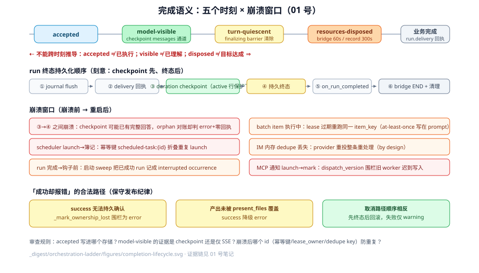

# 完成语义与崩溃窗口：接受、可见、静止与处置

本页是 orchestration-ladder 专题的第一篇：一个请求被接受（accepted），不等于模型已经看见（model-visible）；模型看见，不等于轮次已经静止（turn-quiescent）；资源已处置（resources-disposed），更不等于业务目标完成。DeerFlow 把这些时刻分散在 RunStore（sqlite/postgres 行）、checkpointer（LangGraph checkpoint）、RunEventStore（run_events 事件日志）、进程内 `RunManager._runs`、以及各后台服务的 lease 行里——**没有任何一个状态位同时覆盖这五个时刻**。

与已有 digest 的分工（避免重复）：

- 归属/lease/rollback 机制细节 → [_digest/internals/runtime/05-run-ownership-and-rollback.md](../internals/runtime/05-run-ownership-and-rollback.md)。本页只引用其结论回答"完成证据写在哪个存储"。
- journal 与 run_events 的事件目录 → [_digest/observability/02-run-events-and-journal.md](../observability/02-run-events-and-journal.md)。本页只讨论"journal 缓冲 → flush → 事件落盘"作为 model-visible 证据的时序。
- 子代理双线程池与生命周期 → [_digest/concepts/subagent/dual-threadpool-and-lifecycle.md](../concepts/subagent/dual-threadpool-and-lifecycle.md)。本页只讨论批次 item 的终态语义与结果回注。
- scheduler 的任务模型与配置 → [_digest/operations/scheduler.md](../operations/scheduler.md)。本页只讨论投递原子性与崩溃窗口。

## 五个时刻

| 时刻 | DeerFlow 中的含义 | 不能推出什么 |
|------|------------------|-------------|
| accepted | 请求已通过原子准入落到持久存储（run 行 / batch 行 / queued occurrence 行 / dedupe key），调用方拿到稳定 id | 工作已执行、模型已看见、甚至 worker 任务已创建 |
| model-visible | 消息/工具结果已进入 checkpoint 的 `messages` 通道（下一次模型调用的输入），且 run_events 已落盘 | 模型已正确理解；仅 SSE 推到前端不算 |
| turn-quiescent | 图流结束、终态已持久、同线程无 pending/running 准入、finalizing barrier 清除 | 资源已释放（`bridge.cleanup` 延迟 60s、run record 保留 300s） |
| resources-disposed | journal 关闭、沙箱 lease 释放、bridge/内存 record 清理 | 业务完成（交付回执可能把 success 改判 error） |
| 业务完成 | 交付回执 `run.delivery` 满足（产出文件被 `present_files` 覆盖）等应用层判据 | 由应用层定义，run 终态只是必要条件 |

## 各原语完成证据表

| 原语 | accepted 由谁确认 | model-visible 由什么证明 | 资源处置归谁 | 终态 ≠ 业务完成的说明 |
|------|------------------|--------------------------|--------------|----------------------|
| LangGraph run | `RunStore.create_thread_operation_atomic` 的原子插入（sqlite/postgres 行），本地锁内执行（manager.py:1672-1755） | checkpoint 的 `messages` 通道 + journal flush 到 RunEventStore | worker 终态 finally 序列（worker.py:1697-1751） | `success` 可被交付回执改判 `error`（worker.py:1538-1544）；`error` 也可能是"其实成功但无法持久确认"（manager.py:1021-1026） |
| 子代理 `task`（普通） | FIFO 准入控制器接纳（进程内，无持久行） | 父 run 的 `ToolMessage` 进入 messages 通道 + `subagent.end` 事件 | `SubagentExecutor` finally 幂等释放沙箱 holder | `completed`+`stop_reason=*_capped` 表示护栏截断的部分结果 |
| 子代理批次 `batch_task` | `repository.create_batch` 落持久行（batch_service.py:142-156） | **没有自动回注**——结果只能经 API/JSONL 由外部读取 | `_execute_item` finally 清理 registry（batch_service.py:350-354） | `succeeded` 只表示执行器完成；acceptance verdict 是 advisory，checker 故障不阻塞（batch_service.py:308-311） |
| Scheduler occurrence | `task_run_repo.create(status="queued")` 落持久行（service.py:164-177） | 走普通 run 的证据链（同上） | run 终态钩子 + startup sweep | `running`→terminal 由 `handle_run_completion` 钩子驱动；钩子丢失靠重启 sweep 兜底（service.py:567-582） |
| IM 通道消息 | dedupe store 的 `try_record`（内存 OrderedDict 或 Postgres 原子 upsert）（manager.py:1945-1947, dedupe_store.py:39） | 走普通 run 的证据链 | `ChannelService.stop` 先关准入再排空 worker（service.py:283-311） | GitHub fire-and-forget 在 run `pending` 即返回 accepted；最终回复由 agent 自己用 `gh` 发出 |
| MCP 后台任务通知 | `claim_notification_work` 的 lease + 幂等 launch | 通知 run 的 checkpoint/messages | lease 释放 + dead-letter | `delivered=True` 仅指通知 run 达到 `success`，不证明用户已读（service.py:421-430） |
| 沙箱命令 | `execute_command` 返回字符串 | `ToolMessage` 追加进 messages 通道，下一次模型调用可见；journal `_persist_tool_result_message` 落事件 | 沙箱执行 lease 在 worker finally 释放（worker.py:1706-1711） | 非零退出也返回文本（`Exit Code: N` 尾标），没有工具级成功位 |

## 逐原语核验

### 1. LangGraph run：终态的五段式持久化

run 的生命周期状态枚举是 `pending / running / success / error / timeout / interrupted`（backend/packages/harness/deerflow/runtime/runs/schemas.py:17-25）。**accepted 的定义**：`_admit_thread_operation` 在持有本地 `self._lock` 的情况下调用 `store.create_thread_operation_atomic`（backend/packages/harness/deerflow/runtime/runs/manager.py:1672-1698），跨进程原子性由 `(thread_id) WHERE status IN ('pending','running')` 的部分唯一索引保证（manager.py:1592-1596）。持久失败时内存记录被回滚（manager.py:644-658），初始 `put` 失败会向调用方传播而不是留下内存幻影（manager.py:381-396）。

**终态的持久化顺序**（worker 的 finally 块，backend/packages/harness/deerflow/runtime/runs/worker.py:1462-1751）——这是全篇最重要的时序事实：

1. `journal.flush()` 把缓冲事件写入 RunEventStore（worker.py:1517-1521）；
2. `run.delivery` 回执用 `put_if_absent` 幂等落盘（worker.py:1532-1537；重试策略在 worker.py:263-309）；
3. `update_finalizing_progress` 写最终字段但**故意不终态化**持久行（worker.py:1546-1552）；
4. 成功 run 先写"最终 duration checkpoint"（worker.py:1560-1573），注释明确：持久行保持 active 是为了让这最后一个 checkpoint 写入不被 peer 迁移穿插（worker.py:1556-1559）；
5. 然后才 `set_status_if_not_cancelled` 持久终态（worker.py:1586-1591）；
6. `update_run_completion` 补 token 用量（worker.py:1602）；
7. 线程标题同步、`threads_meta.status` 置 `idle`（仅 success，worker.py:1628-1633）；
8. `on_run_completed` 钩子（scheduler 的 occurrence 终态靠它，worker.py:1635-1639）；
9. `bridge.publish_end`（worker.py:1693）；
10. `journal.close` → 沙箱 lease 释放 → `bridge.cleanup(delay=60)` 与 `run_manager.cleanup(delay=300)`（worker.py:1699-1750）。

因此 **checkpoint 落盘先于 run 状态终态化**，且这是刻意设计（duration 写要在 active 行保护下完成）。取消路径则相反：`_finish_cancellation` 先置 `interrupted`/`error` 再做 checkpoint 回滚（worker.py:887-929）——状态先行，回滚失败只降级为 warning。

**"成功却报错"的合法路径**：`set_status(success)` 持久化失败且 heartbeat 开启时，`_mark_ownership_lost` 把本地 run 围栏成 `error`（manager.py:1021-1026）——因为无法持久确认的成功不能当作成功发布。同理，产出文件未被 `present_files` 覆盖的成功 run 会被降级为 `error`（worker.py:1426-1433, 1538-1544）；回执本身无法持久验证时同样降级（`_DELIVERY_RECEIPT_FAILED_ERROR`，worker.py:312）。

**model-visible 的证据**：图流在 `_checkpoint_thread_lock` 下执行（worker.py:1258），消息进入 checkpoint 的 messages 通道；journal 在内存 `_buffer` 里积累、按阈值/终态 flush（backend/packages/harness/deerflow/runtime/journal.py:1141-1152），flush 失败把批次退回缓冲以供重试（journal.py:1150-1152）。所以"事件已落 RunEventStore"是比"模型已消费"弱的证据，"checkpoint 里 messages 通道已含该消息"才是下一次模型调用可见的持久证据；两者都不是"模型理解了"的证据。

**没有保证的部分**：`threads_meta.status` 的 `idle` 写入（worker.py:1631）与新的 run 准入之间没有原子性——终态持久后、idle 写入前，新 run 已可被同线程准入；idle 写晚到不会回滚成 running（源码无此补偿）。

### 2. 子代理委派：accepted 无持久行，批次才有

普通 `task` 委派没有持久 accepted 证据：接纳发生在进程内 FIFO 控制器，结果以 `ToolMessage` 回到父 run 的 messages 通道（model-visible = 父 run 的下一次模型调用），终态 usage 记在 `ToolMessage.additional_kwargs`。批次模式（`batch_task`）才有持久语义（backend/packages/harness/deerflow/subagents/batch_service.py）：

- **accepted** = `repository.create_batch` 写入批次/item 行（batch_service.py:142-156）；poller 以 `claim_items(lease_owner=...)` 认领（batch_service.py:108-113）。
- 工具组装（可能阻塞在 MCP 缓存）之后、真正 launch 之前**重新校验 lease**，否则会执行用户已取消的工作（batch_service.py:209-225）。
- item 终态由 `finalize_item(lease_owner=...)` 条件写入（batch_service.py:312-325）；执行器**准入失败**（排队被拒/超时）走 `requeue_item_after_admission_failure`，不消耗尝试次数（batch_service.py:291-297）；真实执行失败与 lease 过期仍消耗重试预算。
- 恢复语义写进了 prompt：item 的提示词显式嵌入 "This item may be retried after a worker crash. Keep side effects idempotent and use the item key as the idempotency identity."（batch_service.py:243）——**at-least-once 是声明出来的契约**。
- 取消是持久优先：`cancel_batch` 写库，运行侧 renew 循环最迟 `lease_seconds/3` 观察到（batch_service.py:166-181, 277-278）。
- acceptance verdict 是 advisory：checker 不可用"既不丢弃有用工作也不触发重试"（batch_service.py:308-311）。
- `mark_item_running` 失败（lease 已丢）立即取消执行（batch_service.py:258-265）。

**关键区别**：durable 批次 item 的结果**不会自动回到任何模型上下文**——没有父 journal（见 subagents/AGENTS.md 的"durable batch runs have no parent journal"），结果只能通过 owner-scoped API/JSONL 被外部消费。批次 `succeeded` 只证明执行器走完，不证明有人读了结果。

### 3. Scheduler：投递与状态推进不是原子，靠幂等键缝合

backend/app/scheduler/service.py 的状态机是 `queued → launching(lease) → running(引用 durable run) → terminal`：

- **accepted** = `task_run_repo.create(status="queued")`（service.py:164-177），单活跃约束 `uq_scheduled_task_run_active` 防重复 occurrence。
- `claim_queued_run` 拿 lease-fenced 的 launching（service.py:249-255）；launch 走 Gateway 普通 run 路径，带稳定幂等键 `scheduled-task:{task_run_id}`（backend/app/gateway/services.py:1847-1861）——**崩溃恢复后的重复 launch 通过幂等键复用同一个 run**，而不是创建第二个。
- launch 成功与后置簿记之间崩溃：代码明确注释 run 已 live、task-run 行留在 queued/launching "still holding the slot"，由恢复路径 `reconcile_launched_run` 恢复 `run_id`（service.py:330-354, 430-441）；`_record_launched_run` 失败还有恢复分支（service.py:428-441）。
- 复用线程的 `ConflictError`（busy）把 launching 退回 queued（service.py:315-321）；其他 launch 错误终态化为 failed（service.py:391-397）。
- **完成**：run 的 `on_run_completed` 钩子驱动 `handle_run_completion` 把 occurrence 映射为 success/failed/interrupted（service.py:517-551）。Gateway 死在钩子前，靠启动期 `mark_stale_active_runs` + `cancel_stuck_once_tasks` 破坏性清扫（单实例模式，service.py:560-582）或多实例 lease 对账（service.py:586-607）。
- 队列超时 `queue_timeout_seconds` 把等不到槽的 occurrence 终态化为 failed 并推进调度（service.py:510-515）。

**终态 ≠ 业务完成**：occurrence `success` 只表示那个 run 达到 `RunStatus.success`——而 run `success` 本身还可能被交付回执改判（见第 1 节）。定时任务的"提醒内容已被模型执行"没有单独证据。

### 4. IM 通道：accepted 是 dedupe key，不是 run

外部消息的接受语义在 backend/app/channels/manager.py 的 `_worker_loop`：

- 每条消息在处理前先 `try_record` dedupe key（4 元组 channel/workspace/chat/message_id）（manager.py:1945-1947, 1986-2019）；重复投递直接丢弃（manager.py:2030-2037）。
- dedupe store 默认是**进程内 OrderedDict**（TTL 10 分钟，4096 条）（backend/app/channels/dedupe_store.py:22-23, 43-78）；多 pod 可注入 Postgres 原子 upsert 版（dedupe_store.py:81-104）。
- 处理失败/取消时**释放** dedupe key，让 provider 重投可重试（manager.py:1958-1981, 2039-2049）；流式失败也在发出终局回复后才释放 key（manager.py:2510-2533）。
- GitHub 通道 `fire_and_forget`：`runs.create()` 在 run `pending` 即返回（accepted），manager 不等待也不发 outbound——最终回复由 agent 在 run 中途用 `gh` 自行发出；busy 时的 follow-up 缓冲是**进程内**的（上限 20 条，靠 StreamBridge 的 END 哨兵排空），多 worker 下不共享（channels/AGENTS.md #4121 限制）。
- `ChannelService.stop` 先关 manager 准入、保持 transport 存活直到排空（backend/app/channels/service.py:283-290）——"已接受的消息在关机时仍尽量完成"。

**崩溃窗口**：内存 dedupe store 随进程消失。provider 重投同一条消息会被当作新消息**完整重处理**（再次创建 run）——这是允许的 at-least-once，不是 bug；Postgres 版才跨进程去重。

### 5. MCP 后台任务：dispatch_version 围栏 + 通知 run 幂等

backend/app/mcp_tasks/service.py 的通知投递是两阶段：

1. `claim_notification_work` 拿 lease → `_launch_notification`（幂等键）→ `mark_notification_dispatched(run_id=...)`（service.py:451-497）。崩溃在 launch 与 mark 之间：lease 过期后被另一 worker 重认领，幂等键复用已存在的 run，不会重复通知 turn。
2. `notification_status == "dispatched"` 后轮询 run 终态：`success` → `finish_notification_run(delivered=True)`；`error/timeout/interrupted` → 记错并按指数退避重试（service.py:407-448）；run 消失 → 记错重试（service.py:410-420）。
3. 超过 `_MAX_NOTIFICATION_ATTEMPTS` 进 dead-letter（service.py:395-405）。所有状态写都带 `lease_owner` + `dispatch_version` 条件（service.py:491-497），旧 worker 的迟到写入被围栏。

`delivered=True` 的语义仅仅是"通知 run 达到 success"——即 agent 生成了一个隐藏用户回合（`hide_from_ui`，services.py:1903），**不证明用户读到**。

### 6. 沙箱命令：结果是文本，可见性靠下一次模型调用

`bash_tool` 是同步字符串返回（backend/packages/harness/deerflow/sandbox/tools.py:2118；async 包装 :2217-2221）。"完成"的证据链：

- 工具返回字符串 → LangGraph ToolNode 包装成 `ToolMessage` 追加进 messages 通道 → **同一 run 内的下一次模型调用**才是 model-visible 时刻；
- journal 的 `_persist_tool_result_message` 把工具结果事件写入 RunEventStore（journal.py:655），checkpoint 的 messages 通道是持久证据；
- **没有工具级成功位**：非零退出也返回普通文本（带 `Exit Code: N` 尾标，tools.py:1783-1787），"工具完成"与"命令成功"是两回事，判定责任在模型；
- 资源处置：沙箱执行 lease 在 worker 终态 finally 释放（worker.py:1706-1711），子代理执行器在 finally 幂等重复释放（subagents/AGENTS.md #5128）；崩溃后容器由 warm-pool/idle/ownership 机制回收，与 run 终态解耦。

## 崩溃窗口表

| 过程 | 崩溃前事实 | 重启后事实 |
|------|-----------|-----------|
| run 图流 checkpoint 已写 → 终态持久前 | checkpoint 可能已含完整回答；durable 行仍 `running`（worker.py:1560-1586 的顺序） | lease 过期后被 orphan recovery CAS 认领置 `error` 并回填零交付回执（manager.py:1910-1941）；checkpoint 里的回答仍在，UI 上 run 是 error——内容与状态可分裂 |
| run 终态持久 → `run.delivery` 回执前 | 状态已 terminal | 回执缺失：正常路径回执先于终态（worker.py:1512-1516），崩溃在该窗口则恢复路径只能补零回执；已写详细回执则被保留 |
| scheduler launch → task-run 簿记前 | run 已 live；task-run 行仍 queued/launching 占住活跃槽 | 恢复锁 task/run 对并恢复 `run_id`（service.py:430-441）；重复触发被幂等键 `scheduled-task:{id}` 折叠成同一 run（services.py:1847-1861） |
| scheduler run 完成 → `on_run_completed` 钩子前 | run 已 success；occurrence 仍 running | 启动 sweep `mark_stale_active_runs`/`cancel_stuck_once_tasks` 把 occurrence 置 interrupted（service.py:567-582）——**已成功的 run 被记为 interrupted occurrence**，允许的损失 |
| 批次 item 执行中崩溃 | item 行被 lease 认领、执行到一半 | lease 过期另一 worker 重认领同一 item_key 重跑整个子代理；prompt 已要求副作用幂等（batch_service.py:243）——at-least-once 是显式契约 |
| MCP 通知 launch → mark_dispatched 前 | 通知 run 已创建 | lease 过期重认领，幂等键复用 run；`dispatch_version` 围栏旧 worker 迟到写入（service.py:491-497） |
| IM 消息 dedupe 后、run 创建前（进程崩溃） | 内存 dedupe key 随进程消失 | provider 重投被当新消息完整重处理；Postgres dedupe 才跨进程（dedupe_store.py:81-104） |
| run `success` 持久失败（store 故障） | 本地已完成 | heartbeat 模式下 `_mark_ownership_lost` 围栏为 `error`（manager.py:1021-1026）；peer takeover 后 `update_status` 被 `status IN ('pending','running')` 守卫拒绝（manager.py:423-461） |
| Gateway 优雅关机 drain 超时 | run 任务仍在图流中 | 被 cancel 并尽力持久 `interrupted`；超出预算的持久化被放弃，run 可能与 checkpointer 拆除竞速（manager.py:2306-2404，注释承认 #3373 形态） |

## 允许的重复投递（at-least-once）清单

- scheduler occurrence 的 launch（幂等键折叠，但 thread busy 冲突会退回 queued 再投，service.py:315-321）；
- 批次 item 的整段执行（item_key 幂等指令）；
- MCP 通知 launch（幂等键 + dispatch_version）；
- IM 消息（内存 dedupe 丢失时整条重处理）；
- **不允许**重复的：run 本身的准入（线程活跃唯一索引）、`run.delivery` 回执（`put_if_absent` 单例）、批次 item 的 finalize（lease_owner 条件写）。

## 审查规则

审一段 DeerFlow 编排代码时分别问：accepted 写进了哪个存储（RunStore 行？事件日志？还是只有内存 dict）？model-visible 的证据是 checkpoint 的 messages 通道还是仅 SSE/事件流？终态持久与最后一个 checkpoint 写的顺序是哪个先？崩溃后哪个 id（幂等键 / lease_owner / dispatch_version / dedupe key）防止或允许重复？`success` 是否可能被交付回执改判、`error` 是否可能是"成功但不可确认"？如果说明没有回答这些，就不能把"完成"当单一事实使用。

## 源码入口

| 路径 | 关注点 |
|------|--------|
| `backend/packages/harness/deerflow/runtime/runs/schemas.py:17-25` | run 终态枚举 |
| `backend/packages/harness/deerflow/runtime/runs/manager.py:1570-1800` | 原子准入、幂等复用、唯一索引 |
| `backend/packages/harness/deerflow/runtime/runs/manager.py:1861-1945` | orphan recovery：CAS 认领 + 零回执回填 |
| `backend/packages/harness/deerflow/runtime/runs/worker.py:1462-1751` | 终态持久化顺序：flush → 回执 → duration checkpoint → 终态 → 清理 |
| `backend/packages/harness/deerflow/runtime/journal.py:1088-1207` | 交付事实、flush 重试语义、close(flush=False) 围栏 |
| `backend/packages/harness/deerflow/subagents/batch_service.py:183-354` | 批次 item 生命周期：lease、requeue、finalize、幂等 prompt |
| `backend/app/scheduler/service.py:239-441` | queued→launching→running 状态机与恢复 |
| `backend/app/gateway/services.py:1799-1862` | 定时 launch 的幂等键与非 HTTP 入口 |
| `backend/app/channels/manager.py:1922-2049` | IM 接受语义：dedupe key 的记录与释放 |
| `backend/app/channels/dedupe_store.py:22-104` | 内存 vs Postgres 去重的持久层差异 |
| `backend/app/mcp_tasks/service.py:391-504` | 通知两阶段投递、dispatch_version 围栏、dead-letter |
| `backend/packages/harness/deerflow/sandbox/tools.py:2118-2221` | 沙箱工具的字符串结果契约 |
