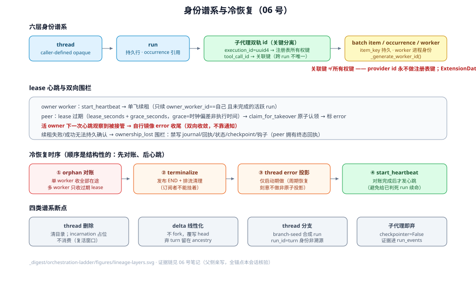

# Session 谱系与冷恢复：线程、运行与所有权

> 方法论对标 DSH `_digested/orchestration-ladder/12-Session谱系与Agent实例-持久边与活体权限.md`——学风格不搬事实。
> **与既有篇的分工**：[02](02-状态三分法-持久事实派生投影与内存权限.md) 已挖过各状态的存储三分（`RunManager._runs` 是内存 authority、lease 是持久事实+内存 authority 等）；本篇回答**谱系与授权视角**：身份有哪几层、层间怎么引用、所有权怎么表达与转移、冷恢复按什么时序重建。

## 1. 身份层谱系：六层与它们的引用方式

| 层 | id 生成 | 唯一范围 | 被谁引用 | 锚点 |
|----|--------|----------|----------|------|
| **thread** | 调用方自定义 opaque id（`None` 才生成 UUID）；正则 `^[A-Za-z0-9_-]{1,64}$`，全后端共享契约 | 全局（持久） | checkpoint、runs、workspace 目录、事件 feed | `deerflow/utils/thread_id.py:11`、`:25`-`29` |
| **run** | RunManager 准入时生成 | 全局（持久，runs 表行） | occurrence（`run_id` 指针）、幂等键、事件按 run 分组 | （[01] 已核验准入路径） |
| **子代理 execution** | `execute_async` 内 `str(uuid.uuid4())` | 进程（注册表键） | 轮询/取消/超时/清理——**registry 所有权键** | `subagents/executor.py:1843` |
| **子代理 provider 关联** | 派发 turn 的 `tool_call_id` | **父 run 内**（跨 run 不保证唯一） | ToolMessage 关联、`task_*` 事件、前端卡片、`ExtensionData.scope_id`（存储为 `SubagentResult.external_task_id`） | `subagents/executor.py:1848`、`:115`（docstring）、`:1417`（`external_task_id or result.task_id` 回退） |
| **batch item** | 提交时稳定 `item_key` | 全局（持久行） | lease 认领、幂等重试、JSONL 导出 | （[01]/[03] 已核验 `batch_service.py:243`） |
| **worker** | `_generate_worker_id()`（RunManager 构造时） | 进程 | lease 的 `owner_worker_id`、心跳日志 | `runtime/runs/manager.py:61`、`:275` |

**双轨制是本篇最重要的结构事实**：provider `tool_call_id` 与 server `execution_id` 刻意分叉（`executor.py:1843`-`1848`），因为 provider id **跨父 run 不唯一**，绝不能做注册表所有权键；scheduler 闭包自己持有 `SubagentResult` 而不是事后经可变注册表反查所有权。这是"关联键 ≠ 所有权键"的教科书分离。

## 2. 所有权平面：lease 心跳与双向围栏

`run_ownership` 配置（`config/run_ownership_config.py:11`-`44`）定义心跳续约 + `lease_seconds + grace_seconds` 的回收窗口——grace 补的是 **worker 间时钟偏差**，不是 owner 的额外执行时间。

- **心跳**：`start_heartbeat`（`manager.py:2053`）创建 per-worker 后台任务 `deerflow-run-lease-heartbeat`；续租是单飞任务（`:2244`），每轮只续 `owner_worker_id == self._worker_id` 且任务未完的活跃 run（`:2152`）。
- **双向围栏**（`manager.py:1316`-`1327` docstring）：peer 用 `claim_for_takeover` 原子认领过期 lease 并标 `error`；**活 owner 在下一次心跳观察到被接管，执行同样的 error 收尾**——两边收敛到同一终态，不靠通知。接管判定原文："owner 停止续租即推定死亡"（`:1442`）。
- **续租失败围栏**：`_mark_ownership_lost` 把"成功无法持久确认"的本地 run 围栏成 error（`manager.py:1021`-`1026`，[01] 已核验）；心跳循环里发现 `owner_worker_id` 变了就地停本地任务（`:2203`-`2213`）。
- **store 侧原子性**：`claim` 重查 status+lease 过期是原子的，扫描与恢复写之间插入的心跳续约不会误杀活 run（`runs/store/base.py:387`-`392`）。

## 3. 冷恢复时序：lifespan 里先对账、后心跳

Gateway 启动（`app/gateway/deps.py:603`-`626`）的顺序是**结构性的**：

1. `reconcile_orphaned_inflight_runs`（`:608`）——单 worker 模式回收**全部**在途行（重启即无主）；多 worker 只回收 lease 过期行、跳过其他活 worker 拥有的（`:603`-`605` 注释）。标记 `stop_reason=orphan_recovered`（常量 `manager.py:39`）。
2. `_terminalize_recovered_runs`（`:613`）——给被回收 run 的流发布 END 并排清理（订阅者不能挂着）。
3. `_mark_latest_startup_recovered_threads_error`（`:619`）——thread error 投影**只在启动期做**（周期性恢复刻意不做这个非原子投影）。
4. `start_heartbeat`（`:626`）——**对账完成后**才启动本 worker 心跳，避免心跳给已判死的 run 续命。

配套的恢复面：scheduler 侧启动清扫 `mark_stale_active_runs` / `cancel_stuck_once_tasks`（`app/scheduler/service.py:567`-`582`，[01] 已核验）+ 过期 launch claim 退回 queued（`service.py:63`）；memory 检索索引重建在后台线程跑、**不阻塞就绪**（`app/gateway/app.py:185`-`195`）。

## 4. 多 worker / 多实例边界

| 身份/机制 | per-process | 共享 | 锚点 |
|-----------|-------------|------|------|
| run lease owner（`_worker_id`） | ✓ | 写入 runs 行 | `manager.py:61` |
| scheduler `_lease_owner = f"{hostname}:{uuid4}"` | ✓（每进程新生成） | launch 行的 fence | `app/scheduler/service.py:40` |
| 同 thread 活跃唯一 | — | DB 部分唯一索引 `uq_runs_thread_active` | （[01]/[03] 已核验） |
| 幂等键 `scheduled-task:{task_run_id}` | — | DB（崩溃后复用同一 run） | `app/gateway/services.py:1847`-`1861`（[01] 已核验） |
| peer run 的本地视图 | `store_only` 复用行**不注册**进 `_runs`（peer 永不 finalize/cleanup 别人的 run） | runs 行 | `manager.py:446`、`:1347` |

scheduler 多实例（`multi_instance=true`）额外要求共享 Postgres + `run_ownership.heartbeat_enabled` + `run_events.backend=db`，否则启动拒绝——三个平面（调度、所有权、事件）必须同时升级到共享存储才允许跨 Pod。

## 5. 谱系断点：哪些操作切断历史、断后残余什么

| 断点 | 动作 | 残余 | 锚点 |
|------|------|------|------|
| thread 删除 | 删 checkpoint/事件/反馈/元数据 + `delete_thread_dir` 清目录 | 已准入写者可能复活状态——`incarnation` 列**只写不消费**，防复活契约尚未生效 | `app/gateway/routers/threads.py:618`；[02] 危险点 3 |
| delta 线性化 | resume/rollback 不 fork，物化后覆写 head | 被弃 turn 留在 ancestry 里当历史，不再是分支 | `runtime/runs/worker.py:2246`-`2275`（[04] 已核验 #4458） |
| thread 分支 | 新 thread 种子合成 run（`branch-seed-{tid}-{n}`），workspace 仅 latest turn 尽力复制 | run_id 对 feed 是 **turn 身份而非溯源标签**——共享 id 会在首次 regenerate 时删光继承史（#4458/#4380） | `threads.py:1147` |
| 子代理结束 | 图 `checkpointer=False`，一次性 | 步骤证据进 run_events（持久），执行态归零 | `executor.py:1013`（[02] 已核验） |

## 危险点

1. **`incarnation` 占位**：写了持久事实、无 authority 消费（[02] 危险点 3 的谱系视角重申）——thread 删除后的"已准入写者复活"窗口目前只有 reservation 生命周期兜底，没有代际 fence。
2. **双轨 id 的回退路径**：`ExtensionData(result.external_task_id or result.task_id)`（`executor.py:1417`）在 provider 缺关联键时会落 server execution_id——消费方若把它当 tool_call_id 用会错位。
3. **心跳单飞任务的静默性**：续租失败 → 围栏 → 取消 run task 的链路在后台跑，HTTP 调用方只在下一次交互时发现 409/状态翻转。

## 审查清单

审一段涉及身份/所有权的代码时问：这个 id 的唯一范围是什么（进程/全局/父 run 内）？它是关联键还是所有权键？lease 由谁续、谁有权判死？重启后这段逻辑在对账（步骤 1-4）的哪一步之前/之后跑？断点操作后残余的状态由谁清理？

## 源码入口

| 路径 | 关注点 |
|------|--------|
| `backend/packages/harness/deerflow/utils/thread_id.py:11`-`29` | thread id 全后端契约（caller-defined opaque） |
| `backend/packages/harness/deerflow/subagents/executor.py:115`、`:1843`-`1848`、`:1417` | 双轨 id：关联键 vs 所有权键 |
| `backend/packages/harness/deerflow/config/run_ownership_config.py:11`-`44` | lease+grace 语义（grace=时钟偏差） |
| `backend/packages/harness/deerflow/runtime/runs/manager.py:61`、`:1021`-`1026`、`:1316`-`1327`、`:2053`、`:2087`、`:2152`、`:2203`-`2213`、`:2244` | worker 身份、ownership_lost 围栏、双向接管、心跳机制 |
| `backend/packages/harness/deerflow/runtime/runs/store/base.py:387`-`392` | claim 与心跳续约的原子性 |
| `backend/app/gateway/deps.py:603`-`626` | 冷恢复时序：对账 → terminalize → thread 投影 → 心跳 |
| `backend/app/gateway/app.py:185`-`195` | memory 检索重建不阻塞就绪 |
| `backend/app/scheduler/service.py:40`、`:63`、`:567`-`582` | scheduler lease 身份、claim 退回、启动清扫 |
| `backend/app/gateway/routers/threads.py:618`、`:1147` | 谱系断点：目录删除、branch-seed 合成 run |
