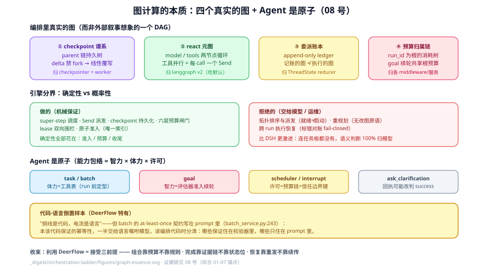

# 图计算的本质：DeerFlow 编排的统一重述

> 对标 DSH `_digested/orchestration-ladder/11-图计算的本质…md` 的收官问题。本页不引入新锚点，只把 [01]-[07] 的已核验事实压成一个统一视角：**编排骨子里是图计算问题，DeerFlow 的回答不是造图引擎，而是把图计算拆给四个各自为政的所有者。**

## 1. 四个真实的图（而非一个）

| 图 | 形态 | 归谁 | 已核验落点 |
|----|------|------|-----------|
| **checkpoint 谱系** | parent 链的持久树；delta 模式下**禁 fork**（兄弟 pending_writes 重放，#4458），改图=线性覆写 head | LangGraph checkpointer + DeerFlow worker | [04] §1.5（`worker.py:2246`） |
| **react 元图** | model/tools 两节点循环；工具并行 = 每 tool call 一个 Send | langgraph `create_agent` v2（DeerFlow 未传 version，吃默认） | [04] §1.3 |
| **委派账本** | `delegations` append-only ledger（同 id 最新胜出、terminal 不降级、截断保留最近）——**记账的图，不是执行的图** | ThreadState reducer | [05] §1（`thread_state.py:208`-`209`） |
| **预算归属链** | 以 run_id 为根的消耗树：goal 续轮共享根预算、batch 独立 | 各 middleware/服务 | [05] §1.2、[03] 叠加链 |

外部叙事把这四张图捏成"planner 任务 DAG"——[07] 已逐条核对为版本混淆。

## 2. 引擎对图做什么、拒绝什么

**做的（机械保证，确定性）**：super-step 调度、Send 派发、checkpoint 持久化、六层预算闸门（[03]）、lease 双向围栏（[06]）、原子准入（唯一索引）。**拒绝的（交给模型/运维）**：拓扑排序与派发（就绪≠启动——依赖是政策硬否决不是数据结构）、重规划（无改图原语）、跨 run 的执行恢复（恢复姿态=标错对账，[02]）。

**分界为什么画在这里**：与 DSH 的论证同构——"接下来什么更值得做、失败了要不要重试"是概率判断；但 DeerFlow 比 DSH 更激进：它连**任务板都没有**，委派账本只记账不推导就绪。确定性全部花在**准入、预算与收尾**上，语义判断 100% 归模型。

## 3. Agent 是原子：全部原语的统一重述

把 [00-map] 的矩阵压成 DSH 11 的形式——每个原语 = 构造什么上下文 × 哪个 Agent 何时跑 × 结果怎么回：

| 原语 | 构造上下文 | 何时跑 | 结果怎么回 |
|------|-----------|--------|-----------|
| `task` | prompt + 子代理 preset（工具剔除定能力面） | Send 并行、capacity FIFO 排队 | ToolMessage 进父 messages 通道 |
| `batch_task` | item prompt + **写在语言里的幂等契约** | worker lease 认领 | 不回——API/JSONL 外部消费 |
| goal | 隐藏 HumanMessage 续轮（同 run） | 评估器准入（预算/静止/人卡） | 下一轮可见输出；收尾=stand_down |
| scheduler | non_interactive 工具表 + 幂等键 | wall-clock + lease fence | occurrence 行终态 |
| interrupt/resume | checkpoint + pending INTERRUPT 写 | 客户端 Command(resume=) | 未开采（[04] 榨取设计） |
| ask_clarification | human_input artifact + goto=END | 用户下一轮 | 用户消息（回执可能改判 success，[01]） |

**能力包络**：智力（模型 + 评估器）× 体力（工具表 = 结构性能力的全集）× 许可（预算归属链 + 信任边界键）。工具表在 run 前定型——**DeerFlow 用"能力面剔除表达不可能"**（[05]），这与 DSH 用 maxDepth 表达深度是两种哲学的分水岭。

## 4. 代码-语言光谱：一个 DeerFlow 特有的倒置

DSH 的格言是"铜线是代码，电流是语言"。DeerFlow 有一处漂亮的**反向样本**：durable batch 的 at-least-once 契约写在 **prompt 里**（`batch_service.py:243`，[01] 已核验）——本该由代码保证的幂等性，一半交给了语言去嘱咐模型。这不是缺陷，是诚实的边界：item 执行体是任意 LLM 行为，代码只能保证"重跑同一 key"，副作用幂等只能请求模型配合。读编排代码时，注意分辨哪些保证住在校验器里、哪些只住在 prompt 里。

## 5. 收束

DeerFlow 是 graph engineering 的**最小完整实现 + 最保守恢复语义**的组合：图缩到两节点、动态全下放、完成语义五时刻拆开、恢复一律 fail-closed。要"充分利用这个框架的能力"，本质是接受它的三个前提：**组合靠预算不靠规则、完成靠证据链不靠状态位、恢复靠重发不靠续传**。

## 源码入口

见 [00-map.md](00-map.md) 源码入口表；本页综合引用 [01]-[07] 全部锚点，不新增。
