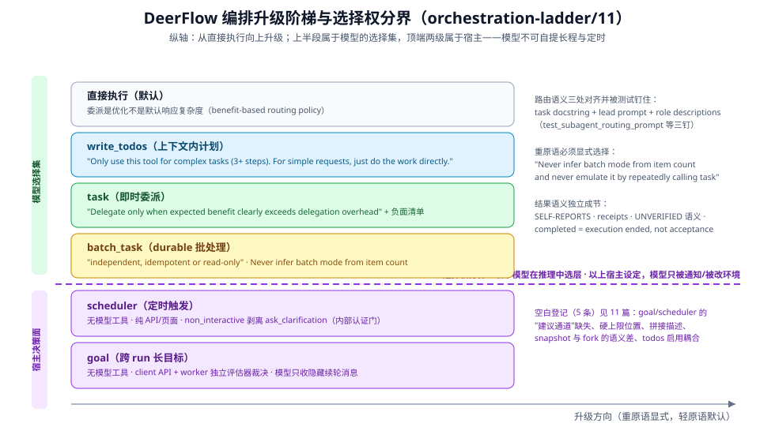

# 选择决策语义全景：DeerFlow 原语边界句逐字盘点

> 本篇把"什么时候用哪个原语"当作**模型可见文本的合同**来核验：逐字引用、跨原语路由汇总、矛盾与空白如实登记。全部引用来自本仓库源码核验（2026-10，`ethan` 分支）。出处分级同 [00-map](00-map.md)。

## 语义住在哪：三处对齐 + 测试钉住

**委派的选择语义住在三处并对齐** `[源码]`——`task` 工具 docstring、lead system prompt（`<subagent_system>` 的 DELEGATION CHECK）、内置角色的 role description——且**被测试钉住**（`tests/test_subagent_routing_prompt.py`、`tests/test_subagent_prompt_security.py`、`test_lead_agent_prompt.py`；对齐要求本身写在 `subagents/AGENTS.md` 的 benefit-based routing policy 节："Keep this policy aligned across `lead_agent/prompt.py`, the `task` tool description, and both built-in role descriptions"）。

`[推断]` 三处对齐的代价是改措辞要同步三处 + 三个测试；换来的是**路由策略不会被任何一处的漂移单独带偏**。

## 逐原语边界句（逐字）

### `task`（即时委派：收益门槛制）

`tools/builtins/task_tool.py:661-734`（docstring 即 description）。核心句：

> "**Delegate only when expected benefit clearly exceeds delegation overhead.** Useful benefits are: - Material wall-clock savings from independent parallel work - Specialist tools, skills, models, or domain instructions - Context isolation for a bounded, unusually context-heavy investigation"

负面清单同节："**When NOT to use this tool:** - Merely because a task is complex, multi-step, verbose, or touches a large repo - Splitting dependent steps across parallel subagents; keep the chain together… - Parallel work with overlapping files, shared mutable state, or external side effects - Tasks requiring user interaction or clarification"。结果语义是独立的一节（"subagent reports are **SELF-REPORTS**, not verified facts"）：receipt 引用交叉核对、`acceptance_criteria` 的确定性检查、"**UNVERIFIED** is missing evidence, not a failed condition"、`completed` means execution ended, not task acceptance。bash 专家的门槛句："**Routine git, build, test, or deploy operations are not sufficient reason to delegate.**"

系统提示侧配套（`agents/lead_agent/prompt.py:474`-`538`）：DELEGATION CHECK、`MAXIMUM {n} task CALLS PER RESPONSE`（随每响应上限配置渲染，limit=1 时并行与多批引导整段移除）、"The `task` tool waits for the subagent and returns its result directly; no polling is needed."

### `batch_task`（durable 批处理：显式模式，永不推断）

`tools/builtins/batch_task_tool.py:145`-`166`：

> "Submit many independent items to DeerFlow's explicit durable batch mode. **Use this only when every item is independent, idempotent or read-only, and can be completed without another item's output.** This tool returns a batch identifier immediately; it never inserts thousands of results into the lead agent context."

模式边界写在 prompt 侧（`agents/lead_agent/prompt.py:458`-`473`）："`batch_task` is a separate execution mode … **Never infer batch mode from item count and never emulate it by repeatedly calling `task`.**"——重原语必须显式选择。

### `write_todos` / plan mode（上下文内计划）

`agents/lead_agent/agent.py:408`-`469`（工厂传入 TodoMiddleware）：

> "**IMPORTANT: Only use this tool for complex tasks (3+ steps). For simple requests, just do the work directly.**"

配套中间件行为：上下文丢失提醒（`todo_middleware.py:147`-`160`）、未完成不得退出提醒（`:63`-`70`，上限 `_MAX_COMPLETION_REMINDERS = 2`）、plan mode 之外不注册（`agent.py:368`-`369`）。琐碎任务直接做的纪律用数字阈值表达：3 步以下不建清单。

### `ask_clarification`（回合级 HITL）

`tools/builtins/clarification_tool.py:36`-`90`（`return_direct=True`）：五类触发场景 + **交互形态选择**（"One open question -> just `question`… Pick several options -> a single `fields` entry of type `multi_select`… Prefer one form over asking field-by-field"）+ 独占 turn（"**Do not call any other tool in the same turn as this one**; sibling tool calls are dropped so they cannot run before the user answers"）。非交互变体的改写（`clarification_middleware.py:458`-`465`）："Clarification is disabled in this context — the human is not present to answer synchronously. **Do not ask for confirmation. Proceed with your best judgment**, carry out the requested action, and state any assumptions."

### goal：**没有模型可见工具**（结构事实）

`[源码]` goal 的 set/get/clear 全是 API/命令面（`client.py:626`-`665`、Gateway `routers/threads.py:1329`-`1383`、TUI 命令），**模型侧零工具**。模型可见的 goal 面只有续轮时的隐藏 HumanMessage `<goal_continuation>`（`runtime/goal.py:393`-`410`，逐字引用与完整机制见 [12](12-goal驾驶座-续轮准入评估熔断与收尾.md)）。`[推断]` 路由含义：**goal 不在模型的选择集里**——"这个任务该不该设 goal"不是模型的决策，是宿主/用户的；模型收到的永远是"已在续轮中，继续干"。

### scheduler：没有模型可见工具（同上）

`[源码]` harness 与 app 的 scheduler 代码里无任何 `@tool`（`scheduler/schedules.py` 只有 cron 数学；管理面是 Gateway API `routers/scheduled_tasks.py:176`-`505`）。唯一的模型可见影响是间接的：scheduled run 注入 `context.non_interactive=True`（`app/gateway/services.py:1831`），lead 工厂据此**剥离 `ask_clarification`**（`agent.py:80`），且该键仅内部认证调用方可设——"arbitrary HTTP/IM clients must not be able to force autonomous execution"（`services.py:521`-`524`）。`[推断]` 这是"定时自主性"的信任边界：自主运行的能力（无 HITL）只随宿主调度路径授予，不随客户端请求授予。

### background tasks / MCP 长任务

`[源码]` 查询与取消有模型工具：`list_background_tasks`（"List current and recent durable background tasks for this chat."）、`cancel_background_task`（`background_tasks_tool.py:46`-`84`）。提交面是**运行时包装**：MCP 长任务的原工具 description 被拼接契约句——"Submitted as durable background task {task_name!r}; returns a DeerFlow task ID immediately and **status polling is handled automatically.**"（`mcp/tools.py:658`-`709`）——同时 status/cancel 原始工具对模型隐藏（`:744`），轮询整体移出 Agent loop 进 `McpTaskService`。

## 跨原语路由规则汇总

| 关系 | DeerFlow 原文/机制 |
|------|-------------------|
| 直接执行 ↔ `task` | "Delegate only when expected benefit clearly exceeds delegation overhead" + 负面清单（"Merely because a task is complex… " 明文排除） |
| `task` ↔ `batch_task` | "Never infer batch mode from item count and never emulate it by repeatedly calling `task`"（prompt 侧）；batch 的验收语义复用 task 的确定性检查（工具侧 "the same bounded checklist as task"） |
| `task` 的 `context_mode` isolated ↔ snapshot | 参数描述自带选择句："Choose snapshot when relevant requirements or failed approaches are spread across the parent conversation… later parent turns are not synced. Historical tool actions are not evidence of child completion."（与继承式委派的关系判定见 [10](10-反向借鉴-DSH原语对DeerFlow的可吸收点.md)） |
| `ask_clarification` ↔ 非交互运行 | 运行时变体改写 + 工厂剥离（scheduler 路径强制自主）——同一名词两种语义随上下文切换 |
| `task` 结果 ↔ 再委派 | "Any further delegation must name the missing condition and cover only remaining work. **Do not repeat an unchanged attempt** or restart the whole task." |
| goal / scheduler ↔ 模型 | **不在选择集内**：宿主设定，模型只被通知（goal）或被改环境（non_interactive） |
| MCP 长任务 ↔ 轮询 | 提交面拼接契约句，status/cancel 原工具隐藏——"status polling is handled automatically" |

## 官方升级阶梯（DeerFlow 版）

1. **直接执行**（默认；"just do the work directly"）；
2. **`write_todos`**（复杂任务 3+ 步的上下文内计划）；
3. **`task`**（收益门槛制的即时委派，一两个）；
4. **`batch_task`**（独立/幂等/只读的规模批处理，显式 durable 模式）；
5. **goal / scheduler**（跨 run 长目标与定时触发——**宿主设定**，模型无选择权）。

阶梯的结构：**上半段属于模型的选择集，顶端两级属于宿主**——长程与定时的裁决权在产品面，不在 prompt 里。

## 矛盾与空白登记

1. **goal/scheduler 的"建议通道"缺失**：模型不能设 goal，也没有"建议用户为这个请求设 goal / 定时任务"的工具或 prompt 指引——模型判断"这活儿该挂 goal"只能靠自然语言口头建议，宿主是否采纳无合同。
2. **`task` 硬上限的位置**：`MAXIMUM {n} task CALLS PER RESPONSE` 在系统提示侧随配置渲染，工具 description 不随上限变化——两处语义（怎么选/最多几次）分离在两个文本里，对齐靠测试。
3. **MCP 提交面的拼接描述**：原工具作者写的 description + 运行时拼接的契约句（`mcp/tools.py:705`）来自两个作者；拼接面的一致性没有测试钉（登记，未核验是否有）。
4. **`context_mode=snapshot` 与继承式委派的语义差**：snapshot 是 dispatch-time 快照注入（"later parent turns are not synced"），不是继承式上下文复用——工具描述已写清，但与 [10](10-反向借鉴-DSH原语对DeerFlow的可吸收点.md) 判定的"fork 式继承"是两个候选方向，未来若实现继承需改写此参数合同。
5. **`write_todos` 的启用耦合 plan mode**：非 plan mode 下工具不存在（`agent.py:368`-`369`）——工具描述里没有写"我在什么配置下才在场"，模型无从知道它为何时有时无（登记：工具描述不声明自己的启用条件）。

## 源码入口

| 路径 | 一句话 |
|------|--------|
| `backend/packages/harness/deerflow/tools/builtins/task_tool.py:650`-`757` | task 边界句全文 + self-report 语义节 |
| `backend/packages/harness/deerflow/tools/builtins/batch_task_tool.py:135`-`166` | batch 显式模式边界句 |
| `backend/packages/harness/deerflow/agents/lead_agent/prompt.py:458`-`538` | batch 模式禁推断 + DELEGATION CHECK + 硬上限 |
| `backend/packages/harness/deerflow/agents/lead_agent/agent.py:408`-`469`、`:80` | write_todos 描述与 non_interactive 剥离 |
| `backend/packages/harness/deerflow/tools/builtins/clarification_tool.py:22`-`90` | ask_clarification 全文 |
| `backend/packages/harness/deerflow/runtime/goal.py:393`-`410`；`client.py:626`-`665` | goal 隐藏续轮消息 + API 面 |
| `backend/app/gateway/services.py:521`-`524`、`:1831` | non_interactive 信任边界 |
| `backend/packages/harness/deerflow/mcp/tools.py:658`-`709`、`:744` | 提交面契约句拼接 + 轮询出环 |
| `tests/test_subagent_routing_prompt.py` 等 | 路由语义的测试钉 |
