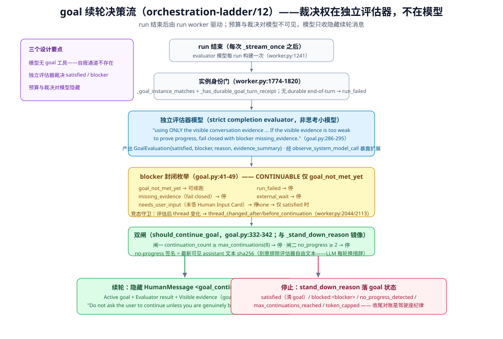

# goal 驾驶座：续轮准入、评估熔断与收尾

> 本篇回答：作为驾驶座，DeerFlow 的 goal 该怎么用、什么时候自动续、什么时候停、停了之后看什么。核心结论：**goal 是宿主驱动的**——模型不可自报完成，裁决权在 run worker 的独立评估器。机制事实见 [../internals/runtime/goal-continuation.md](../internals/runtime/goal-continuation.md)，本篇拥有驾驶座视角；出处分级同 [00-map](00-map.md)。

## 结构差异：裁决权在评估器，不在模型

`[源码]` DeerFlow 的 goal 生命周期由宿主与 worker 推进，模型全程无自报通道：

- **goal 的设置面在宿主**：`DeerFlowClient.set_goal/get_goal/clear_goal`（[../internals/runtime/goal-continuation.md](../internals/runtime/goal-continuation.md) 记载的方法面；TUI 经 `client.set_goal` 走同一路径，`tui/app.py:538`）。模型没有 `create_goal`/`update_goal` 工具可调；
- **续轮裁决在 run worker**：每个 run 结束后，worker 用**独立的评估器模型**产出 `GoalEvaluation`（`runtime/runs/worker.py:1241` 的 `_get_goal_evaluator_model()`），再经 `should_continue_goal`（`runtime/goal.py:332`-`342`）决定是否开新一轮；
- **模型自报不进裁决**：`satisfied` 与否由评估器判定；agent 的自述只是被评估的证据之一。

`[推断]` 这就是**提议权与裁决权分离**：agent 的自述只是被评估的证据之一；评估器同时是 DeerFlow 反馈体系里少有的独立 grader 实例（覆盖目标满足判定，不覆盖验收主张——那属于验收清单的 judge 层）。

## 驾驶座时间线

```text
用户/客户端 set_goal(thread_id, objective, max_continuations=8)
  → run 正常执行（agent 无感：没有 goal 工具占用工具集）
  → run 结束：worker 从 checkpoint 读 goal（_read_checkpoint_goal）
  → 实例身份门：_goal_instance_matches + _has_durable_goal_turn_receipt
  → 评估器模型产出 GoalEvaluation（satisfied / blocker / evidence）
  → should_continue_goal 双闸判定
      闸一：continuation_count >= max_continuations → 停
      闸二：no_progress_count >= max_no_progress_continuations → 停
  → 继续：开启下一轮 run（目标原样持久）
  → 停止：stand_down_reason 落 goal 状态（satisfied / blocked:<blocker> /
          no_progress_detected / 轮预算耗尽），并做收尾对账
```



`[源码]` 关键锚点：`should_continue_goal`（`runtime/goal.py:332`-`342`）、`compute_no_progress_count`（`:382`-`389`）、worker 侧 `_stand_down_reason`（`runtime/runs/worker.py:1840`-`1850`）、`_persist_goal_evaluation`（`:1854`）、实例身份三件（`:1774`-`1803`）。

## 两个独立预算

| 数字 | DeerFlow 默认 | 语义 | 来源 |
|------|--------------|------|------|
| `max_continuations` | **8**（`set_goal` 参数；上限被 `DEFAULT_MAX_GOAL_CONTINUATIONS = 8` clamp，`runtime/goal.py:33`-`39`、`:105`-`121`；Gateway 字段描述 "Maximum automatic hidden continuation turns before stopping"，`app/gateway/routers/threads.py:538`） | 最多自动续多少轮 | 客户端 API |
| `max_no_progress_continuations` | **2**（`DEFAULT_MAX_NO_PROGRESS_CONTINUATIONS`，`runtime/goal.py:34`） | **无进展**连续多少轮即熔断——与总轮数无关 | goal 状态字段 |

## 裁决的形状：评估器合同、blocker 枚举与隐藏续轮消息

`[源码]` 评估器是一个**专用的小型非思考模型**（"Ask a small non-thinking model whether the active goal is satisfied"，`runtime/goal.py:254`-`329` 的 `evaluate_goal_completion`；模型由 `create_goal_evaluator_model` 创建，`thinking_enabled=False`——它跑在主图之外，自带 tracing；**每 run 构建一次而非每次流式调用一次**，`runtime/runs/worker.py:1241`-`1250`）。评估 prompt 是一份严格的完成判定合同（`runtime/goal.py:286`-`295` 逐字）：

> "You are a strict completion evaluator for an AI coding assistant. Decide whether the active goal is fully satisfied using ONLY the visible conversation evidence. Do not assume files, commands, tests, or external state changed unless the conversation explicitly shows it. **If the visible evidence is too weak to prove progress, fail closed with blocker missing_evidence.** … Output exactly one JSON object: {"satisfied": boolean, "blocker": string, "reason": string, "evidence_summary": string}."

`[源码]` blocker 是**封闭枚举**（`runtime/goal.py:41`-`49`），且只有一类允许续跑：

| blocker | 含义 | 续跑？ |
|---------|------|--------|
| `goal_not_met_yet` | 还有有效的自主工作可做 | ✅（`CONTINUABLE_GOAL_BLOCKERS` 仅此一类） |
| `missing_evidence` | 可见证据不足以证明进展——**fail closed** | ❌ |
| `needs_user_input` | turn 结束在未回答的 Human Input Card 上（`worker.py:1823`-`1837`） | ❌ |
| `run_failed` | 无 durable end-of-turn checkpoint（`worker.py:1803`-`1820`） | ❌ |
| `external_wait` | 在等待外部系统 | ❌ |
| `none` | 仅 satisfied=true 时 | — |

`[源码]` 续轮时模型看到的**全部** goal 面是一条隐藏 HumanMessage（`runtime/goal.py:393`-`410` 逐字）：

> `<goal_continuation>` Active goal: {objective} / Evaluator result: not satisfied. Blocker: {blocker}. Reason: {reason} / Visible evidence: {evidence_summary} / "Continue working toward the active goal. Use the available tools and conversation context. **Do not ask the user to continue unless you are genuinely blocked.**" `</goal_continuation>`

（`hide_from_ui: True` + `deerflow_goal_continuation: True`——Gateway 字段措辞 "hidden continuation turns" 即由此来。）`[推断]` 驾驶座含义：**预算与裁决对模型不可见**——模型不知道还剩几轮、不知道评估逻辑，只知道"没满足、为什么、继续干"。透明度是刻意的选择：防止模型按剩余预算表演进度。

worker 侧还有三道竞态与降级守卫：评估后 goal 实例或可见会话变化 → `thread_changed_after_evaluation` / `thread_changed_before_continuation`（`worker.py:2044`-`2059`、`:2113`-`2128`）；run 以 `token_capped` 收尾 → stand_down_reason 直接记 `token_capped`（`:2090`-`2094`）；satisfied → **清空 goal**（`:2061`-`2087`）。评估本身经 `observe_system_model_call(SystemOperationKind.GOAL, …)` 暴露给扩展观察（`runtime/goal.py:316`-`328`），评估结果以 `as_node="goal_evaluator"` 写回 checkpoint（`worker.py:1854`-`1909`）。

## no-progress 熔断：签名是"你说的话"，不是"评估器的措辞"

`[源码]` 熔断键的精确定义（`runtime/goal.py:345`-`390`）：`latest_visible_assistant_signature` 对**最近一条用户可见 assistant 消息的文本**取 sha256；progress key = `{satisfied, blocker, evidence_signature}` 三元组，与上次相同则 `no_progress_count + 1`，不同则归零（`compute_goal_progress_key:364`-`379`、`compute_no_progress_count:382`-`390`）。设计注释明说为什么排除评估器的自由文本：

> The "no progress" breaker keys on what the agent actually produced — the text of the most recent user-visible assistant message — not on the evaluator's free-text reason/evidence_summary (which an LLM rewords on every turn…).

`[推断]` 驾驶座含义：**换说法不算新进展，换可见结论才算**——但"产出"以 assistant 结论文本为准；工具侧的真变化若没有反映到 assistant 文本，也不构成进展。给 goal 写 objective 时，应同时要求 agent 每轮产出**可区分的可见结论**。

## 收尾：stand_down_reason 与对账

`[源码]` goal 停止不注入任何 wrapup 指令（[05-组合模式与收尾纪律](05-组合模式与收尾纪律-跨原语协同.md) 已核验"goal 满足不扫任何尾"）。停止时的全部产物是 **`stand_down_reason`**（`runtime/goal.py:547`-`568` 写入 `last_evaluation`）：

| reason | 含义 | 驾驶座动作 |
|--------|------|-----------|
| `satisfied`（evaluation.satisfied） | 评估器判定目标达成 | 复核产物；goal 状态可清（CAS） |
| `blocked:<blocker>` | 评估器报出非 `goal_not_met_yet` 的具体 blocker | 按 blocker 类型处置（外部依赖/需要人类输入），改条件后重设 |
| `no_progress_detected` | 无进展熔断触发 | **换打法而不是换说法**：证据签名不变就永远熔断 |
| 轮预算耗尽（`continuation_count >= max_continuations`） | 两闸之一 | 提高预算前先读评估器历史——它比轮数更诚实 |

`[源码]` 一致性保证：worker 侧 `_stand_down_reason` 的 cap 逻辑与 `should_continue_goal` **镜像**——"Default caps mirror should_continue_goal so the two gate functions agree"（`runtime/runs/worker.py:1845` 注释）。两个闸不会给出矛盾的"为什么停"。

`[推断]` 收尾对账是**驾驶座纪律**：goal 终态不自动对账未终态 delegations（[05](05-组合模式与收尾纪律-跨原语协同.md) 已核验"对 delegations 零引用"）——set_goal 的目标里应写清收尾判据，或满足后手动核对 delegation ledger，宿主不会替你扫尾。

## 并发与身份：写要过锁，续要认亲

`[源码]` 三个驾驶座必须知道的门：

1. **写序列化**：`goal_thread_lock`（`runtime/goal.py:64`-`66`）按 thread 串行化 read-modify-write；基于旧 checkpoint 的写抛 `GoalWriteConflict`（`runtime/goal.py:60`-`61`，"Raised when a goal write is based on a stale checkpoint"）——客户端 CAS 语义；
2. **实例身份**：checkpoint 里读到的 goal 必须与当前实例匹配（`_goal_instance_matches`），且有 durable goal-turn receipt（`_has_durable_goal_turn_receipt`）才驱动续轮——**旧的 goal incarnation 不能凭同一个 thread_id 继续干活**（`runtime/runs/worker.py:1774`-`1803`）；
3. **run 边界**：评估发生在 run 结束后的 worker 里，不在 turn 内——goal 续轮的粒度是 run，不是 turn。

## 驾驶座守则

| 守则 | 依据 |
|------|------|
| objective 写成**评估器可判定的终态描述** | 评估器 prompt 只看可见对话证据，抽象目标会被 fail-closed 成 `missing_evidence` |
| 别指望模型按预算表演进度 | 预算与裁决对模型不可见；进度应体现在**可区分的可见结论**里（证据签名以此为准） |
| no-progress 熔断后**换打法，不是换说法** | 同一 assistant 结论的重说不归零计数 |
| 续轮粒度是 run，不是 turn | 评估只发生在 run 结束后的 worker 里 |
| goal 写入走 CAS | `GoalWriteConflict`（stale checkpoint 即拒）；并发写先读后改 |
| 终态不自动对账 delegations | 05 页核验"对 delegations 零引用"；satisfied 后手动核对 ledger |

## 出处

- DeerFlow 事实：`backend/packages/harness/deerflow/runtime/goal.py`（:33-49、:60-66、:105-121、:254-329、:332-410、:547-568）、`backend/packages/harness/deerflow/runtime/runs/worker.py`（:1241、:1774-1909、:1924-2137）、`client.py:626-665`、`tui/app.py:538`
- 关联页：[05-组合模式与收尾纪律](05-组合模式与收尾纪律-跨原语协同.md)（goal 无 wrapup 的核验）、[02-状态三分法](02-状态三分法-持久事实派生投影与内存权限.md)、[../internals/runtime/goal-continuation.md](../internals/runtime/goal-continuation.md)
